<p align="center">
  
</p>

<div align="center">
  <h1>Universidad Peruana de Ciencias Aplicadas</h1>
  <p><strong>Carrera:</strong> Ingeniería de Software</p>
  <p><strong>Ciclo:</strong> 2025 - 10</p>
  <p><strong>Curso:</strong> Desarrollo de Soluciones IOT (1ASI0572)</p>
  <p><strong>Sección:</strong> 2942</p>
  <p><strong>Profesor:</strong> León Baca, Marco Antonio</p>
  <p><strong>Informe de Trabajo Final</strong></p>
  <p><strong>Startup:</strong> IoT Solutions</p>
  <p><strong>Producto:</strong> HydroSmart</p>
</div>

<table align="center">
  <tr>
    <th>Integrantes</th>
    <th>Código</th>
  </tr>
  <tr>
    <td>Delgado Corrales, Piero Gonzalo</td>
    <td>U202210749</td>
  </tr>
  <tr>
    <td>Neyra Santa Cruz, Marcelo Sebastian</td>
    <td>U202217241</td>
  </tr>
  <tr>
    <td>Paredes Puente, Sebastián Roberto</td>
    <td>U202217239</td>
  </tr>
  <tr>
    <td>Salinas Torres, Salvador Antonio</td>
    <td>U20221B127</td>
  </tr>
  <tr>
    <td>Soto Salis, Natanael David</td>
    <td>U20201C607</td>
  </tr>
</table>

<p align="center"><b>Junio 2025</b></p>

<div style="page-break-after: always;"></div>

# Registro de versiones

<style>
  table {
    width: 100%;
    border-collapse: collapse;
  }
  th, td {
    border: 1px solid #ddd;
    padding: 8px;
  }
  th {
    background-color: #f2f2f2;
    text-align: center;
  }
</style>

<table>
  <thead>
    <tr>
        <th>Versión</th>
        <th>Fecha</th>
        <th>Autor</th>
        <th>Descripción de modificación</th>
    </tr>
  </thead>
  <tbody>
  <tr>
      <th>TB1</th>
      <td>08/04/2025</td>
      <td rowspan="4">
        <p>Paredes Puente, Sebastian Roberto</p>
        <p>Delgado Corrales, Piero Gonzalo</p>
        <p>Salinas Torres, Salvador Antonio</p>
        <p>Neyra Santa Cruz, Marcelo Sebastian</p>
        <p>Soto Salis, Natanael David</p>
      </td>
      <td>
        Se han agregado los siguientes capítulos
        <ul>
          <li>Capítulo 1</li>
          <li>Capítulo 2</li>
          <li>Capítulo 3</li>
          <li>Capítulo 4</li>
        </ul>
      </td>
  </tr>
  <tr>
      <th>Trabajo Parcial</th>
      <td>14/05/2025</td>
      <td>
        Se han agregado los siguientes capítulos
        <ul>
          <li>Capítulo 5</li>
          <li>Capítulo 6</li>
        </ul>
      </td>
  </tr>
  <tr>
      <th>TB2</th>
      <td>07/06/2025</td>
      <td>
        Se han agregado nuevas secciones al capítulo 6
      </td>
  </tr>
  <tr>
      <th>Trabajo Final</th>
      <td>28/06/2025</td>
      <td>
        Se han agregado nuevas secciones al capítulo 6
      </td>
  </tr>
  </tbody>
</table>

# Project Report Collaboration Insights

<table>
  <tr>
    <th colspan="2">Entrega TB1</th>
  </tr>
  <tr>
    <td>
      <p> Para la entrega TB1 se realizaron los 4 primeros capítulos del informe. A cada integrante se le asignó una parte específica a desarrollar y el informe completo se realizó con éxito.</p>
      <p> El informe se realizó en el siguiente repositorio:</p>
      <p>Reporte: <a href="https://github.com/iot-solutions64/report">Documento TB1</a></p>
    </td>
    <td>
      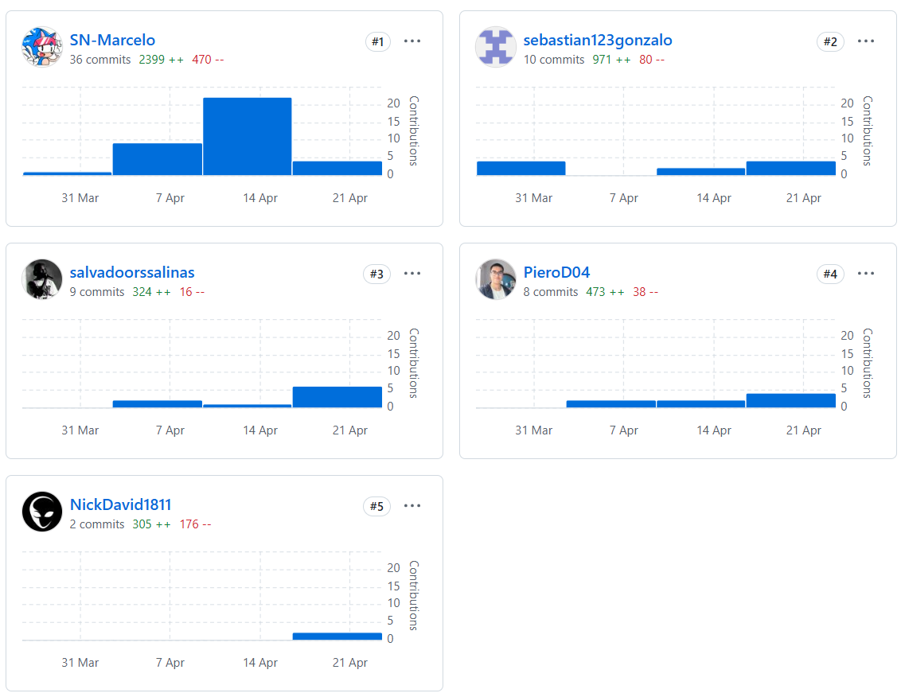
    </td>
  </tr>
  <tr>
    <th colspan="2">Entrega Trabajo Parcial</th>
  </tr>
  <tr>
    <td>
      <p> Para la entrega Trabajo Parcial se realizó la primera versión de la aplicación web, tanto el frontend como el backend, así como la landing page. El equipo se dividió en 3 subdivisiones, siendo 2 integrantes para el frontend, 2 para el backend y 1 para la landing page</p>
      <p>Los avances se registraron en los siguientes repositorios:</p>
      <p>Reporte: <a href="https://github.com/iot-solutions64/report">Documento Trabajo Parcial</a></p>
      <p>Frontend Web: <a href="https://github.com/iot-solutions64/frontend-web">Repositorio del Frontend Web</a></p>
      <p>Backend: <a href="https://github.com/iot-solutions64/backend">Repositorio del Backend</a></p>
      <p>Landing Page: <a href="https://github.com/iot-solutions64/landing-page">Repositorio de la Landing Page</a></p>
      <p>Por otro lado, aquí se encuentran los enlaces directos a las aplicaciones desarrolladas para este entregable:</p>
      <p>Aplicación Frontend Web: <a href="https://hydrosmart-iot.netlify.app">Enlace a la aplicación</a></p>
      <p>Aplicación Backend: <a href="https://api-hydrosmart.up.railway.app/swagger-ui/index.html">Enlace a la aplicación</a></p>
      <p>Página Landing Page: <a href="https://iot-solutions64.github.io/landing-page/">Enlace a la página</p>
    </td>
    <td>
      <p>Frontend Web</p>
      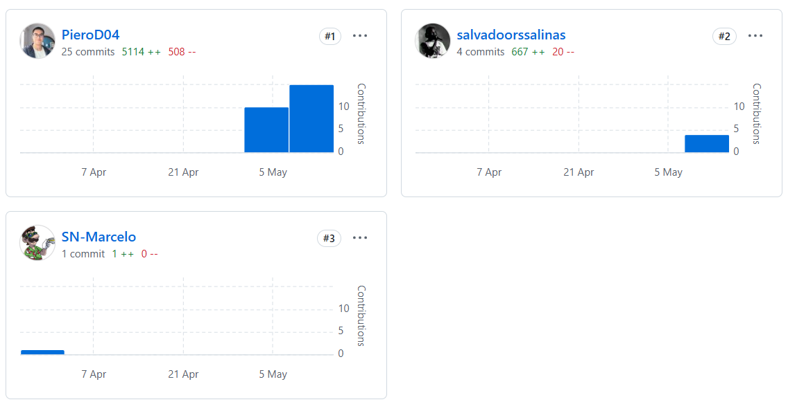
      <p>Backend</p>
      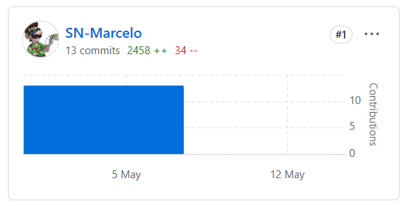
      <p>Landing Page</p>
      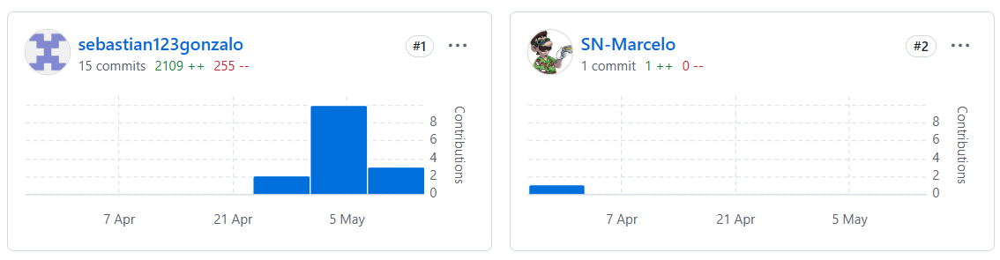
    </td>
  </tr>
  <tr>
    <th colspan="2">Entrega TB2</th>
  </tr>
  <tr>
    <td>
      <p> Para la entrega TB2, se realizó la segunda versión de la aplicaciones Backend y Frontend, la simulación del dispositivo embebido en Wokwi, el Edge API y la primera versión del sistema embebido</p>
      <p>Los avances se registraron en los siguientes repositorios:</p>
      <p>Reporte: <a href="https://github.com/iot-solutions64/report">Documento Trabajo Parcial</a></p>
      <p>Frontend Web: <a href="https://github.com/iot-solutions64/frontend-web">Repositorio del Frontend Web</a></p>
      <p>Frontend Móvil: <a href="https://github.com/iot-solutions64/frontend-movil">Repositorio del Frontend Móvil</a></p>
      <p>Edge API: <a href="https://github.com/iot-solutions64/edge-api">Repositorio del Edge API</a></p>
      <p>Backend: <a href="https://github.com/iot-solutions64/backend">Repositorio del Backend</a></p>
      <p>Simulación de la Sistema Embebido: <a href="https://github.com/iot-solutions64/wokwi">Repositorio de la sistema embebido</a></p>
      <p>Landing Page: <a href="https://github.com/iot-solutions64/landing-page">Repositorio de la Landing Page</a></p>
      <p>Por otro lado, aquí se encuentran los enlaces directos a las aplicaciones desarrolladas para este entregable:</p>
      <p>Aplicación Frontend Web: <a href="https://hydrosmart-iot.netlify.app">Enlace a la aplicación</a></p>
      <p>Aplicación Backend: <a href="https://api-hydrosmart.up.railway.app/swagger-ui/index.html">Enlace a la aplicación</a></p>
      <p>Sistema Embebido: <a href="https://wokwi.com/projects/431338881324863489">Enlace a la aplicación</a></p>
      <p>Página Landing Page: <a href="https://iot-solutions64.github.io/landing-page/">Enlace a la página</p>
    </td>
    <td>
      <p>Frontend Web</p>
      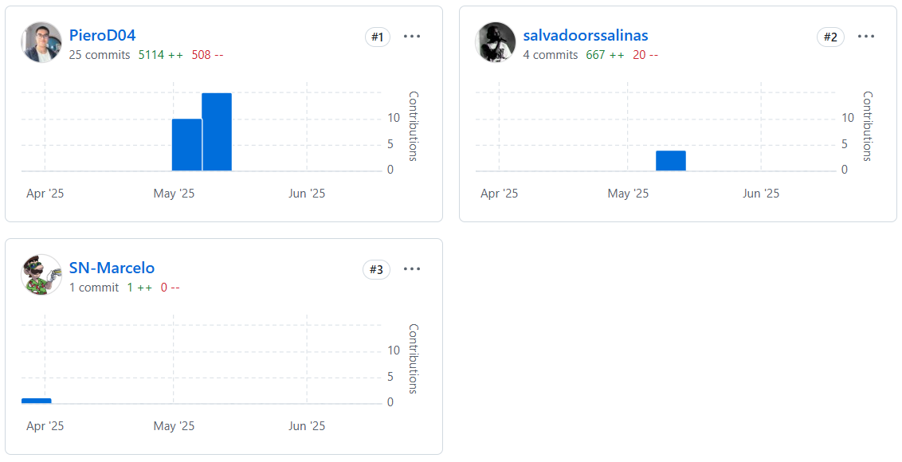
      <p>Frontend Móvil</p>
      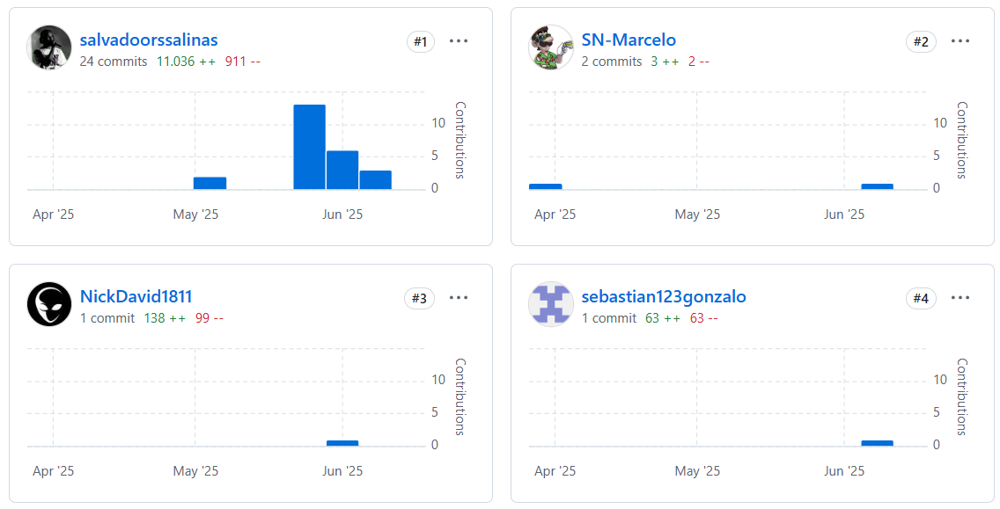
      <p>Backend</p>
      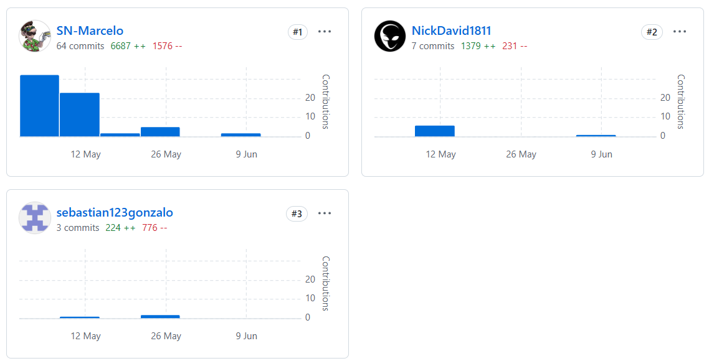
      <p>Edge API</p>
      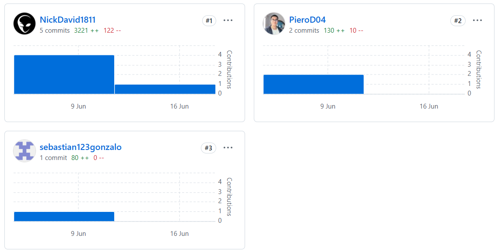
      <p>Prototipo del Sistema Embebido en Wokwi</p>
      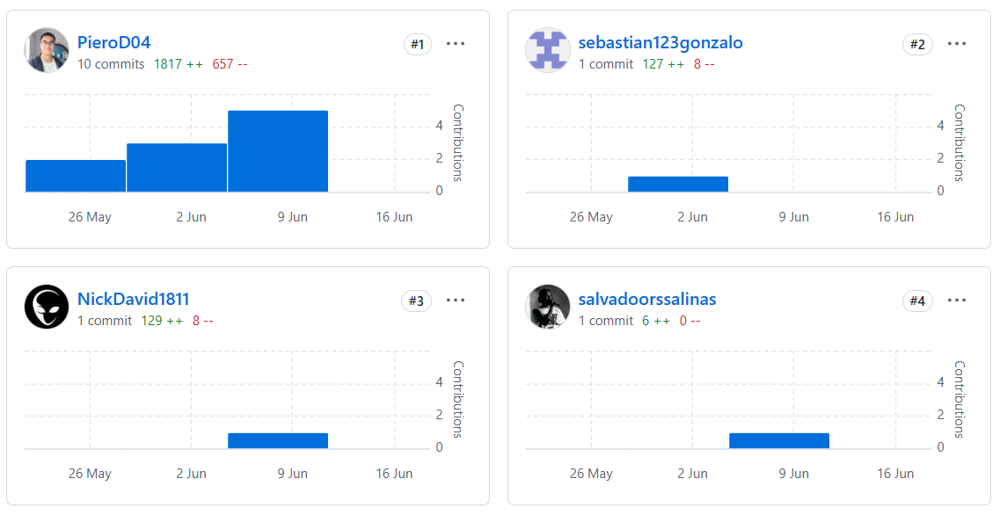
      <p>Landing Page</p>
      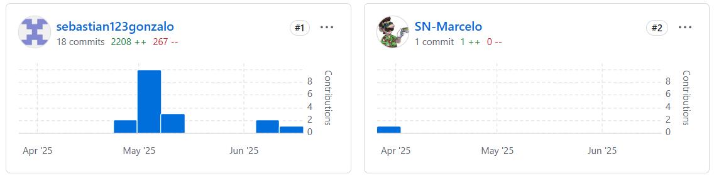
    </td>
  </tr>
  <tr>
    <th colspan="2">Entrega Trabajo Final</th>
  </tr>
  <tr>
    <td>
      <p> Para la entrega del Trabajo Final, se realizó la última versión de la aplicaciones Backend y Frontend, la simulación del dispositivo embebido en Wokwi, el Edge API y del sistema embebido</p>
      <p>Los avances se registraron en los siguientes repositorios:</p>
      <p>Reporte: <a href="https://github.com/iot-solutions64/report">Documento Trabajo Parcial</a></p>
      <p>Frontend Web: <a href="https://github.com/iot-solutions64/frontend-web">Repositorio del Frontend Web</a></p>
      <p>Frontend Móvil: <a href="https://github.com/iot-solutions64/frontend-movil">Repositorio del Frontend Móvil</a></p>
      <p>Edge API: <a href="https://github.com/iot-solutions64/edge-api">Repositorio del Edge API</a></p>
      <p>Backend: <a href="https://github.com/iot-solutions64/backend">Repositorio del Backend</a></p>
      <p>Simulación de la Sistema Embebido: <a href="https://github.com/iot-solutions64/wokwi">Repositorio de la sistema embebido</a></p>
      <p>Landing Page: <a href="https://github.com/iot-solutions64/landing-page">Repositorio de la Landing Page</a></p>
      <p>Por otro lado, aquí se encuentran los enlaces directos a las aplicaciones desarrolladas para este entregable:</p>
      <p>Aplicación Frontend Web: <a href="https://hydrosmart-iot.netlify.app">Enlace a la aplicación</a></p>
      <p>Aplicación Backend: <a href="https://api-hydrosmart.up.railway.app/swagger-ui/index.html">Enlace a la aplicación</a></p>
      <p>Sistema Embebido: <a href="https://wokwi.com/projects/431338881324863489">Enlace a la aplicación</a></p>
      <p>Página Landing Page: <a href="https://iot-solutions64.github.io/landing-page/">Enlace a la página</p>
    </td>
    <td>
      <p>Frontend Web</p>
      
      <p>Frontend Móvil</p>
      
      <p>Backend</p>
      
      <p>Edge API</p>
      
      <p>Prototipo del Sistema Embebido en Wokwi</p>
      
      <p>Landing Page</p>
      
    </td>
  </tr>
</table>

<div style="page-break-after: always;"></div>

# Tabla de Contenidos

### [Registro de Versiones](#registro-de-versiones)

### [Student Outcome](#student-outcome)

### [Capítulo I: Introducción](#capítulo-i-introducción)

- [1.1. Startup Profile](#11-startup-profile)
  - [1.1.1. Descripción de la Startup](#111-descripción-de-la-startup)
  - [1.1.2. Perfiles de integrantes del equipo](#112-perfiles-de-integrantes-del-equipo)
- [1.2. Solution Profile](#12-solution-profile)
  - [1.2.1. Antecedentes y problemática](#121-antecedentes-y-problemática)
  - [1.2.2. Lean UX Process](#122-lean-ux-process)
    - [1.2.2.1. Lean UX Problem Statements](#1221-lean-ux-problem-statements)
    - [1.2.2.2. Lean UX Assumptions](#1222-lean-ux-assumptions)
    - [1.2.2.3. Lean UX Hypothesis Statements](#1223-lean-ux-hypothesis-statements)
    - [1.2.2.4. Lean UX Canvas](#1224-lean-ux-canvas)
- [1.3. Segmentos objetivo](#13-segmentos-objetivo)

### [Capítulo II: Requirements Elicitation & Analysis](#capítulo-ii-requirements-elicitation--analysis)

- [2.1. Competidores](#21-competidores)
  - [2.1.1. Análisis competitivo](#211-análisis-competitivo)
  - [2.1.2. Estrategias y tácticas frente a competidores](#212-estrategias-y-tácticas-frente-a-competidores)
- [2.2. Entrevistas](#22-entrevistas)
  - [2.2.1. Diseño de entrevistas](#221-diseño-de-entrevistas)
  - [2.2.2. Registro de entrevistas](#222-registro-de-entrevistas)
  - [2.2.3. Análisis de entrevistas](#223-análisis-de-entrevistas)
- [2.3. Needfinding](#23-needfinding)
  - [2.3.1. User Personas](#231-user-personas)
  - [2.3.2. User Task Matrix](#232-user-task-matrix)
  - [2.3.3. User Journey Mapping](#233-user-journey-mapping)
  - [2.3.4. Empathy Mapping](#234-empathy-mapping)
  - [2.3.5. As-is Scenario Mapping](#235-as-is-scenario-mapping)
- [2.4. Ubiquitous Language](#24-ubiquitous-language)

### [Capítulo III: Requirements Specification](#capítulo-iii-requirements-specification)

- [3.1. To-Be Scenario Mapping](#31-to-be-scenario-mapping)
- [3.2. User Stories](#32-user-stories)
- [3.3. Impact Mapping](#33-impact-mapping)
- [3.4. Product Backlog](#34-product-backlog)

### [Capítulo IV: Solution Software Design](#capítulo-iv-solution-software-design)

- [4.1. Strategic-Level Domain-Driven Design](#41-strategic-level-domain-driven-design)
  - [4.1.1. EventStorming](#411-eventstorming)
    - [4.1.1.1. Candidate Context Discovery](#4111-candidate-context-discovery)
    - [4.1.1.2. Domain Message Flows Modeling](#4112-domain-message-flows-modeling)
    - [4.1.1.3. Bounded Context Canvases](#4113-bounded-context-canvases)
  - [4.1.2. Context Mapping](#412-context-mapping)
  - [4.1.3. Software Architecture](#413-software-architecture)
    - [4.1.3.1. System Landscape Diagram](#4131-system-landscape-diagram)
    - [4.1.3.2. Context Level Diagrams](#4132-context-level-diagrams)
    - [4.1.3.3. Container Level Diagrams](#4133-container-level-diagrams)
    - [4.1.3.4. Deployment Diagrams](#4134-deployment-diagrams)
- [4.2. Tactical-Level Domain-Driven Design](#42-tactical-level-domain-driven-design)
  - [4.2.1. Bounded Context: Soil](#421-bounded-context-soil)
    - [4.2.1.1. Domain Layer](#4211-domain-layer)
    - [4.2.1.2. Interface Layer](#4212-interface-layer)
    - [4.2.1.3. Application Layer](#4213-application-layer)
    - [4.2.1.4. Infrastructure Layer](#4214-infrastructure-layer)
    - [4.2.1.5. Component Level Diagrams](#4215-component-level-diagrams)
    - [4.2.1.6. Code Level Diagrams](#4216-code-level-diagrams)
      - [4.2.1.6.1. Domain Layer Class Diagrams](#42161-domain-layer-class-diagrams)
      - [4.2.1.6.2. Database Design Diagram](#42162-database-design-diagram)
  - [4.2.2. Bounded Context: Irrigation](#422-bounded-context-irrigation)
    - [4.2.2.1. Domain Layer](#4221-domain-layer)
    - [4.2.2.2. Interface Layer](#4222-interface-layer)
    - [4.2.2.3. Application Layer](#4223-application-layer)
    - [4.2.2.4. Infrastructure Layer](#4224-infrastructure-layer)
    - [4.2.2.5. Component Level Diagrams](#4225-component-level-diagrams)
    - [4.2.2.6. Code Level Diagrams](#4226-code-level-diagrams)
      - [4.2.2.6.1. Domain Layer Class Diagrams](#42261-domain-layer-class-diagrams)
      - [4.2.2.6.2. Database Design Diagram](#42262-database-design-diagram)
  - [4.2.3. Bounded Context: Security](#423-bounded-context-security)
    - [4.2.3.1. Domain Layer](#4231-domain-layer)
    - [4.2.3.2. Interface Layer](#4232-interface-layer)
    - [4.2.3.3. Application Layer](#4233-application-layer)
    - [4.2.3.4. Infrastructure Layer](#4234-infrastructure-layer)
    - [4.2.3.5. Component Level Diagrams](#4235-component-level-diagrams)
    - [4.2.3.6. Code Level Diagrams](#4236-code-level-diagrams)
      - [4.2.3.6.1. Domain Layer Class Diagrams](#42361-domain-layer-class-diagrams)
      - [4.2.3.6.2. Database Design Diagram](#42362-database-design-diagram)
  - [4.2.4. Bounded Context: System](#424-bounded-context-system)
    - [4.2.4.1. Domain Layer](#4241-domain-layer)
    - [4.2.4.2. Interface Layer](#4242-interface-layer)
    - [4.2.4.3. Application Layer](#4243-application-layer)
    - [4.2.4.4. Infrastructure Layer](#4244-infrastructure-layer)
    - [4.2.4.5. Component Level Diagrams](#4245-component-level-diagrams)
    - [4.2.4.6. Code Level Diagrams](#4246-code-level-diagrams)
      - [4.2.4.6.1. Domain Layer Class Diagrams](#42461-domain-layer-class-diagrams)
      - [4.2.4.6.2. Database Design Diagram](#42462-database-design-diagram)

### [Capítulo V: Solution UI/UX Design](#capítulo-v-solution-uiux-design)

- [5.1. Style Guidelines](#51-style-guidelines)
  - [5.1.1. General Style Guidelines](#511-general-style-guidelines)
  - [5.1.2. Web, Mobile and IoT Style Guidelines](#512-web-mobile-and-iot-style-guidelines)
- [5.2. Information Architecture](#52-information-architecture)
  - [5.2.1. Organization Systems](#521-organization-systems)
  - [5.2.2. Labeling Systems](#522-labeling-systems)
  - [5.2.3. SEO Tags and Meta Tags](#523-seo-tags-and-meta-tags)
  - [5.2.4. Searching Systems](#524-searching-systems)
  - [5.2.5. Navigation Systems](#525-navigation-systems)
- [5.3. Landing Page UI Design](#53-landing-page-ui-design)
  - [5.3.1. Landing Page Wireframe](#531-landing-page-wireframe)
  - [5.3.2. Landing Page Mock-up](#532-landing-page-mock-up)
- [5.4. Applications UX/UI Design](#54-applications-uxui-design)
  - [5.4.1. Applications Wireframes](#541-applications-wireframes)
  - [5.4.2. Applications Wireflow Diagrams](#542-applications-wireflow-diagrams)
  - [5.4.3. Applications Mock-ups](#543-applications-mock-ups)
  - [5.4.4. Applications User Flow Diagrams](#544-applications-user-flow-diagrams)
- [5.5. Applications Prototyping](#55-applications-prototyping)

### [Capítulo VI: Product Implementation, Validation & Deployment](#capítulo-vi-product-implementation-validation--deployment)

- [6.1. Software Configuration Management](#61-software-configuration-management)
  - [6.1.1. Development Environment Configuration](#611-development-environment-configuration)
  - [6.1.2. Source Code Management](#612-source-code-management)
  - [6.1.3. Style Guide & Conventions](#613-style-guide--conventions)
  - [6.1.4. Deployment Configuration](#614-deployment-configuration)
- [6.2. Implementation](#62-implementation)
  - [6.2.1. Sprint 1](#621-sprint-1)
    - [6.2.1.1. Sprint Planning 1](#6211-sprint-planning-1)
    - [6.2.1.2. Aspect Leaders and Collaborators](#6212-aspect-leaders-and-collaborators)
    - [6.2.1.3. Sprint Backlog 1](#6213-sprint-backlog-1)
    - [6.2.1.4. Development Evidence](#6214-development-evidence)
    - [6.2.1.5. Testing Suite Evidence](#6215-testing-suite-evidence)
    - [6.2.1.6. Execution Evidence](#6216-execution-evidence)
    - [6.2.1.7. Services Documentation](#6217-services-documentation)
    - [6.2.1.8. Deployment Evidence](#6218-deployment-evidence)
    - [6.2.1.9. Collaboration Insights](#6219-collaboration-insights)
  - [6.2.2. Sprint 2](#622-sprint-2)
    - [6.2.2.1. Sprint Planning 2](#6221-sprint-planning-2)
    - [6.2.2.2. Aspect Leaders and Collaborators](#6222-aspect-leaders-and-collaborators)
    - [6.2.2.3. Sprint Backlog 2](#6223-sprint-backlog-2)
    - [6.2.2.4. Development Evidence](#6224-development-evidence)
    - [6.2.2.5. Testing Suite Evidence](#6225-testing-suite-evidence)
    - [6.2.2.6. Execution Evidence](#6226-execution-evidence)
    - [6.2.2.7. Services Documentation](#6227-services-documentation)
    - [6.2.2.8. Deployment Evidence](#6228-deployment-evidence)
    - [6.2.2.9. Collaboration Insights](#6229-collaboration-insights)
  - [6.2.3. Sprint 3](#623-sprint-3)
    - [6.2.3.1. Sprint Planning 3](#6231-sprint-planning-3)
    - [6.2.3.2. Aspect Leaders and Collaborators](#6232-aspect-leaders-and-collaborators)
    - [6.2.3.3. Sprint Backlog 3](#6233-sprint-backlog-3)
    - [6.2.3.4. Development Evidence](#6234-development-evidence)
    - [6.2.3.5. Testing Suite Evidence](#6235-testing-suite-evidence)
    - [6.2.3.6. Execution Evidence](#6236-execution-evidence)
    - [6.2.3.7. Services Documentation](#6237-services-documentation)
    - [6.2.3.8. Deployment Evidence](#6238-deployment-evidence)
    - [6.2.3.9. Collaboration Insights](#6239-collaboration-insights)
- [6.3. Validation Interviews](#63-validation-interviews)
  - [6.3.1. Diseño de Entrevistas](#631-diseño-de-entrevistas)
  - [6.3.2. Registro de Entrevistas](#632-registro-de-entrevistas)
  - [6.3.3. Evaluaciones según heurísticas](#633-evaluaciones-según-heurísticas)
- [6.4. Video About-the-Product](#64-video-about-the-product)

### [7. Conclusiones y Recomendaciones](#conclusiones-y-recomendaciones)

### [8. Video About-the-Team](#video-about-the-team)

### [9. Bibliografía](#bibliografía)

### [10. Anexos](#anexos)

<div style="page-break-after: always;"></div>

# Student Outcome

> **ABET – EAC - Student Outcome 5** La capacidad de funcionar efectivamente en un equipo cuyos miembros juntos proporcionan liderazgo, crean un entorno de colaboración e inclusivo, establecen objetivos, planifican tareas y cumplen objetivos.

<table>
  <thead>
    <tr>
      <th>Criterio específico</th>
      <th>Acciones realizadas</th>
      <th>Conclusiones</th>
    </tr>
  </thead>
  <tbody>
    <tr>
      <td>Trabaja en equipo para proporcionar liderazgo en forma conjunta</td>
      <td>
        <h3>TB1</h3>
        <h4>Delgado Corrales, Piero Gonzalo</h4>
          <p>Para este entregable, coordiné constantemente con el equipo para mantener una línea de trabajo coherente y me comprometí a cumplir puntualmente con las tareas asignadas para evitar retrasos que pudieran afectar el avance colectivo.</p>
        <h4>Neyra Santa Cruz, Marcelo Sebastian</h4>
          <p>Para este entregable, como líder de equipo, asigné a cada uno de los integrantes del equipo su parte correspondiente. También, aporté al grupo manteniendome activo en los avances y actividades realizadas</p>
        <h4>Paredes Puente, Sebastian Roberto</h4>
          <p>Para este entregable, demostré capacidad de trabajo en equipo al coordinar con mis compañeros para mantener una línea de trabajo coherente y asegurar el cumplimiento puntual de las tareas asignadas. Participé activamente en la división equitativa de actividades y contribuyendo de manera eficiente para lograr los objetivos colectivos.</p>
        <h4>Salinas Torres, Salvador Antonio</h4>
          <p>Para este entregable, se dividió las actividades de forma igualitaria para que todos los miembros puedan aportar eficientemente en el trabajo. Siempre estuve al tanto de las actividades que ibamos realizando y las que faltaban realizar.</p>
        <h4>Soto Salis, Natanael David</h4>
          <p>Para este entregable, se dividió las tareas de forma equitativa entre todos los miembros del equipo, asegurando que cada uno tuviera una parte justa del trabajo. Me mantuve al tanto de los avances de mis compañeros y contribuí con mis ideas para mejorar el desarrollo del proyecto.</p>
        <h3>Trabajo Parcial</h3>
        <h4>Delgado Corrales, Piero Gonzalo</h4>
          <p>Para esta entrega, coordiné con el equipo para el desarrollo del backend, frontend y landing page. Me comprometí con desarollar el frontend y asegurarme de que cumpliera con los requisitos establecidos.</p>
        <h4>Neyra Santa Cruz, Marcelo Sebastian</h4>
          <p>Para este entregable, como líder de equipo, me encargué de gestionar al grupo para el correcto desarrollo de las 3 aplicaciones de esta entrega, el backend, frontend y landing page. Me aseguré de estar monitoreando el constante avance para cumplir con el nivel calidad esperado</p>
        <h4>Paredes Puente, Sebastian Roberto</h4>
          <p>En esta entrega, trabajamos en equipo y compartimos el liderazgo. Yo me encargué de la landing page, coordinándome con el grupo para asegurar coherencia y buenos resultados.</p>
        <h4>Salinas Torres, Salvador Antonio</h4>
          <p>En este entregable, nos dividimos las tareas de forma equitativa, para que todos los integrantes podamos participar de forma eficiente. En mi caso, apoyé en el desarollo del frontend y las pruebas unitarias de este mismo.</p>
        <h4>Soto Salis, Natanael David</h4>
          <p>Para este entregable, el asignamiento de los puntos fue clave para delimitar de manera justa el desarrolla del proyecto. En mi caso me fue encargado el desarrollo del backend y el despliegue del mismo.</p>
        <h3>TB2</h3>
        <h4>Delgado Corrales, Piero Gonzalo</h4>
          <p>Para este entregable, después de una reunión de coordinación con el equipo, quedamos en que yo me encargaría de desarrollar y mejorar tanto la aplicación web como la simulación del sistema embebido en Wokwi. Me comprometí a desarollar ambas aplicaciones correctamente y en asegurarme de que cumpliera con los requisitos establecidos.</p>
        <h4>Neyra Santa Cruz, Marcelo Sebastian</h4>
          <p>Para este entregable, como líder de equipo, me encargué de gestionar al grupo para el correcto desarrollo de las 6 aplicaciones de esta entrega, el backend, frontend web, frontend móvil, la landing page, la simulación de la sistema embebido en Wokwi y su implementación real hecha con un microcontrolador ESP32, un sensor de temperatura y humedad y un sensor de distancia. Me aseguré de estar monitoreando el constante avance para cumplir con el nivel calidad esperado</p>
        <h4>Paredes Puente, Sebastian Roberto</h4>
          <p>Para este entregable, después de una reunión de coordinación con el equipo, quedamos en que yo me encargaría de desarrollar y mejorar la aplicación backend. Me comprometí a desarrollar la aplicación correctamente y en asegurarme de que cumpliera con los requisitos establecidos.</p>
        <h4>Salinas Torres, Salvador Antonio</h4>
          <p>Para este entregable, después de una reunión de coordinación con el equipo, yo me encargué principalmente del desarrollo de la aplicación móvil. Para ello organicé bien las tareas a realizar y me aseguré de que se cumplieran los requisitos establecidos. Igualmente, mantuve informado al equipo sobre los avances que se iban realizando.</p>
        <h4>Soto Salis, Natanael David</h4>
          <p>Para este entregable, después de una reunión de coordinación con el equipo, quedamos en que yo me encargaría de desarrollar la aplicación frontend móvil. Me comprometí a desarrollar la aplicación correctamente y en asegurarme de que cumpliera con los requisitos establecidos.</p>
        <h3>Trabajo Final</h3>
        <h4>Delgado Corrales, Piero Gonzalo</h4>
          <p>Para este entregable, se coordinó en equipo para terminar de desarrollar todas las funcionalidades faltantes, así como mejorar las que ya estaban funcionando correctamente para un mejor entregable. Me encargué de desarrollar la Aplicación Embebida</p>
        <h4>Neyra Santa Cruz, Marcelo Sebastian</h4>
          <p>Para este entregable, como líder de equipo, me encargué de gestionar al grupo para concluir con el desarrollo de la aplicaciones, así como mejorar aquellas funcionalidades que ya estaban funcionando para presentar un mejor entregable. Me encargué de desarrollar la aplicación Embebida</p>
        <h4>Paredes Puente, Sebastian Roberto</h4>
          <p>Para este entregable, se coordinó en equipo para terminar de desarrollar todas las funcionalidades faltantes, así como mejorar las que ya estaban funcionando correctamente para un mejor entregable. Me encargué de desarrollar la Aplicación Frontend Web</p>
        <h4>Salinas Torres, Salvador Antonio</h4>
          <p>Para este entregable, se coordinó en equipo para terminar de desarrollar todas las funcionalidades faltantes, así como mejorar las que ya estaban funcionando correctamente para un mejor entregable. Me encargué de desarrollar la Aplicación Frontend Mobile</p>
        <h4>Soto Salis, Natanael David</h4>
          <p>Para este entregable, se coordinó en equipo para terminar de desarrollar todas las funcionalidades faltantes, así como mejorar las que ya estaban funcionando correctamente para un mejor entregable. Me encargué de desarrollar la Aplicación Backend</p>
      </td>
      <td>
        <h4>TB1</h4>
        <p>Para la entrega de la TB1, a cada integrante del grupo se le asignó una parte del informe para trabajar de manera más dinámica. Al final del proceso, se revisó en conjunto todo el informe para levantar alguna observación que se haya visto.</p>
        <h4>Trabajo Parcial</h4>
        <p>Para la entrega del Trabajo Parcial, el grupo se dividió en pequeñas subdivisiones con el motivo de desarrollar correcta y eficientemente las aplicaciones. Al final del proceso, se revisaron todas las aplicaciones y el informe para levantar alguna observación que se haya encontrado.</p>
        <h4>TB2</h4>
        <p>Para la entrega de la TB2, el equipo se enfocó en terminar y mejorar las aplicaciones previamente desarrolladas y en iniciar con el desarrollo de las aplicaciones Frontend Móvil y el Sistema Embebido. Al final del proceso, se revisaron todas las aplicaciones y el informe para levantar alguna observación que se haya encontrado.</p>
        <h4>Trabajo Final</h4>
        <p>Para la entrega de la Trabajo Final, el equipo se enfocó en terminar y mejorar las aplicaciones previamente desarrolladas. Al final del proceso, se revisaron todas las aplicaciones y el informe para levantar alguna observación que se haya encontrado.</p>
      </td>
    </tr>
    <tr>
      <td>Crea un entorno colaborativo e inclusivo, establece metas, planifica tareas y cumple objetivos.</td>
      <td>
        <h3>TB1</h3>
        <h4>Delgado Corrales, Piero Gonzalo</h4>
          <p>Para este entregable, opiné sobre distintas partes del informe y características de la aplicación, aportando sugerencias que fueron consideradas por el equipo para mejorar el desarrollo del proyecto.</p>
        <h4>Neyra Santa Cruz, Marcelo Sebastian</h4>
          <p>Para este entregable, como líder de equipo, establecí metas y planifiqué los avances de cada uno de los entregables para cumplir con el objetivo propuesto. Para asegurarme que se esté trabajando correctamente, se realizaron algunas reuniones y se coordinó constantemente por la plataforma WhatsApp</p>
        <h4>Paredes Puente, Sebastian Roberto</h4>
          <p>Para este entregable, contribuí al desarrollo del proyecto mediante la propuesta de ideas. Además, me mantuve informado sobre los avances colectivos del equipo, lo que permitió planificar adecuadamente las tareas correspondientes y establecer metas claras.</p>
        <h4>Salinas Torres, Salvador Antonio</h4>
          <p>Para este entregable, siempre estuve al tanto de los avances que realizamos todos los miembros en conjunto. De esta forma, se planificaron las tareas a realizar y las metas a cumplir para la fecha límite del entregable.</p>
        <h4>Soto Salis, Natanael David</h4>
          <p>Para este entregable, me mantuve al tanto de los avances de mis compañeros y contribuí con mis ideas para mejorar el desarrollo del proyecto. Además, se establecieron metas y tareas a cumplir para asegurar que todos estemos alineados en el trabajo.</p>
        <h3>Trabajo Parcial</h3>
        <h4>Delgado Corrales, Piero Gonzalo</h4>
          <p>Para este entregable, planifique las tareas a desarrollar para crear la aplicación web. Me aseguré de que cada tarea se cumpliera a tiempo y de que se mantuviera una buena comunicación de los avances con el equipo.</p>
        <h4>Neyra Santa Cruz, Marcelo Sebastian</h4>
          <p>Para este entregable, como líder de equipo, establecí metas y planifiqué los avances de cada una de las 3 aplicaciones solicitadas para este entregable. Para asegurarme que se esté trabajando correctamente, se realizaron algunas reuniones y se coordinó constantemente por la plataforma WhatsApp</p>
        <h4>Paredes Puente, Sebastian Roberto</h4>
          <p>Para este entregable, logramos fomentar un entorno colaborativo e inclusivo. Juntos definimos metas, organizamos las tareas y logramos cumplir los objetivos del proyecto a tiempo, siempre ayudandonos entre nosotros.</p>
        <h4>Salinas Torres, Salvador Antonio</h4>
          <p>Para este entregable, participé en la planificación de las tareas a realizar para el frontend. Para ello, se revisaron las historias de usuario ya planteadas para cumplir con los requisitos funcionales que brindan valor al usuario.</p>
        <h4>Soto Salis, Natanael David</h4>
          <p>Para este entregable, se planifico correctamente los puntos a desarrollar y en el cual el equipo se desempeño de manera correcta y cumplio con los objetivos.</p>
        <h3>TB2</h3>
        <h4>Delgado Corrales, Piero Gonzalo</h4>
          <p>Para este entregable, establecí una meta propia de concluir con el desarrollo de la aplicación frontend web y de la simulación del sistema embebido. Para ello, planifiqué las tareas que debía desarrollar y me aseguré de cumplir con todos los requisitos y objetivos planteados por el equipo</p>
        <h4>Neyra Santa Cruz, Marcelo Sebastian</h4>
          <p>Para este entregable, como líder de equipo, establecí metas y planifiqué los avances de cada una de las 6 aplicaciones solicitadas para este entregable. Para asegurarme que se esté trabajando correctamente, se realizaron algunas reuniones y se coordinó constantemente por la plataforma WhatsApp</p>
        <h4>Paredes Puente, Sebastian Roberto</h4>
          <p>Para este entregable, establecí una meta propia de concluir con el desarrollo del backend y ayudar con el desarrollo de la aplicación frontend web. Para ello, planifiqué las tareas que debía desarrollar y me aseguré de cumplir con todos los requisitos y objetivos planteados por el equipo</p>
        <h4>Salinas Torres, Salvador Antonio</h4>
          <p>Para este entregable, puse mi meta de concluir con el desarrollo de la aplicación móvil y la simulación del sistema embebido en Wokwi, así como un avance del sistema embebido real. De esta forma, planifiqué las tareas que debía realizar, asegurándome de cumplir con los requisitos y objetivos generales planteados por el equipo</p>
        <h4>Soto Salis, Natanael David</h4>
          <p>Para este entregable, establecí una meta propia de concluir con el desarrollo de la aplicación frontend móvil y edge API. Para ello, planifiqué las tareas que debía desarrollar y me aseguré de cumplir con todos los requisitos y objetivos planteados por el equipo</p>
      </td>
      <td>
        <h4>TB1</h4>
        <p>Para la entrega de la TB1, se establecieron metas a cumplir, siendo la principal la validación de nuestro proyecto. Se cumplieron con todos los puntos pedidos en el tiempo indicado</p>
        <h4>Trabajo Parcial</h4>
        <p>Para la entrega del Trabajo Parcial, se establecieron metas a cumplir, siendo la principal la validación de las 3 aplicaciones realizadas. Se cumplieron con todos los puntos pedidos en el tiempo indicado y se espera mejorar las aplicaciones en las siguientes entregas</p>
        <h4>TB2</h4>
        <p>Para la entrega del TB2, se establecieron metas a cumplir, siendo la principal la validación de las 6 aplicaciones realizadas. Se cumplieron con todos los puntos pedidos en el tiempo indicado y para el siguiente y último entregable solo se desarrollarán algunas mejoras para arreglar pequeños errores en la aplicación y la interfaz del usuario</p>
      </td>
    </tr>
  </tbody>
</table>

<div style="page-break-after: always;"></div>

# Capítulo 1: Presentación

## 1.1. Startup Profile

### 1.1.1. Descripción de la Startup

Nuestra startup se llama **IoT Solutions** y se especializa en enfrentar los desafíos del riego agrícola mediante nuestra solución inteligente **HydroSmart**. Nos enfocamos en optimizar el uso del agua a través de sensores de humedad y sistemas de riego automatizados, facilitando una gestión eficiente y sostenible de los cultivos.

**Misión**: Brindar a los agricultores una herramienta accesible e inteligente para optimizar el uso del agua en sus cultivos, promoviendo una agricultura más sostenible, eficiente y rentable.

**Visión**: Ser líderes en innovación tecnológica para el riego agrícola, contribuyendo al desarrollo sostenible de la agricultura mediante soluciones basadas en IoT.

<p align="center">
  
</p>

### 1.1.2. Perfiles de integrantes del equipo

<table>
  <th colspan="2">Delgado Corrales, Piero Gonzalo</th>
  <tr>
    <td>
    
    </td>
    <td>
      <p>
        Soy estudiante del séptimo ciclo de Ingeniería de Software. Tengo conocimientos en diseño web utilizando HTML, CSS. Además, utilizo herramientas como Figma para la creación de prototipos. Asimismo, he aprendido a trabajar con frameworks para frontend (Vue, Angular y React) y backend (Spring Boot, .NET y Django).  
        Soy una persona responsable y me esfuerzo por mantener una organización óptima para gestionar mi tiempo de forma eficiente.
      </p>
    </td>
  </tr>
  <th colspan="2">Neyra Santa Cruz, Marcelo Sebastian</th>
  <tr>
    <td>
    
    </td>
    <td>
      <p>
        Mi nombre es Marcelo Sebastian Neyra Santa Cruz, Actualmente estudio la carrera de ingeniería de software en la  UPC. Entre mis habilidades, podemos destacar el buen uso de tecnologías web y móviles. Me considero como una persona perseverante, trabajadora y amable.
      </p>
    </td>
  </tr>
  <th colspan="2">Salinas Torres, Salvador Antonio</th>
  <tr>
    <td>
    
    </td>
    <td>
      <p>
        Soy Salvador y actualmente curso el séptimo ciclo de la carrera de Ingeniería de Software. Poseo conocimientos en: programación orientada a objetos en C++, Python, C# y Java; desarrollo de Frontend Web con frameworks de Angular y Vue; desarrollo de backend con frameworks de Spring Boot y .NET; desarrollo móvil con Kotlin y Dart; gestión de base de datos en SQL Server, MySQL y SQLite. Considero que soy una persona responsable y siempre organizo el tiempo para hacerlos tranquilamente antes de la fecha de entrega.
      </p>
    </td>
  </tr>
  <th colspan="2">Paredes Puente, Sebastian Roberto</th>
  <tr>
    <td>
    
    </td>
    <td>
      <p>
        Soy Sebastian, estudiante del séptimo ciclo de Ingeniería de Software. A lo largo de mi formación he adquirido experiencia trabajando con diversos lenguajes como C++, Python, C# y Java, aplicando principios de programación orientada a objetos. Además, he desarrollado proyectos web utilizando Angular y Vue para el frontend, y he implementado servicios backend con Spring Boot y .NET. También he explorado el desarrollo móvil con Kotlin y Dart, y tengo manejo de bases de datos como SQL Server, MySQL y SQLite. 
      </p>
    </td>
  </tr>
  <th colspan="2">Soto Salis, Natanael David</th>
  <tr>
    <td>
    
    </td>
    <td>
      <p>
        Soy Natanael David, estudiante de octavo ciclo de Ingeniería de Software en la UPC. Tengo experiencia en el desarrollo de aplicaciones web del lado de back-end utilizando frameworks y lenguajes de programacion como NestJS, Springboot y Golang, así como en el desarrollo de aplicaciones móviles con Flutter. También tengo conocimientos en el uso de bases de datos SQL como PostgresSQL y MySQL al igual que tengo conocimiento en el uso de Docker. Me considero una persona responsable y comprometida con mis proyectos, siempre buscando aprender y mejorar mis habilidades.
      </p>
    </td>
  </tr>
</table>

## 1.2. Solution Profile

### 1.2.1 Antecedentes y problemática

La gestión ineficiente del agua en el riego agrícola representa un desafío crítico para la sostenibilidad y productividad del sector. Muchos agricultores aún dependen de métodos manuales o tradicionales, lo que genera un uso excesivo o insuficiente del agua, afectando tanto al rendimiento de los cultivos como al medio ambiente.

**5 W's**

**What:** El riego agrícola enfrenta desafíos significativos debido al uso ineficiente del agua, la falta de automatización en los procesos y la limitada capacidad para adaptar los sistemas a condiciones climáticas cambiantes. Esto provoca un manejo inapropiado del recurso hídrico, que impacta negativamente tanto en el rendimiento de los cultivos como en el medio ambiente.

**Where:** La solución se implementará en zonas agrícolas del Perú, especialmente en regiones con alta actividad agrícola y limitaciones hídricas, donde la eficiencia en el riego es crucial para la productividad.

**When:** Actualmente, el cambio climático y la escasez de agua están afectando la producción agrícola. La necesidad de soluciones inteligentes como HydroSmart es urgente para enfrentar estos problemas en el corto y largo plazo.

**Who:** Los principales beneficiarios son los agricultores, quienes podrán automatizar sus procesos de riego, reducir el desperdicio de agua y aumentar la productividad. También se benefician cooperativas y comunidades agrícolas que buscan soluciones sostenibles a gran escala.

**Why:** La ineficiencia en el uso del agua en la agricultura peruana limita la productividad y sostenibilidad del sector, especialmente en zonas con estrés hídrico. Debido a esto, la implementación de sistemas de riego inteligente se vuelve crucial ya que permite optimizar el uso del recurso hídrico, garantizando una distribución adecuada que favorezca el crecimiento de los cultivos sin comprometer los recursos naturales.

**2 H's**

**How:** A través de HydroSmart, se instalarán sensores de humedad en el suelo conectados a un sistema automatizado de riego. El sistema analiza en tiempo real las condiciones del cultivo y activa el riego solo cuando es necesario, asegurando un uso óptimo del recurso hídrico.

**How much:** Según la Escuela de Gestión Pública de la Universidad del Pacífico (2022) el sector agropecuario absorbe la mayor cantidad de fuerza laboral en la economía peruana, representando el 27.5% de la población activa en 2021. Esta cifra resalta la importancia de abordar los desafíos del sector, como la ineficiencia en el uso del agua, para mejorar la productividad y el bienestar de millones de trabajadores agrícolas.

### 1.2.2 Lean UX Process

#### 1.2.2.1. Lean UX Problem Statements

**Problem Statement 1**

La escasez de recursos hídricos y el uso ineficiente del agua en la agricultura son problemas comunes que enfrentan los agricultores, lo que genera en ocasiones costos elevados como una escasa rentabilidad en sus cultivos. Las técnicas de riego tradicionales no son suficientemente efectivas, y los agricultores tienen poca visibilidad sobre el estado de la humedad del suelo, lo que resulta en un uso excesivo de agua o un riego insuficiente.

<table> 
    <tr> 
      <td><strong>El producto tiene como objetivo optimizar el uso del agua en los cultivos agrícolas.</strong></td>
    </tr>
    <tr>
      <td>Hemos observado que los agricultores enfrentan grandes dificultades para gestionar el riego de sus cultivos, lo que afecta la eficiencia del uso del agua y su productividad general.</td>
    </tr>
    <tr>
      <td>¿Podría nuestro sistema HydroSmart ayudar a los agricultores a gestionar de manera más eficiente el uso del agua en sus cultivos y mejorar su productividad?</td>
    </tr> 
</table>

**Problem Statement 2**

En muchos casos, los agricultores carecen de tecnología que les brinde información precisa y en tiempo real sobre las condiciones de sus cultivos, lo que dificulta la toma de decisiones informadas sobre el riego y el cuidado del suelo.

<table>
  <tr>
    <td><strong>El producto tiene como objetivo proporcionar datos en tiempo real sobre la humedad del suelo para optimizar el riego.</strong></td>
  </tr>
  <tr>
    <td>Hemos observado que los agricultores tienen dificultades para obtener datos precisos sobre la humedad del suelo y sus cultivos, lo que lleva a decisiones erróneas en cuanto al riego.</td>
  </tr>
  <tr>
    <td>¿Podría HydroSmart ofrecer datos precisos y fáciles de interpretar para que los agricultores optimicen el riego de manera más eficiente?</td>
  </tr>
</table>

**Problem Statement 3**

El riego automatizado es aún una práctica poco adoptada por los agricultores debido a su costo y complejidad. Muchos agricultores desconocen las tecnologías disponibles y cómo podrían implementarlas de forma rentable en sus cultivos.

<table>
  <tr>
    <td><strong>El producto tiene como objetivo facilitar la implementación de sistemas de riego automatizado accesibles y fáciles de usar.</strong></td>
  </tr>
  <tr>
    <td>Hemos observado que los agricultores desean adoptar soluciones automatizadas de riego, pero a menudo no tienen los conocimientos ni los recursos para hacerlo de manera rentable y sencilla.</td>
    </tr>
    <tr>
    <td>¿Podría HydroSmart ofrecer una solución de riego automatizado fácil de implementar y a un costo accesible para los agricultores?</td>
   </tr>
</table>

#### 1.2.2.2. Lean UX Assumptions

##### **User Assumptions**

**1. ¿Quién es el usuario?**

El usuario principal de HydroSmart son los agricultores, especialmente aquellos que carecen de experiencia en la implementación de tecnologías avanzadas de riego y gestión de cultivos. Nuestro sistema está dirigido a agricultores de pequeña y mediana escala que buscan optimizar el uso del agua y mejorar la productividad de sus cultivos de manera rentable.

**2. ¿Dónde encaja nuestro producto en su trabajo o vida?**

HydroSmart se integra en la vida diaria del agricultor proporcionando datos en tiempo real sobre la humedad del suelo y controlando el riego de forma automatizada. La plataforma se usa en campo, permitiendo a los agricultores tomar decisiones informadas sobre cuándo y cuánto regar, todo desde su teléfono móvil o dispositivo conectado.

**3. ¿Qué problemas tiene nuestro producto? ¿Resolver?**

Los agricultores enfrentan la falta de tecnologías accesibles y prácticas para gestionar eficientemente el riego y el uso del agua en sus cultivos. El uso ineficiente del agua no solo aumenta los costos operativos, sino que también impacta negativamente en la sostenibilidad de sus cultivos. HydroSmart busca resolver este problema brindando un sistema de riego automatizado basado en datos reales de humedad del suelo.

**4. ¿Cuándo y cómo es nuestro producto? ¿Usado?**

HydroSmart es utilizado principalmente durante las estaciones de crecimiento de los cultivos, cuando el monitoreo del riego es esencial para garantizar la salud de las plantas. Los agricultores lo usarán tanto en sus dispositivos móviles como en estaciones de control de riego en el campo, en tiempo real, para gestionar el riego de manera eficiente.

**5. ¿Qué características son importantes?**

- Sensores de humedad del suelo precisos y de bajo costo.
- Sistema de riego automatizado, que se activa de acuerdo con los datos recogidos.
- Interfaz fácil de usar para visualizar el estado de los cultivos y controlar el riego.
- Alerta de condiciones de riego deficientes o excesivos.

**6. ¿Cómo debe verse nuestro producto y cómo comportarse?**

HydroSmart debe tener una interfaz simple, clara y fácil de usar, ideal para agricultores con poca experiencia tecnológica. La aplicación debe ser intuitiva y rápida, mostrando los datos de manera visual y comprensible. Además, debe ser robusta, segura y capaz de manejar grandes volúmenes de datos sin fallos.

##### **Business Assumptions**

1. **Creo que mis clientes necesitan** una solución que les permita gestionar de manera eficiente el uso del agua y optimizar el riego en sus cultivos, mejorando así la productividad y reduciendo costos.
2. **Estas necesidades se pueden resolver con** el uso de sensores de humedad del suelo, un sistema de riego automatizado y una plataforma accesible que brinde recomendaciones basadas en datos precisos y en tiempo real.
3. **Mis clientes iniciales son** agricultores de pequeña y mediana escala que buscan mejorar la eficiencia del uso del agua en sus cultivos, especialmente en áreas agrícolas de Perú.
4. **El valor N.°1 que mi cliente quiere de mi servicio es** la mejora de la eficiencia en el uso del agua, la reducción de costos operativos y el aumento de la productividad de sus cultivos, adoptando prácticas sostenibles.
5. **Mi cliente también puede obtener estos beneficios adicionales:** Una aplicación web y móvil que les permita adminisitrar el regado todos sus cultivos
6. **Voy a adquirir la mayoría de mis clientes a través de** campañas de marketing digital dirigidas, demostraciones en ferias agrícolas, y asociaciones con cooperativas agrícolas locales que promuevan la adopción de tecnologías innovadoras.
7. **Haré dinero a través de** la venta de suscripciones mensuales a nuestra plataforma HydroSmart.
8. **Mi competencia principal en el mercado serán** otras soluciones tecnológicas para la agricultura como PRISMAB y Netafim Perú.
9. **Los venceremos debido a que** la aplicación cuenta con una interfaz de usuario muy sencilla de utilizar, con una curva de aprendizaje mínima, por lo que todo tipo de usuario puede adquirirlo y usarlo sin ningún tipo de problemas
10. **Mi mayor riesgo de producto es** la falta de confianza de los agricultores en la tecnología y la resistencia al cambio, ya que muchos están acostumbrados a métodos de riego tradicionales.
11. **Resolveremos esto a través de** una estrategia educativa que incluya tutoriales fáciles de seguir, demostraciones prácticas y casos de éxito que demuestren el valor tangible de nuestra solución. Además, ofreceremos soporte técnico continuo.

#### 1.2.2.3. Lean UX Hypothesis Statements

##### Hypothesis Statement 1

Creemos que al proporcionar a los agricultores acceso a datos en tiempo real sobre la humedad del suelo y automatizar el proceso de riego, mejoraremos la eficiencia del uso del agua en los cultivos.

Sabremos que esto es cierto

Cuando se observe una reducción del 20% en el consumo de agua durante los primeros 6 meses de uso en los cultivos de los agricultores que implementen HydroSmart.

---

##### Hypothesis Statement 2

Creemos que al ofrecer un sistema de riego automatizado accesible y fácil de usar, aumentaremos la adopción de la tecnología entre los agricultores de pequeña y mediana escala.

Sabremos que esto es cierto

Cuando el 30% de los agricultores que usan HydroSmart durante los primeros 3 meses adopten el sistema de riego automatizado

---

##### Hypothesis Statement 3

Creemos que al permitir a los agricultores tomar decisiones informadas sobre el riego, se aumentará la productividad y rentabilidad de sus cultivos.

Sabremos que esto es cierto

Cuando se observe un incremento del 15% en la productividad de los cultivos de los agricultores que utilicen HydroSmart durante los primeros 6 meses.

#### 1.2.2.4. Lean UX Canvas


## 1.3. Segmentos objetivo

##### Agricultores

Los agricultores en Perú enfrentan desafíos en la gestión del agua para el riego debido a la falta de tecnologías adecuadas y prácticas sostenibles, lo que afecta la productividad y rentabilidad. HydroSmart les ofrecerá una solución para optimizar su uso del agua promoviendo una agricultura más eficiente y sostenible.

| **Segmento objetivo**   | Agricultores                   |
| :---------------------- | :----------------------------- |
| **Edad**                | 25-55 años                     |
| **Ubicación**           | Perú                           |
| **Sexo**                | Masculino y Femenino           |
| **Formación educativa** | Primaria, Secundaria o Técnico |
| **Poder adquisitivo**   | Bajo y medio                   |

<div style="page-break-after: always;"></div>

# Capítulo II: Requirements Elicitation & Analysis

## 2.1. Competidores

### 2.1.1. Análisis competitivo

<table>
   <tr>
      <th colspan="6" valign="top"><b>Competitive Analysis Landscape</b></th>
   </tr>
   <tr>
      <td rowspan="2" valign="top">¿Por qué llevar a cabo este análisis? </td>
     <td colspan="5" valign="top">
      <ul>
        <li>Objetivo 1: Obtener información sobre las ofertas de nuestros competidores y aprender de las áreas en las que tienen limitaciones.</li>
        <li>Objetivo 2: Reconocer las fortalezas y debilidades de nuestros competidores para desarrollar una estrategia competitiva robusta y eficaz.</li>
      </ul>
     </td>
   </tr>
   <tr></tr>
   <tr>
      <td colspan="2" valign="top">(En la cabecera colocar por cada competidor nombre y logo)</td>
      <td valign="top">
         <p>HydroSmart</p>
         <p></p>
      </td>
      <td valign="top">
         <p>CropX</p>
         <p>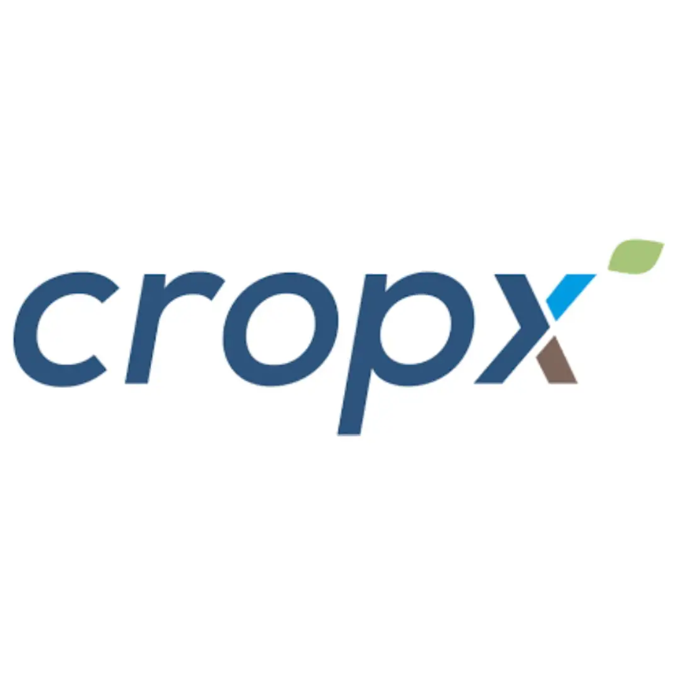</p>
      </td>
      <td valign="top">
         <p>AgriWebb</p>
         <p></p>
      </td>
      <td valign="top">
         <p>DigiFarmz</p>
         <p>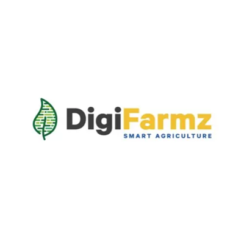</p>
      </td>
   </tr>
   <tr>
      <td rowspan="2">Perfil</td>
      <td valign="top">Overview</td>
      <td valign="top"><b>HydroSmart</b> es una solución que tiene como propósito optimizar el uso de agua en el riego de los cultivos utilizando sistemas de riego y sensores de humedad eficaces.</td>
      <td valign="top"><b>CropX</b> es un sistema de gestión agrícola que recopila y analiza datos para ayudar a los agricultores a administrar sus cultivos.</td>
      <td valign="top"><b>AgriWebb</b> es una plataforma que ofrece una solución integral para ayudar a los agricultores a registrar datos de forma segura para decisiones agrícolas y fines de auditoría.</td>
      <td valign="top"><b>DigiFarmz</b> es una plataforma que viene a ayudar en los trabajos de técnicos y productores para maximizar los rendimientos, con el manejo eficiente de las enfermedades en el cultivo de soja.</td>
   </tr>
   <tr>
      <td valign="top">
         <p>Ventaja competitiva</p>
         <p>¿Qué valor ofrece a los clientes?</p>
      </td>
      <td valign="top">Integración simple y económica para pequeños agricultores.</td>
      <td valign="top">Análisis avanzado del suelo y recomendaciones</td>
      <td valign="top">Fuerte enfoque en la trazabilidad y la capacidad de capturar datos en tiempo real</td>
      <td valign="top">Recomendaciones agronómicas en tiempo real</td>
   </tr>
   <tr>
      <td rowspan="2">Perfil de Marketing</td>
      <td valign="top">Mercado objetivo</td>
      <td valign="top">Pequeños y medianos agricultores en Perú</td>
      <td valign="top">Productores medianos y grandes a nivel global</td>
      <td valign="top">Productores agropecuarios, sobre todo en Australia</td>
      <td valign="top">Agricultores en Latinoamérica, especialmente Brasil</td>
   </tr>
   <tr>
      <td valign="top">Estrategias de marketing</td>
      <td valign="top">Marketing digital, colaboraciones con asociaciones agrícolas</td>
      <td valign="top">Presencia global, partners agrícolas</td>
      <td valign="top">Promoción digital y alianzas con universidades</td>
      <td valign="top">Redes sociales, asociaciones con institutos técnicos</td>
   </tr>
   <tr>
      <td rowspan="3">Perfil de Producto</td>
      <td valign="top">Productos & Servicios</td>
      <td valign="top">Sensores de humedad, control de riego inteligente, y aplicación web/móvil para tener control sobre estos.</td>
      <td valign="top">Sensores, dashboard en la nube, app móvil</td>
      <td valign="top">App de gestión, integración de datos y sensores</td>
      <td valign="top">Recomendaciones de cultivo con base en clima y suelo</td>
   </tr>
   <tr>
      <td valign="top">Precios & Costos</td>
      <td valign="top">Bajo costo, modelo SaaS mensual</td>
      <td valign="top">Planes de suscripción, precios altos</td>
      <td valign="top">Suscripción mensual, depende del tamaño de la finca</td>
      <td valign="top">Freemium + suscripción mensual accesible</td>
   </tr>
   <tr>
      <td valign="top">Canales de distribución (Web y/o Móvil)</td>
      <td valign="top">App móvil y app web</td>
      <td valign="top">Web y app, integración con ERPs</td>
      <td valign="top">Web, app móvil y plataforma online</td>
      <td valign="top">Web, app móvil, redes sociales</td>
   </tr>
   <tr>
      <td rowspan="5">Análisis SWOT</td>
      <td colspan="5" valign="top">Realice esto para su startup y sus competidores. Sus fortalezas deberían apoyar sus oportunidades y contribuir a lo que ustedes definen como su posible ventaja competitiva. </td>
   </tr>
   <tr>
      <td valign="top">
         <p>Fortalezas</p>
         <p></p>
      </td>
      <td valign="top">
        Simple, accesible, centrado en usuarios rurales
      </td>
      <td valign="top">
        Precisión científica, soporte global
      </td>
      <td valign="top">
        Completa gestión de finca con enfoque práctico
      </td>
      <td valign="top">
        Rápida adaptación a condiciones regionales
      </td>
   </tr>
   <tr>
      <td valign="top">Debilidades</td>
      <td valign="top">
        Menor madurez tecnológica, recién ingresando al mercado
      </td>
      <td valign="top">
        Costoso, complejo de implementar
      </td>
      <td valign="top">
        Costoso para pequeñas fincas, poca especialización en agricultura no ganadera
      </td>
      <td valign="top">
        Está muy limitado fuera de Brasil
      </td>
   </tr>
   <tr>
      <td valign="top">Oportunidades</td>
      <td valign="top">
        Alta demanda de soluciones accesibles y simples
      </td>
      <td valign="top">
        Expansión a mercados emergentes
      </td>
      <td valign="top">
        Adaptación a otros cultivos y regiones
      </td>
      <td valign="top">
        Escalar hacia otros países de LatAm
      </td>
   </tr>
   <tr>
      <td valign="top">Amenazas</td>
      <td valign="top">
        Competencia de plataformas más establecidas o especializadas en áreas específicas
      </td>
      <td valign="top">
        Competencia de startups más ágiles
      </td>
      <td valign="top">
        Cambios en regulaciones o tecnologías
      </td>
      <td valign="top">
        Competidores con mayor inversión y tecnologías más avanzadas
      </td>
   </tr>
</table>

### 2.1.2. Estrategias y tácticas frente a competidores

**Experiencia personalizada de soporte:** Ofrecer soporte por videollamada o visitas puntuales de técnicos aliados para ayudar en la instalación inicial. Esta táctica genera confianza, fideliza al cliente desde el inicio y reduce errores en el uso del sistema.

**Penetración de mercado en zonas rurales:** Promocionar el producto en radios rurales, ferias agrícolas locales y visitas técnicas, aprovechando medios accesibles para el público objetivo. De esta forma, también se puede generar confianza y credibilidad en la comunidad agrícola.

**Expansión de la Red de Colaboradores:** Formar alianzas con universidades y centros de investigación agrícola para desarrollar nuevos conocimientos y tecnologías. Estas colaboraciones permitirán el acceso a investigaciones avanzadas y tecnologías emergentes, lo que puede enriquecer la oferta de HydroSmart y fomentar la innovación.

**Mejora continua:** Siempre tener en cuenta las opiniones de los usuarios, y así obtener feedback, sugerencias y casos de éxito para alimentar el desarrollo del producto. Por otro lado, se puede analizar mensualmente las funcionalidades de los competidores y priorizar mejoras clave en base a lo que el usuario realmente valora.

## 2.2. Entrevistas

### 2.2.1. Diseño de entrevistas

Las entrevistas representan una estrategia de investigación que implica el intercambio de diálogo con el propósito de adquirir datos, empleando cuestionamientos específicos para explorar en profundidad el pensamiento y la visión de la persona objeto de estudio.

##### Segmento Objetivo: Agricultor

1. En pocas palabras, ¿Cómo describiría su día a día como agricultor?
2. ¿Con qué cultivos trabaja actualmente y en qué zona se ubica su terreno?
3. ¿Cuáles son los principales problemas que enfrenta en el manejo del agua para sus cultivos?
4. ¿Lleva usted un control sobre cuándo y cuánto riega sus cultivos?
5. ¿Utiliza alguna herramienta o aplicación para manejar el control de sus cultivos?
6. ¿Cuántas veces al día o a la semana suele regar sus cultivos? ¿Y en qué horarios normalmente lo hace?
7. ¿Cree que gasta más agua de la que realmente necesita para regar sus cultivos?
8. ¿Le parece que regar los cultivos es una tarea pesada o cansada? ¿Por qué?
9. ¿Cree que la calidad del agua que usa para regar afecta a sus cultivos? ¿Por qué?
10. Si existiera una aplicación que controle el sistema de riego por usted y le avise cuando se esté regando los cultivos, ¿estaría dispuesto a probarla?

##### Objetivo

El propósito de estas entrevistas es entender a fondo cómo los agricultores gestionan el riego de sus cultivos en el día a día. Queremos conocer sus hábitos, dificultades y necesidades reales en el uso del agua, ya que este recurso es clave tanto para la productividad como para el ahorro.

Con la información que usted nos comparta, podremos diseñar una aplicación práctica, sencilla y útil, que le ayude a optimizar el uso del agua, reducir el desperdicio y mejorar el rendimiento de sus cultivos. Nos enfocamos especialmente en dos aspectos:

- Cuánta agua se utiliza realmente durante el riego.

- Qué problemas enfrentan los agricultores al tratar de controlar o automatizar el riego.

Nuestro objetivo final es brindarle una herramienta que facilite su trabajo, ahorre agua y mejore sus resultados sin complicarle la vida.

### 2.2.2. Registro de entrevistas

Enlace del video de las entrevista: [Enlace a Microsoft Stream](https://upcedupe-my.sharepoint.com/:v:/g/personal/u202217241_upc_edu_pe/Ee74xVmCHXdCqRbfXAxMVYcBWwsAtbc9I_3-GWoUAOtq4A?e=53DCcG&nav=eyJyZWZlcnJhbEluZm8iOnsicmVmZXJyYWxBcHAiOiJTdHJlYW1XZWJBcHAiLCJyZWZlcnJhbFZpZXciOiJTaGFyZURpYWxvZy1MaW5rIiwicmVmZXJyYWxBcHBQbGF0Zm9ybSI6IldlYiIsInJlZmVycmFsTW9kZSI6InZpZXcifX0%3D)

**Entrevista 1**

**Entrevistador:** Salvador Salinas

**Entrevistado:** Anderson Gonza

**Edad:** 23 años

**Distrito:** Lurín


**Resumen:** Anderson es un agricultor de 23 años que cultiva hortalizas junto a su padre en Lurín. Mencionó que uno de los problemas con el agua es la irregularidad en el suministro de agua del canal y la presión que a veces no alcanza. Comenta que es bastante problable que se utilice más agua de la necesaria al no tener un control sobre este. De esta forma, le gustaría contar con una herramienta que le ayude a optimizar el riego. Anderson está dispuesto a probar una aplicación que le facilite esta tarea.

**Entrevista 2**

**Entrevistador:** Sebastian Paredes

**Entrevistado:** Alessandra Chaupis

**Edad:** 20 años

**Distrito:** San Juan de Lurigancho


**Resumen:** Alessandra, de 20 años, tiene un familiar que se dedica a la agricultura en una zona rural de la Sierra, donde cultiva papa, maíz y habas. Señala que uno de los principales problemas es el acceso irregular al agua y la falta de tecnología para un mejor aprovechamiento. Su familiar no lleva un control preciso del riego ni utiliza herramientas digitales, por lo que muchas veces termina usando más agua de la necesaria. El riego es una tarea física y demandante, especialmente por la necesidad de trasladar agua. Además, cree que la calidad del agua puede afectar directamente a los cultivos. Debido a estas dificultades, Alessandra considera que su familiar estaría muy interesado en probar una aplicación que ayude a automatizar y optimizar el sistema de riego, sobre todo ante los efectos del cambio climático y las sequías recientes.

**Entrevista 3**

**Entrevistador:** Piero Delgado

**Entrevistado:** Daniel Ruiz

**Edad:** 20 años

**Distrito:** Juliaca


**Resumen:** En la entrevista, Daniel describe su rutina diaria como agotadora, iniciando desde las 4 o 5 a.m. y trabajando hasta el anochecer. Cultiva principalmente papa y camote en un clima complicado, donde el manejo del agua representa un gran desafío debido a la irregularidad del clima. No lleva un control exacto del riego ni usa herramientas tecnológicas, regando de dos a tres veces por semana en las mañanas. Reconoce que gasta más agua de la necesaria y que la calidad del agua afecta directamente a sus cultivos. Finalmente, muestra interés en una aplicación que automatice el riego y le brinde alertas, ya que considera que le ayudaría a optimizar sus procesos y ahorrar agua.

**Entrevista 4**

**Entrevistador:** Natanael Soto

**Entrevistado:** Joan Talizo

**Edad:** 23 años

**Distrito:** San Borja


**Resumen:** Joan, un joven agricultor de Puno, trabaja sus campos de quinua, papa y otros productos en la zona de Tonco, además de cuidar su rebaño de ovejas. Su día a día es exigente, marcado por la revisión y el cuidado manual de sus cultivos. Un problema importante que enfrenta es la gestión del agua para el riego, especialmente durante las sequías, debido a la distancia y la falta de sistemas precisos. Lleva el control del riego de forma manual y reconoce que a veces gasta más agua de la necesaria. Regar es una tarea pesada para él, y la calidad del agua que utiliza también le preocupa por su impacto en las plantas. Ante la posibilidad de usar una aplicación que controle el riego, John se muestra muy interesado en probarla para ahorrar agua, tiempo y asegurar un riego óptimo, incluso sin buena señal.

**Entrevista 5**

**Entrevistador:** Marcelo Neyra

**Entrevistado:** Giancarlo Paredes

**Edad:** 18 años

**Distrito:** San Borja


**Resumen:** Giancarlo Paredes es un joven de 18 años perteneciente a una familia de agrícolas. Nos menciona que cuenta con cultivos de maiz y kiwicha que revisa diariamente. En cuanto al manejo del agua, nos comenta que no suele tener muchos problemas con el agua, ya que en donde vive hay abundante agua, y que lleva un control para sus dos tipos de cultivos, debido a que no se riegan con la misma frecuencia. Por último, considera que la calidad del agua no afecta a sus cultivos, ya que toda viene de un lago cercano a donde vive, llamada "Laguna del Parón"

### 2.2.3. Análisis de entrevistas

**Segmento: Agricultores**

El análisis de entrevistas a agricultores revela patrones comunes que permiten identificar características clave para crear arquetipos representativos. Este grupo se distingue por los problemas que tienen con el control del agua y su gran necesidad de apoyo técnico. Las entrevistas proporcionan una visión detallada de los desafíos y expectativas de estos agricultores, especialmente respecto al uso de herramientas tecnológicas para tener un sistema de riego automatizado.

**Segmento Demográfico:**

Edad: Principalmente jóvenes adultos (25 a 55 años).

Sexo: Masculino y Femenino.

Ocupación: Jóvenes que trabajan en la gestión de cultivos.

**Segmento Geográfico:**

País: Perú.

Idioma: Español.

**Segmento Psicográfico:**

_Clase Social:_ NSE C y NSE D, debido a que trabajan en granjas familiares pequeñas con recursos limitados.

_Intereses:_ Buscan mejorar sus cultivos y optimizar el uso del agua, además de estar interesados en aprender sobre nuevas tecnologías que puedan ayudarles en su trabajo diario.

**Segmento Conductual:**

_Conocimientos:_ Tienen conocimientos básicos sobre riego y cultivos, pero carecen de experiencia en el uso de tecnologías avanzadas.

_Actitudes:_ Muestran disposición a aprender y adoptar nuevas tecnologías, pero necesitan apoyo y orientación para hacerlo de manera efectiva.

**Características Objetivas:**

- Tienen acceso limitado a internet.

- Utilizan principalmente celulares con Android y navegador Chrome.

- No han utilizado aplicaciones de riego automatizado.

**Características Subjetivas:**

- Se sienten motivados por el deseo de sacar adelante sus cultivos y mejorar su calidad de vida.

- Valoran la simplicidad y facilidad de uso en las herramientas tecnológicas.

- Buscan soluciones que les ayuden a optimizar el uso del agua y mejorar la productividad de sus cultivos.

<div style="page-break-after: always;"></div>

## 2.3. Needfinding

### 2.3.1. User Personas

Para esta sección se presentan personajes ficticios de acuerdo al segmento objetivo. La información que se ha utilizado para elaborar el User persona se obtuvo de las entrevistas realizadas previamente al segmento objetivo en cuestion. La intención de las entrevistas era conocer un poco más a las personas a las que la aplicación está dirigida. Entre la información de las entrevistas que fue utilizada tenemos demografía, metas, motivaciones, frustraciones, marcas relacionadas con el tema que envuelve a la aplicación, canales digitales que más utiliza, etc. Para la creación de esta sección se utilizó la plataforma UXPressia.

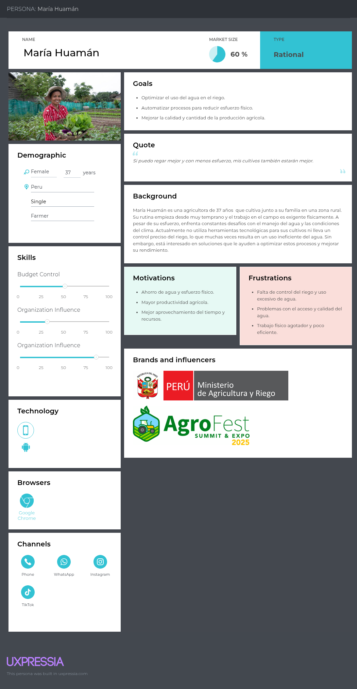

<div style="page-break-after: always;"></div>

### 2.3.2. User Task Matrix

En esta sección se presenta el user task matrix, herramienta centrada en el segmento objetivo (agricultor), que nos permitirá identificar las tareas y objetivos claves del usuario. Además, nos permitirá priorizar características y funcionalidades al momento de realizar el product backlog. Para la frecuencia se han considerado cinco opciones:nunca ,casi nunca, a veces, a menudo ,siempre; y para la importancia tres opciones: bajo, medio, alto.

<table>
  <thead>
    <tr>
      <th rowspan="2">User task Matrix</th>
      <th colspan="2">Maria Huaman</th>
    </tr>
    <tr>
      <th>Frecuencia</th>
      <th>Importancia</th>
    </tr>
  </thead>
  <tbody>
    <tr>
      <td>Revisar humedad del suelo desde la app</td>
      <td>Siempre</td>
      <td>Alto</td>
    </tr>
    <tr>
      <td>Activar/desactivar el sistema de riego automático</td>
      <td>A menudo</td>
      <td>Alto</td>
    </tr>
    <tr>
      <td>Ver alertas de exceso o falta de riego</td>
      <td>Siempre</td>
      <td>Alto</td>
    </tr>
    <tr>
      <td>Consultar el historial de riego</td>
      <td>A veces</td>
      <td>Medio</td>
    </tr>
    <tr>
      <td>Verificar el consumo mensual de agua</td>
      <td>A veces</td>
      <td>Alto</td>
    </tr>
    <tr>
      <td>Controlar manualmente el riego si es necesario</td>
      <td>Casi nunca</td>
      <td>Alto</td>
    </tr>
    <tr>
      <td>Revisar el estado de sensores (batería, conectividad)</td>
      <td>A veces</td>
      <td>Medio</td>
    </tr>
    <tr>
      <td>Configurar límites personalizados de riego por cultivo</td>
      <td>Casi nunca</td>
      <td>Medio</td>
    </tr>
    <tr>
      <td>Contactar soporte técnico o ver tutorial</td>
      <td>Casi nunca</td>
      <td>Bajo</td>
    </tr>
  </tbody>
</table>

<div style="page-break-after: always;"></div>

### 2.3.3. User Journey Mapping

En esta sección se presentarán los user journey mapping para el user persona.

**User Journey Mapping: Agricultor**

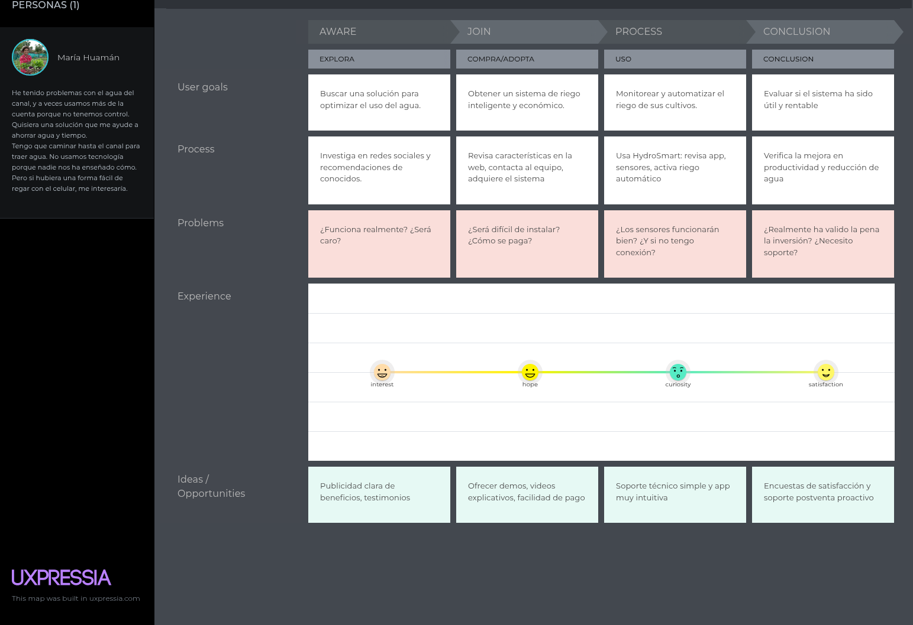 
 
<div style="page-break-after: always;"></div>

### 2.3.4. Empathy Mapping

En esta sección se presentarán los empathy mapping de acuerdo al user persona que se realizo. El empathy mapping será de utilidad debido a que podemos conocer a mayor detalle a nuestros clientes, lo que nos permite mejorar algunos aspectos de la aplicación.

**Segmento objetivo: Agricultor**

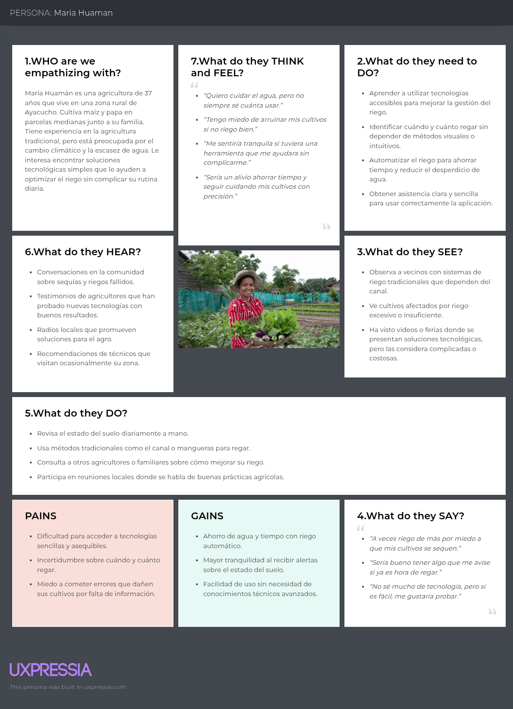

<div style="page-break-after: always;"></div>

### 2.3.5. As-is Scenario Mapping

Segmento objetivo: Agricultor

<table>
  <tr>
    <th>Fase</th>
    <th>Inicio del día</th>
    <th>Inspección general de los cultivos</th>
    <th>Regado de los cultivos</th>
    <th>Finalización e inspección del regado</th>
  </tr>
  <tr>
    <th>Doing</th>
    <td>
      <ul>
        <li>Me levanto a las 4:00 am</li>
        <li>Veo qué cultivos son los que revisaré y regaré hoy</li>
        <li>Me dirijo al campo para empezar mi día</li>
      </ul>
    </td>
    <td>
      <ul>
        <li>Reviso los cultivos que me tocaba inspeccionar hoy</li>
        <li>Me aseguro de no ver ninguna anormalidad aparente</li>
        <li>Verifico la calidad de la tierra</li>
      </ul>
    </td>
    <td>
      <ul>
        <li>Empiezo a regar los cultivos que tocaban hoy</li>
        <li>Hago lo mejor que puedo que a ningún cultivo le llegue muy poca a demasiada agua</li>
      </ul>
    </td>
    <td>
      <ul>
        <li>Termino de regar los cultivos</li>
        <li>Hago una verificación rápida de los cultivos</li>
        <li>Empiezo con mis otras actividades diarias</li>
      </ul>
    </td>
  </tr>
  <tr>
    <th>Thinking</th>
    <td>Un día más en el trabajo. A empezar otro día</td>
    <td>Tengo que asegurarme que los cultivos y la tierra se encuentren en buen estado. Si la tierra está muy seca, tendré que pasar más tiempo regando</td>
    <td>Tengo que tener cuidado con cuanto riego. Si me paso de agua, puedo arruinar una gran cantidad de mis cultivos</td>
    <td>Después de unas cuantas horas, puedo finalmente seguir con mis otras actividades. Espero no haber regado de más</td>
  </tr>
  <tr>
    <th>Feeling</th>
    <td>Normal. Espero que hoy sea un buen día para los cultivos</td>
    <td>Ligeramente ansioso. Si hay alguna anomalía, puede afectar mi rutina diaria y puede atrasarme algunas tareas</td>
    <td>Aburrido. Mientras riego manualmente los cultivos no puedo hacer mucho más</td>
    <td>Intranquilo. Aunque sé que tengo ya bastante experiencia regando los cultivos, uno nunca puede estar 100% seguro que lo haya hecho perfectamente</td>
  </tr>
</table>

<div style="page-break-after: always;"></div>

## 2.4. Ubiquitous Language

| **Término (en inglés)**       | **Término (en español)**     | **Definición**                                                                                                                     |
| ----------------------------- | ---------------------------- | ---------------------------------------------------------------------------------------------------------------------------------- |
| **Farmer**                    | Agricultor                   | Persona que se dedica al cultivo de la tierra y al manejo de cultivos agrícolas.                                                   |
| **Irrigation**                | Riego                        | Proceso de aplicar agua a los cultivos de manera controlada para asegurar su crecimiento.                                          |
| **Smart irrigation system**   | Sistema de riego inteligente | Tecnología que permite automatizar y optimizar el uso del agua en el riego agrícola, considerando factores climáticos y del suelo. |
| **Water efficiency**          | Eficiencia del agua          | Grado en que el uso del agua logra el máximo beneficio con el menor desperdicio posible.                                           |
| **Crop yield**                | Rendimiento de cultivo       | Cantidad de producto agrícola cosechado por unidad de área sembrada.                                                               |
| **Water scarcity**            | Escasez de agua              | Situación en la que la disponibilidad de agua es insuficiente para satisfacer las demandas agrícolas y otras necesidades.          |
| **Sustainable agriculture**   | Agricultura sostenible       | Práctica agrícola que busca equilibrar la producción de alimentos con el cuidado del medio ambiente y los recursos naturales.      |
| **Weather data**              | Datos climáticos             | Información relacionada al clima (temperatura, humedad, lluvia, etc.) usada para tomar decisiones en el riego.                     |
| **Soil moisture**             | Humedad del suelo            | Cantidad de agua presente en el suelo, relevante para determinar la necesidad de riego.                                            |
| **Field**                     | Campo                        | Terreno destinado al cultivo de productos agrícolas.                                                                               |
| **Agricultural productivity** | Productividad agrícola       | Relación entre la producción obtenida y los recursos utilizados en la actividad agrícola.                                          |
| **Irrigation scheduling**     | Programación de riego        | Planificación del momento y duración del riego según las necesidades del cultivo y condiciones ambientales.                        |
| **Climate change**            | Cambio climático             | Alteraciones significativas y duraderas en los patrones del clima, que afectan la disponibilidad de agua y la producción agrícola. |

<div style="page-break-after: always;"></div>

# Capítulo III: Requirements Specification

## 3.1. To-Be Scenario Mapping

Segmento objetivo: Agricultor

<table>
  <tr>
    <th>Fase</th>
    <th>Inicio del día</th>
    <th>Inspección general de los cultivos</th>
    <th>Regado de los cultivos</th>
    <th>Finalización e inspección del regado</th>
  </tr>
  <tr>
    <th>Doing</th>
    <td>
      <ul>
        <li>Me levanto a las 5:00 am</li>
        <li>Me dirijo al campo para empezar mi día</li>
      </ul>
    </td>
    <td>
      <ul>
        <li>Reviso la aplicación HydroSmart para ver qué cultivos serán los que serán regados hoy</li>
        <li>La aplicación me indica si es que hay alguna anormalidad relacionada con el agua</li>
        <li>Verifico la calidad de la tierra</li>
      </ul>
    </td>
    <td>
      <ul>
        <li>El sistema HydroSmart riega por mí los cultivos automáticamente</li>
        <li>Le doy un vistazo al sistema para verificar cuánta agua está utilizando para los cultivos</li>
        <li>Si considero que está utilizando mucha agua, lo detengo</li>
      </ul>
    </td>
    <td>
      <ul>
        <li>Los cultivos terminan de regarse automáticante</li>
        <li>Hago una verificación rápida de los cultivos</li>
        <li>Empiezo con mis otras actividades diarias</li>
      </ul>
    </td>
  </tr>
  <tr>
    <th>Thinking</th>
    <td>Un día más en el trabajo. A empezar otro día</td>
    <td>A través de la aplicación HydroSmart, puedo verificar si los cultivos y la tierra se encuentren en buen estado. Si existe algún problema, la aplicación me lo indicará</td>
    <td>Con la aplicación HydroSmart no me tengo que preocupar mucho del riego. Si algo llegara a fallar, solo lo detengo</td>
    <td>Dado que el sistema hace el regado por mí, no tuve que invertir mucho tiempo en esta etapa, por lo que puedo empezar más temprano mis otras actividades</td>
  </tr>
  <tr>
    <th>Feeling</th>
    <td>Normal. Espero que hoy sea un buen día para los cultivos</td>
    <td>Contento. El sistema simplifica considerablemente la etapa de riego. Si hay algún problema, la aplicación me lo indica</td>
    <td>Aliviado. Puedo realizar otras actividades mientras se están regando los cultivos</td>
    <td>Contento. Ahora que el riego ha terminado, puedo enfocarme al 100% en mis otras actividades</td>
  </tr>
</table>

<div style="page-break-after: always;"></div>

## 3.2. User Stories

<table>
  <tr>
    <th>Epic ID</th>
    <th> Epic </th>
    <th> User Story ID </th>
    <th> User Story </th>
  </tr>
  <!--Epic 1-->
  <tr>
    <th rowspan="7"> EP01 </th>
    <th rowspan="7"> Landing Page </th>
    <td> US01 </td>
    <td> Implementación de Barra de navegación </td>
  </tr>
  <tr>
    <td> US02 </td>
    <td> Logo y Descripción de la empresa </td>
  </tr>
  <tr>
    <td> US03 </td>
    <td> Detalles y Servicios de la empresa </td>
  </tr>
  <tr>
    <td> US04 </td>
    <td> Clientes de la empresa </td>
  </tr>
  <tr>
    <td> US05 </td>
    <td> Acerca de nosotros </td>
  </tr>
  <tr>
    <td> US06 </td>
    <td> Implementación de un Footer </td>
  </tr>
  <tr>
    <td> US07 </td>
    <td> Traslación a la aplicación web </td>
  </tr>
  <!--Epic 2-->
  <tr>
    <th rowspan="7"> EP02 </th>
    <th rowspan="7"> Monitoreo de los cultivos </th>
    <td> US08 </td>
    <td> Verificación de humedad del suelo </td>
  </tr>
  <tr>
    <td>TS-US08</td>
    <td>Verificar humedad del suelo</td>
  </tr>
  <tr>
    <td> US09 </td>
    <td> Verificación de temperatura del suelo </td>
  </tr>
  <tr>
    <td>TS-US09</td>
    <td>Verificar temperatura del suelo</td>
  </tr>
  <tr>
    <td> US10 </td>
    <td> Acciones Recomendadas </td>
  </tr>
  <tr>
    <td> US11 </td>
    <td> Historial del cultivo </td>
  </tr>
  <tr>
    <td>TS-US11</td>
    <td>Mostrar historial del cultivo</td>
  </tr>
  <!--Epic 3-->
  <tr>
    <th rowspan="6"> EP03 </th>
    <th rowspan="6"> Sistema automático de riego </th>
    <td> US12 </td>
    <td> Interacción con el riego automático </td>
  </tr>
  <tr>
    <td>TS-US12</td>
    <td>Interactuar con el riego automático</td>
  </tr>
  <tr>
    <td> US13 </td>
    <td> Notificaciones de regado </td>
  </tr>
  <tr>
    <td>TS-US13</td>
    <td>Notificar el regado</td>
  </tr>
  <tr>
    <td> US14 </td>
    <td> Limites en el uso agua por cultivo</td>
  </tr>
  <tr>
    <td>TS-US14</td>
    <td>Limitar el uso de agua por cultivo</td>
  </tr>
  <!--Epic 4-->
  <tr>
    <th rowspan="4"> EP04 </th>
    <th rowspan="4"> Administración de Agua </th>
    <td> US15 </td>
    <td> Cantidad de agua disponible </td>
  </tr>
  <tr>
    <td>TS-US15</td>
    <td>Mostrar Cantidad de agua disponible</td>
  </tr>
  <tr>
    <td> US16 </td>
    <td> Historial de consumo de agua mensual </td>
  </tr>
  <tr>
    <td>TS-US16</td>
    <td>Mostrar historial de consumo de agua mensual</td>
  </tr>
  <!--Epic 5-->
  <tr>
    <th rowspan="14"> EP05 </th>
    <th rowspan="14"> Configuración del sistema </th>
    <td> US17 </td>
    <td> Apagar y Encender los Sistemas</td>
  </tr>
  <tr>
    <td> TS-US17 </td>
    <td> Apagar/Encender Sistemas </td>
  </tr>
  <tr>
    <td> US18 </td>
    <td> Verificación del estado del sistema de regado</td>
  </tr>
  <tr>
    <td> TS-US18 </td>
    <td> Verificar estado del sistema de regado </td>
  </tr>
  <tr>
    <td> US19 </td>
    <td> Verificación del estado del sensor de humedad </td>
  </tr>
  <tr>
    <td> TS-US19 </td>
    <td> Verificar estado del sensor de humedad </td>
  </tr>
  <tr>
    <td> US20 </td>
    <td> Verificación del estado del sensor de temperatura </td>
  </tr>
  <tr>
    <td> TS-US20 </td>
    <td> Verificar estado del sensor de temperatura </td>
  </tr>
  <tr>
    <td> US21 </td>
    <td> Verificación de la batería</td>
  </tr>
  <tr>
    <td> TS-US21 </td>
    <td> Verificar batería </td>
  </tr>
  <tr>
    <td> US22 </td>
    <td> Añadir un nuevo sistema de HydroSmart </td>
  </tr>
  <tr>
    <td> TS-US22 </td>
    <td> Agregar un nuevo sistema HydroSmart</td>
  </tr>
  <tr>
    <td> US23 </td>
    <td> Quitar un sistema de HydroSmart </td>
  </tr>
  <tr>
    <td> TS-US23 </td>
    <td> Eliminar un sistema HydroSmart</td>
  </tr>
  <!--Epic 6-->
  <tr>
    <th rowspan="4"> EP06 </th>
    <th rowspan="4"> Autenticación de Usuarios </th>
    <td> US24 </td>
    <td> Registro de usuarios </td>
  </tr>
  <tr>
    <td> TS-US24 </td>
    <td> Registar usuario</td>
  </tr>
  <tr>
    <td> US25 </td>
    <td> Acceso de Usuarios </td>
  </tr>
  <tr>
    <td> TS-US25 </td>
    <td> Acceso a usuario </td>
  </tr>
  <!--Epic 7-->
  <tr>
    <th rowspan="4"> EP07 </th>
    <th rowspan="4"> Administración de Contraseña de Usuarios </th>
    <td> US26 </td>
    <td> Actualización de contraseña </td>
  </tr>
  <tr>
    <td> TS-US26 </td>
    <td> Actualizar contraseña</td>
  </tr>
  <tr>
    <td> US27 </td>
    <td> Recuperación de contraseña </td>
  </tr>
  <tr>
    <td> TS-US27 </td>
    <td> Recuperar de contraseña</td>
  </tr>
</table>

<p></p>

<table>
  <tr>
    <th> Epic / Story ID </th>
    <th> Título </th>
    <th> Descripción </th>
    <th> Criterios de Aceptación </th>
    <th> Relacionado con (Epic ID) </th>
  </tr>
  <tr>
    <td colspan="5">
      <h5 style="text-align: center">EPIC 1: LANDING PAGE</h5>
      <p>
        Como visitante, quiero contar con una landing page para visualizar todas las funcionalidades que tiene la aplicación móvil que ofrece la empresa
      </p>
    </td>
  </tr>
  <tr>
    <th>EP01 / US01</th>
    <th>Implementación de Barra de navegación</th>
    <td>
      <p> Como visitante </p>
      <p> Quiero tener la opción de atravesar todas las secciones de la landing page a través de una barra de navegación </p>
      <p> Para facilitar el acceso a la información </p>
    </td>
    <td>
      <h5>Escenario 1: Traslado de una sección a otra</h5>
        <p> Dado que el usuario se encuentra en la landing page </p>
        <p> Cuando el usuario seleccione una de las secciones de la barra de navegación </p>
        <p> Entonces se trasladará a la sección seleccionada </p>
      <h5>Escenario 2: Selección de la misma sección de la landing page</h5>
        <p> Dado que el usuario se encuentra en una sección específica de la landing page </p>
        <p> Cuando el usuario seleccione la misma sección en la barra de navegación </p>
        <p> Entonces la pantalla no se moverá a otra sección diferente </p>
    </td>
    <td>EP01</td>
    </tr>
  <tr>
    <th>EP01 / US02</th>
    <th> Logo y Descripción de la empresa </th>
    <td>
      <p> Como visitante </p>
      <p> Quiero visualizar el logo y descripción de la empresa </p>
      <p> Para verificar que estoy en la landing page oficial de la empresa </p>
    </td>
    <td>
      <h5> Escenario 1: Visualización del Logo </h5>
        <p> Dado que el usuario se encuentra en la landing page </p>
        <p> Cuando el usuario seleccione “Inicio” en la barra de navegación </p>
        <p> Entonces se trasladará al usuario a la sección del logo y descripción de la empresa </p>
      <h5>Escenario 2: El logo no aparece</h5>
        <p> Dado que el usuario se encuentra en una sección específica de la landing page </p>
        <p> Cuando el usuario seleccione “Inicio” en la barra de navegación </p>
        <p> Y el logo de la empresa no haya cargado </p>
        <p> Entonces se trasladará al usuario a la sección del logo y descripción de la empresa </p>
        <p> Y aparecerá solo la descripción </p>
    </td>
    <td>EP01</td>
  </tr>
  <tr>
    <th>EP01 / US03</th>
    <th>Detalles y Servicios de la empresa</th>
    <td>
      <p> Como visitante </p>
      <p> Quiero visualizar los detalles y servicios de la empresa </p>
      <p> Para conocer de qué manera se puede utilizar la aplicación </p>
    </td>
    <td>
      <h5>Escenario 1: Traslado a la sección servicios</h5>
        <p> Dado que el usuario se encuentra en la landing page </p>
        <p> Cuando el usuario seleccione “Servicios” en la barra de navegación </p>
        <p> Entonces se trasladará al usuario a la sección de detalles de servicios </p>
      <h5>Escenario 2: El usuario ya se encuentra en la sección servicios</h5>
        <p> Dado que el usuario se encuentra en la sección “servicios” </p>
        <p> Cuando el usuario seleccione “Servicios” en la barra de navegación </p>
        <p> Entonces el sistema mantendrá al usuario en la sección seleccionada </p>
    </td>
    <td>EP01</td>
  </tr>
  <tr>
    <th>EP01 / US04</th>
    <th>Clientes de la empresa</th>
    <td>
      <p> Como visitante </p>
      <p> Quiero visualizar las experiencias de clientes previos de la empresa </p>
      <p> Para es que la vida de los usuarios cambió al utilizar la aplicación </p>
    </td>
    <td>
      <h5>Escenario 1: Traslado a la sección clientes</h5>
        <p> Dado que el usuario se encuentra en la landing page </p>
        <p> Cuando el usuario seleccione “Clientes” en la barra de navegación </p>
        <p> Entonces se trasladará al usuario a la sección de experiencia de clientes </p>
      <h5>Escenario 2: El usuario ya se encuentra en la sección clientes</h5>
        <p> Dado que el usuario se encuentra en la sección “clientes” </p>
        <p> Cuando el usuario seleccione “Clientes” en la barra de navegación </p>
        <p> Entonces el sistema mantendrá al usuario en la sección seleccionada </p>
    </td>
    <td>EP01</td>
  </tr>
  <tr>
    <th>EP01 / US05</th>
    <th>Acerca de nosotros</th>
    <td>
      <p> Como visitante </p>
      <p> Quiero visualizar la misión y visión de la empresa </p>
      <p> Para conocer qué planes tienen a futuro </p>
    </td>
    <td>
      <h5>Escenario 1: Traslado a la sección Nosotros</h5>
        <p> Dado que el usuario se encuentra en la landing page </p>
        <p> Cuando el usuario seleccione “Acerca de Nosotros” en la barra de navegación </p>
        <p> Entonces se trasladará al usuario a la sección de experiencia de clientes </p>
      <h5>Escenario 2: El usuario ya se encuentra en la sección nosotros</h5>
        <p> Dado que el usuario se encuentra en la sección “Nosotros” </p>
        <p> Cuando el usuario seleccione “Acerca de Nosotros” en la barra de navegación </p>
        <p> Entonces el sistema mantendrá al usuario en la sección seleccionada </p>
    </td>
    <td>EP01</td>
  </tr>
  <tr>
    <th>EP01 / US06</th>
    <th>Implementación de un Footer</th>
    <td>
      <p> Como visitante </p>
      <p> Quiero visualizar un Footer al final de la página </p>
      <p> Para ver las redes sociales asociadas a la empresa </p>
    </td>
    <td>
      <h5>Escenario 1: Traslado a la sección de footer</h5>
        <p> Dado que el usuario se encuentra en la landing page </p>
        <p> Cuando el usuario se dirija al final de la landing page </p>
        <p> Entonces el usuario visualizará las redes sociales asociadas a la empresa </p>
      <h5>Escenario 2: Traslado al usuario de la red social seleccionada</h5>
        <p> Dado que el usuario se encuentra en el footer </p>
        <p> Cuando el usuario seleccione una de íconos de las redes sociales que aparecen la sección del footer </p>
        <p> Entonces el sistema redirigirá al usuario a la red social indicada </p>
      </td>
    <td>EP01</td>
  </tr>
  <tr>
    <th>EP01 / US07</th>  
    <th>Translación a la aplicación web</th>
    <td>
      <p> Como visitante </p>
      <p> Quiero contar con un botón que me redirija a la aplicación web </p>
      <p> Para tener un acceso directo y rápido a ella </p>
    </td>
    <td>
      <h5>Escenario 1: Traslado a la aplicación web</h5>
        <p> Dado que el usuario se encuentra en la landing page </p>
        <p> Cuando el dé click en el botón "Abrir App" </p>
        <p> Entonces el sistema redirigirá al usuario a la aplicación web </p>
      <h5>Escenario 2: Aplicación actualmente en mantenimiento</h5>
        <p> Dado que el usuario se encuentra en la landing page </p>
        <p> Cuando el dé click en el botón "Abrir App" </p>
        <p> Y lo servicios de la aplicación web estén actualmente en mantenimiento </p>
        <p> Entonces aparecerá un mensaje, indicando que actualmente la aplicación web está en mantenimiento </p>
    </td>
    <td>EP01</td>
  </tr>
  <!--EPIC 2-->
  <tr>
    <td colspan="5">
      <h5 style="text-align: center">EPIC 2: Monitoreo de Cultivos</h5>
      <p>
        Como agricultor, quiero contar con una interfaz que me indique el estado de los cultivos para facilitar la administración de estos
      </p>
    </td>
  </tr>
  <tr>
    <th>EP02 / US08</th>
    <th>Verificación de la humedad del suelo</th>
    <td>
      <p> Como agricultor </p>
      <p> Quiero contar con indicador de la humedad del suelo de cada uno de mis cultivos </p>
      <p> Para asegurarme que cada uno de los suelos esté en el estado correcto para no arruinar los cultivos </p>
    </td>
    <td>
      <h5>Escenario 1: Suelo con humedad dentro de los parámetros normales</h5>
        <p>Dado que el agricultor se encuentra en la página "Detalles del suelo"</p>
        <p>Cuando el agricultor quiera visualizar la humedad del suelo</p>
        <p>Y la humedad del suelo esté dentro de los parámetros aceptables</p>
        <p>Entonces se podrán ver los datos importantes del suelo</p>
        <p>Y en la parte inferior aparecerá un mensaje, indicando que el suelo se encuentra con la humedad favorable</p>
      <h5>Escenario 2: Suelo con humedad ligeramente fuera de los parámetros normales</h5>
        <p>Dado que el agricultor se encuentra en la página "Detalles del suelo"</p>
        <p>Cuando el agricultor quiera visualizar la humedad del suelo</p>
        <p>Y la humedad del suelo esté ligeramente fuera de los parámetros aceptables</p>
        <p>Entonces se podrán ver los datos importantes del suelo</p>
        <p>Y en la parte inferior aparecerá un mensaje de precaución, indicando que el suelo no se encuentra en un estado aceptable y que requiere atención</p>
      <h5>Escenario 3: Suelo con humedad fuera de los parámetros normales</h5>
        <p>Dado que el agricultor se encuentra en la página "Detalles del suelo"</p>
        <p>Cuando el agricultor quiera visualizar la humedad del suelo</p>
        <p>Y la humedad del suelo esté muy por fuera de los parámetros aceptables</p>
        <p>Entonces aparecerá un mensaje de peligro, indicando que el suelo necesita atención urgente y que se pueden hechar a perder los cultivos</p>
        <p>Y en la parte inferior se encontrarán los datos del cultivo</p>
      <h5>Escenario 4: Suelo inundado</h5>
        <p>Dado que el agricultor se encuentra en la página "Detalles del suelo"</p>
        <p>Cuando el agricultor quiera visualizar la humedad del suelo</p>
        <p>Y el suelo se encuentra inundado</p>
        <p>Entonces aparecerá un mensaje, indicando que el suelo se encuentra en una situación no favorable</p>
        <p>Y en la parte inferior se encontrarán los datos del cultivo</p>
        <p>Y aparecerá el botón "Acciones recomendadas"</p>
      <h5>Escenario 5: Suelo seco</h5>
        <p>Dado que el agricultor se encuentra en la página "Detalles del suelo"</p>
        <p>Cuando el agricultor quiera visualizar la humedad del suelo</p>
        <p>Y el suelo se encuentra muy seco</p>
        <p>Entonces aparecerá un mensaje, indicando que el suelo se encuentra en una situación no favorable</p>
        <p>Y en la parte inferior se encontrarán los datos del cultivo</p>
        <p>Y aparecerá el botón "Acciones recomendadas"</p>
    </td>
    <td>EP02</td>
  </tr>
  <tr>
    <th>EP02 / TS-US08</th>
    <th>Verificar humedad del suelo</th>
    <td>
      <p> Como desarrollador </p>
      <p> Quiero agregar un indicador de la humedad del suelo </p>
      <p> Para que los usuarios puedan ver el estado de los suelos de sus cultivos </p>
    </td>
    <td>
      <h5>Escenario 1: Suelo con humedad dentro de los parámetros normales</h5>
        <p>Dado que el endpoint/usuario está disponible</p>
        <p>Cuando una solicitud GET sea enviada al presionar el botón "Detalles del cultivo"</p>
        <p>Y la humedad del suelo esté dentro de los parámetros aceptables (high: 80%-100%, medio: 60%-80%, bajo: 40%-60%) para el tipo de cultivo que es</p>
        <p>Entonces se recibe una respuesta con el estado 200</p>
        <p>Y la página mostrará todos los datos importantes del suelo</p>
        <p>Y el mensaje "Humedad favorable" es mostrado</p>
      <h5>Escenario 2: Suelo con humedad ligeramente fuera de los parámetros normales</h5>
        <p>Dado que el endpoint/usuario está disponible</p>
        <p>Cuando una solicitud GET sea enviada al presionar el botón "Detalles del cultivo"</p>
        <p>Y la humedad del suelo esté ligeramente fuera de los parámetros aceptables (high: 75%-79%, medio: 55%-59% o 81%-85%, bajo: 35%-39% o 61%-65%) para el tipo de cultivo que es</p>
        <p>Entonces se recibe una respuesta con el estado 200</p>
        <p>Y la página mostrará todos los datos importantes del suelo</p>
        <p>Y el mensaje "Humedad ligeramente desfavorable, se recomienda una acción" es mostrado</p>
      <h5>Escenario 3: Suelo con humedad fuera de los parámetros normales</h5>
        <p>Dado que el endpoint/usuario está disponible</p>
        <p>Cuando una solicitud GET sea enviada al presionar el botón "Detalles del cultivo"</p>
        <p>Y la humedad del suelo esté muy por fuera de los parámetros aceptables (high: < 75%, medio: < 55% o > 85%, bajo: < 35% o > 65%) para el tipo de cultivo que es</p>
        <p>Entonces se recibe una respuesta con el estado 200</p>
        <p>Y la página mostrará todos los datos importantes del suelo</p>
        <p>Y el mensaje "Humedad desfavorable, se requiere acción" es mostrado</p>
      <h5>Escenario 4: Suelo inundado</h5>
        <p>Dado que el endpoint/usuario está disponible</p>
        <p>Cuando una solicitud GET sea enviada al presionar el botón "Detalles del cultivo"</p>
        <p>Y el suelo se encuentre inundado</p>
        <p>Entonces se recibe una respuesta con el estado 200</p>
        <p>Y la página mostrará todos los datos importantes del suelo, junto con un botón "Acciones Recomendadas"</p>
        <p>Y el mensaje "Suelo inundado, se requiere acción inmediata" es mostrado</p>
      <h5>Escenario 5: Suelo seco</h5>
        <p>Dado que el endpoint/usuario está disponible</p>
        <p>Cuando una solicitud GET sea enviada al presionar el botón "Detalles del cultivo"</p>
        <p>Y el suelo se encuentre muy seco (humedad < 10%)</p>
        <p>Entonces se recibe una respuesta con el estado 200</p>
        <p>Y la página mostrará todos los datos importantes del suelo, junto con un botón "Acciones Recomendadas"</p>
        <p>Y el mensaje "Suelo seco, se requiere acción inmediata" es mostrado</p>
    </td>
    <td>EP02</td>
  </tr>
  <tr>
    <th>EP02 / US09</th>
    <th>Verificación de temperatura del suelo</th>
    <td>
      <p> Como agricultor </p>
      <p> Quiero contar con indicador de la temperatura del suelo de cada uno de mis cultivos </p>
      <p> Para asegurarme que el suelo en donde se encuentran mis cultivos se encuentren con la temperatura correcta para no arruinar los cultivos </p>
    </td>
    <td>
      <h5>Escenario 1: Suelo con temperatura dentro de los parámetros normales</h5>
        <p>Dado que el agricultor se encuentra en la página "Detalles del suelo"</p>
        <p>Cuando el agricultor quiera visualizar la temperatura del suelo</p>
        <p>Y la temperatura del suelo esté dentro de los parámetros aceptables</p>
        <p>Entonces se podrán ver los datos importantes del suelo</p>
        <p>Y en la parte inferior aparecerá un mensaje, indicando que el suelo se encuentra con la temperatura favorable</p>
      <h5>Escenario 2: Suelo con temperatura ligeramente fuera de los parámetros normales</h5>
        <p>Dado que el agricultor se encuentra en la página "Detalles del suelo"</p>
        <p>Cuando el agricultor quiera visualizar la temperatura del suelo</p>
        <p>Y la temperatura del suelo esté ligeramente fuera de los parámetros aceptables</p>
        <p>Entonces se podrán ver los datos importantes del suelo</p>
        <p>Y en la parte inferior aparecerá un mensaje de precaución, indicando que el suelo no se encuentra con una temperatura aceptable y que requiere atención</p>
      <h5>Escenario 3: Suelo con temperatura fuera de los parámetros normales</h5>
        <p>Dado que el agricultor se encuentra en la página "Detalles del suelo"</p>
        <p>Cuando el agricultor quiera visualizar la temperatura del suelo</p>
        <p>Y la temperatura del suelo esté muy por fuera de los parámetros aceptables</p>
        <p>Entonces aparecerá un mensaje de peligro, indicando que el suelo necesita atención urgente y que se pueden hechar a perder los cultivos</p>
        <p>Y en la parte inferior se encontrarán los datos del cultivo</p>
      <h5>Escenario 4: Suelo en llamas</h5>
        <p>Dado que el agricultor se encuentra en la página "Detalles del suelo"</p>
        <p>Cuando el agricultor quiera visualizar la temperatura del suelo</p>
        <p>Y el suelo se encuentra en llamas</p>
        <p>Entonces aparecerá un mensaje de peligro, indicando que el suelo está en llamas</p>
        <p>Y en la parte inferior se encontrarán los datos del cultivo</p>
        <p>Y aparecerá el botón "Acciones recomendadas"</p>
    </td>
    <td>EP02</td>
  </tr>
  <tr>
    <th>EP02 / TS-US09</th>
    <th>Verificar temperatura del suelo</th>
    <td>
      <p> Como desarrollador </p>
      <p> Quiero agregar un indicador de la temperatura del suelo </p>
      <p> Para que los usuarios puedan ver el estado de los suelos de sus cultivos </p>
    </td>
    <td>
      <h5>Escenario 1: Suelo con temperatura dentro de los parámetros normales</h5>
        <p>Dado que el endpoint/usuario está disponible</p>
        <p>Cuando una solicitud GET sea enviada al presionar el botón "Detalles del cultivo"</p>
        <p>Y la temperatura del suelo esté dentro de los parámetros aceptables (Tropicales/calor: 20–30°C, Templados: 15–25°C, Frescos/resistentes: 10–20°C) para el tipo de cultivo que es</p>
        <p>Entonces se recibe una respuesta con el estado 200</p>
        <p>Y la página mostrará todos los datos importantes del suelo</p>
        <p>Y el mensaje "Temperatura favorable" es mostrado</p>
      <h5>Escenario 2: Suelo con temperatura ligeramente fuera de los parámetros normales</h5>
        <p>Dado que el endpoint/usuario está disponible</p>
        <p>Cuando una solicitud GET sea enviada al presionar el botón "Detalles del cultivo"</p>
        <p>Y la temperatura del suelo esté ligeramente fuera de los parámetros aceptables (Tropicales/calor: 16-19°C o 31-34°C, Templados: 11-14°C o 25-28°C, Frescos/resistentes: 6-9°C o 21-24°C) para el tipo de cultivo que es</p>
        <p>Entonces se recibe una respuesta con el estado 200</p>
        <p>Y la página mostrará todos los datos importantes del suelo</p>
        <p>Y el mensaje "Temperatura ligeramente desfavorable, se recomienda una acción" es mostrado</p>
      <h5>Escenario 3: Suelo con temperatura fuera de los parámetros normales</h5>
        <p>Dado que el endpoint/usuario está disponible</p>
        <p>Cuando una solicitud GET sea enviada al presionar el botón "Detalles del cultivo"</p>
        <p>Y la temperatura del suelo esté muy por fuera de los parámetros aceptables (Tropicales/calor: < 15°C o > 35°C, Templados: < 11°C o > 28°C, Frescos/resistentes: < 6°C o > 24°C) para el tipo de cultivo que es</p>
        <p>Entonces se recibe una respuesta con el estado 200</p>
        <p>Y la página mostrará todos los datos importantes del suelo</p>
        <p>Y el mensaje "Temperatura desfavorable, se requiere acción" es mostrado</p>
      <h5>Escenario 4: Suelo en llamas</h5>
        <p>Dado que el endpoint/usuario está disponible</p>
        <p>Cuando una solicitud GET sea enviada al presionar el botón "Detalles del cultivo"</p>
        <p>Y el suelo está en llamas</p>
        <p>Entonces se recibe una respuesta con el estado 200</p>
        <p>Y la página mostrará todos los datos importantes del suelo, junto con un botón "Acciones Recomendadas"</p>
        <p>Y el mensaje "Suelo en llamas, acción inmediata requerida" es mostrado</p>
    </td>
    <td>EP02</td>
  </tr>
  <tr>
    <th>EP02 / US10</th>
    <th>Acciones Recomendadas para los cultivos</th>
    <td>
      <p> Como agricultor </p>
      <p> Quiero contar una interfaz que me permita ver qué acciones debo realizar en situaciones de peligro</p>
      <p> Para que mis cultivos siempre se encuentren saludables y a salvo</p>
    </td>
    <td>
      <h5>Escenario 1: Ingreso a la página Acciones Recomendadas</h5>
        <p>Dado que el agricultor se encuentra en la página "Detalles del suelo"</p>
        <p>Y que el suelo se encuentra en una situación no favorable</p>
        <p>Cuando el agricultor haga click en el botón "Acciones Recomendadas"</p>
        <p>Entonces el agricultor será redirigido a la página de "Acciones Recomendadas"</p>
      <h5>Escenario 2: Tutoriales</h5>
        <p>Dado que el agricultor se encuentra en la página "Acciones Recomendadas"</p>
        <p>Cuando el agricultor haga click en cualquiera de los tutoriales</p>
        <p>Entonces se redirigirá al agricultor a la página del tutorial seleccionado</p>
      <h5>Escenario 3: Videos tutoriales</h5>
        <p>Dado que el agricultor se encuentra en la página "Acciones Recomendadas"</p>
        <p>Cuando el agricultor haga click en cualquiera de los video tutoriales</p>
        <p>Entonces se redirigirá al agricultor a la video de Youtube correspondiente</p>
    </td>
    <td>EP02</td>
  </tr>
  <tr>
    <th>EP02 / US11</th>
    <th>Historial del cultivo</th>
    <td>
      <p> Como agricultor </p>
      <p> Quiero contar con una historial de cultivos</p>
      <p> Para visualizar cómo han estado los cultivos en los últimos días</p>
    </td>
    <td>
      <h5>Escenario 1: Visualizar el estado de los cultivos</h5>
        <p>Dado que el agricultor se encuentra en la página "Detalles del suelo"</p>
        <p>Cuando el agricultor haga click en "Visualizar Historial de cultivos"</p>
        <p>Entonces aparecerá en la parte inferior una lista del estado (temperatura y humedad) de los cultivos en los últimos 30 días </p>
      <h5>Escenario 2: Visualizar el estado de los cultivos en más de 30 días</h5>
        <p>Dado que el agricultor se encuentra en la página "Detalles del suelo"</p>
        <p>Cuando el agricultor haga click en "Visualizar Historial Completo de cultivos"</p>
        <p>Entonces se redirigirá al agricultor a la página "Historial Detallado", en donde aparecerá el historial completo de los cultivos </p>
    </td>
    <td>EP02</td>
  </tr>
  <tr>
    <th>EP02 / TS-US11</th>
    <th>Mostrar historial del cultivo</th>
    <td>
      <p> Como desarrollador </p>
      <p> Quiero que el usuario cuente con historial de cultivos</p>
      <p> Para que pueda verificar el estado de sus cultivos</p>
    </td>
    <td>
      <h5>Escenario 1: Visualizar el estado de los cultivos</h5>
        <p>Dado que el endpoint/usuario está disponible</p>
        <p>Cuando un solicitud GET sea enviada al presionar "Visualizar Historial de cultivos"</p>
        <p>Entonces se recibe una respuesta con el estado 200 </p>
        <p>Y el mensaje "Mostrando historial de cultivos" es mostrado</p>
      <h5>Escenario 2: Visualizar el estado de los cultivos en más de 30 días</h5>
        <p>Dado que el endpoint/usuario está disponible</p>
        <p>Cuando un solicitud GET sea enviada al presionar "Visualizar Historial Completo de cultivos"</p>
        <p>Entonces se recibe una respuesta con el estado 200 </p>
        <p>Y el mensaje "Mostrando historial completo de cultivos" es mostrado</p>
    </td>
    <td>EP02</td>
  </tr>
  <!--EPIC 3-->
  <tr>
    <td colspan="5">
      <h5 style="text-align: center">EPIC 3: Sistema automático de riego</h5>
      <p>
        Como agricultor, quiero contar con un sistema que riegue automáticamente mis cultivos cuando sea necesario para poder utilizar mi tiempo en otras tareas relacionadas con los cultivos con mayor calma y facilidad
      </p>
    </td>
  </tr>
  <tr>
  <tr>
    <th>EP03 / US12</th>
    <th>Interacción con el riego automático</th>
    <td>
      <p> Como agricultor </p>
      <p> Quiero poder activar y desactivar el riego automático </p>
      <p> Para tener mayor control con el agua que se está utilizando para el regado de cultivos</p>
    </td>
    <td>
      <h5>Escenario 1: Activar regado automático</h5>
        <p>Dado que el agricultor se encuentra en la página "Cultivos"</p>
        <p>Y el regado automático está desactivado</p>
        <p>Cuando el agricultor haga click en el switch "Toggle Regado"</p>
        <p>Entonces el regado automático se activará para el cultivo seleccionado</p>
        <p>Y aparecerá un mensaje de confirmación, indicando que el regado automático ha sido activado</p>
      <h5>Escenario 2: Desactivar regado automático</h5>
        <p>Dado que el agricultor se encuentra en la página "Cultivos"</p>
        <p>Y el regado automático está activado</p>
        <p>Cuando el agricultor haga click en el switch "Toggle Regado"</p>
        <p>Entonces el regado automático se desactivará para el cultivo seleccionado</p>
        <p>Y aparecerá un mensaje de confirmación, indicando que el regado automático ha sido desactivado</p>
      <h5>Escenario 3: Desactivar regado automático mientras se está regando</h5>
        <p>Dado que el agricultor se encuentra en la página "Cultivos"</p>
        <p>Y el regado automático está activado</p>
        <p>Y actualmente se está regando</p>
        <p>Cuando el agricultor haga click en el switch "Toggle Regado"</p>
        <p>Entonces aparecerá un mensaje, indicando que se está regando en este momento, junto con un botón para confirmar la desactivación</p>
      <h5>Escenario 4: Activar regado automático para todos los cultivos</h5>
        <p>Dado que el agricultor se encuentra en la página "Cultivos"</p>
        <p>Cuando el agricultor haga click en el botón "Activar Regado de todos los cultivos"</p>
        <p>Entonces aparecerá un mensaje, indicando se ha activado el regado automático para todos los cultivos</p>
      <h5>Escenario 5: Desactivar regado automático para todos los cultivos</h5>
        <p>Dado que el agricultor se encuentra en la página "Cultivos"</p>
        <p>Cuando el agricultor haga click en el botón "Desactivar Regado de todos los cultivos"</p>
        <p>Entonces aparecerá un mensaje, indicando se ha desactivado el regado automático para todos los cultivos</p>
      <h5>Escenario 6: Desactivar regado automático para todos los cultivos mientras al menos 1 se está actualmente</h5>
        <p>Dado que el agricultor se encuentra en la página "Cultivos"</p>
        <p>Cuando el agricultor haga click en el botón "Desactivar Regado de todos los cultivos"</p>
        <p>Y al menos 1 cultivo se esté regando</p>
        <p>Entonces aparecerá un mensaje, indicando que se está regando en este momento, junto con un botón para confirmar la desactivación</p>
    </td>
    <td>EP03</td>
  </tr>
  <tr>
    <th>EP03 / TS-US12</th>
    <th>Interacción con el riego automático</th>
    <td>
      <p> Como desarrollador </p>
      <p> Quiero un botón para activar y desactivar el riego automático </p>
      <p> Para que los usuarios tengan un mayor control con el agua que se está utilizando para el regado de cultivos</p>
    </td>
    <td>
      <h5>Escenario 1: Verificación de estado inicial</h5>
        <p>Dado que el endpoint/usuario se encuentra disponible</p>
        <p>Cuando una solicitud GET sea enviada al entrar por a la página "Cultivos"</p>
        <p>Entonces se recibe una respuesta con estado 200</p>
        <p>Y se muestran todos los cultivos con sus respectivos estados de regado automático</p>
      <h5>Escenario 2: Activar regado automático</h5>
        <p>Dado que el endpoint/usuario se encuentra disponible</p>
        <p>Y el regado automático está desactivado</p>
        <p>Cuando una solicitud PATCH sea enviada al presionar el switch "Toggle Regado"</p>
        <p>Entonces se recibe una respuesta con estado 200 </p>
        <p>Y el mensaje "Regado automático activado" es mostrado</p>
        <p>Y el regado automático se activa para el cultivo seleccionado</p>
      <h5>Escenario 3: Desactivar regado automático</h5>
        <p>Dado que el endpoint/usuario se encuentra disponible</p>
        <p>Y el regado automático está activado</p>
        <p>Cuando una solicitud PATCH sea enviada al presionar el switch "Toggle Regado"</p>
        <p>Entonces se recibe una respuesta con estado 200 </p>
        <p>Y el mensaje "Regado automático desactivado" es mostrado</p>
        <p>Y el regado automático se desactiva para el cultivo seleccionado</p>
      <h5>Escenario 4: Activar regado automático para todos los cultivos</h5>
        <p>Dado que el endpoint/usuario se encuentra disponible</p>
        <p>Cuando una solicitud PATCH sea enviada al presionar el switch "Activar Regado Automático de todos los cultivos"</p>
        <p>Entonces se recibe una respuesta con estado 200 </p>
        <p>Y el mensaje "Regado automático activado para todos los cultivos" es mostrado</p>
        <p>Y el regado automático se activa para el cultivo seleccionado</p>
      <h5>Escenario 5: Desactivar regado automático para todos los cultivos</h5>
        <p>Dado que el endpoint/usuario se encuentra disponible</p>
        <p>Cuando una solicitud PATCH sea enviada al presionar el switch "Desactivar Regado Automático de todos los cultivos"</p>
        <p>Entonces se recibe una respuesta con estado 200 </p>
        <p>Y el mensaje "Regado automático desactivado para todos los cultivos" es mostrado</p>
        <p>Y el regado automático se desactiva para el cultivo seleccionado</p>
    </td>
    <td>EP03</td>
  </tr>
  <tr>
    <th>EP03 / US13</th>
    <th>Notificaciones de regado</th>
    <td>
      <p> Como agricultor </p>
      <p> Quiero que la aplicación cuente con notificaciones que me indiquen cuándo se inicia el regado de cada cultivo </p>
      <p> Para saber cuándo se está regando los cultivos </p>
    </td>
    <td>
      <h5>Escenario 1: Notificación al iniciar regado automático</h5>
        <p>Dado que el agricultor cuenta con la aplicación móvil HydroSmart</p>
        <p>Cuando el regado de un cultivo esté por iniciar</p>
        <p>Entonces se le envía una notificación al agricultor, indicando que el regado automático está por iniciar</p>
      <h5>Escenario 2: Error al iniciar regado automático</h5>
        <p>Dado que el agricultor cuenta con la aplicación móvil HydroSmart</p>
        <p>Cuando el regado de un cultivo esté por iniciar</p>
        <p>Y algún error interno ocurre que impide el regado automático</p>
        <p>Entonces se le envía una notificación al agricultor, indicando que el regado automático no se ha podido iniciar</p>
      <h5>Escenario 3: Fin de regado automático</h5>
        <p>Dado que el agricultor cuenta con la aplicación móvil HydroSmart</p>
        <p>Cuando el regado de un cultivo haya concluido</p>
        <p>Entonces se le envía una notificación al agricultor, indicando que el regado automático ha concluido</p>
    </td>
    <td>EP03</td>
  </tr>
  <tr>
    <th>EP03 / TS-US13</th>
    <th>Notificar el regado</th>
    <td>
      <p> Como desarrollador </p>
      <p> Quiero que la aplicación cuente con notificaciones que le indiquen al usuario cuándo se inicia el regado de cada cultivo </p>
      <p> Para que sepan cuándo se está regando los cultivos </p>
    </td>
    <td>
      <h5>Escenario 1: Notificación al iniciar regado automático</h5>
        <p>Dado que el endpoint/usuario está disponible</p>
        <p>Cuando una solicitud POST sea enviada en el momento que el regado de un cultivo esté a 5 minutos de iniciar</p>
        <p>Entonces se recibe una respuesta con estado 200 </p>
        <p>Y el sistema envía una notificación al agricultor con el mensaje "Cultivo {nombre}: El regado automático está por iniciar"</p>
      <h5>Escenario 2: Error al iniciar regado automático</h5>
        <p>Dado que el endpoint/usuario está disponible</p>
        <p>Cuando una solicitud POST sea enviada en el momento que el regado de un cultivo esté a 5 minutos de iniciar</p>
        <p>Y algún error interno (falta de agua, obstrucción del sistema de regado) ocurra</p>
        <p>Entonces se recibe una respuesta con estado 400 </p>
        <p>Y el sistema envía una notificación al agricultor con el mensaje "Cultivo {nombre}: El regado automático no se ha podido iniciar debido a el siguiente motivo: {motivo}"</p>
      <h5>Escenario 3: Fin de regado automático</h5>
        <p>Dado que el endpoint/usuario está disponible</p>
        <p>Cuando una solicitud POST sea enviada en el momento que el regado de un cultivo haya concluido</p>
        <p>Entonces se recibe una respuesta con estado 200 </p>
        <p>Y el sistema envía una notificación al agricultor con el mensaje "Cultivo {nombre}: El regado automático ha concluido"</p>
    </td>
    <td>EP03</td>
  </tr>
  <tr>
    <th>EP03 / US14</th>
    <th>Limites en el uso agua por cultivo</th>
    <td>
      <p> Como agricultor </p>
      <p> Quiero que la aplicación me permita limitar la cantidad de agua utilizada por cada cultivo </p>
      <p> Para asegurarme que ningún cultivo utilice agua de más </p>
    </td>
    <td>
      <h5>Escenario 1: Ingresar a la interfaz "Limitar uso de agua"</h5>
        <p>Dado que el agricultor se encuentra en la pantalla "Cultivos"</p>
        <p>Cuando el usuario haga click en el botón "Limitar uso de agua"</p>
        <p>Entonces aparecerá un diálogo que le permite al usuario limitar el uso del agua</p>
      <h5>Escenario 2: Limitar uso del agua</h5>
        <p>Dado que el agricultor se encuentra en el diálogo "Limitar uso de agua"</p>
        <p>Cuando el usuario escriba la cantidad máxima de agua que el cultivo pueda usar</p>
        <p>Y haga click en "Confirmar"</p>
        <p>Entonces la cantidad de agua que utiliza el cultivo será limitada a la cantidad indicada</p>
        <p>Y aparecerá un mensaje de confirmación, indicando que la cantidad utilizable de agua máxima ha sido cambiada </p>
      <h5>Escenario 3: Error al limitar uso del agua</h5>
        <p>Dado que el agricultor se encuentra en el diálogo "Limitar uso de agua"</p>
        <p>Cuando el usuario escriba la cantidad máxima de agua que el cultivo pueda usar</p>
        <p>Y haga click en "Confirmar"</p>
        <p>Y algún error impida guardar los cambios</p>
        <p>Entonces la cantidad de agua que utiliza el cultivo se mantendrá como estaba antes de iniciar el cambio</p>
        <p>Y aparecerá un mensaje de error, indicando que no se ha hecho ningún cambio </p>
      <h5>Escenario 4: Restablecer cantidad máxima de agua utilizable</h5>
        <p>Dado que el agricultor se encuentra en el diálogo "Limitar uso de agua"</p>
        <p>Cuando el usuario haga click en "Restablecer"</p>
        <p>Y haga click en "Confirmar"</p>
        <p>Entonces el límite de agua utilizable volverá al predeterminado</p>
        <p>Y aparecerá un mensaje de confirmación, indicando que la cantidad utilizable de agua máxima ha sido restablecida a su valor original</p>
    </td>
    <td>EP03</td>
  </tr>
  <tr>
    <th>EP03 / TS-US14</th>
    <th>Limitar uso agua por cultivo</th>
    <td>
      <p> Como desarrollador </p>
      <p> Quiero que haya un método para limitar el uso de agua por cultivo </p>
      <p> Para que el usuario se asegure que no se utilice más agua por cultivo que la deseada </p>
    </td>
    <td>
      <h5>Escenario 1: Ingresar a la interfaz "Limitar uso de agua"</h5>
        <p>Dado endpoint/usuario está disponible</p>
        <p>Cuando una solicitud PATCH sea enviada con el dato de cantidad máxima de agua que el cultivo pueda usar al hacer click al botón "Confirmar"</p>
        <p>Entonces se recibe una respuesta con estado 200</p>
        <p>Y el sistema establece como límite de cantidad de agua utilizable en el cultivo el valor indicado por el usuario</p>
        <p>Y el mensaje "Límite de agua actualizado" es mostrado </p>
      <h5>Escenario 2: Error al limitar uso del agua</h5>
        <p>Dado endpoint/usuario está disponible</p>
        <p>Cuando una solicitud PATCH sea enviada con el dato de cantidad máxima de agua que el cultivo pueda usar al hacer click el botón "Confirmar"</p>
        <p>Y el valor ingresado no es un número real positivo mayor a la cantidad mínima necesaria</p>
        <p>Entonces se recibe una respuesta con estado 400</p>
        <p>Y el mensaje "Error al actualizar límite de agua utilizable: el valor ingresado no es un número real positivo mayor a la cantidad mínima necesaria" es mostrado </p>
      <h5>Escenario 3: Restablecer cantidad máxima de agua utilizable</h5>
        <p>Dado endpoint/usuario está disponible</p>
        <p>Cuando una solicitud PATCH sea enviada con el valor predeterminado de agua utilizable al hacer click al botón "Restablecer"</p>
        <p>Entonces se recibe una respuesta con estado 200</p>
        <p>Y el sistema restablece el valor de agua utilizable al valor predeterminado</p>
        <p>Y el mensaje "Límite restablecido al valor predeterminado" es mostrado </p>
    </td>
    <td>EP03</td>
  </tr>
  <!--EPIC 4-->
  <tr>
    <td colspan="5">
      <h5 style="text-align: center">EPIC 5: Administración de Agua</h5>
      <p>
        Como agricultor, quiero verificar la cantidad de agua con la que cuento para asegurarme de estar utilizando la cantidad adecuada de agua para mis cultivos
      </p>
    </td>
  </tr>
  <tr>
    <th>EP04 / US15</th>
    <th>Cantidad de agua disponible</th>
    <td>
      <p> Como agricultor </p>
      <p> Quiero verificar la cantidad de agua disponible para mis cultivos</p>
      <p> Para visualizar si tengo suficiente agua para mis culivos</p>
    </td>
    <td>
      <h5>Escenario 1: Visualizar cantidad de agua</h5>
        <p>Dado que el agricultor se encuentra en la página principal</p>
        <p>Cuando el agricultor haga click en "Ver cantidad de agua disponible"</p>
        <p>Entonces se redirigirá al agricultor a la página "Agua Disponible"</p>
        <p>Y aparecerá la cantidad de agua disponible, en litros</p>
      <h5>Escenario 2: No hay agua disponible</h5>
        <p>Dado que el agricultor se encuentra en la página principal</p>
        <p>Cuando el agricultor haga click en "Ver cantidad de agua disponible"</p>
        <p>Y no haya agua disponible</p>
        <p>Entonces se redirigirá al agricultor a la página "Agua Disponible"</p>
        <p>Y aparecerá un mensaje, indicando que no hay agua disponible</p>
    </td>
    <td>EP04</td>
  </tr>
  <tr>
    <th>EP04 / TS-US15</th>
    <th>Mostrar Cantidad de agua disponible</th>
    <td>
      <p> Como desarrollador </p>
      <p> Quiero que se pueda verificar la cantidad de agua disponible para mis cultivos</p>
      <p> Para que el agricultor visualizar si tengo suficiente agua para mis culivos</p>
    </td>
    <td>
      <h5>Escenario 1: Iniciar verificación de nivel de agua</h5>
        <p>Dado endpoint/usuario esté disponible</p>
        <p>Cuando una solicitud POST sea enviada al hacer click en "Ver cantidad de agua disponible"</p>
        <p>Entonces se recibe una respuesta con estado 200</p>
        <p>Y la solicitud es enviada al sistema IOT</p>
        <p>Y el mensaje "Iniciando comprobación de nivel de agua" es mostrado</p>
      <h5>Escenario 2: Verificación del nivel del agua</h5>
        <p>Dado endpoint/sistemaIOT esté disponible</p>
        <p>Cuando una solicitud POST, enviada por la plataforma al hacer click en "Ver cantidad de agua disponible", se recibida</p>
        <p>Entonces se recibe una respuesta con estado 200</p>
        <p>Y el sistema sistema comprueba la cantidad de agua que se encuentra en el tanque</p>
        <p>Y el mensaje "Verificando cantidad de agua" es mostrado</p>
      <h5>Escenario 3: Comprobación de cantidad de agua concluida</h5>
        <p>Dado endpoint/sistemaIOT esté disponible</p>
        <p>Cuando el sistema IOT haya terminado de verificar la cantidad de agua</p>
        <p>Y la cantidad de agua es mayor o igual a 200 L</p>
        <p>Entonces se devuelve una respuesta a la plataforma con estado 200, mediante una solicitud POST</p>
        <p>Y el mensaje "Mostrando cantidad de agua. Cantidad de agua suficiente" es mostrado</p>
      <h5>Escenario 4: Comprobación de cantidad de agua concluida con agua insuficiente</h5>
        <p>Dado endpoint/sistemaIOT esté disponible</p>
        <p>Cuando el sistema IOT haya terminado de verificar la cantidad de agua</p>
        <p>Y la cantidad de agua es menor a 200 L</p>
        <p>Entonces se devuelve una respuesta a la plataforma con estado 200, mediante una solicitud POST</p>
        <p>Y el mensaje "Mostrando cantidad de agua. Cantidad de agua insuficiente" es mostrado</p>
      <h5>Escenario 5: Comprobación de cantidad de agua concluida sin agua en el tanque</h5>
        <p>Dado endpoint/sistemaIOT esté disponible</p>
        <p>Cuando el sistema IOT haya terminado de verificar la cantidad de agua</p>
        <p>Y el sistema no detecta agua en el tanque</p>
        <p>Entonces se devuelve una respuesta a la plataforma con estado 404, mediante una solicitud POST</p>
        <p>Y el mensaje "No hay agua en el tanque" es mostrado</p>
      <h5>Escenario 6: Comprobación defectuosa de cantidad de agua</h5>
        <p>Dado endpoint/sistemaIOT esté disponible</p>
        <p>Cuando el sistema IOT haya terminado de verificar la cantidad de agua</p>
        <p>Y el sistema presenta algún error al verificar el nivel del agua (cantidad de agua fluctuante durante la comprobación, cantidad de agua detectada por encima de la capacidad del tanque, cantidad de agua < 0)</p>
        <p>Entonces se devuelve una respuesta a la plataforma con estado 400, mediante una solicitud POST</p>
        <p>Y el mensaje "Error al comprobar cantidad de agua" es mostrado</p>
      <h5>Escenario 7: Sin respuesta del verificador de cantidad de agua</h5>
        <p>Dado endpoint/sistemaIOT esté disponible</p>
        <p>Cuando hayan pasado más de 30 segundos</p>
        <p>Y el verificador de cantidad de agua no da ninguna respuesta</p>
        <p>Entonces se devuelve una respuesta a la plataforma con estado 500, mediante una solicitud POST</p>
        <p>Y el mensaje "No hay respuesta del verificador de cantidad de agua" es mostrado</p>
      <h5>Escenario 8: Recepción de la respuesta del verificador de cantidad de agua</h5>
        <p>Dado endpoint/usuario esté disponible</p>
        <p>Cuando la solicitud POST, enviada por el sistema al terminar su evaluación, sea recibida</p>
        <p>Entonces se recibe una respuesta con estado 200</p>
        <p>Y el mensaje "Cantidad de agua disponible: {cantidad}" es mostrado</p>
      <h5>Escenario 9: Recepción de la respuesta del verificador de cantidad de agua con agua insuficiente</h5>
        <p>Dado endpoint/usuario esté disponible</p>
        <p>Cuando la solicitud POST, enviada por el sistema al terminar su evaluación, sea recibida</p>
        <p>Y la cantidad de agua no es suficiente para el regado de los cultivos</p>
        <p>Entonces se recibe una respuesta con estado 200</p>
        <p>Y el mensaje "Cantidad de agua disponible: {cantidad}. No es suficiente para regar los cultivos" es mostrado</p>
      <h5>Escenario 10: Sin respuesta del sistema</h5>
        <p>Dado endpoint/usuario esté disponible</p>
        <p>Cuando la solicitud POST, enviada por la plataforma al hacer click en "Ver cantidad de agua disponible", no tenga una respuesta en menos de 30 segundos</p>
        <p>Entonces se recibe una respuesta con estado 500</p>
        <p>Y el mensaje "No se pudo comunicar con el verificador de cantidad de agua" es mostrado</p>
    </td>
    <td>EP04</td>
  </tr>
  <tr>
    <th>EP04 / US16</th>
    <th>Historial de consumo de agua mensual</th>
    <td>
      <p> Como agricultor </p>
      <p> Quiero contar con una historial de consumo de agua mensual</p>
      <p> Para visualizar cuánta agua utilizo por mes</p>
    </td>
    <td>
      <h5>Escenario 1: Visualizar consumo de agua mensual</h5>
        <p>Dado que el agricultor se encuentra en la página principal</p>
        <p>Cuando el agricultor haga click en "Ver consumo de agua mensual"</p>
        <p>Entonces se redirigirá al agricultor a la página "Consumo de agua mensual"</p>
        <p>Y aparecerá un listado de consumo de agua por mes</p>
      <h5>Escenario 2: Visualizar consumo detallado de agua mensual</h5>
        <p>Dado que el agricultor se encuentra en la página "Consumo de agua mensual"</p>
        <p>Cuando el agricultor dé click en "Historial detallado"</p>
        <p>Entonces se redirigirá al agricultor a la página "Historial Detallado" </p>
        <p>Y aparecerá un gráfico de barras indicando la cantidad diaria de agua utilizada</p>
    </td>
    <td>EP04</td>
  </tr>
  <tr>
    <th>EP04 / TS-US16</th>
    <th>Mostrar historial de consumo de agua mensual</th>
    <td>
      <p> Como desarrollador </p>
      <p> Quiero que se pueda visualizar en una tabla la cantidad de agua utilizada mensualmente</p>
      <p> Para que el agricultor pueda contar con un seguimiento de cantidad de agua utilizada</p>
    </td>
    <td>
      <h5>Escenario 1: Visualizar consumo de agua mensual</h5>
        <p>Dado endpoint/usuario esté disponible</p>
        <p>Cuando una solicitud GET sea enviada al hacer click en "Ver consumo de agua mensual"</p>
        <p>Entonces se recibirá una respuesta con estado 200</p>
        <p>Y el sistema mostrará un listado de consumo de agua por mes en formato gráfico de barras</p>
        <p>Y el mensaje "Cantidad de agua utilizada mensualmente obtenida satisfactoriamente" es mostrado</p>
      <h5>Escenario 2: Visualizar consumo de agua mensual para usuario nuevo</h5>
        <p>Dado endpoint/usuario esté disponible</p>
        <p>Y el usuario es nuevo</p>
        <p>Cuando una solicitud GET sea enviada al hacer click en "Ver consumo de agua mensual"</p>
        <p>Entonces se recibirá una respuesta con estado 400</p>
        <p>Y el mensaje "No hay datos para mostrar" es mostrado</p>
      <h5>Escenario 3: Visualizar consumo detallado de agua mensual</h5>
        <p>Dado endpoint/usuario esté disponible</p>
        <p>Cuando una solicitud GET sea enviada al hacer click en "Historial detallado"</p>
        <p>Entonces se recibirá una respuesta con estado 200</p>
        <p>Y el sistema mostrará un listado de consumo de agua por diario en formato gráfico de barras</p>
        <p>Y el mensaje "Cantidad de agua utilizada mensualmente en formato diario obtenida satisfactoriamente" es mostrado</p>
      <h5>Escenario 4: Visualizar consumo detallado de agua mensual para usuario nuevo</h5>
        <p>Dado endpoint/usuario esté disponible</p>
        <p>Y el usuario es nuevo</p>
        <p>Cuando una solicitud GET sea enviada al hacer click en "Historial detallado"</p>
        <p>Entonces se recibirá una respuesta con estado 400</p>
        <p>Y el mensaje "No hay datos para mostrar" es mostrado</p>
    </td>
    <td>EP04</td>
  </tr>
  <!--EPIC 5-->
  <tr>
    <td colspan="5">
      <h5 style="text-align: center">EPIC 5: Configuración del sistema</h5>
      <p>
        Como agricultor, quiero controlar los sistemas de regadío que me ofrece HydroSmart a través de una interfaz para que sea más sencillo poder modificar los datos y las funcionalidades a mi gusto
      </p>
    </td>
  </tr>
  <tr>
  <tr>
    <th>EP05 / US17</th>
    <th>Apagar y Encender los Sistemas</th>
    <td>
      <p> Como agricultor </p>
      <p> Quiero poder apagar y encender los sistemas en cualquier momento</p>
      <p> Para no gastar energía innecesariamente</p>
    </td>
    <td>
      <h5>Escenario 1: Ver estado del sistema</h5>
        <p>Dado que el agricultor se encuentra en la página "Configuración"</p>
        <p>Cuando el agricultor haga click en alguno de los sistemas</p>
        <p>Entonces aparecerán todos los estados modificables del sistemas</p>
      <h5>Escenario 2: Encender un sistema</h5>
        <p>Dado que el agricultor se encuentra en la página de un sistema</p>
        <p>Cuando el agricultor haga click en el switch "On/Off"</p>
        <p>Entonces el sistema se encenderá</p>
        <p>Y en pantalla se mostrará el momento en el que el sistema se encienda por completo</p>
      <h5>Escenario 3: Apagar un sistema mientras no está regando</h5>
        <p>Dado que el agricultor se encuentra en la página de un sistema</p>
        <p>Cuando el agricultor haga click en el switch "On/Off"</p>
        <p>Y el sistema no se encuentra regando en este momento</p>
        <p>Entonces el sistema se apagará</p>
        <p>Y en pantalla se mostrará el momento en el que el sistema se apague por completo</p>
      <h5>Escenario 4: Apagar un sistema mientras se está regando</h5>
        <p>Dado que el agricultor se encuentra en la página de un sistema</p>
        <p>Cuando el agricultor haga click en el switch "On/Off"</p>
        <p>Y el sistema se encuentra regando en este momento</p>
        <p>Entonces aparecerá un mensaje, indicando si es el sistema se encuentra regando en este momento, junto con un botón de confirmación de apagado de sistema</p>
    </td>
    <td>EP05</td>
  </tr>
  <tr>
    <th>EP05 / TS-US17</th>
    <th>Apagar y Encender los Sistemas</th>
    <td>
      <p> Como desarrollador </p>
      <p> Quiero que el usuario pueda apagar y encender los sistemas en cualquier momento</p>
      <p> Para que no gaste energía innecesariamente</p>
    </td>
    <td>
      <h5>Escenario 1: Encender/Apagar un sistema</h5>
        <p>Dado que el endpoint/usuario está disponible</p>
        <p>Cuando una solicitud POST sea enviada al hacer click en el switch "On/Off"</p>
        <p>Entonces se recibirá una respuesta con estado 200</p>
        <p>Y el sistema cambiará al estado correspondiente</p>
        <p>Y el mensaje "Sistema {estado}" es mostrado</p>
      <h5>Escenario 2: Apagar un sistema mientras se está regando</h5>
        <p>Dado que el endpoint/usuario está disponible</p>
        <p>Cuando una solicitud POST sea enviada al hacer click en el switch "On/Off"</p>
        <p>Y el sistema está regando actualmente</p>
        <p>Entonces se recibirá una respuesta con estado 400</p>
        <p>Y el mensaje "Sistema regando. No es posible apagarlo en este momento" es mostrado</p>
    </td>
    <td>EP05</td>
  </tr>
  <tr>
    <th>EP05 / US18</th>
    <th>Verificación del estado del sistema de regado</th>
    <td>
      <p> Como agricultor </p>
      <p> Quiero poder verificar el estado del sistema de regado</p>
      <p> Para asegurarme que estén funcionando correctamente</p>
    </td>
    <td>
      <h5>Escenario 1: Comprobar sistema de regado</h5>
        <p>Dado que el agricultor se encuentra en la página de un sistema</p>
        <p>Cuando el agricultor haga click en el botón "Comprobar sistema de regado"</p>
        <p>Entonces el sistema comprobará si es que el sistema de regado está obstruido</p>
        <p>Y aparecerá un mensaje, indicando si el sistema de regado está funcionando correctamente</p>
      <h5>Escenario 2: Comprobar sensor de humedad</h5>
        <p>Dado que el agricultor se encuentra en la página de un sistema</p>
        <p>Cuando el agricultor haga click en el botón "Comprobar sensor de humedad"</p>
        <p>Entonces el sistema comprobará si es que el sensor de humedad está funcionando correctamente, activándolo brevemente</p>
        <p>Y aparecerá un mensaje, indicando si el sensor de humedad está funcionando correctamente</p>
    </td>
    <td>EP05</td>
  </tr>
  <tr>
    <th>EP05 / TS-US18</th>
    <th>Verificar el estado del sistema de regado</th>
    <td>
      <p> Como desarrollador </p>
      <p> Quiero que el usuario pueda verificar el estado del sistema de regado</p>
      <p> Para que pueda asegurarse que esté funcionando correctamente</p>
    </td>
    <td>
      <h5>Escenario 1: Inicia comprobación del sistema de regado</h5>
        <p>Dado que el endpoint/usuario está disponible</p>
        <p>Cuando una solicitud POST sea enviada al hacer click en el botón "Comprobar sistema de regado"</p>
        <p>Entonces se recibe una respuesta con estado 200</p>
        <p>Y se envía la solicitud al sistema</p>
        <p>Y el mensaje "Iniciando comprobación" es mostrado</p>
      <h5>Escenario 2: Comprobación del sistema de regado</h5>
        <p>Dado que el endpoint/sistemaIOT está disponible</p>
        <p>Cuando la solicitud POST, enviada al hacer click en el botón "Comprobar sistema de regado", sea recibida por el sistema</p>
        <p>Entonces se recibe una respuesta con estado 200</p>
        <p>Y el sistema comprobará si es que el sistema de regado está obstruido, fluyendo un poco de agua</p>
        <p>Y el mensaje "Comprobando sistema de regado" es mostrado</p>
      <h5>Escenario 3: Sistema de regado en estado correcto</h5>
        <p>Dado que el endpoint/sistemaIOT está disponible</p>
        <p>Cuando el sistema haya terminado la verificación del sistema de regado</p>
        <p> Y no detecte ningún problema </p>
        <p>Entonces se devuelve la respuesta 200 a la plataforma, mediante una solicitud POST</p>
        <p>Y el mensaje "Sistema sin obstrucciones" es mostrado</p>
      <h5>Escenario 4: Sistema de regado obstruído</h5>
        <p>Dado que el endpoint/sistemaIOT está disponible</p>
        <p>Cuando el sistema haya terminado la verificación del sistema de regado</p>
        <p> Y detecta una obstrucción en el sistema de regado </p>
        <p>Entonces se devuelve la respuesta 400 a la plataforma, mediante una solicitud POST</p>
        <p>Y el mensaje "Sistema obstruído" es mostrado</p>
      <h5>Escenario 5: Recepción del estado del sistema de regado por plataforma</h5>
        <p>Dado que el endpoint/usuario está disponible</p>
        <p>Cuando la solicitud POST, enviada por el sistema al terminar su evaluación, sea recibida</p>
        <p>Entonces se recibe una respuesta con estado 200</p>
        <p>Y el mensaje "Sistema de regado en estado {estado}" es mostrado</p>
      <h5>Escenario 6: Sin respuesta del sistema</h5>
        <p>Dado que el endpoint/usuario está disponible</p>
        <p>Cuando la solicitud POST, enviada al hacer click en el botón "Comprobar sistema de regado", no tenga una respuesta por el sistema de regado</p>
        <p>Entonces se recibe una respuesta con estado 500</p>
        <p>Y el mensaje "No se pudo comunicar con el sistema de regado" es mostrado</p>
    </td>
    <td>EP05</td>
  </tr>
  <tr>
    <th>EP05 / US19</th>
    <th>Verificación del estado del sensor de humedad</th>
    <td>
      <p> Como agricultor </p>
      <p> Quiero poder verificar el estado del sensor de humedad</p>
      <p> Para asegurarme que esté funcionando correctamente</p>
    </td>
    <td>
      <h5>Escenario 1: Comprobar sensor de humedad</h5>
        <p>Dado que el agricultor se encuentra en la página de un sistema</p>
        <p>Cuando el agricultor haga click en el botón "Comprobar sensor de humedad"</p>
        <p>Entonces el sistema comprobará si es que el sensor de humedad está funcionando correctamente, activándolo brevemente</p>
        <p>Y aparecerá un mensaje, indicando si el sensor de humedad está funcionando correctamente</p>
      <h5>Escenario 2: Comprobar humedad</h5>
        <p>Dado que el agricultor se encuentra en la página de un sistema</p>
        <p>Cuando el agricultor haga click en el botón "Comprobar humedad del suelo"</p>
        <p>Entonces el sistema comprobará la humedad del suelo</p>
        <p>Y aparecerá un mensaje, indicando la humedad del suelo</p>
    </td>
    <td>EP05</td>
  </tr>
  <tr>
    <th>EP05 / TS-US19</th>
    <th>Verificar el estado de los sistemas</th>
    <td>
      <p> Como desarrollador </p>
      <p> Quiero que el usuario pueda verificar el estado del sensor de humedad</p>
      <p> Para que pueda asegurarse que esté funcionando correctamente</p>
    </td>
    <td>
      <h5>Escenario 1: Inicia comprobación del sensor de humedad</h5>
        <p>Dado que el endpoint/usuario está disponible</p>
        <p>Cuando una solicitud POST sea enviada al hacer click en el botón "Comprobar sensor de humedad"</p>
        <p>Entonces se recibe una respuesta con estado 200</p>
        <p>Y se envía la solicitud al sistema</p>
        <p>Y el mensaje "Iniciando comprobación" es mostrado</p>
      <h5>Escenario 2: Comprobación del sensor de humedad</h5>
        <p>Dado que el endpoint/sistemaIOT está disponible</p>
        <p>Cuando la solicitud POST, enviada al hacer click en el botón "Comprobar sensor de humedad", sea recibida por el sistema</p>
        <p>Entonces se recibe una respuesta con estado 200</p>
        <p>Y el sistema comprobará si es que el sensor de humedad está funcionando correctamente, activándolo brevemente</p>
        <p>Y el mensaje "Comprobando sensor de humedad" es mostrado</p>
      <h5>Escenario 3: Sensor de humedad en estado correcto</h5>
        <p>Dado que el endpoint/sistemaIOT está disponible</p>
        <p>Cuando el sistema haya terminado la verificación del sensor de humedad</p>
        <p> Y no detecte ningún problema </p>
        <p>Entonces se devuelve la respuesta 200 a la plataforma, mediante una solicitud POST</p>
        <p>Y el mensaje "Sensor de humedad funcionando correctamente" es mostrado</p>
      <h5>Escenario 4: Sensor de humedad defectuoso</h5>
        <p>Dado que el endpoint/sistemaIOT está disponible</p>
        <p>Cuando el sistema haya terminado la verificación del sensor de humedad</p>
        <p> Y detecta que el sensor de humedad no está funcionando correctamente (detecta 0% de humedad, lee un +-20% de nivel de humedad en comparación a la última comprobación, detecta una humedad muy fluctuante) </p>
        <p>Entonces se devuelve la respuesta 400 a la plataforma, mediante una solicitud POST</p>
        <p>Y el mensaje "Sensor de humedad mal estado" es mostrado</p>
      <h5>Escenario 5: Sin respuesta del sensor de humedad</h5>
        <p>Dado que el endpoint/sistemaIOT está disponible</p>
        <p>Cuando el sistema haya terminado la verificación del sensor de humedad</p>
        <p> Y el sensor de humedad no devuelve ninguna respuesta (no enciende, no hay ningún sensor) </p>
        <p>Entonces se devuelve la respuesta 404 a la plataforma, mediante una solicitud POST</p>
        <p>Y el mensaje "No hay respuesta del sensor de humedad" es mostrado</p>
      <h5>Escenario 6: Recepción del estado del sensor de humedad por plataforma</h5>
        <p>Dado que el endpoint/usuario está disponible</p>
        <p>Cuando la solicitud POST, enviada por el sistema al terminar su evaluación, sea recibida</p>
        <p>Entonces se recibe una respuesta con estado 200</p>
        <p>Y el mensaje "Sensor en estado {estado}" es mostrado</p>
      <h5>Escenario 7: Sin respuesta del sistema</h5>
        <p>Dado que el endpoint/usuario está disponible</p>
        <p>Cuando la solicitud POST, enviada al hacer click en el botón "Comprobar sensor de humedad", no tenga una respuesta por el sensor de humedad</p>
        <p>Entonces se recibe una respuesta con estado 404</p>
        <p>Y el mensaje "No se pudo comunicar con el sensor de humedad" es mostrado</p>
    </td>
    <td>EP05</td>
  </tr>
  <tr>
    <th>EP05 / US20</th>
    <th>Verificación del estado del sensor de temperatura</th>
    <td>
      <p> Como agricultor </p>
      <p> Quiero poder verificar el estado del sensor de temperatura</p>
      <p> Para asegurarme que esté funcionando correctamente</p>
    </td>
    <td>
      <h5>Escenario 1: Comprobar sensor de temperatura</h5>
        <p>Dado que el agricultor se encuentra en la página de un sistema</p>
        <p>Cuando el agricultor haga click en el botón "Comprobar sensor de temperatura"</p>
        <p>Entonces el sistema comprobará si es que el sensor de temperatura está funcionando correctamente, activándolo brevemente</p>
        <p>Y aparecerá un mensaje, indicando si el sensor de temperatura está funcionando correctamente</p>
      <h5>Escenario 2: Comprobar temperatura</h5>
        <p>Dado que el agricultor se encuentra en la página de un sistema</p>
        <p>Cuando el agricultor haga click en el botón "Comprobar temperatura del suelo"</p>
        <p>Entonces el sistema comprobará la temperatura del suelo</p>
        <p>Y aparecerá un mensaje, indicando la temperatura del suelo</p>
    </td>
    <td>EP05</td>
  </tr>
  <tr>
    <th>EP05 / TS-US20</th>
    <th>Verificar el estado de los sistemas</th>
    <td>
      <p> Como desarrollador </p>
      <p> Quiero que el usuario pueda verificar el estado del sensor de humedad</p>
      <p> Para que pueda asegurarse que esté funcionando correctamente</p>
    </td>
    <td>
      <h5>Escenario 1: Inicia comprobación del sensor de temperatura</h5>
        <p>Dado que el endpoint/usuario está disponible</p>
        <p>Cuando una solicitud POST sea enviada al hacer click en el botón "Comprobar sensor de temperatura"</p>
        <p>Entonces se recibe una respuesta con estado 200</p>
        <p>Y se envía la solicitud al sistema</p>
        <p>Y el mensaje "Iniciando comprobación" es mostrado</p>
      <h5>Escenario 2: Comprobación del sensor de temperatura</h5>
        <p>Dado que el endpoint/sistemaIOT está disponible</p>
        <p>Cuando la solicitud POST, enviada al hacer click en el botón "Comprobar sensor de temperatura", sea recibida por el sistema</p>
        <p>Entonces se recibe una respuesta con estado 200</p>
        <p>Y el sistema comprobará si es que el sensor de temperatura está funcionando correctamente, activándolo brevemente</p>
        <p>Y el mensaje "Comprobando sensor de temperatura" es mostrado</p>
      <h5>Escenario 3: Sensor de temperatura en estado correcto</h5>
        <p>Dado que el endpoint/sistemaIOT está disponible</p>
        <p>Cuando el sistema haya terminado la verificación del sensor de temperatura</p>
        <p> Y no detecte ningún problema </p>
        <p>Entonces se devuelve la respuesta 200 a la plataforma, mediante una solicitud POST</p>
        <p>Y el mensaje "Sensor de temperatura funcionando correctamente" es mostrado</p>
      <h5>Escenario 4: Sensor de temperatura defectuoso</h5>
        <p>Dado que el endpoint/sistemaIOT está disponible</p>
        <p>Cuando el sistema haya terminado la verificación del sensor de temperatura</p>
        <p> Y detecta que el sensor de temperatura no está funcionando correctamente (detecta una temperatura de <-10C°, lee un +-20% de nivel de temperatura en comparación a la última comprobación, detecta una temperatura >60°C, detecta una temperatura muy fluctuante) </p>
        <p>Entonces se devuelve la respuesta 400 a la plataforma, mediante una solicitud POST</p>
        <p>Y el mensaje "Sensor de temperatura mal estado" es mostrado</p>
      <h5>Escenario 5: Sin respuesta del sensor de temperatura</h5>
        <p>Dado que el endpoint/sistemaIOT está disponible</p>
        <p>Cuando el sistema haya terminado la verificación del sensor de temperatura</p>
        <p> Y el sensor de temperatura no devuelve ninguna respuesta (no enciende, no hay ningún sensor) </p>
        <p>Entonces se devuelve la respuesta 404 a la plataforma, mediante una solicitud POST</p>
        <p>Y el mensaje "No hay respuesta del sensor de temperatura" es mostrado</p>
      <h5>Escenario 6: Recepción del estado del sensor de temperatura por plataforma</h5>
        <p>Dado que el endpoint/usuario está disponible</p>
        <p>Cuando la solicitud POST, enviada por el sistema al terminar su evaluación, sea recibida</p>
        <p>Entonces se recibe una respuesta con estado 200</p>
        <p>Y el mensaje "Sensor en estado {estado}" es mostrado</p>
      <h5>Escenario 7: Sin respuesta del sistema</h5>
        <p>Dado que el endpoint/usuario está disponible</p>
        <p>Cuando la solicitud POST, enviada al hacer click en el botón "Comprobar sensor de temperatura", no tenga una respuesta por el sensor de temperatura</p>
        <p>Entonces se recibe una respuesta con estado 404</p>
        <p>Y el mensaje "No se pudo comunicar con el sensor de temperatura" es mostrado</p>
    </td>
    <td>EP05</td>
  </tr>
  <tr>
    <th>EP05 / US21</th>
    <th>Verificación del estado de la batería</th>
    <td>
      <p> Como agricultor </p>
      <p> Quiero poder verificar el estado de la batería</p>
      <p> Para asegurarme que esté funcionando correctamente</p>
    </td>
    <td>
      <h5>Escenario 1: Verificar batería</h5>
        <p>Dado que el agricultor se encuentra en la página de un sistema</p>
        <p>Cuando el agricultor quiera ver la batería</p>
        <p>Entonces aparecerá la cantidad de batería con la que cuenta el sistema</p>
    </td>
    <td>EP05</td>
  </tr>
  <tr>
    <th>EP05 / TS-US21</th>
    <th>Verificar el estado de los sistemas</th>
    <td>
      <p> Como desarrollador </p>
      <p> Quiero que el usuario pueda verificar el estado del sensor de humedad</p>
      <p> Para que pueda asegurarse que esté funcionando correctamente</p>
    </td>
    <td>
      <h5>Escenario 1: Verificar batería</h5>
        <p>Dado que el endpoint/usuario está disponible</p>
        <p>Cuando una solicitud GET sea enviada al ingresar a la sección "Configuración"</p>
        <p>Entonces se recibe una respuesta con estado 200</p>
        <p>Y el mensaje "Mostrando batería" es mostrado</p>
        <p>Y la plataforma muestra la batería correspondiente del sistema IOT</p>
      <h5>Escenario 2: Sin respuesta del sistema IOT</h5>
        <p>Dado que el endpoint/usuario está disponible</p>
        <p>Cuando una solicitud GET sea enviada al ingresar a la sección "Configuración"</p>
        <p>Y el sistema IOT no devuelva una respuesta (sin batería, sin conexión a internet)</p>
        <p>Entonces se recibe una respuesta con estado 404</p>
        <p>Y el mensaje "Sin respuesta del sistema IOT" es mostrado</p>
    </td>
    <td>EP05</td>
  </tr>
  <tr>
    <th>EP05 / US22</th>
    <th>Añadir un nuevo sistema de HydroSmart</th>
    <td>
      <p> Como agricultor </p>
      <p> Quiero poder agregar un nuevo sistema de HydroSmart </p>
      <p> Para automatizar aún más el proceso de regado de mis cultivos </p>
    </td>
    <td>
      <h5>Escenario 1: Buscar un nuevo sistema para añadir</h5>
        <p>Dado que el agricultor se encuentra en la página "Configuración"</p>
        <p>Cuando el agricultor haga click en "Agregar nuevo sistema"</p>
        <p>Entonces se redirigirá al agricultor a la página "Agregar nuevo sistema"</p>
        <p>Y la plataforma empezará a buscar un nuevo sistema cercano</p>
      <h5>Escenario 2: Sin detección de sistemas</h5>
        <p>Dado que el agricultor se encuentra en la página "Agregar nuevo sistema"</p>
        <p>Cuando la plataforma se encuentre buscando los sistemas cercanos</p>
        <p>Y hayan pasado más de 30 segundos buscando</p>
        <p>Entonces aparecerá un mensaje de error, indicando que no se encontró ningún sistema cercano, junto con un botón para reintar el proceso</p>
      <h5>Escenario 3: Agregar nuevo sistema</h5>
        <p>Dado que el agricultor se encuentra en la página "Agregar nuevo sistema"</p>
        <p>Cuando la plataforma encuentre un sistema nuevo para agregar</p>
        <p>Y el agricultor haga click en "Agregar"</p>
        <p>Entonces la plataforma agregará automáticamente el nuevo sistema</p>
        <p>Y aparecerá un mensaje de confirmación, indicando que el nuevo sistema ha sido agregando</p>
        <p>Y el nuevo sistema será visible en la interfaz de configuración, junto con la personalización del mismo</p>
      <h5>Escenario 4: Error al agregar nuevo sistema</h5>
        <p>Dado que el agricultor se encuentra en la página "Agregar nuevo sistema"</p>
        <p>Cuando la plataforma encuentre un sistema nuevo para agregar</p>
        <p>Y el agricultor haga click en "Agregar"</p>
        <p>Y algún error interno impida agregar el nuevo sistema</p>
        <p>Entonces aparecerá un mensaje de error, indicando que no fue posible agregar el nuevo sistema, junto con un botón para reintar el proceso</p>
    </td>
    <td>EP05</td>
  </tr>
  <tr>
    <th>EP05 / TS-US22</th>
    <th>Agregar un nuevo sistema HydroSmart</th>
    <td>
      <p> Como desarrollador </p>
      <p> Quiero que el usuario pueda agregar un nuevo sistema de HydroSmart </p>
      <p> Para que pueda utilizar más de nuestros productos en su propiedad </p>
    </td>
    <td>
      <h5>Escenario 1: Se encontró un nuevo sistema para añadir</h5>
        <p>Dado que el endpoint/usuario se encuentra disponible</p>
        <p>Cuando una solicitud GET sea enviada al hacer click en "Agregar nuevo sistema"</p>
        <p>Y se ha encontrado al menos un nuevo sistema cercano</p>
        <p>Entonces se recibe un respuesta con estado 200</p>
        <p>Y el mensaje "Se han encontrado {cantidad} sistema(s)" es mostrado</p>
      <h5>Escenario 2: No se encontró un nuevo sistema para añadir</h5>
        <p>Dado que el endpoint/usuario se encuentra disponible</p>
        <p>Cuando una solicitud GET sea enviada al hacer click en "Agregar nuevo sistema"</p>
        <p>Y han pasado más de 30 segundos buscando sistemas</p>
        <p>Y no se ha encontrado al menos un nuevo sistema cercano</p>
        <p>Entonces se recibe un respuesta con estado 404</p>
        <p>Y el mensaje "No se ha encontrado ningún sistema" es mostrado</p>
      <h5>Escenario 3: Agregar nuevo sistema</h5>
        <p>Dado que el endpoint/usuario se encuentra disponible</p>
        <p>Cuando una solicitud POST sea enviada al hacer click en "Agregar"</p>
        <p>Entonces se recibe una respuesta con estado 201</p>
        <p>Y la plataforma agrega automáticamente el nuevo sistema</p>
        <p>Y mensaje "Nuevo sistema agregado satisfactoriamente" es mostrado</p>
      <h5>Escenario 4: Error al agregar nuevo sistema</h5>
        <p>Dado que el endpoint/usuario se encuentra disponible</p>
        <p>Cuando una solicitud POST sea enviada al hacer click en "Agregar"</p>
        <p>Y algún error de conexión ocurra (sistema corrupto, sistema conectándose a otra plataforma, sin respuesta del sistema)</p>
        <p>Entonces se recibe una respuesta con estado 400</p>
        <p>Y mensaje "Error al agregar el nuevo sistema: {error}" es mostrado</p>
    </td>
    <td>EP05</td>
  </tr>
  <tr>
    <th>EP05 / US23</th>
    <th>Quitar un sistema de HydroSmart</th>
    <td>
      <p> Como agricultor </p>
      <p> Quiero poder quitar un sistema de HydroSmart </p>
      <p> Para no tener sistemas que ya no utilizo en la plataforma </p>
    </td>
    <td>
      <h5>Escenario 1: Elegir sistema a eliminar</h5>
        <p>Dado que el agricultor se encuentra en la página "Configuración"</p>
        <p>Cuando el agricultor haga click en "Eliminar sistema"</p>
        <p>Entonces se redirigirá al agricultor a la página "Eliminar sistema"</p>
        <p>Y la plataforma mostrará todos los sistemas disponibles para la eliminación</p>
      <h5>Escenario 2: Sin detección de sistemas</h5>
        <p>Dado que el agricultor se encuentra en la página "Configuración"</p>
        <p>Y actualmente no cuente con ningún sistema disponible</p>
        <p>Cuando el agricultor haga click en "Eliminar sistema"</p>
        <p>Entonces aparecerá un mensaje, indicando que no cuenta con ningún sistema disponible </p>
      <h5>Escenario 3: Inicio de eliminación sistema</h5>
        <p>Dado que el agricultor se encuentra en la página "Eliminar sistema"</p>
        <p>Cuando el agricultor haga click en el botón "Eliminar" de cualquiera de los sistemas disponibles</p>
        <p>Entonces aparecerá un diálogo de confirmación, indicando que la acción es irreversible, junto con un botón de confirmación</p>
      <h5>Escenario 4: Eliminación definitiva de sistema</h5>
        <p>Dado que el agricultor se encuentra en el diálogo de confirmación de eliminación de sistema</p>
        <p>Cuando el agricultor haga click en "Eliminar Definitivamente"</p>
        <p>Entonces la plataforma empezará a eliminar todo dato del sistema de la plataforma</p>
        <p>Y aparecerá un mensaje de confirmación, indicando que el sistema ha sido eliminado</p>
      <h5>Escenario 5: Eliminación definitiva de sistema que está regando</h5>
        <p>Dado que el agricultor se encuentra en el diálogo de confirmación de eliminación de sistema</p>
        <p>Cuando el agricultor haga click en "Eliminar Definitivamente"</p>
        <p>Entonces la plataforma detendrá el sistema de regado automático del sistema</p>
        <p>Y empezará a eliminar todo dato del sistema de la plataforma</p>
        <p>Y aparecerá un mensaje de confirmación, indicando que el sistema ha sido eliminado</p>
    </td>
    <td>EP05</td>
  </tr>
  <tr>
    <th>EP05 / TS-US23</th>
    <th>Eliminar un sistema de HydroSmart</th>
    <td>
      <p> Como desarrollador </p>
      <p> Quiero que el usuario pueda quitar un sistema de HydroSmart </p>
      <p> Para que no tenga sistemas que ya no utiliza en la plataforma </p>
    </td>
    <td>
      <h5>Escenario 1: Elegir sistema a eliminar</h5>
        <p>Dado que el endpoint/usuario está disponible</p>
        <p>Cuando una solicitud GET sea enviada al dar click en "Eliminar sistema"</p>
        <p>Entonces se recibe una respuesta con estado 200</p>
        <p>Y la plataforma muestra todos los dispositivos disponibles para eliminar</p>
        <p>Y el mensaje, "Mostrando {cantidad} dispositivos disponibles para eliminar"</p>
      <h5>Escenario 2: Sin detección de sistemas</h5>
        <p>Dado que el endpoint/usuario está disponible</p>
        <p>Cuando una solicitud GET sea enviada al dar click en "Eliminar sistema"</p>
        <p>Y no haya ningún sistema para eliminar</p>
        <p>Entonces se recibe una respuesta con estado 404</p>
        <p>Y el mensaje, "No hay dispositivos disponibles para eliminar"</p>
      <h5>Escenario 3: Inicio de eliminación sistema</h5>
        <p>Dado que el endpoint/usuario está disponible</p>
        <p>Cuando una solicitud GET sea enviada al hacer click en el botón "Eliminar" de cualquiera de los sistemas disponibles</p>
        <p>Entonces se recibe una respuesta con estado 200 con el dato del estado del sistema </p>
        <p>Y el mensaje "El sistema se encuentra actualmente {estado}" es mostrado</p>
      <h5>Escenario 4: Eliminación definitiva de sistema</h5>
        <p>Dado que el endpoint/usuario está disponible</p>
        <p>Cuando una solicitud DELETE sea enviada al hacer click en "Eliminar Definitivamente"</p>
        <p>Entonces se recibe una respuesta con estado 200</p>
        <p>Y la plataforma empezará a eliminar todo dato del sistema de la plataforma </p>
        <p>Y el mensaje "Sistema eliminado de la plataforma" es mostrado</p>
      <h5>Escenario 5: Eliminación definitiva de sistema que está regando</h5>
        <p>Dado que el endpoint/usuario está disponible</p>
        <p>Cuando una solicitud DELETE sea enviada al hacer click en "Eliminar Definitivamente"</p>
        <p>Y el sistema se encuentra actualmente regando</p>
        <p>Entonces se recibe una respuesta con estado 200</p>
        <p>Y la plataforma detiene el funcionamiento del sistema</p>
        <p>Y la plataforma empezará a eliminar todo dato del sistema de la plataforma </p>
        <p>Y el mensaje "Sistema eliminado de la plataforma" es mostrado</p>
    </td>
    <td>EP05</td>
  </tr>
  <!--EPIC 6-->
  <tr>
    <td colspan="5">
      <h5 style="text-align: center">EPIC 6: Autenticación de Usuarios</h5>
        <p>
          Como usuario, quiero poder registrarme e iniciar sesión para acceder a todas las herramientas que HydroSmart me ofrece
        </p>
    </td>
  </tr>
  <tr>
    <th>EP06 / US24</th>
    <th>Registro de usuario</th>
    <td>
      <p> Como usuario de cualquiera de los segmentos objetivos sin una cuenta en el sistema </p>
      <p> Quiero poder registrarme en la aplicación </p>
      <p> Para acceder a todas sus funcionalidades </p>
    </td>
    <td>
      <h5>Escenario 1: Ingreso a la página "Crear una cuenta"</h5>
        <p> Dado que el usuario se encuentra en la página "Inicio Sesión" </p>
        <p> Cuando el usuario seleccione el botón "Crear nueva cuenta" </p>
        <p> Entonces se redirige al usuario a la página "Crear nueva cuenta" </p>
      <h5>Escenario 2: Registro exitoso</h5>
        <p> Dado que el usuario se encuentra en la página “Crear nueva cuenta” </p>
        <p> Cuando el usuario ingrese todos sus datos de registro </p>
        <p> Entonces el sistema crea una nueva cuenta, incluyendo los datos de registro proporcionados por el usuario </p>
        <p> Y se redirige al usuario a la página principal </p>
      <h5>Escenario 3: Registro con datos incompletos</h5>
        <p> Dado que el usuario se encuentra en la página “Crear nueva cuenta” </p>
        <p> Cuando el usuario intente registrar una cuenta sin proporcionar todos los datos de registro requeridos </p>
        <p> Entonces se muestra un mensaje de error, indicando que no puede crearse una cuenta sin haber completado todos los campos </p>
      <h5>Escenario 4: Registro con correo electrónico ya registrado</h5>
        <p> Dado que el usuario se encuentra en la página “Crear nueva cuenta” </p>
        <p> Cuando el usuario ingrese una dirección de correo electrónico ya está registrada en el sistema </p>
        <p> Entonces se muestra un mensaje de error, indicando que la dirección de correo electrónico ya está en uso </p>
      <h5>Escenario 5: Registro con un nombre inválido</h5>
        <p> Dado que el usuario se encuentra en la página “Crear nueva cuenta” </p>
        <p> Cuando el usuario ingrese un nombre inválido </p>
        <p> Entonces se muestra un mensaje de error, indicando que el nombre escrito no puede ser utilizado para crear una cuenta </p>
    </td>
    <td>EP065</td>
  </tr>
  <tr>
    <th>EP06 / TS-US24</th>
    <th>Registrar Usuario</th>
    <td>
      <p> Como desarrollador </p>
      <p> Quiero agregar usuarios a la base de datos </p>
      <p> Para que puedan utilizar mi aplicación </p>
    </td>
    <td>
      <h5>Escenario 1: Registro de usuario exitoso</h5>
        <p> Dado que el ENDPOINT/usuario está disponible </p>
        <p> Cuando una solicitud POST sea enviada con los datos de nombre, edad, sexo, correo electrónico, contraseña </p>
        <p> Entonces se recibe una respuesta con el status 201 </p>
        <p> Y un recurso de usuario es incluido en el campo de respuestas con un nuevo ID y los datos ofrecidos por el usuario </p>
      <h5>Escenario 2: Registro con correo electrónico ya registrado</h5>
        <p> Dado que el ENDPOINT/usuario está disponible </p>
        <p> Cuando una solicitud POST sea enviada con los datos de nombre, edad, sexo, correo electrónico, contraseña </p>
        <p> Y la dirección de correo electrónico ingresada ya está registrada en el sistema </p>
        <p> Entonces se recibe una respuesta con el status 400 </p>
        <p> Y un mensaje con el valor “Correo ya registrado” es mostrado </p>
      <h5>Escenario 3: Registro con datos incompletos</h5>
        <p> Dado que el ENDPOINT/usuario está disponible </p>
        <p> Cuando una solicitud POST sea enviada con solo algunos de los datos de nombre, edad, sexo, correo electrónico, contraseña </p>
        <p> Entonces se recibe una respuesta con el status 400 </p>
        <p> Y un mensaje con el valor “Faltan datos” es mostrado </p>
      <h5>Escenario 4: Registro con un nombre de usuario prohibido</h5>
        <p> Dado que el ENDPOINT/usuario está disponible </p>
        <p> Cuando una solicitud POST sea enviada con los datos de nombre, edad, sexo, correo electrónico, contraseña </p>
        <p> Y el dato nombre sea una palabra inválida </p>
        <p> Entonces se recibe una respuesta con el status 400 </p>
        <p> Y un mensaje con el valor “Nombre Prohibido” es mostrado </p>
      <h5>Escenario 5: Registro con una edad inválida</h5>
        <p> Dado que el ENDPOINT/usuario está disponible </p>
        <p> Cuando una solicitud POST sea enviada con los datos de nombre, edad, sexo, correo electrónico, contraseña </p>
        <p> Y el dato edad menor o igual a 0 o mayor que 130 </p>
        <p> Entonces se recibe una respuesta con el status 400 </p>
        <p> Y un mensaje con el valor “La edad no es número entero positivo menor a 130” es mostrado </p>
      <h5>Escenario 6: Registro con una contraseña débil</h5>
        <p> Dado que el ENDPOINT/usuario está disponible </p>
        <p> Cuando una solicitud POST sea enviada con los datos de nombre, edad, sexo, correo electrónico, contraseña </p>
        <p> Y la contraseña sea muy débil (sin al menos una letra mayúscula, una letra minúscula, un número y un carácter especial) </p>
        <p> Entonces se recibe una respuesta con el status 400 </p>
        <p> Y un mensaje con el valor de “La contraseña no incluye al menos una letra mayúscula, una letra minúscula, un número y un carácter especial” es mostrado </p>
    </td>
    <td>EP06</td>
  </tr>
  <tr>
    <th>EP06 / US25</th>
    <th>Acceso de usuario</th>
    <td>
      <p> Como usuario de cualquiera de los segmentos objetivos sin una cuenta en el sistema </p>
      <p> Quiero poder iniciar sesión en la aplicación utilizando mi dirección de correo electrónico y contraseña </p>
      <p> Para acceder a mi cuenta y utilizar todas las funcionalidades de la aplicación </p>
    </td>
    <td>
      <h5>Escenario 1: Inicio de sesión exitoso</h5>
        <p> Dado que el usuario se encuentra en la página "Inicio Sesión" </p>
        <p> Cuando el usuario ingrese una dirección de correo electrónico que tenga una cuenta registrada en el sistema </p>
        <p>Y el usuario ingrese la contraseña asociada al correo electrónico proporcionado</p>
        <p> Entonces se redirige al usuario a la página principal de la aplicación </p>
      <h5>Escenario 2: Inicio de sesión con un correo electrónico no registrado en el sistema</h5>
        <p> Dado que el usuario se encuentra en la página “Inicio Sesión” </p>
        <p> Cuando el usuario ingrese una dirección de correo electrónico que no tenga una cuenta registrada en el sistema </p>
        <p> Entonces se muestra un mensaje de error, indicando que el correo o contraseña es incorrecto </p>
      <h5>Escenario 3: Inicio de sesión con una contraseña inválida</h5>
        <p> Dado que el usuario se encuentra en la página “Inicio Sesión” </p>
        <p> Cuando el usuario ingrese una dirección de correo electrónico </p>
        <p> Y una contraseña inválida</p>
        <p> Entonces se muestra un mensaje de 1error, indicando que el correo o contraseña es incorrecto </p>
      <h5>Escenario 4: Inicio de sesión con una cuenta desactivada</h5>
        <p> Dado que el usuario se encuentra en la página de “Inicio Sesión” </p>
        <p> Cuando el usuario intente iniciar sesión con una cuenta desactivada </p>
        <p> Entonces el sistema activa automáticamente la cuenta</p>
        <p> Y se redirige al usuario a la página principal de la aplicación</p>
    </td>
    <td>EP06</td>
  </tr>
  <tr>
    <th>EP06 / TS-US25</th>
    <th>Acceder Usuarios</th>
    <td>
      <p> Como desarrollador </p>
      <p> Quiero poder permitir el acceso a los usuarios a la aplicación móvil </p>
      <p> Para que puedan utilizar los servicios ofrecidos por nuestra empresa </p>
    </td>
    <td>
      <h5>Escenario 1: Inicio de sesión exitoso</h5>
        <p> Dado que el ENDPOINT/usuario está disponible </p>
        <p> Cuando una solicitud POST sea enviada con los datos de dirección de correo electrónico y contraseña que se encuentren guardados dentro de la base de datos</p>
        <p> Entonces se recibe una respuesta con el status 202 </p>
        <p> Y el sistema permite el acceso al usuario a la página principal </p>
      <h5>Escenario 2: Registro con correo electrónico ya registrado</h5>
        <p> Dado que el ENDPOINT/usuario está disponible </p>
        <p> Cuando una solicitud POST sea enviada con los datos de dirección de correo electrónico y contraseña </p>
        <p> Y la dirección de correo electrónico no esté guardada en la base de datos </p>
        <p> Entonces se recibe una respuesta con el status 404 </p>
        <p> Y un mensaje con el valor de “No existe una cuenta asociada a el correo electrónico proporcionado” es mostrado </p>
      <h5>Escenario 3: Inicio de sesión con contraseña incorrecta</h5>
        <p> Dado que el ENDPOINT/usuario está disponible </p>
        <p> Cuando una solicitud POST sea enviada con los datos de dirección de correo electrónico y contraseña </p>
        <p> Y la contraseña sea incorrecta </p>
        <p> Entonces se recibe una respuesta con el status 400 </p>
        <p> Y un mensaje con el valor “Datos incorrectos” es mostrado </p>
      <h5>Escenario 4: Inicio de sesión con datos incompletos</h5>
        <p> Dado que el ENDPOINT/usuario está disponible </p>
        <p> Cuando una solicitud POST sea enviada con solo uno de los datos de dirección de correo electrónico y contraseña </p>
        <p> Entonces se recibe una respuesta con el status 400 </p>
        <p> Y un mensaje con el valor “Faltan Datos” es mostrado </p>
    </td>
    <td>EP06</td>
  </tr>
  <!--EPIC 07-->
  <tr>
    <td colspan="5">
      <h5 style="text-align: center">EPIC 7: Administración de Contraseña de Usuarios</h5>
        <p>
          Como usuario, quiero poder actualizar mi contraseña para asegurarme que mi cuenta esté segura
        </p>
    </td>
  </tr>
  <tr>
    <th>EP07 / US26</th>
    <th>Actualización de contraseña</th>
    <td>
      <p> Como usuario de cualquiera de los segmentos objetivos </p>
      <p> Quiero poder cambiar mi contraseña </p>
      <p> Para mantener mi cuenta segura </p>
    </td>
    <td>
      <h5>Escenario 1: Entrar en el entorno “Contraseña”</h5>
        <p> Dado que el usuario se encuentra en el entorno “Configuración” </p>
        <p> Cuando el usuario seleccione el botón "Contraseña”</p>
        <p> Entonces se redirige al usuario al entorno “Contraseña” </p>
      <h5>Escenario 2: Ingreso al entorno “Cambiar Contraseña”</h5>
        <p> Dado que el usuario se encuentra en el entorno “Contraseña” </p>
        <p> Cuando el usuario complete el campo mostrado con la contraseña actual </p>
        <p> Entonces se redirige al usuario al entorno “Cambiar contraseña” </p>
      <h5>Escenario 3: Contraseña incorrecta</h5>
        <p> Dado que el usuario se encuentra en el entorno “Contraseña” </p>
        <p> Cuando el usuario complete el campo mostrado con una contraseña diferente a la actual </p>
        <p> Entonces se muestra un mensaje de error, indicando que la contraseña escrita no coincide con la contraseña actual </p>
      <h5>Escenario 4: Cambio de contraseña exitoso</h5>
        <p> Dado que el usuario se encuentra en el entorno “Cambiar contraseña” </p>
        <p> Cuando el usuario ingrese la nueva contraseña </p>
        <p> Y da clic en “Cambiar” </p>
        <p> Entonces se muestra un mensaje de confirmación, indicando que se cambió la contraseña </p>
    </td>
    <td>EP07</td>
  </tr>
  <tr>
    <th>EP07 / TS-US26</th>
    <th>Actualizar de contraseña</th>
    <td>
      <p> Como desarrollador </p>
      <p> Quiero permitir al usuario cambiar su contraseña actual mediante un entorno aislado del resto de los entornos </p>
      <p> Para mantener el cambio de contraseña como un método aislado del resto que no pueda afectar ninguna de las otras funcionalidades de la aplicación </p>
    </td>
    <td>
      <h5>Escenario 1: Contraseña actual incorrecta</h5>
        <p> Dado que el ENDPOINT/usuario está disponible </p>
        <p> Cuando una solicitud PUT sea enviada con los datos del campo “Contraseña Actual” al presionar el botón “Comprobar” </p>
        <p> Entonces se recibe una respuesta con el status 400 </p>
        <p> Y el mensaje “La contraseña escrita no coincide con la actual” es mostrado </p>
        <p> Y el sistema muestra solo las tareas que están etiquetadas con la etiqueta seleccionada </p>
      <h5>Escenario 2: Cambio de contraseña exitoso</h5>
        <p> Dado que el ENDPOINT/usuario está disponible </p>
        <p> Cuando una solicitud PUT sea enviada con los datos de los campos “Nueva Contraseña” y “Confirmar Contraseña” al presionar el botón “Cambiar” </p>
        <p> Entonces se recibe una respuesta con el status 202 </p>
        <p> Y el mensaje “La contraseña ha sido cambiada” es mostrado </p>
        <p> Y el sistema cambia la contraseña actual por la proporcionada </p>
    </td>
    <td>EP07</td>
  </tr>
  <tr>
    <th>EP07 / US27</th>
    <th>Recuperación de Contraseña</th>
    <td>
      <p> Como usuario de cualquiera de los segmentos objetivos </p>
      <p> Quiero tener la capacidad de restablecer mi contraseña en caso de olvidarla </p>
      <p> Para así poder acceder nuevamente a mi cuenta </p>
    </td>
    <td>
      <h5>Escenario 1: Ingreso al entorno “Recuperar Contraseña”</h5>
        <p> Dado que el usuario se encuentra en la página “Inicio sesión” </p>
        <p> Cuando el usuario dé clic en "Olvidé mi contraseña" </p>
        <p> Entonces se redirige al usuario al entorno “Recuperar Contraseña” </p>
      <h5>Escenario 2: Recuperación con dirección de correo electrónico válido</h5>
        <p> Dado que el usuario se encuentra en el entorno “Recuperar Contraseña” </p>
        <p> Cuando el usuario escriba una dirección de correo electrónico registrada en el sistema </p>
        <p> Entonces se muestra el entorno “Nueva Contraseña” </p>
      <h5>Escenario 3: Recuperación con dirección de correo electrónico inválido</h5>
        <p> Dado que el usuario se encuentra en el entorno “Recuperar Contraseña” </p>
        <p> Cuando el usuario proporcione una dirección de correo electrónico que no se encuentra actualmente registrada en el sistema </p>
        <p> Entonces se muestra un mensaje de error, indicando que la dirección de correo electrónico no está registrada en el sistema </p>
      <h5>Escenario 4: Restablecimiento de contraseña exitoso</h5>
        <p> Dado que el usuario se encuentra en la página “Nueva Contraseña” </p>
        <p> Cuando el usuario ingresa una nueva contraseña </p>
        <p> Entonces se muestra un mensaje de confirmación, indicando que la contraseña se ha restablecido correctamente </p>
        <p> Y se redirige al usuario a la página “Inicio Sesión”</p>
      <h5>Escenario 5: Restablecimiento de contraseña con la misma contraseña que la original</h5>
        <p> Dado que el usuario se encuentra en la página “Recuperar Contraseña” </p>
        <p> Cuando el usuario ingresa una contraseña igual a la que actualmente está utilizando </p>
        <p> Entonces se muestra un mensaje de error, indicando que no puede cambiarse a la misma contraseña que está actualmente en uso </p>
    </td>
    <td>EP07</td>
  </tr>
  <tr>
    <th>EP07 / TS-US27</th>
    <th>Recuperar Contraseña</th>
    <td>
      <p> Como desarrollador </p>
      <p> Quiero que el sistema permita a los usuarios recuperar su contraseña </p>
      <p> Para permitir que los usuarios tengan un método para acceder de nuevo a la aplicación si es que se han olvidado de su contraseña </p>
    </td>
    <td>
      <h5>Escenario 1: Recuperación con dirección de correo electrónico válido</h5>
        <p> Dado que el ENDPOINT/usuario está disponible </p>
        <p> Cuando una solicitud POST sea enviada con el dato de dirección de correo electrónico </p>
        <p> Y la dirección de correo electrónico ingresada esté registrada en el sistema </p>
        <p> Entonces se recibe una respuesta con el status 202 </p>
        <p> Y el sistema permite el acceso al usuario al entorno “Nueva Contraseña” </p>
      <h5>Escenario 2: Recuperación con dirección de correo electrónico inválido</h5>
        <p> Dado que el ENDPOINT/usuario está disponible </p>
        <p> Cuando una solicitud POST sea enviada con el dato de dirección de correo electrónico </p>
        <p> Y la dirección de correo electrónico ingresada no se encuentre registrada en el sistema </p>
        <p> Entonces se recibe una respuesta con el status 401 </p>
        <p> Y un mensaje con el valor “El correo electrónico es incorrecto” es mostrado </p>
      <h5>Escenario 3: Restablecimiento de contraseña exitoso </h5>
        <p> Dado que el ENDPOINT/usuario está disponible </p>
        <p> Cuando una solicitud POST sea enviada con el dato de una nueva contraseña </p>
        <p> Entonces se recibe una respuesta con el status 202</p>
        <p> Y el sistema redirige al usuario a la página principal </p>
      <h5>Escenario 4: Restablecimiento de contraseña con la misma contraseña que la original</h5>
        <p> Dado que el ENDPOINT/usuario está disponible </p>
        <p> Cuando una solicitud POST sea enviada con el dato de una contraseña</p>
        <p> Y la contraseña sea la misma que la contraseña actual </p>
        <p> Entonces se recibe una respuesta con el status 406 </p>
        <p> Y un mensaje con el valor “La nueva contraseña coincide con la actual” es mostrado </p>
      <h5>Escenario 5: Restablecimiento de contraseña sin proporcionar una contraseña</h5>
        <p> Dado que el ENDPOINT/usuario está disponible </p>
        <p> Cuando una solicitud POST sea enviada sin datos</p>
        <p> Entonces se recibe una respuesta con el status 400 </p>
        <p> Y un mensaje con el valor “Contraseña no proporcionada” es mostrado </p>
    </td>
    <td>EP07</td>
  </tr>
</table>

## 3.3. Impact Mapping

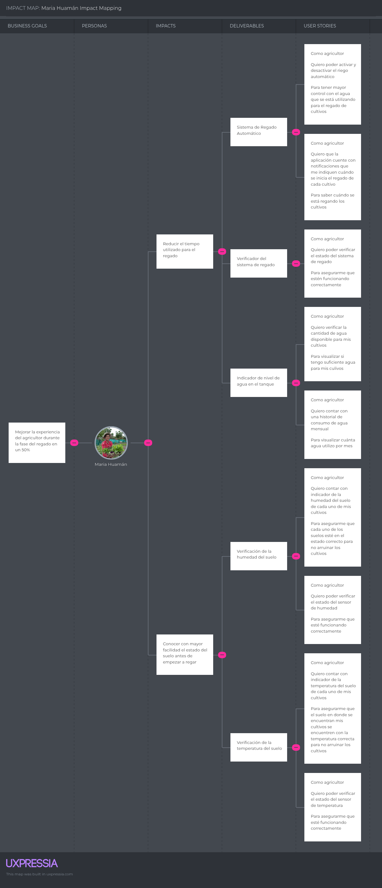

## 3.4. Product Backlog

Se utilizó la aplicación Trello para el desarrollo del product backlog **[Trello Board](https://trello.com/invite/b/68029db69b9160a847867db7/ATTIe60cc61d919ec781877b36318d877ec2F1FD4DE3/desarrollo-de-soluciones-iot)**
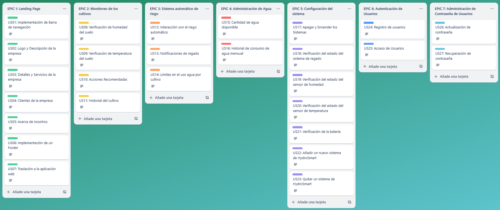
|Orden|User Story ID|Título|Descripción|Story Points|
| - | - | - | - | - |
| 1 | US12 | Interacción con el riego automático | Como agricultor quiero poder activar y desactivar el riego automático para tener mayor control con el agua que se está utilizando para el regado de cultivos | 5 |
| 2 | US08 | Verificación de humedad del suelo | Como agricultor quiero contar con indicador de la humedad del suelo de cada uno de mis cultivos para asegurarme que cada uno de los suelos esté en el estado correcto para no arruinar los cultivos| 5 |
| 3 | US09 | Verificación de temperatura del suelo | Como agricultor quiero contar con indicador de la temperatura del suelo de cada uno de mis cultivos para asegurarme que el suelo en donde se encuentran mis cultivos se encuentren con la temperatura correcta para no arruinar los cultivos | 5 |
| 4 | US13 | Notificaciones de regado | Como agricultor quiero que la aplicación cuente con notificaciones que me indiquen cuándo se inicia el regado de cada cultivo para saber cuándo se está regando los cultivos | 3 |
| 5 | US11 | Historial del cultivo | Como agricultor quiero contar con una historial de cultivos para visualizar cómo han estado los cultivos en los últimos días | 5 |
| 6 | US14 | Limites en el uso agua por cultivo | Como agricultor quiero que la aplicación me permita limitar la cantidad de agua utilizada por cada cultivo para asegurarme que ningún cultivo utilice agua de más | 3 |
| 7 | US15 | Cantidad de agua disponible | Como agricultor quiero verificar la cantidad de agua disponible para mis cultivos para visualizar si tengo suficiente agua para mis culivos | 5 |
| 8 | US16 | Historial de consumo de agua mensual | Como agricultor quiero contar con una historial de consumo de agua mensual para visualizar cuánta agua utilizo por mes | 3 |
| 9 | US17 | Apagar y Encender los Sistemas | Como agricultor quiero poder apagar y encender los sistemas en cualquier momento para no gastar energía innecesariamente | 2 |
| 10 | US18 | Verificación del estado del sistema de regado | Como agricultor quiero poder verificar el estado del sistema de regado para asegurarme que estén funcionando correctamente | 5 |
| 11 | US19 | Verificación del estado del sensor de humedad | Como agricultor quiero poder verificar el estado del sensor de humedad para asegurarme que esté funcionando correctamente | 5 |
| 12 | US20 | Verificación del estado del sensor de temperatura | Como agricultor quiero poder verificar el estado del sensor de temperatura para asegurarme que esté funcionando correctamente | 5 |
| 13 | US21 | Verificación del estado de la batería | Como agricultor quiero poder verificar el estado de la batería para asegurarme que esté funcionando correctamente | 3 |
| 14 | US22 | Añadir un nuevo sistema de HydroSmart | Como agricultor quiero poder agregar un nuevo sistema de HydroSmart para automatizar aún más el proceso de regado de mis cultivos | 3 |
| 15 | US23 | Quitar un sistema de HydroSmart | Como agricultor quiero poder quitar un sistema de HydroSmart para no tener sistemas que ya no utilizo en la plataformas | 3 |
| 16 | US10 | Acciones Recomendadas | Como agricultor quiero contar una interfaz que me permita ver qué acciones debo realizar en situaciones de peligro para que mis cultivos siempre se encuentren saludables y a salvo | 2 |
| 17 | US24 | Registro de usuarios | Como usuario de cualquiera de los segmentos objetivos sin una cuenta en el sistema quiero poder registrarme en la aplicación para acceder a todas sus funcionalidades | 3 |
| 18 | US25 | Acceso de Usuarios | Como usuario de cualquiera de los segmentos objetivos sin una cuenta en el sistema quiero poder iniciar sesión en la aplicación utilizando mi dirección de correo electrónico y contraseña para acceder a mi cuenta y utilizar todas las funcionalidades de la aplicación | 3 |
| 19 | US26 | Actualización de contraseña | Como usuario de cualquiera de los segmentos objetivos quiero poder cambiar mi contraseña para mantener mi cuenta segura | 3 |
| 20 | US27 | Recuperación de contraseña | Como usuario de cualquiera de los segmentos objetivos quiero tener la capacidad de restablecer mi contraseña en caso de olvidarla para así poder acceder nuevamente a mi cuenta | 3 |
| 21 | US01 | Implementación de Barra de navegación | Como visitante quiero tener la opción de atravesar todas las secciones de la landing page a través de una barra de navegación para facilitar el acceso a la información | 1 |
| 22 | US02 | Implementación de Barra de navegación | Como visitante quiero visualizar el logo y descripción de la empresa para verificar que estoy en la landing page oficial de la empresa | 1 |
| 23 | US03 | Detalles y Servicios de la empresa | Como visitante quiero visualizar los detalles y servicios de la empresa para conocer de qué manera se puede utilizar la aplicación | 1 |
| 24 | US04 | Clientes de la empresa | Como visitante quiero visualizar las experiencias de clientes previos de la empresa para es que la vida de los usuarios cambió al utilizar la aplicación | 1 |
| 25 | US05 | Acerca de nosotros | Como visitante quiero visualizar la misión y visión de la empresa para conocer qué planes tienen a futuro | 1 |
| 26 | US06 | Implementación de un Footer | Como visitante quiero visualizar un Footer al final de la página para ver las redes sociales asociadas a la empresa | 1 |
| 27 | US07 | Translación a la aplicación web | Como visitante quiero contar con un botón que me redirija a la aplicación web para tener un acceso directo y rápido a ella | 1 |

<div style="page-break-after: always;"></div>

# Capítulo IV: Solution Software Design

## 4.1. Strategic-Level Domain-Driven Design

### 4.1.1. EventStorming

A continuación se presentan los resultados del proceso de Event Storming realizado para el diseño de la arquitectura del sistema. Este proceso se llevó a cabo con el objetivo de identificar los diferentes bounded contexts y los flujos de mensajes entre ellos.

#### 4.1.1.1. Candidate Context Discovery

Tomando en cuenta el Domain-Driven Design, hicimos todo el proceso de Event Storming en una pizarra en Miro. De este modo, se llegaron a identificar los Bounded Contexts de nuestro sistema.

Para esto, realizamos una sesión grupal donde se identificaron los diferentes eventos, comandos y políticas que componen el sistema. Duró aproximadamente 2 horas.

[Tablero de Miro con Event Storming](https://miro.com/welcomeonboard/UWVqWXkzM01CTlJFcGFxOTR0WHNvc1U0M2hBNUtQM1VLR0NnY0dOL1YzREsxdXdNWnFGcFVXdTRBVmhHSm0rbWsxb0JzRGNuaE84WGVQK3oyT3BzY2E4UGY5VUUzM2dBd3JJeE1sbGF1ZWN4Z1YyM1h4ZGJMZWhkaG9SbnNkNzhnbHpza3F6REdEcmNpNEFOMmJXWXBBPT0hdjE=?share_link_id=584797912906)

**Paso 1: Unstructured Exploration**


**Paso 2: Timelines**


<div style="page-break-after: always;"></div>

**Paso 3: Pain points**

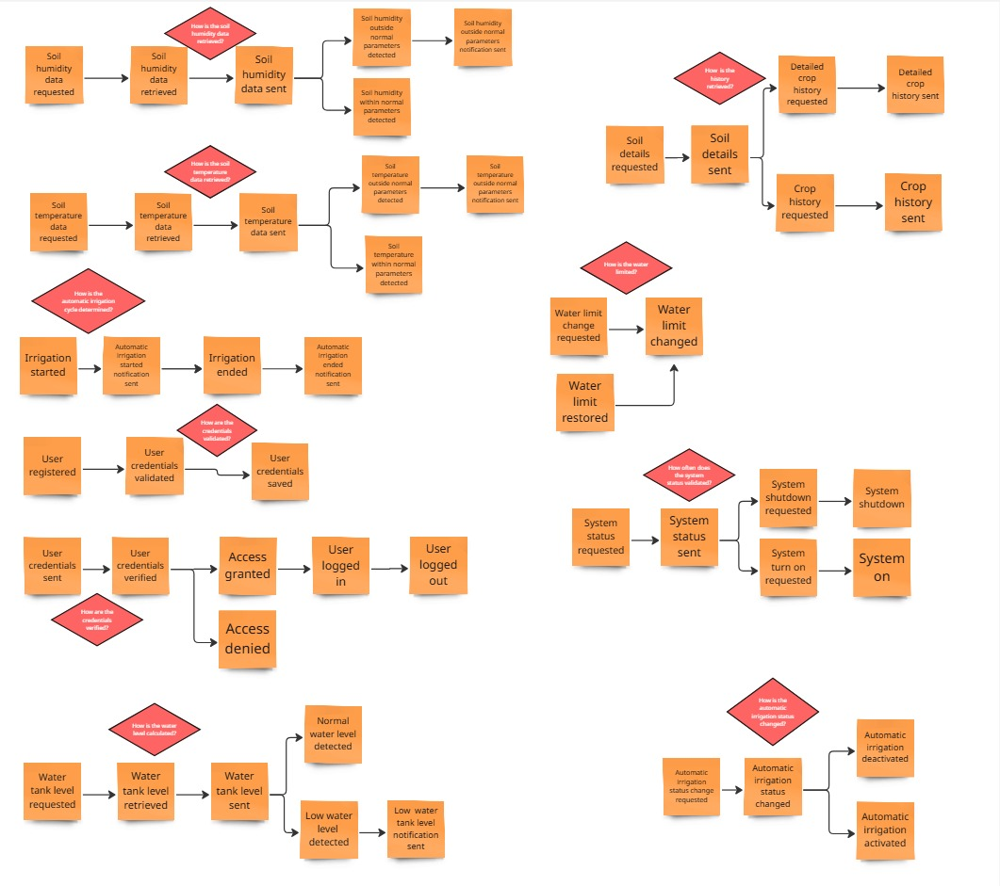

<div style="page-break-after: always;"></div>

**Paso 4: Pivotal points**

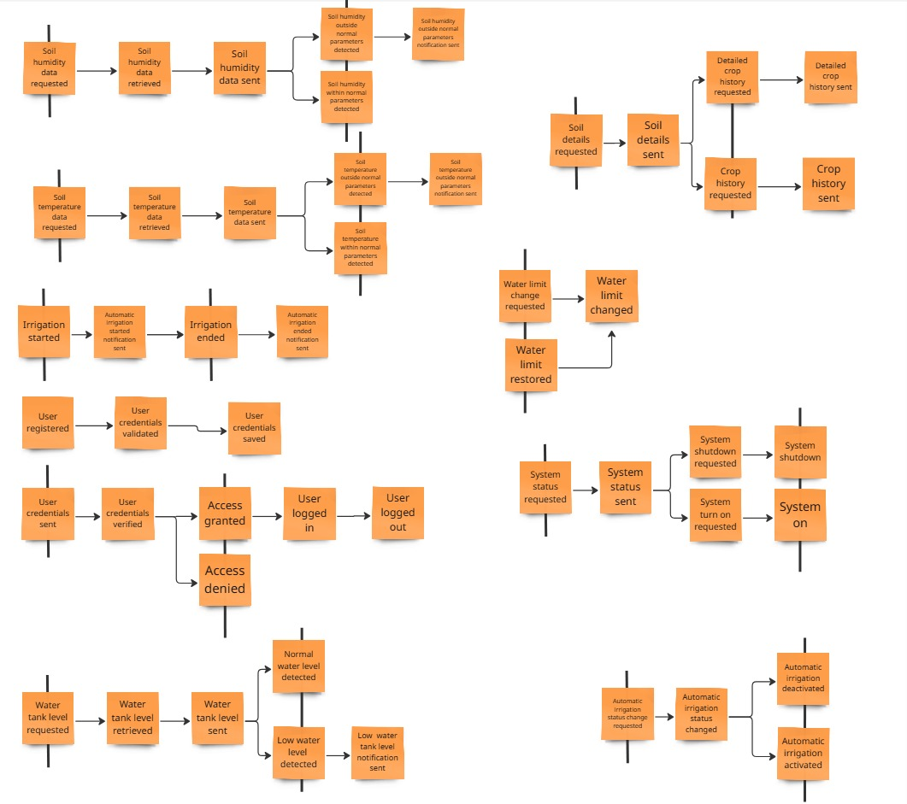

<div style="page-break-after: always;"></div>

**Paso 5: Commands**


<div style="page-break-after: always;"></div>

**Paso 6: Policies**

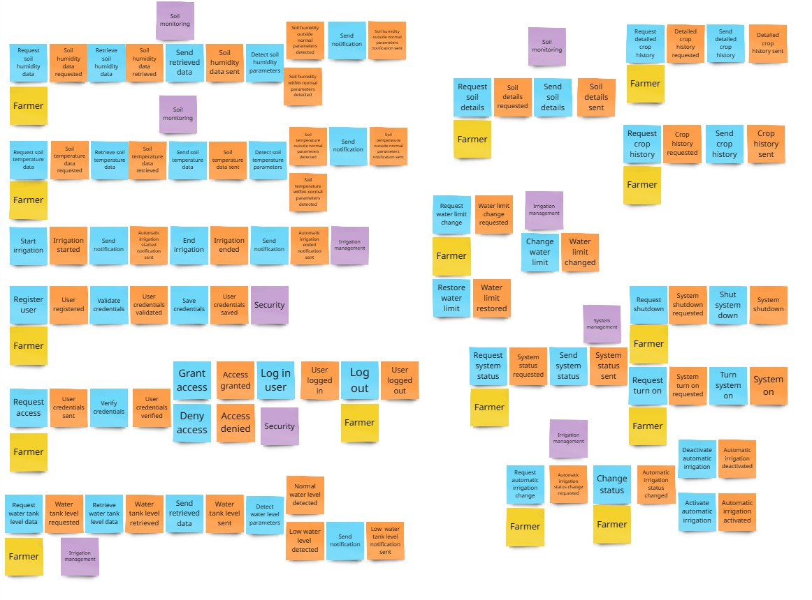

**Paso 7: Read models**


<div style="page-break-after: always;"></div>

**Paso 8: External systems**

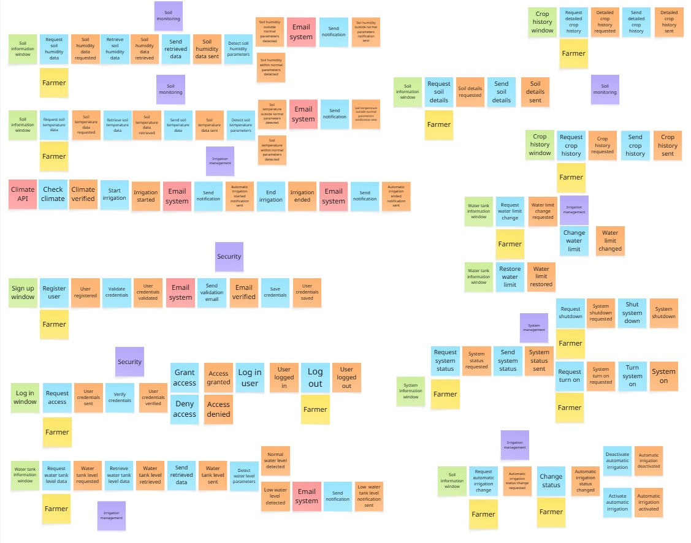

<div style="page-break-after: always;"></div>

**Paso 9: Aggregates**

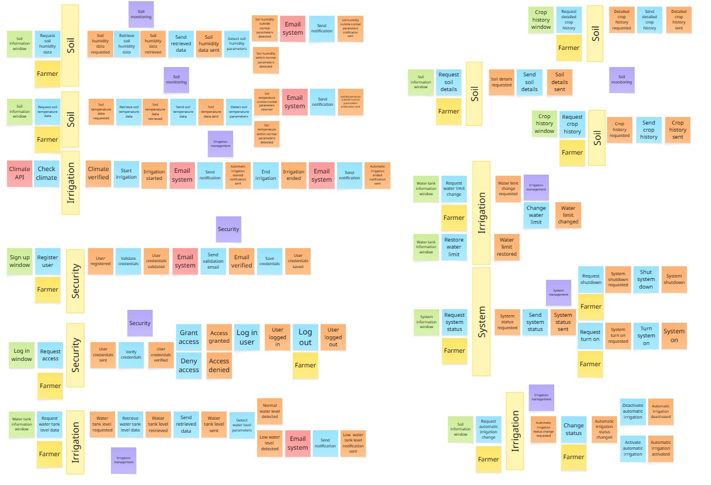

**Paso 10: Bounded contexts**

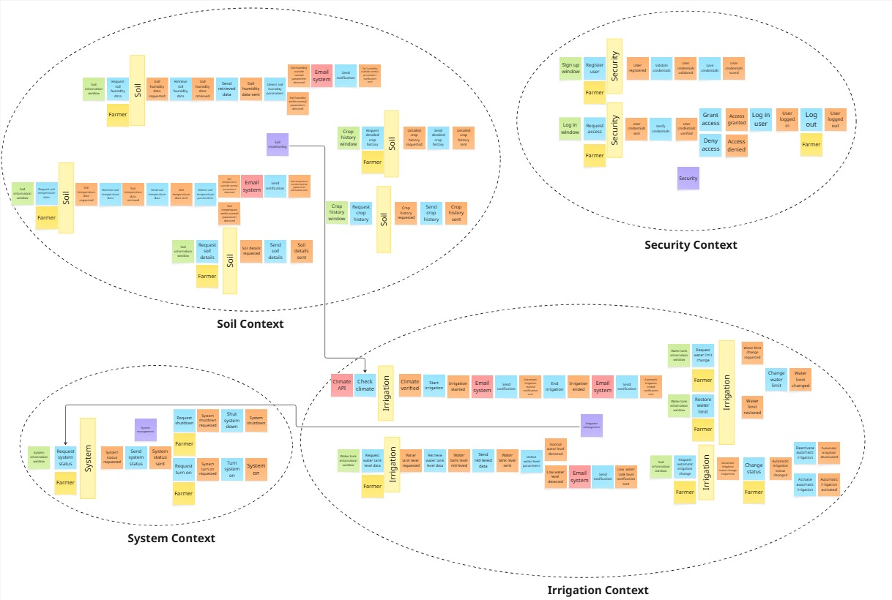

#### 4.1.1.2. Domain Message Flows Modeling

Los siguientes diagramas muestran el flujo de mensajes de los diferentes bounded contexts. Estos diagramas fueron creados utilizando la herramienta de Miro, y muestran cómo los diferentes bounded contexts interactúan entre sí a través de eventos y comandos.

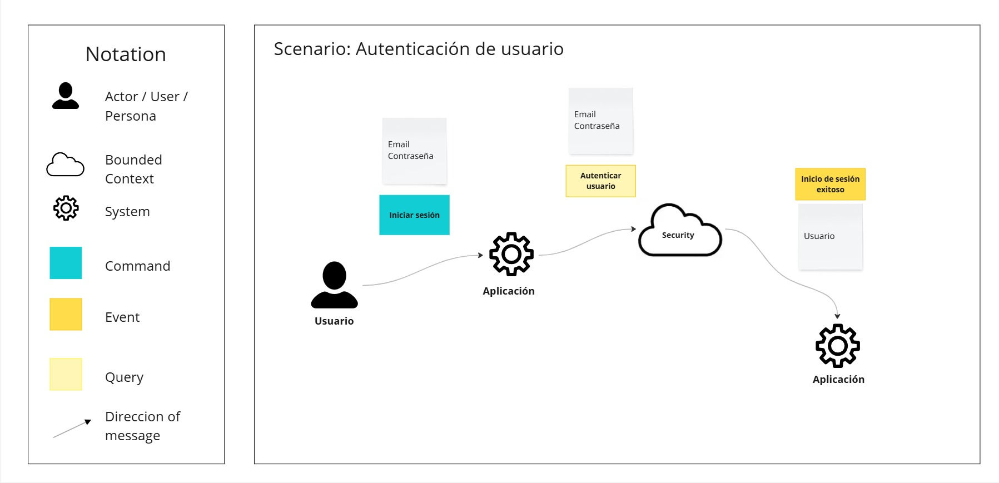

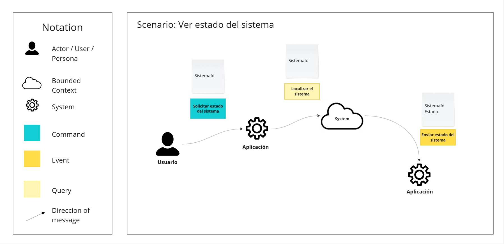

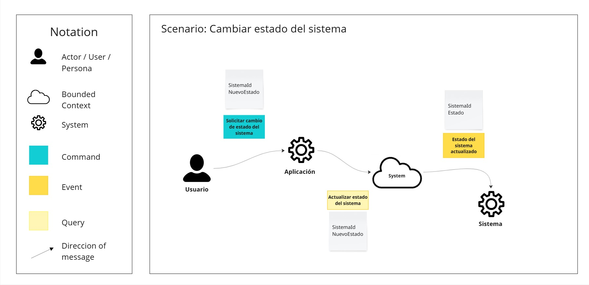

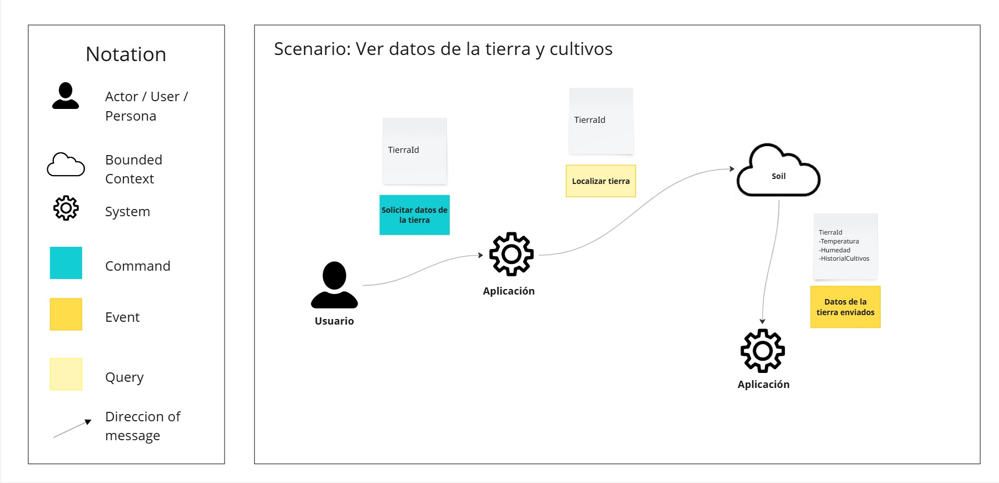

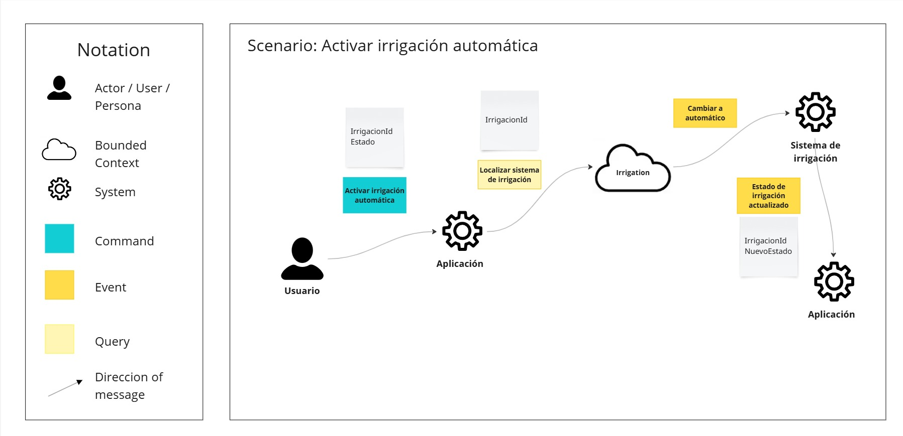

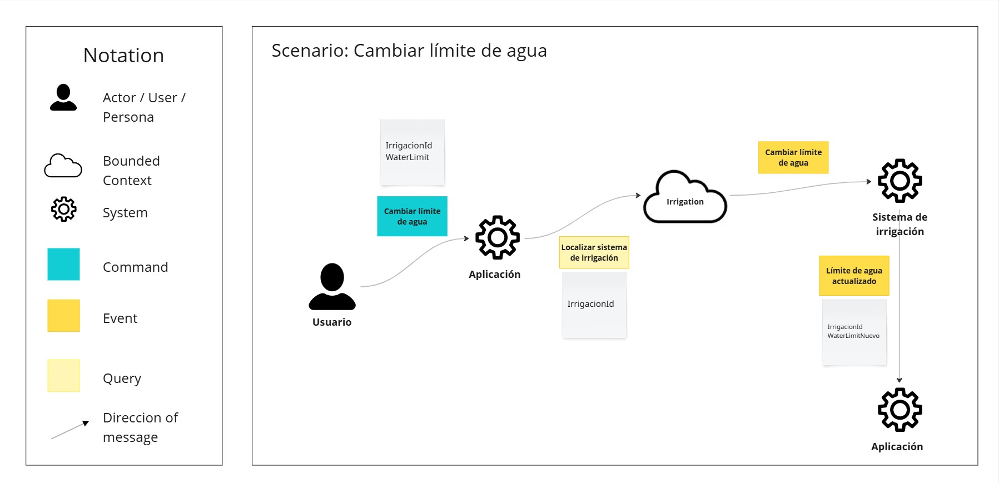

#### 4.1.1.3. Bounded Context Canvases

Los siguientes diagramas muestran los bounded contexts de nuestro sistema. Estos diagramas fueron creados utilizando la herramienta de Miro, y detallan más a fondo cada uno de los bounded contexts, incluyendo su clasificación, eventos, comandos, mensajes y sistemas.

**Soil Context Canvas**
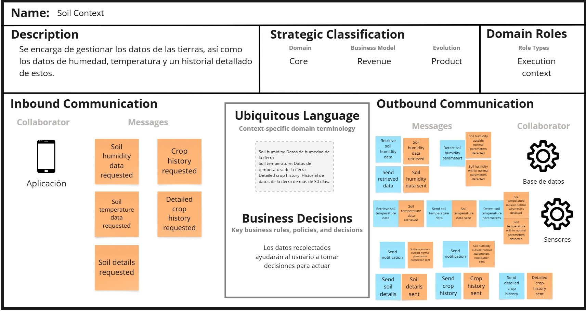

**Irrigation Context Canvas**
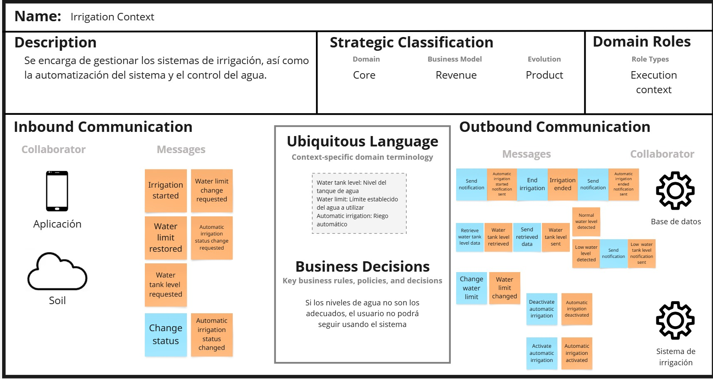

**Security Context Canvas**
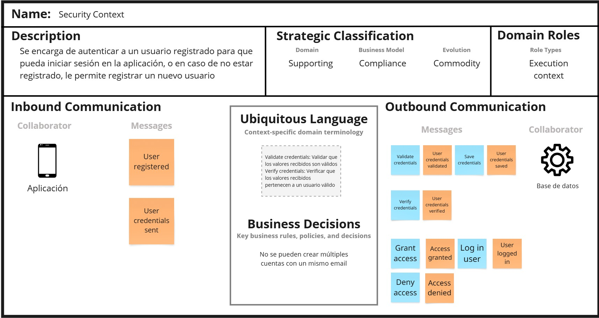

**System Context Canvas**
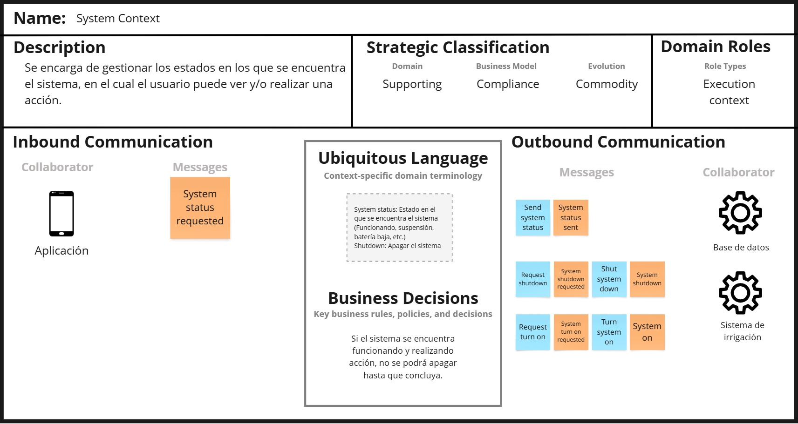

### 4.1.2. Context Mapping

Durante el proceso de modelado del dominio para HydroSmart, identificamos cuatro Bounded Contexts principales: _Soil_, _Irrigation_, _Security_ y _System_. A partir de esta base, realizamos una serie de reflexiones y escenarios de reestructuración para evaluar cómo podrían reorganizarse las capacidades del sistema y qué tipo de relación surgiría entre contextos. A continuación, explicamos el proceso seguido y las alternativas consideradas:

**Análisis de Contextos:**

- _Soil ↔ Irrigation_: Existe una fuerte dependencia, ya que los datos del suelo son necesarios para decisiones de riego. Aquí se establece una relación de tipo Customer/Supplier, donde Irrigation depende de los datos provistos por Soil.

- _Security ↔ Todos los contextos_: Security es un contexto transversal que proporciona autenticación y autorización. Aquí es viable aplicar un patrón Shared Kernel si los demás contextos comparten usuarios autenticados, o Conformist si los contextos consumidores simplemente aceptan las reglas impuestas por Security.

- _System ↔ Farmer_: Aquí observamos una relación directa, donde el Farmer interactúa con el sistema físico de riego. System es relativamente autónomo y puede funcionar bajo un modelo independiente, salvo las acciones iniciadas por otros contextos como Irrigation.

**Escenarios alternativos:**

_¿Qué pasaría si movemos la lógica de validación de sensores del contexto Irrigation al contexto System?_
Esto podría reducir la carga de responsabilidades del contexto Irrigation, delegando el manejo del hardware a System. Sin embargo, crearía más dependencia técnica entre ambos contextos.

_¿Qué pasaría si partimos Irrigation en: Control Manual y Automatización?_
Ayudaría a diferenciar entre las acciones directas del usuario y las decisiones tomadas por IA. Esto favorecería el mantenimiento y la escalabilidad de funcionalidades como predicción climática. No obstante, podría aumentar la complejidad del sistema al introducir más contextos.

_¿Qué pasaría si duplicamos la funcionalidad de visualización de historial en Soil y en Irrigation?_
Esto rompería dependencia entre contextos en tiempo real, aunque aumentaría la duplicación de datos.

**Decisión final:**

Tras evaluar estas opciones, consideramos lo siguiente como la estructura más coherente:

- Separación clara de responsabilidades entre autenticación, análisis de suelo y riego, permitiendo un desarrollo y despliegue independiente.

- Soil → Irrigation: Irrigation depende de los datos de Soil para tomar decisiones de riego. (Customer/Supplier)

- Security ↔ Todos: Establecer un patrón Shared Kernel para Security, donde los modelos de usuario y permisos son compartidos entre contextos.

- Irrigation → System: Irrigation decide cuándo activar el riego, y System ejecuta esas decisiones operando hardware físico (Conformist).

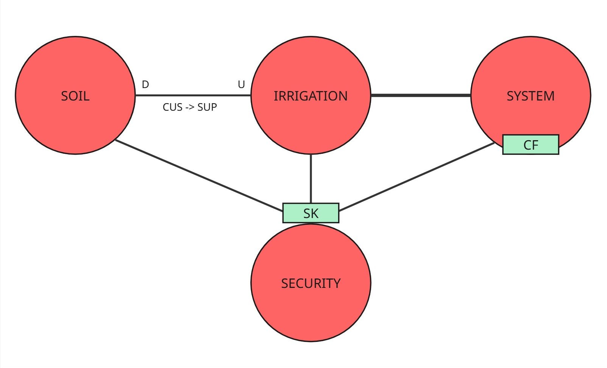

<div style="page-break-after: always;"></div>

### 4.1.3. Software Architecture

#### 4.1.3.1. System Landscape Diagram


<div style="page-break-after: always;"></div>

#### 4.1.3.2. Context Level Diagrams


#### 4.1.3.3. Container Level Diagrams

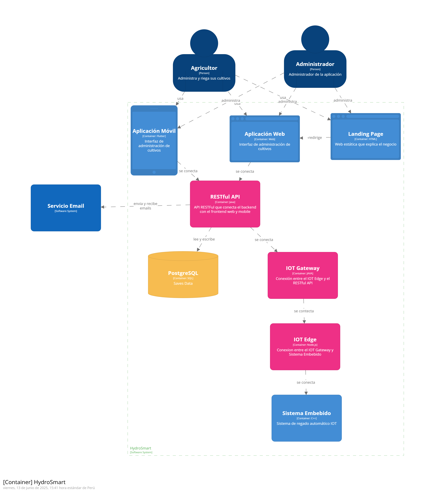

#### 4.1.3.4. Deployment Diagrams

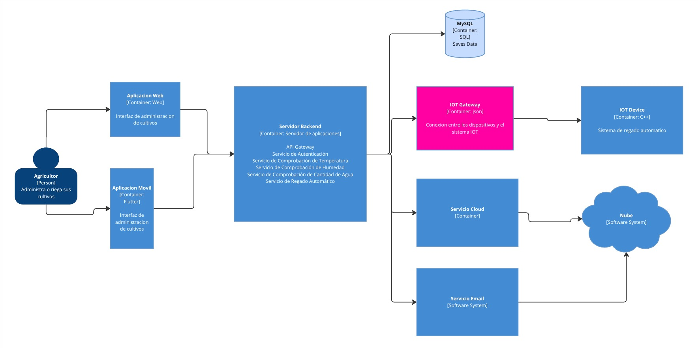

## 4.2. Tactical-Level Domain-Driven Design

### 4.2.1. Bounded Context: Soil

Este bounded context se encarga de la gestión de los datos relacionados a la humedad y temperatura del suelo. Este contexto es el encargado de recibir los datos de los sensores y almacenarlos en la base de datos. Además, este contexto es el encargado de enviar las notificaciones al usuario cuando la humedad o temperatura del suelo se encuentren fuera de los límites establecidos por el usuario.

### 4.2.1. Bounded Context: Soil

Este Bounded Context es responsable de la gestión de los datos de humedad y temperatura del suelo, integrando los sensores y las notificaciones para garantizar que los valores de los parámetros se mantengan dentro de los rangos definidos por el usuario. El contexto maneja tanto el almacenamiento de datos como la lógica para alertar al usuario cuando los valores de humedad o temperatura exceden los umbrales definidos.

#### 4.2.1.1. Domain Layer

El Core Domain Layer dentro del contexto de Soil se representa a través de las siguientes clases y componentes:

- **SoilData (Entity)**: Esta clase representa los datos de humedad y temperatura del suelo en un momento específico. Contiene atributos como `humidity`, `temperature`, `timestamp` y `location`. La entidad SoilData mantiene la consistencia de los datos y garantiza que las mediciones estén asociadas correctamente con la ubicación y el tiempo en que fueron capturados.

- **SoilParameterThresholds (Value Object)**: Este objeto de valor representa los límites definidos por el usuario para la humedad y temperatura del suelo. Asegura que los valores de humedad (`minHumidity`, `maxHumidity`) y temperatura (`minTemperature`, `maxTemperature`) se mantengan dentro de un rango adecuado y se considera inmutable una vez establecido.

- **SoilAnomalyDetector (Domain Service)**: Este servicio de dominio contiene la lógica para detectar si los valores de humedad o temperatura del suelo están fuera de los límites definidos en **SoilParameterThresholds**. Si se detecta una anomalía, el servicio genera una alerta para notificar al usuario.

- **SoilNotificationService (Domain Service)**: Este servicio de dominio se encarga de enviar notificaciones al usuario. Utiliza los resultados del **SoilAnomalyDetector** para determinar si es necesario generar una alerta. Se integra con sistemas de mensajería o notificaciones push para informar al usuario en tiempo real sobre las variaciones en los parámetros del suelo.

- **ParameterType (Enum)**: Define los tipos de parámetros de suelo que se están midiendo (humidity, temperature).

#### 4.2.1.2. Interface Layer

En la capa de Interface Layer, se gestionan las interacciones con el usuario y las solicitudes externas al sistema, como la visualización de datos, la actualización de los parámetros y la notificación de anomalías. Esta capa se compone de interfaces que facilitan la interacción entre el **Domain Layer** y los servicios o consumidores de la aplicación.

- **SoilInformationDisplayInterface (Controller)**: Esta interfaz define los métodos para presentar los datos del suelo al usuario. Actúa como un controlador que consume información de la **Application Layer** y se encarga de formatearla para su presentación en la interfaz de usuario. Contiene métodos como `showHumidity(SoilData data)` y `showTemperature(SoilData data)`.

- **SoilDataRequestInterface (Consumer)**: Esta interfaz define los métodos para recibir y procesar solicitudes de datos de humedad o temperatura del suelo. Recibe las peticiones del frontend o de otros sistemas y las pasa a los servicios correspondientes en la capa de aplicación. Contiene el método `getSoilData(location, timestamp)`.

- **SoilDetailsRequestInterface (Consumer)**: Esta interfaz maneja las solicitudes de detalles específicos sobre el suelo, como el historial de cambios de humedad y temperatura o el estado actual de los sensores. Incluye métodos como `getSoilHistory(location)` y `getSensorDetails(sensorId)`.

- **NotificationServiceInterface (Controller)**: Esta interfaz gestiona el envío de notificaciones al usuario. Está vinculada a la **SoilNotificationService** en la **Application Layer** y se encarga de invocar los métodos necesarios para notificar al usuario cuando se detectan anomalías. Contiene el método `sendAlert(notificationMessage)`.

#### 4.2.1.3. Application Layer

En la capa de Application Layer orquesta los procesos del negocio utilizando los servicios de dominio definidos en la **Domain Layer**. Es aquí donde se manejan los flujos de procesos y la interacción con otros componentes.

- **SoilAnomalyDetectionService (Command Handler)**: Este servicio procesa los comandos relacionados con la detección de anomalías en los datos del suelo. Utiliza la clase **SoilAnomalyDetector** para verificar si los valores de humedad y temperatura están dentro de los rangos definidos por el usuario. Contiene el método `detectAnomalies(SoilData data)`.

- **SoilNotificationService (Event Handler)**: Este servicio escucha los eventos de anomalías detectadas por el **SoilAnomalyDetectionService** y se encarga de disparar eventos o realizar acciones como el envío de notificaciones a través de diferentes canales. Contiene métodos como `sendNotification(alertMessage)` y `handleAnomalyEvent(event)`.

- **SoilDataQueryService (Query Handler)**: Este servicio recibe consultas relacionadas con los datos del suelo. Gestiona solicitudes como la información actual del suelo o el historial de mediciones. Contiene métodos como `querySoilData(location)` y `querySoilHistory(sensorId)`.

- **SoilDataCommandService (Command Handler)**: Este servicio gestiona las acciones que modifican los datos del suelo, como la actualización de los parámetros definidos por el usuario. Actúa como intermediario entre los controladores que envían comandos y los servicios de dominio. Contiene métodos como `updateSoilThresholds(newThresholds)` y `storeNewSoilData(soilData)`.

#### 4.2.1.4. Infrastructure Layer

La Infrastructure Layer se encarga de la persistencia de los datos y la comunicación con servicios externos como bases de datos, sistemas de mensajería o servicios de correo electrónico. Aquí se implementan las interfaces definidas en la **Domain Layer**, como los repositorios.

- **SoilDataRepository (Repository)**: Implementa la persistencia de los datos del suelo en la base de datos. Utiliza un ORM para interactuar con la base de datos, almacenando los objetos **SoilData** y recuperándolos según la ubicación o el timestamp. Contiene métodos como `save(SoilData data)` y `findByLocation(location)`.

- **ThresholdsRepository (Repository)**: Este repositorio almacena y recupera los límites de humedad y temperatura definidos por el usuario (**SoilParameterThresholds**). Interactúa con la base de datos para mantener estos valores actualizados y es utilizado por los servicios en la **Application Layer**.

#### 4.2.1.5. Component Level Diagrams


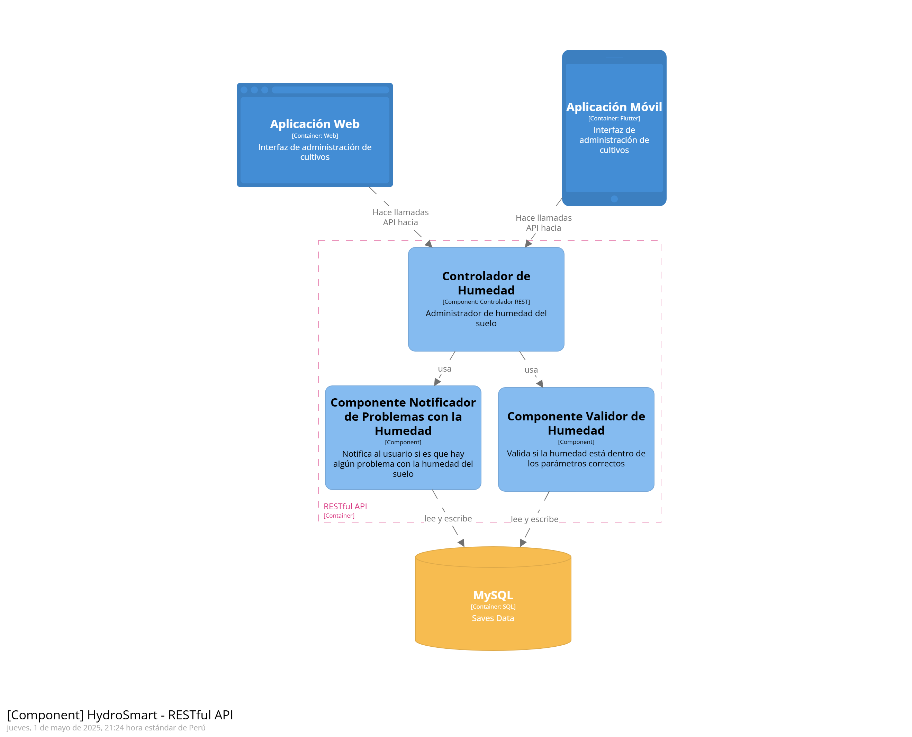

#### 4.2.1.6. Code Level Diagrams

##### 4.2.1.6.1. Domain Layer Class Diagrams

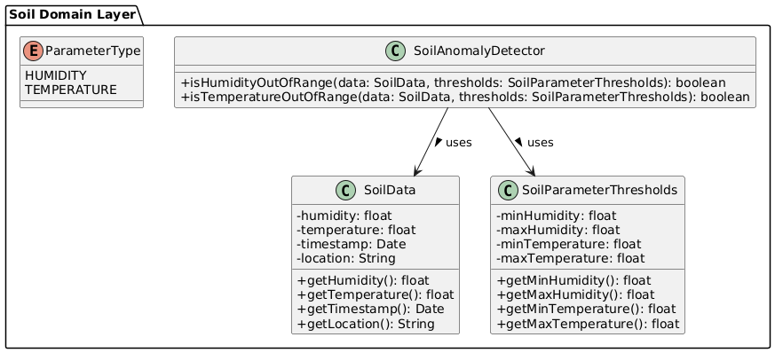

##### 4.2.1.6.2. Database Design Diagram

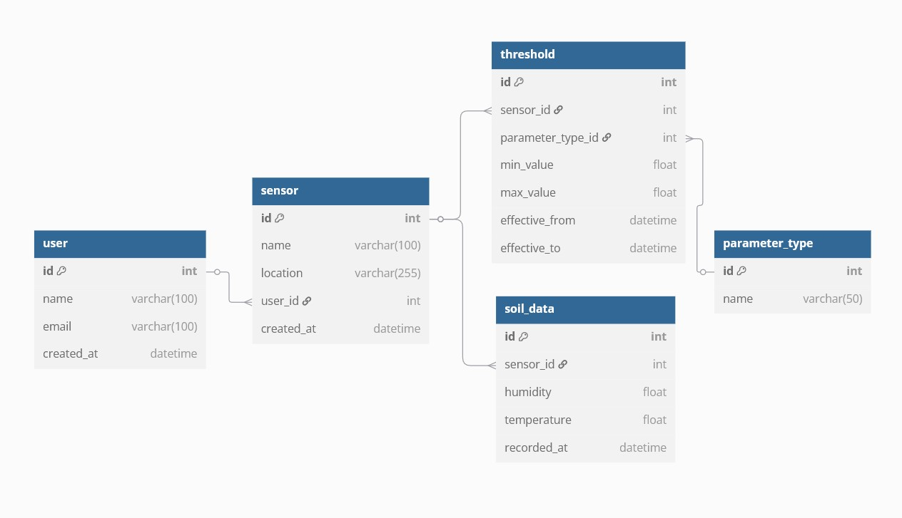

### 4.2.2. Bounded Context: Irrigation

Este bounded context se encarga de la gestión de los datos relacionados al riego automático de los cultivos. Este contexto es el encargado de mantener el control de los sistemas de riego y de la cantidad de agua que se utiliza para el riego de los cultivos. Además, este contexto es el encargado de enviar las notificaciones al usuario cuando se inicie o detenga el riego de los cultivos, además de enviar las notificaciones al usuario cuando la cantidad de agua utilizada para el riego de los cultivos se encuentre fuera de los límites establecidos por el usuario.

#### 4.2.2.1. Domain Layer

El Domain Layer del contexto de Irrigation define las reglas del negocio y los conceptos fundamentales relacionados con las sesiones de riego, los niveles de agua y las condiciones que activan el riego automático.

- **IrrigationSession (Entity)**: Representa una sesión de riego específica. Contiene atributos como `sessionId`, `startTime`, `endTime`, `requestedWaterAmount`, `deliveredWaterAmount` e `irrigationStatus`. Gestiona el ciclo de vida de una sesión y su estado actual.
- **WaterTankLevel (Entity)**: Representa el estado actual del nivel de agua en el tanque. Contiene atributos como `currentLevel` y `capacity`. Se utiliza para monitorear y validar la disponibilidad de agua.
- **WaterLevelThresholds (Value Object)**: Define los límites de referencia para los niveles del tanque. Incluye valores como `normalLevelThreshold` y `lowLevelThreshold`. Permite determinar si se requiere acción correctiva.
- **IrrigationSchedule (Entity)**: Contiene la configuración del riego automático, como la hora de inicio (`startTime`), duración (`duration`) y los disparadores de condiciones del suelo (`soilConditionTriggers`).
- **WaterLimit (Value Object)**: Representa el límite máximo permitido de agua en un periodo específico. Incluye atributos como `limitValue` y `period`.
- **SoilConditionTrigger (Value Object)**: Define los parámetros del suelo (ej. `minHumidity`, `maxTemperature`) que deben cumplirse para activar el riego automático.
- **IrrigationStatus (Enum)**: Enumera los estados posibles de una sesión de riego: `started`, `running`, `ended`.
- **AutomaticIrrigationStatus (Enum)**: Enumera los estados del sistema de riego automático: `active`, `inactive`.

#### 4.2.2.2. Interface Layer

Esta capa expone interfaces para interactuar con los servicios de riego, ya sea de manera manual o automática. Permite a los usuarios iniciar procesos, visualizar información relevante y recibir alertas.

- **IrrigationControlInterface (Controller)**: Define los métodos que permiten al usuario iniciar o detener el riego manualmente. Incluye `startIrrigation()` y `stopIrrigation()`.
- **WaterTankLevelDisplayInterface (Controller)**: Permite mostrar el nivel actual del tanque de agua al usuario. Incluye el método `showTankLevel()`.
- **WaterLimitManagementInterface (Controller)**: Gestiona las solicitudes para visualizar o modificar los límites de uso de agua. Incluye métodos como `getWaterLimit()` y `updateWaterLimit(newLimit)`.
- **AutomaticIrrigationControlInterface (Controller)**: Gestiona la activación o desactivación del sistema de riego automático. Contiene métodos como `activateAutomaticIrrigation()` y `deactivateAutomaticIrrigation()`.
- **NotificationServiceInterface (Controller)**: Expone la funcionalidad para enviar notificaciones al usuario. Invoca a los servicios de la Application Layer para emitir alertas cuando ocurren eventos relevantes.

#### 4.2.2.3. Application Layer

La Application Layer orquesta la lógica del negocio mediante el uso de servicios que actúan como command, query y event handlers. Controla los flujos de proceso que afectan al dominio de riego.

- **IrrigationCommandService (Command Handler)**: Gestiona los comandos para iniciar o detener el riego manual. Interactúa con **IrrigationSession** y actualiza su estado. Incluye métodos como `startSession()` y `endSession()`.
- **WaterLevelMonitoringService (Event Handler)**: Supervisa el nivel del tanque de agua. Cuando detecta que los valores bajan por debajo del umbral, genera un evento que puede disparar notificaciones o bloquear el inicio de nuevas sesiones de riego.
- **WaterLimitManagementService (Command Handler)**: Se encarga de validar y actualizar los límites de agua establecidos por el usuario. Asegura que las nuevas configuraciones no violen políticas definidas.
- **AutomaticIrrigationService (Command Handler)**: Ejecuta la lógica del riego automático según la configuración del **IrrigationSchedule** y las condiciones obtenidas desde el contexto **Soil**. Decide si se inicia o detiene automáticamente una sesión.
- **IrrigationNotificationService (Event Handler)**: Maneja los eventos generados durante las sesiones de riego o por los monitores, y se encarga de emitir notificaciones. Incluye métodos como `notifyIrrigationStarted()`, `notifyLowWaterLevel()` y `notifyWaterLimitExceeded()`.

#### 4.2.2.4. Infrastructure Layer

La Infrastructure Layer implementa la persistencia y la integración con sensores, actuadores físicos y servicios externos como notificaciones.

- **IrrigationActuator (External Device Handler)**: Controla el hardware físico para abrir y cerrar válvulas de riego. Se invoca desde la Application Layer para ejecutar comandos físicos.
- **WaterTankLevelSensor (Sensor Reader)**: Se conecta al sensor del tanque para obtener datos actualizados del nivel de agua.
- **IrrigationSessionRepository (Repository)**: Guarda y recupera sesiones de riego (**IrrigationSession**) en la base de datos. Implementa métodos como `save(session)` y `findActiveSessions()`.
- **WaterLevelRepository (Repository)**: Persiste y consulta datos del nivel de agua (**WaterTankLevel**) asociados a un tanque.
- **WaterLimitRepository (Repository)**: Administra la información relacionada a los límites de uso de agua (**WaterLimit**).
- **IrrigationScheduleRepository (Repository)**: Almacena la configuración del riego automático (**IrrigationSchedule**), permitiendo que sea consultada o modificada según sea necesario.
- **NotificationService (Integration Service)**: Se encarga de enviar las notificaciones a través de correo, push o mensajería (accede a un sistema externo de correos electrónicos). Implementa la interfaz definida en la capa de presentación.
- **ClimateApiIntegrationService (Integration Service)**: Se conecta con una API externa de clima para obtener condiciones ambientales en tiempo real (acceso a servicio externo). Se utiliza en conjunto con el riego automático para decidir si activar el riego

#### 4.2.2.5. Component Level Diagrams


  
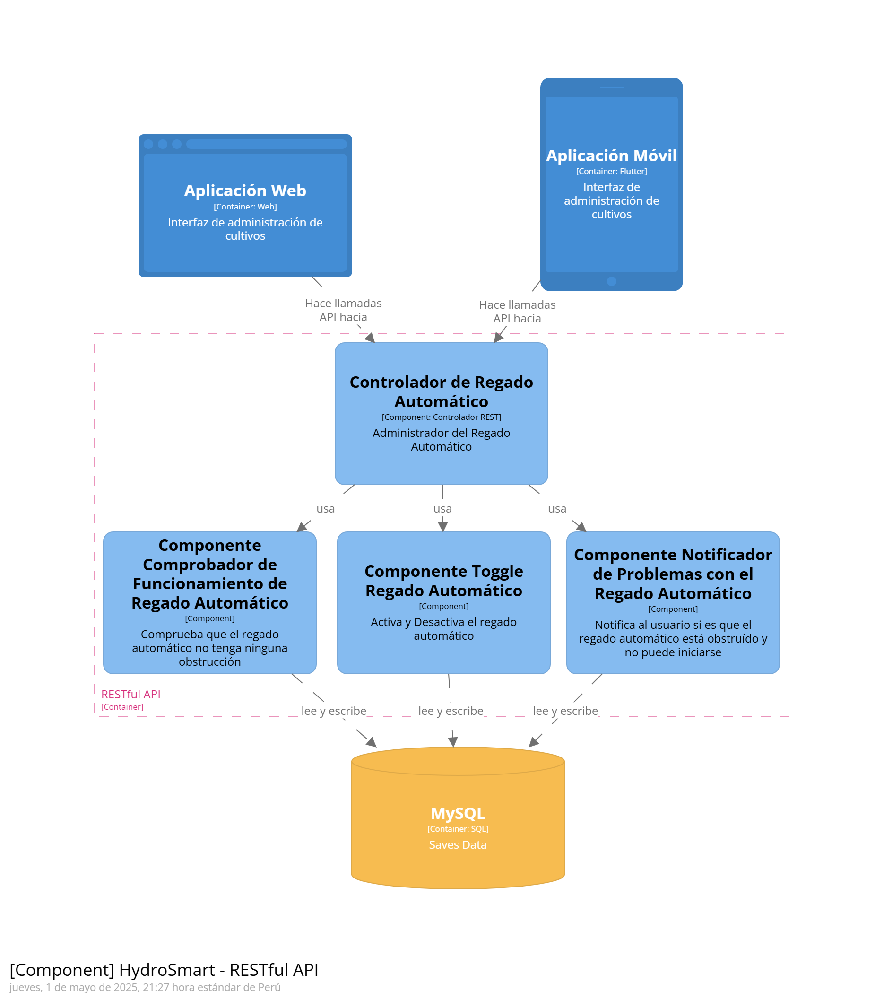

#### 4.2.2.6. Code Level Diagrams

##### 4.2.2.6.1. Domain Layer Class Diagrams

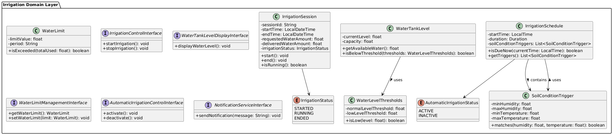

##### 4.2.2.6.2. Database Design Diagram

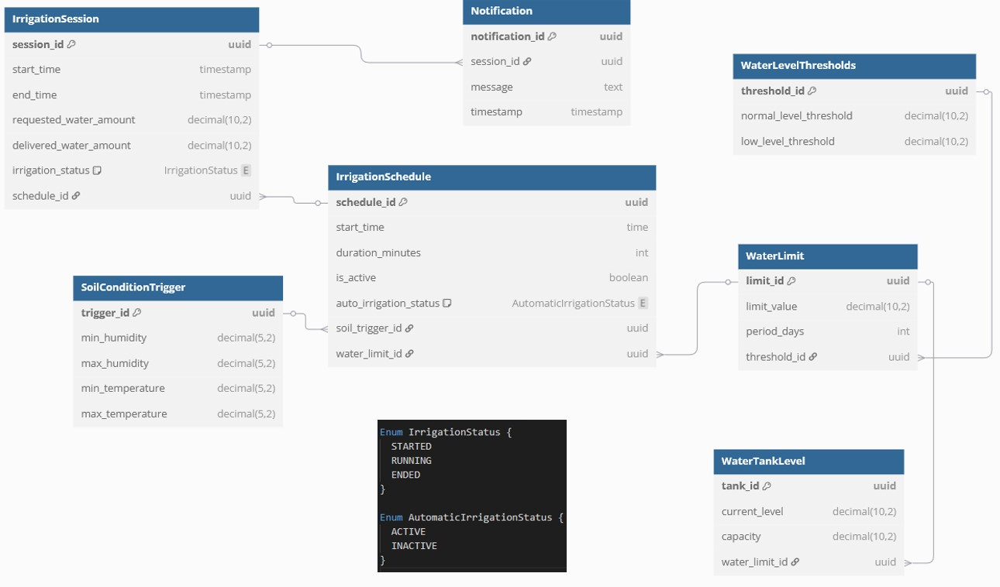

### 4.2.3. Bounded Context: Security

Este bounded context se encarga de la gestión de los datos relacionados a la seguridad del sistema. Este contexto es el encargado de verificar las credenciales de los usuarios y de gestionar el registro de los usuarios en el sistema.

#### 4.2.3.1. Domain Layer

La capa de dominio define los conceptos centrales de seguridad, como usuarios, roles, permisos y los resultados de los procesos de autenticación y autorización.

- **User (Entity)**: Representa a un usuario registrado en el sistema. Atributos: `userId`, `username`, `passwordHash`, `registrationDate`, `email`.
- **Role (Entity)**: Representa un rol que puede tener un usuario, como `Farmer` o `Administrator`. Atributos: `roleId`, `roleName`, `permissions`.
- **Permission (Value Object)**: Define una acción específica permitida, como `view_dashboard` o `manage_users`. Atributos: `permissionId`, `permissionName`.
- **AuthenticationResult (Value Object)**: Representa el resultado de un intento de autenticación. Indica si fue exitoso y, si lo fue, incluye un token de acceso.
- **AuthorizationResult (Value Object)**: Representa si un usuario tiene permiso para realizar una acción específica. Puede incluir información contextual como recurso y motivo de denegación.

#### 4.2.3.2. Interface Layer

La capa de interfaz expone las operaciones que permiten a los usuarios interactuar con el sistema de seguridad, como registrarse, iniciar sesión o verificar acceso.

- **UserRegistrationInterface (Controller)**: Expone el método `registerUser(userData)` para registrar nuevos usuarios.
- **UserAuthenticationInterface (Controller)**: Expone el método `authenticateUser(credentials)` para validar las credenciales y generar un token.
- **UserAuthorizationInterface (Controller)**: Expone el método `authorize(userId, action)` para verificar si un usuario tiene permiso para ejecutar una acción.
- **NotificationServiceInterface (Controller)**: Utilizado para enviar notificaciones relacionadas con la seguridad, como confirmaciones de registro o alertas de acceso.

#### 4.2.3.3. Application Layer

Esta capa orquesta los procesos de seguridad, integrando los repositorios y servicios de infraestructura con las reglas del dominio.

- **UserRegistrationService (Command Handler)**: Gestiona el flujo completo de registro. Valida datos, crea una instancia de `User`, guarda en el repositorio y notifica por correo al usuario.
- **UserAuthenticationService (Command Handler)**: Realiza la verificación de credenciales, genera un `AuthenticationResult` con token si es válido.
- **UserAuthorizationService (Query Handler)**: Determina si un usuario puede realizar una acción específica, evaluando sus roles y permisos asociados.
- **UserSessionService (Session Manager)**: Administra el estado de sesión del usuario: login, logout, y validación de tokens activos.

#### 4.2.3.4. Infrastructure Layer

Esta capa implementa la persistencia de datos y la interacción con servicios externos como el correo electrónico.

- **UserRepository (Repository)**: Almacena y recupera información de los usuarios (**User**), permitiendo búsquedas por `username` o `email`.
- **RoleRepository (Repository)**: Gestiona la información de roles y permisos (**Role**, **Permission**), incluyendo asignación de permisos.
- **EmailNotificationService (Integration Service)**: Implementa el envío real de correos electrónicos para confirmar registros o notificar eventos importantes de seguridad (accede a un sistema externo de correos electrónicos).
- **PasswordResetService (Integration Service)**: Gestiona el proceso de restablecimiento de contraseñas, enviando correos electrónicos con enlaces de restablecimiento a los usuarios (accede a un sistema externo de correos electrónicos).

#### 4.2.3.5. Component Level Diagrams


#### 4.2.3.6. Code Level Diagrams

##### 4.2.3.6.1. Domain Layer Class Diagrams

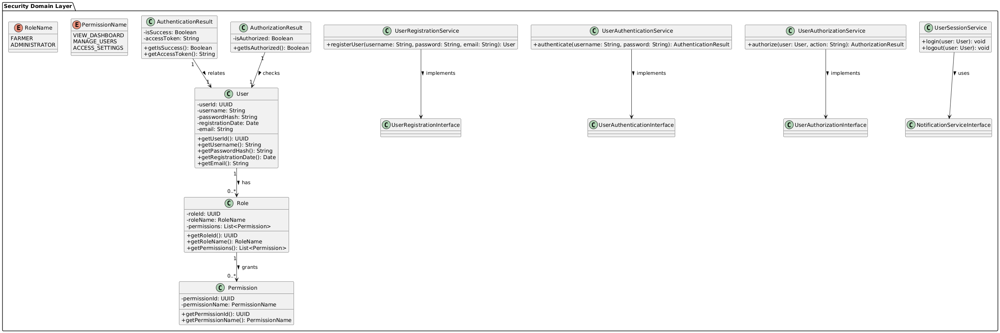

##### 4.2.3.6.2. Database Design Diagram

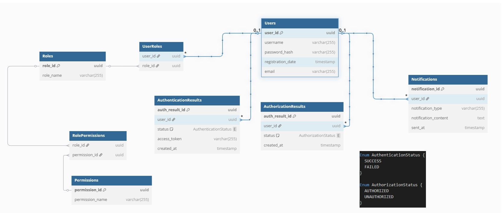

### 4.2.4. Bounded Context: System

Este bounded context se encarga de la gestión de los datos relacionados a los sistemas de HydroSmart. Este contexto es el encargado de gestionar la información relacionada al estado de los sistemas.

#### 4.2.4.1. Domain Layer

Define los conceptos centrales para representar y comunicar el estado general del sistema.

- **SystemState (Entity)**: Representa el estado actual del sistema. Atributos: `status`, `lastStatusChange`.
- **SystemStatusReport (Value Object)**: Contiene un informe del estado del sistema completo, incluyendo el estado general (`overallStatus`) y los estados de cada subsistema (`subsystemStatuses`), que provienen de otros Bounded Contexts.

- **SystemStatus (Enum)**: Enumera los posibles estados de operación del sistema: `on`, `off`, `shutting_down`.

#### 4.2.4.2. Interface Layer

Define las interfaces mediante las cuales se solicitan y muestran los estados del sistema, y se controla su encendido o apagado.

- **SystemStatusRequestInterface (Controller)**: Expone el método `getCurrentSystemStatus()` para consultar el estado actual del sistema.
- **SystemInformationDisplayInterface (Controller)**: Proporciona el método `displaySystemInformation(statusReport)` para mostrar los datos relevantes al usuario.
- **SystemControlInterface (Controller)**: Permite encender (`startSystem()`) y apagar (`shutdownSystem()`) el sistema.

#### 4.2.4.3. Application Layer

Contiene la lógica para gestionar el estado operativo del sistema y coordinar acciones entre los distintos subsistemas.

- **SystemStatusService (Query Handler)**: Obtiene el estado actual consultando `SystemState` y agregando datos de `SystemStatusReport`.
- **SystemStartupService (Command Handler)**: Coordina la secuencia de inicio del sistema, incluyendo la inicialización de subsistemas.
- **SystemShutdownService (Command Handler)**: Coordina el apagado seguro del sistema, solicitando a cada subsistema su cierre controlado.

#### 4.2.4.4. Infrastructure Layer

Provee la implementación técnica de persistencia y control físico del sistema.

- **SystemStatusRepository (Repository)**: Almacena y recupera el estado actual del sistema (`SystemState`).
- **SystemControlHardwareInterface (Hardware Integration)**: Realiza acciones físicas de encendido y apagado del sistema mediante interacción directa con hardware.
- **SubsystemStatusIntegrations (Integration Services)**: Se comunican con los otros Bounded Contexts (`Soil`, `Irrigation`, `Security`) para consultar sus estados y componer el `SystemStatusReport`.

#### 4.2.4.5. Component Level Diagrams

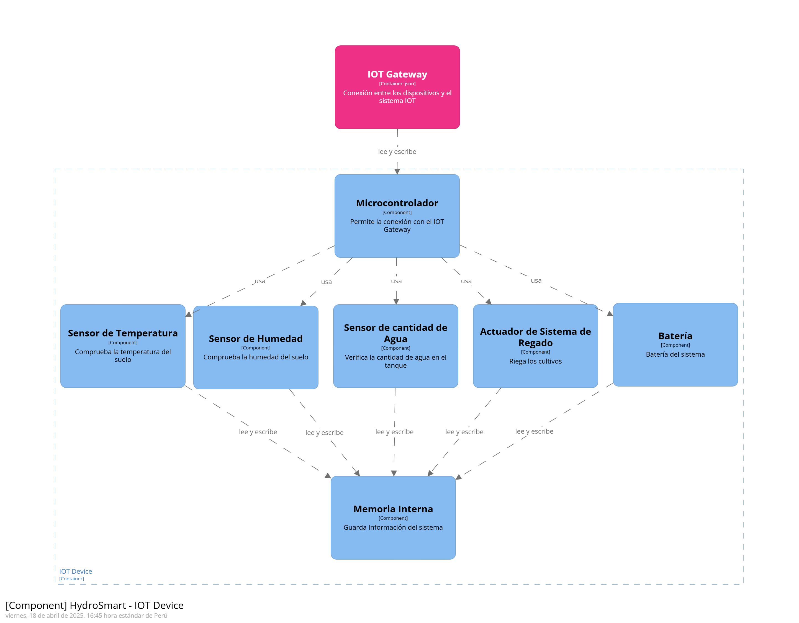

#### 4.2.4.6. Code Level Diagrams

##### 4.2.4.6.1. Domain Layer Class Diagrams

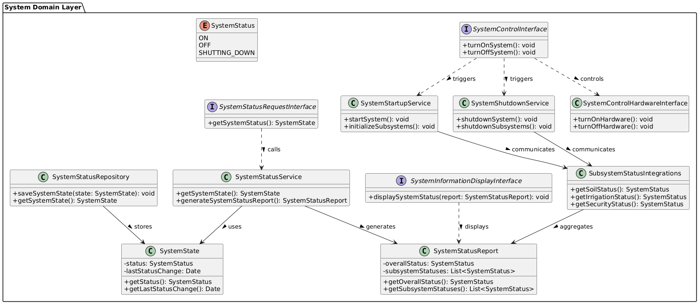

##### 4.2.4.6.2. Database Design Diagram

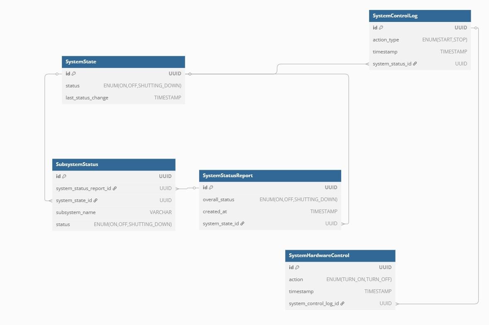

<div style="page-break-after: always;"></div>

# Capítulo V: Solution UI/UX Design

## 5.1. Style Guidelines

### 5.1.1. General Style Guidelines

<strong>Consistencia Visual: </strong>Mantener una coherencia visual en todos los aspectos de la aplicación es clave para crear una experiencia intuitiva. Esto incluye el uso de una paleta de colores uniforme que refleje la naturaleza y la vida agrícola, una tipografía legible y tamaños de fuente adecuados para facilitar la lectura en diferentes condiciones de luz.

<p align="center">
  
</p>

<strong>Simplicidad y Claridad: </strong>La interfaz debe ser sencilla y fácil de navegar, con un diseño limpio que evite la sobrecarga de información. El uso de un lenguaje claro y directo es fundamental para asegurar que los usuarios, independientemente de su nivel de experiencia con la tecnología, puedan entender rápidamente cómo utilizar la aplicación.

<p align="center">
  
</p>

<strong>Accesibilidad: </strong>Diseñar la aplicación teniendo en cuenta las necesidades de accesibilidad, como texto ampliable, contraste de colores para personas con discapacidades visuales, y compatibilidad con tecnologías de asistencia como lectores de pantalla.

<p align="center">
  
</p>

<strong>Logo: </strong>El logotipo de Hydrosmart representa la esencia de la tecnología al servicio del campo peruano. En el centro, una gota de agua simboliza la eficiencia hídrica, elemento vital para la agricultura. Dentro de la gota, brota una pequeña planta verde, reflejo del crecimiento, la vida y la sostenibilidad. Esta integración visual transmite el objetivo del producto: aspersores inteligentes que permiten a los agricultores peruanos regar sus cultivos de forma más precisa, eficiente y responsable con el medio ambiente. El diseño circular sugiere continuidad, cuidado y conexión con la tierra.

<p align="center">
  
</p>

<strong>Tipografía: </strong>La tipografía seleccionada para HydroSmart es "Roboto", una fuente sans-serif moderna y altamente legible. Roboto destaca por su estilo limpio y contemporáneo, transmitiendo profesionalismo y actualización. La elección de Roboto garantiza que el texto en las interfaces de usuario sea fácilmente legible y mantenga una apariencia moderna y uniforme. Además, Roboto es una fuente versátil que ofrece una amplia gama de pesos y estilos, permitiendo una adaptación flexible a diferentes contextos y tamaños de texto en la aplicación.

<p align="center">
  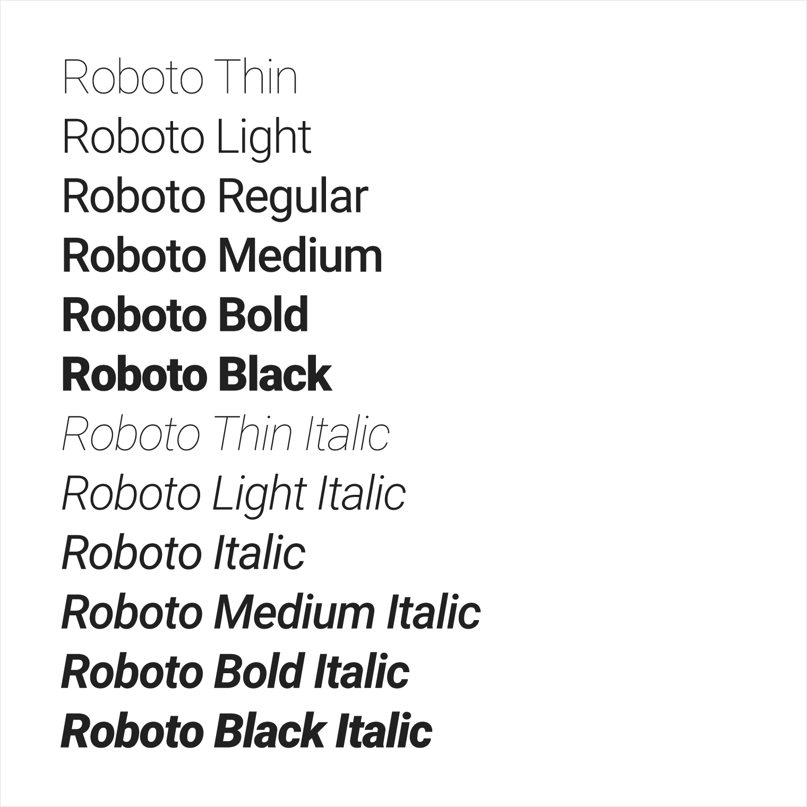
</p>

<strong>Colores: </strong>IoT Solutions ha definido una paleta de colores moderna y equilibrada para garantizar una identidad visual coherente y atractiva tanto en la landing page como en la aplicación web y móvil de HydroSmart. Los tonos azules transmiten tecnología y confianza, el verde representa el crecimiento y la conexión con la naturaleza, mientras que el rojo resalta elementos clave de interacción. Los colores neutros aportan claridad, calidez y equilibrio visual. Esta paleta refuerza el compromiso de la marca con soluciones inteligentes, eficientes y amigables para el agricultor peruano.

<p align="center">
  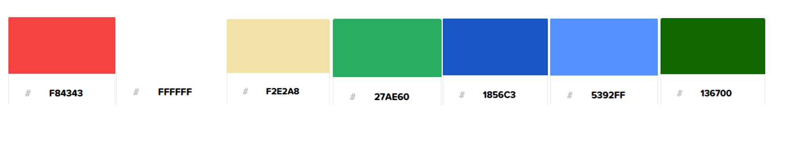
</p>

### 5.1.2. Web, Mobile and IoT Style Guidelines

Para mantener una identidad visual coherente en todos los puntos de contacto, la interfaz de usuario en la web, la aplicación móvil y los dispositivos IoT seguirá las mismas directrices establecidas en la sección de **General Style Guidelines**. Se utilizará la misma paleta de colores y tipografía, garantizando una experiencia uniforme, reconocible y alineada con los valores del proyecto **HydroSmart**.

A continuación, se detallan los lineamientos visuales clave para la interfaz de usuario en estas plataformas:

- **Botones (default, Hover, Pressed, Inactive):** El diseño y comportamiento de los botones será consistente a través de todos los dispositivos, respetando la paleta de colores y los efectos visuales para estados de interacción.
- **Tamaño de la Fuente (Font Size):** Se mantendrá un tamaño de fuente estandarizado que optimiza la legibilidad tanto en pantallas pequeñas como grandes, asegurando una experiencia de usuario clara y accesible.

- **Espaciado (Spacing):** El espaciado entre los elementos será uniforme para crear una interfaz limpia y ordenada, mejorando la navegación y la estética general.

- **Sistema de Rejillas (Grid System):** El sistema de rejillas se adapta a diferentes tamaños de pantalla, garantizando una estructura organizada en dispositivos móviles, tabletas y escritorios.

A continuación, se presentan las imágenes correspondientes a estos lineamientos visuales:

1. **Botones (default, Hover, Pressed, Inactive):**  
   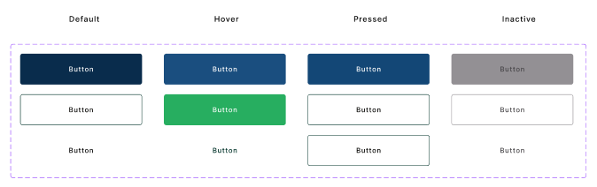

2. **Tamaño de la Fuente (Font Size):**  
   

3. **Espaciado (Spacing):**  
   

4. **Sistema de Rejillas (Grid System):**  
   

## 5.2. Information Architecture

### 5.2.1. Organization Systems

En IoT Solutions, aplicamos una jerarquía visual clara y adaptativa tanto en plataformas móviles como web para HydroSmart, nuestra solución inteligente para el riego automatizado de cultivos. Esta estructura visual permite resaltar la información más importante y facilita que los usuarios controlen fácilmente aspectos clave del entorno agrícola, como la temperatura, la humedad y el nivel de agua. La interfaz está organizada de manera secuencial para guiar al usuario a través de sus funciones principales: la vista Cultivos, donde se pueden añadir, editar y eliminar cultivos; la vista Agua, que muestra la cantidad de agua restante en litros y el historial de consumo de los aspersores inteligentes; y la vista Sistemas, donde se detalla el estado de los sistemas activos (los sistemas de aspersores para un tipo de cultivo, también se podrá visualizar la batería de este sistema”). Esta categorización del contenido asegura una experiencia fluida y centrada en las necesidades del agricultor moderno.

### 5.2.2. Labeling Systems

Para HydroSmart, hemos diseñado un sistema de etiquetado claro tanto para la aplicación móvil como para la versión web, con el objetivo de optimizar la experiencia del usuario y facilitar la navegación entre las funcionalidades clave. Las etiquetas empleadas en la interfaz son:

Vista del Agricultor:

<table> <tbody> <tr> <th>Cultivos - Crops</th> <td>Permite al usuario añadir, editar o eliminar cultivos registrados en el sistema.</td> </tr> <tr> <th>Gestión de agua - Water Management</th> <td>Muestra la cantidad de agua restante en litros, el historial de consumo por aspersores inteligentes y opciones de control hídrico.</td> </tr> <tr> <th>Sistemas - Systems</th> <td>Presenta información sobre el estado de los sistemas activos para los diferentes cultivos que se tengan, se puede visualizar factores como humedad, temperatura, cantidad de agua y el nivel de batería del sistema.</td> </tr> <tr> <th>Logout</th> <td>Permite al usuario cerrar sesión y salir de su cuenta de manera segura.</td> </tr> </tbody> </table>

### 5.2.3. SEO Tags and Meta Tags

Para mejorar la visibilidad y el rendimiento de HydroSmart en motores de búsqueda y en las tiendas de aplicaciones, se han implementado las siguientes etiquetas SEO y metaetiquetas:

<strong>Metaetiqueta de Descripción: </strong>Proporciona una breve descripción del contenido y propósito de la aplicación, ayudando a los usuarios a entender de qué se trata la aplicación y a mejorar la tasa de clics.

```
<meta name="description" content="HydroSmart is a platform that provides farmers with the necessary information to improve their farming practices.">
```

<strong>Metaetiqueta de Autor: </strong>Especifica el autor de la aplicación, lo que ayuda a atribuir la propiedad intelectual y la fuente del contenido.

```
<meta name="author" content="IoT Solutions">
```

<strong>Metaetiqueta de Robots: </strong>Indica a los motores de búsqueda cómo deben indexar y rastrear la página, permitiendo que se indexe y que se sigan los enlaces en la aplicación.

```
<meta name="robots" content="index, follow">
```

<strong>Etiqueta de Título: </strong> Define el título de la aplicación que aparece en los resultados de búsqueda y en las pestañas del navegador.

```
<title>HydroSmart</title>
```

<strong>Etiqueta de Idioma: </strong> Especifica el idioma principal del contenido de la aplicación para ayudar a los motores de búsqueda a entender y clasificar el contenido adecuadamente.

```
<html lang="en">
```

<p align="center">
  
</p>

### 5.2.4. Searching Systems

En HydroSmart, el sistema de búsqueda ha sido diseñado para integrarse de forma fluida con la jerarquía visual clara y secuencial que caracteriza tanto a la versión móvil como web de la aplicación. Esta funcionalidad permite a los usuarios localizar fácilmente cultivos específicos, consultar el historial de cultivos registrados, acceder a tutoriales desde la sección de acciones recomendadas, y filtrar sistemas de riego activos según criterios como el tipo de cultivo, el estado operativo o el nivel de batería. Asimismo, en la vista de gestión del agua, los usuarios pueden buscar por fechas o patrones de consumo. Este enfoque mejora significativamente la experiencia del usuario, permitiendo un acceso rápido y preciso a la información relevante, y facilitando una toma de decisiones eficiente en la gestión agrícola automatizada.

### 5.2.5. Navigation Systems

La interfaz de la aplicación HydroSmart está diseñada para una navegación eficiente, con características adaptadas a la usabilidad en portales web como pantallas táctiles:

- **_Menús de Navegación:_** Menús adaptados para dispositivos móviles o de escritorio, que pueden incluir menús desplegables, botones en la parte superior o inferior de la pantalla, y accesos directos.

- **_Navegación por Pestañas:_** Utiliza pestañas en la parte superior o inferior de la pantalla para organizar el contenido en secciones o categorías, permitiendo a los usuarios cambiar entre diferentes secciones sin necesidad de cargar nuevas pantallas.

## 5.3. Landing Page UI Design

Link del Figma de los wireframes y mockups de la landing page: https://www.figma.com/design/t5ZCVaxwwvv3f73ZR73WYq/Iot-Solutions---Landing-Page?node-id=0-1&t=OWeHU0WHyO5VgVB0-1

### 5.3.1. Landing Page Wireframe

Los wireframes son el esquema básico de la Landing page, mostrando la estructura principal y la disposición de los elementos. Aquí se detallan las secciones clave como el encabezado, el área de beneficios, las llamadas a la acción y la ubicación de imágenes, enfocándose en la usabilidad y el flujo de la página sin distracciones visuales.

**Página de inicio**


**Página de inicio (versión móvil)**


**Página de Problemática**


**Página de Problemática (versión móvil)**


**Página de Características**


**Página de Características (versión móvil)**


**Página de Sobre Nosotros**


**Página de Sobre Nosotros (versión móvil)**


**Página de Contacto**


**Página de Contacto (versión móvil)**


### 5.3.2. Landing Page Mock-up

Los mockups añaden detalles visuales y de diseño a los wireframes, mostrando la paleta de colores, tipografía y estilo gráfico que tendrá la landing page. Representan cómo se verá la página final, integrando los elementos visuales que harán la experiencia más atractiva y coherente con la marca.

**Página de inicio**


**Página de inicio (versión móvil)**


**Página de Problemática**


**Página de Problemática (versión móvil)**


**Página de Características**


**Página de Características (versión móvil)**


**Página de Sobre Nosotros**


**Página de Sobre Nosotros (versión móvil)**


**Página de Contacto**


**Página de Contacto (versión móvil)**


## 5.4. Applications UX/UI Design

Link del Figma de Applications UX/UI Design: https://www.figma.com/design/dZGHe90xVgeIrFnflNogzc/UX-UI-Design--IoT?node-id=5257-5961&t=WAEc6KnZiu5vW5He-1

### 5.4.1. Applications Wireframes

En este apartado, se muestran todos los wireframes necesarios para cumplir las funcionalidades indicadas en las User Stories con sus escenarios relacionados con la aplicación. Se muestra la versión y móvil y web de cada uno de los wireframes.

**Sección de Registro e Inicio de Sesión**


**Gestión de Cultivos**


**Detalle de Cultivo**


**Gestión de Agua**


**Gestión de Sistemas**


**Agregar nuevo sistema**


### 5.4.2. Applications Wireflow Diagrams

Se presentan los wireflow diagrams de la aplicación, que muestran el flujo de navegación entre las diferentes pantallas y funcionalidades. Estos diagramas ayudan a visualizar cómo los usuarios interactuarán con la aplicación y cómo se moverán entre las distintas secciones.

En este wireflow, se muestra como un usuario sin cuenta puede registrarse en la aplicación. Si el registro es exitoso, se le redirige a iniciar sesión. Si el registro falla, se le muestra un mensaje de error.


En este wireflow, se muestra como un usuario registrado puede iniciar sesión en la aplicación. Si las credenciales son correctas, se le redirige a la vista de cultivos. Si las credenciales son incorrectas, se le muestra un mensaje de error.


En este wireflow, se muestra como el usuario agricultor puede ver la lista de cultivos. Desde esta vista, puede agregar un nuevo cultivo, editar uno existente o eliminarlo. Al seleccionar un cultivo, se le redirige a la vista de detalle del cultivo.


En este wireflow, se muestra como el usuario agricultor puede ver la vista de detalle del cultivo. Desde esta vista, puede ver datos como la humedad, temperatura.


En este wireflow, se muestra como el usuario agricultor puede actuar frente algún evento de alerta. Así, se le recomendará tutoriales para actuar frente a la alerta.


En este wireflow, se muestra como el usuario agricultor desde la vista de detalles del cultivo, puede dirigirse a ver el historial de cultivos. Puede ver el historial limitado (30 días) o el historial completo.


En este wireflow, se muestra como el usuario agricultor desde la vista de detalles del suelo, puede dirigirse a ver el sistema perteneciente al cultivo y ver el estado del sistema.


En este wireflow, se muestra como el usuario agricultor puede ver la gestión del agua, así como la cantidad de agua que se ha utilizado cada mes. Además, cuenta con el botón para ver el historial detallado de consumo de agua, que muestra un gráfico de barras con el consumo de agua por mes.


En este wireflow, se muestra como el usuario agricultor puede ver la gestión de los tanques de agua. Desde esta vista, puede ver la lista completa de tanques, agregar uno nuevo, editar uno existente o eliminarlo.


En este wireflow, se muestra como el usuario agricultor puede ver los sistemas que tiene. Desde esta vista, puede ver la lista completa de sistemas, editar uno existente o eliminarlo. Al seleccionar un sistema, se le redirige a la vista de detalle del sistema.


En este wireflow, se muestra como el usuario agricultor puede agregar un nuevo sistema. Al seleccionar esta opción, se empezará a buscar sistemas disponibles. Si se encuentra un sistema, lo podrá agregar y se le redirige a la vista de detalle del sistema. Si no se encuentra un sistema, se le muestra un mensaje de que no se encontraron sistemas disponibles.


### 5.4.3. Applications Mock-ups

A continuación se presentan los mockups de la aplicación, que muestran el diseño visual final de cada pantalla, incluyendo colores, tipografía y elementos gráficos. Estos mockups reflejan cómo se verá la aplicación en su versión final.

**Sección de Registro e Inicio de Sesión**


**Gestión de Cultivos**


**Detalle de Cultivo**


**Gestión de Agua**


**Gestión de Sistemas**


**Agregar nuevo sistema**


### 5.4.4. Applications User Flow Diagrams

En este apartado se presentan los diagramas de flujo de usuario (User Flow Diagrams) que ilustran el recorrido del usuario a través de la aplicación, desde el registro hasta la gestión de cultivos y sistemas. Estos diagramas ayudan a entender cómo los usuarios interactúan con la aplicación y cómo se mueven entre las diferentes funcionalidades.

En este user flow, se muestra como un usuario sin cuenta puede registrarse en la aplicación. Si el registro es exitoso, se le redirige a iniciar sesión. Si el registro falla, se le muestra un mensaje de error.


En este user flow, se muestra como un usuario registrado puede iniciar sesión en la aplicación. Si las credenciales son correctas, se le redirige a la vista de cultivos. Si las credenciales son incorrectas, se le muestra un mensaje de error.


En este user flow, se muestra como el usuario agricultor puede ver la lista de cultivos. Desde esta vista, puede agregar un nuevo cultivo, editar uno existente o eliminarlo. Al seleccionar un cultivo, se le redirige a la vista de detalle del cultivo.


En este user flow, se muestra como el usuario agricultor puede ver la vista de detalle del cultivo. Desde esta vista, puede ver datos como la humedad, temperatura.


En este user flow, se muestra como el usuario agricultor puede actuar frente algún evento de alerta. Así, se le recomendará tutoriales para actuar frente a la alerta.


En este user flow, se muestra como el usuario agricultor desde la vista de detalles del cultivo, puede dirigirse a ver el historial de cultivos. Puede ver el historial limitado (30 días) o el historial completo.


En este user flow, se muestra como el usuario agricultor desde la vista de detalles del suelo, puede dirigirse a ver el sistema perteneciente al cultivo y ver el estado del sistema.


En este user flow, se muestra como el usuario agricultor puede ver la gestión del agua, así como la cantidad de agua que se ha utilizado cada mes. Además, cuenta con el botón para ver el historial detallado de consumo de agua, que muestra un gráfico de barras con el consumo de agua por mes.


En este user flow, se muestra como el usuario agricultor puede ver la gestión de los tanques de agua. Desde esta vista, puede ver la lista completa de tanques, agregar uno nuevo, editar uno existente o eliminarlo.


En este user flow, se muestra como el usuario agricultor puede ver los sistemas que tiene. Desde esta vista, puede ver la lista completa de sistemas, editar uno existente o eliminarlo. Al seleccionar un sistema, se le redirige a la vista de detalle del sistema.


En este user flow, se muestra como el usuario agricultor puede agregar un nuevo sistema. Al seleccionar esta opción, se empezará a buscar sistemas disponibles. Si se encuentra un sistema, lo podrá agregar y se le redirige a la vista de detalle del sistema. Si no se encuentra un sistema, se le muestra un mensaje de que no se encontraron sistemas disponibles.


## 5.5. Applications Prototyping

En esta sección se presentan los prototipos de la aplicación HydroSmart, tanto para la versión web como para la versión móvil. Estos prototipos permiten visualizar y probar la interfaz de usuario y la experiencia de usuario antes de la implementación final.

[Enlace a prototipo web en Figma](https://www.figma.com/proto/dZGHe90xVgeIrFnflNogzc/UX-UI-Design--IoT?node-id=5121-1796&p=f&t=IDlzW8jHozdgLpV7-1&scaling=scale-down&content-scaling=fixed&page-id=3122%3A648&starting-point-node-id=5121%3A1796)

[Enlace a prototipo móvil en Figma](https://www.figma.com/proto/dZGHe90xVgeIrFnflNogzc/UX-UI-Design--IoT?node-id=5148-8913&p=f&t=t6iW7Xef8vPinDsu-1&scaling=scale-down&content-scaling=fixed&page-id=5148%3A7382&starting-point-node-id=5148%3A8913)


[Enlace a video de prototipo web y móvil](https://upcedupe-my.sharepoint.com/:v:/g/personal/u20221b127_upc_edu_pe/EZgB4ykAX9ZCmvwzDKE6VVEB2ibqPGudFnnR1NwBbRU2XQ?nav=eyJyZWZlcnJhbEluZm8iOnsicmVmZXJyYWxBcHAiOiJPbmVEcml2ZUZvckJ1c2luZXNzIiwicmVmZXJyYWxBcHBQbGF0Zm9ybSI6IldlYiIsInJlZmVycmFsTW9kZSI6InZpZXciLCJyZWZlcnJhbFZpZXciOiJNeUZpbGVzTGlua0NvcHkifX0&e=KhDFvR)

<div style="page-break-after: always;"></div>

# Capítulo VI: Product Implementation, Validation & Deployment

## 6.1. Software Configuration Management

### 6.1.1. Development Environment Configuration

**Product UX/UI Design**

Se realizaron los productos de UX con la herramienta UXPressia, así como el User Persona, Empathy Mapping, Impact Mapping, entre otras. Gracias a esto pudimos modelar bien los diseños de la experiencia de usuario, lo cual nos sirve para poder ponernos en una mejor perspectiva para nuestros segmentos objetivo. Por otro lado, hicimos los prototipos de la aplicación móvil utilizando la herramienta Figma, la cual nos permitió crear los Wireframes y Mock-ups para tener un diseño previo al desarrollo de la aplicación.

**Software Development**

Como principales IDEs, utilizamos WebStorm y Intellij Idea, con los cuales estamos más familiarizados por ser de Jetbrains. Por otro lado, para el desarrollo usamos los lenguajes aprendidos previamente, como HTML y CSS para la landing page, Java para el backend, JavaScript para el frontend web, y Dart para la aplicación móvil.

**Software Testing**

Las pruebas de aceptación son importantes a realizar para comprobar que los criterios de aceptación planteados están favoreciendo a las necesidades del negocio y cumplir con los requerimientos, para lo cual utilizamos el lenguaje Gherkin. Este consiste en trabajar el escenario con Given When Then, y lograr identificar las variables de input y output, lo cual es sencillo de entender para todos ya que utiliza lenguaje natural. Gracias a este, es que se logra garantizar la calidad del software, por ello cumple un papel esencial en los proyectos de desarrollo.

### 6.1.2. Source Code Management

Usuarios de GitHub

<table>
  <thead>
    <tr>
        <th>Integrante</th>
        <th>Usuario de GitHub</th>
    </tr>
  </thead>
  <tbody>
    <tr>
        <td>Delgado Corrales, Piero Gonzalo</td>
        <td>PieroD04</td>
    </tr>
    <tr>
        <td>Paredes Puente, Sebastián Roberto</td>
        <td>sebastian123gonzalo</td>
    </tr>
    <tr>
        <td>Salinas Torres, Salvador Antonio</td>
        <td>salvadoorssalinas</td>
    </tr>
    <tr>
        <td>Neyra Santa Cruz, Marcelo Sebastian</td>
        <td>SN-Marcelo</td>
    </tr>
    <tr>
        <td>Soto Salis, Natanael David</td>
        <td>NickDavid811</td>
    </tr>
  </tbody>
</table>

**URL de la organización en GitHub:** https://github.com/iot-solutions64

Para el desarrollo del trabajo se hará uso de GitFlow, el cual es un modelo de flujo de trabajo para la gestión de control de versiones Git. Está compuesta por ramas y cada una cumple un propósito distinto. Las ramas que utilizamos son: Feature, Develop, Release y Main.

### 6.1.3. Style Guide & Conventions

En el desarrollo de este trabajo, se utilizará una gran variedad de lenguajes para trabajar en el Landing Page, Frontend Web y Mobile Application. Para ello, se utilizará la siguiente guía de estilos y convenciones.

**HTML**

Es el lenguaje utilizado para estructurar el contenido de una página web, brindando una variedad de elementos posibles como texto, imágenes, formularios, etc.
https://www.w3schools.com/html/html5_syntax.asp

- Declarar el tipo de documento en la primera línea con \<!DOCTYPE html>.
- Respetar la estructura básica del HTML: \<html>, \<head>, \<body>.
- Declarar el título de la página para dar a conocer al usuario en qué página se encuentra. (Usar el elemento \<title> en \<head>)
- Se usará la indentación coherente para lograr una lectura sencilla del código, por lo que es importante tener la tabulación correcta para cada nivel de anidamiento.
- Siempre cerrar los elementos que lo requieran, ya sea una división, párrafo, título. (Si se declara una \<div>, siempre cerrarlo con \</div>)
- Declarar el atributo “alt” para las imágenes.

**CSS**

Es el lenguaje utilizado para definir el diseño de la página web, así como los estilos, fuentes, colores, contenedores, etc.
https://google.github.io/styleguide/htmlcssguide.html

- Usar indentación de forma correcta.
- Los nombres para elementos deben ser cortos y en minúsculas.
- Declarar los colores en código hexadecimal. (Ejemplo: #024A86)
- Dejar comentarios para conocer el propósito del estilo y su uso.
- El diseño debe ser responsive para que los usuarios lo puedan visualizar cómodamente desde el dispositivo en qué se encuentren.

**JavaScript**

Es un lenguaje de programación utilizado para crear interactividad en la página web, así como la lógica de negocio.
https://google.github.io/styleguide/jsguide.html

- Declarar nombres coherentes y descriptivos para variables, funciones y clases.
- Incluir comentarios que expliquen claramente el propósito de cada bloque de código.
- Finalizar cada línea con punto y coma para mantener consistencia.
- Usar const y let de forma adecuada: const para valores que no cambian y let para aquellos que sí.
- Emplear comparaciones estrictas (=== y !==) para evitar errores de tipo.
- Aprovechar el tipado de TypeScript para declarar tipos explícitos y prevenir errores en tiempo de compilación.

**Dart**

Es un lenguaje de programación utilizado para crear aplicaciones móviles. Se utiliza para crear la aplicación móvil de HydroSmart, la cual está desarrollada en Flutter.
https://dart.dev/guides/language/effective-dart

- Nombrar las variables, funciones y clases con CamelCase, además de ser significativos y cortos.
- Usar lowerCamelCase para los nombres de las variables y funciones.
- Usar indentación correctamente para un código coherente y ordenado.
- Usar comillas dobles (“) para las cadenas de texto.
- Dejar comentarios en cada bloque de código para explicar su funcionalidad.
- Declarar constantes cuando sean variables que no cambiarán su valor a lo largo de todo el código.

**Java**

Es un lenguaje de programación utilizado para la programación web, programación móvil, entre otros. Es capaz de adaptarse para funcionar en distintas plataformas. https://google.github.io/styleguide/javaguide.html

- Nombrar las variables, funciones y clases con CamelCase, además de ser significativos y cortos.
- Utilizar HTTPS para establecer una conexión segura.
- Usar indentación correctamente para un código coherente y ordenado.
- Usar comillas dobles (“) para las cadenas de texto.
- Dejar comentarios en cada bloque de código para explicar su funcionalidad.
- Declarar constantes cuando sean variables que no cambiarán su valor a lo largo de todo el código.

### 6.1.4. Deployment Configuration

Para la configuración del despliegue de la aplicación, utilizaremos Git, un sistema de control de versiones distribuido que es bastante utilizado en proyectos de desarrollo de software. Es una herramienta esencial para trabajar colaborativamente y poder hacer el seguimiento de los cambios realizados por los miembros del grupo. Una de sus mejores ventajas es su capacidad para rastrear los cambios en los archivos de un proyecto a lo largo del tiempo. Con Git, es posible crear ramas, realizar cambios en ellas y fusionarlos eficientemente, permitiendo que varios desarrolladores trabajen en diferentes aspectos del proyecto simultáneamente sin interferencias.

Por otro lado, tenemos a GitHub, el cual es la plataforma para poder alojar repositorios de Git. Es uno de los servicios más utilizados por desarrolladores de forma mundial, ya que permite manejar repositorios públicos y privados para almacenar el código en la nube. A parte de ello, maneja el historial de los repositorios, permitiendo a los usuarios acceder a todas las versiones trabajadas, permitiendo que puedan retornar a una versión anterior en caso lo deseen. Ofrece otras herramientas que son muy útiles como los pull requests, los cuales son solicitudes de revisiones de una rama y luego poder fusionarla con otra rama.

Asimismo, utilizaremos el sistema de GitHub Pages para desplegar la Landing Page de nuestro proyecto. Este es un servicio que ofrece GitHub para alojar sitios web estáticos de forma gratuita. Permite a los desarrolladores alojar un sitio web directamente desde un repositorio de GitHub, lo que facilita la publicación de sitios web sin tener que preocuparse por la infraestructura de alojamiento.

Para el Backend se usará Railway, que es un servicio de alojamiento de aplicaciones web y APIs. Permite a los desarrolladores desplegar sus aplicaciones en la nube sin necesidad de preocuparse por la infraestructura subyacente. Finalmente, para la aplicación web se usará Netlify, una plataforma de despliegue y alojamiento para aplicaciones web modernas. Permite desplegar aplicaciones de forma rápida y sencilla, con integración continua y escalabilidad automática.

## 6.2. Implementation

### 6.2.1. Sprint 1

#### 6.2.1.1. Sprint Planning 1

Se planeó el primer sprint a través de una reunión presencial. Para ello, se hizo la siguiente tabla para registrar la información que se discutió.

<table>
  <tr>
    <th>Sprint #</th>
    <td>Sprint 1</td>
  </tr>
  <tr>
    <th colspan="2"><strong>Sprint Planning Background</strong></th>
  </tr>
  <tr>
    <th>Date</th>
    <td>2025-05-03</td>
  </tr>
  <tr>
    <th>Time</th>
    <td>01:00 PM</td>
  </tr>
  <tr>
    <th>Location</th>
    <td>Presencial (En la universidad)</td>
  </tr>
  <tr>
    <th>Prepared by</th>
    <td>Paredes Puente, Sebastian Roberto</td>
  </tr>
  <tr>
    <th>Attendees (to planning meeting)</th>
    <td>
      <p>Paredes Puente, Sebastián Roberto</p>
      <p>Delgado Corrales, Piero Gonzalo</p>
      <p>Neyra Santa Cruz, Marcelo Sebastian</p>
      <p>Soto Salis, Natanael David</p>
      <p>Salinas Torres, Salvador Antonio</p>
    </td>
  </tr>
  <tr>
    <th>Sprint n - 1 Review Summary</th>
    <td>No hubo sprint anterior</td>
  </tr>
  <tr>
    <th>Sprint n - 1 Retrospective Summary</th>
    <td>No hubo sprint anterior</td>
  </tr>
  <tr>
    <th colspan="2"><strong>Sprint Goal & User Stories</strong></th>
  </tr>
  <tr>
    <th>Sprint 1 Goal</th>
    <td>Desarrollar la landing page, el frontend web, backend de la aplicacion; asimismo, despliegar la landing page</td>
  </tr>
  <tr>
    <th>Sprint 1 Velocity</th>
    <td>37</td>
  </tr>
  <tr>
    <th>Sum of Story Points</th>
    <td>37</td>
  </tr>
  </tr>
</table>

#### 6.2.1.2. Aspect Leaders and Collaborators

En esta sección se presenta el equipo que participará en la elaboración del artefacto **Leadership-and-Collaboration Matrix (LACX)**, con el objetivo de brindar claridad y efectividad en la comunicación dentro del equipo. Para ello, se han identificado tres aspectos principales dentro del alcance del Sprint: **Desarrollo de Backend**, **Desarrollo de Frontend Web** y **Desarrollo de Landing Page**.

Cada aspecto tiene asignados un líder y colaboradores que serán responsables de su ejecución. La matriz de liderazgo y colaboración es la siguiente:

| **Team Member** (Last Name, First Name) | **GitHub Username** | **Desarrollo de Backend** | **Desarrollo de Frontend Web** | **Desarrollo de Landing Page** |
| --------------------------------------- | ------------------- | ------------------------- | ------------------------------ | ------------------------------ |
| Paredes Puente, Sebastian Roberto       | sebastian123gonzalo | -                         | -                              | L                              |
| Delgado Corrales, Piero Gonzalo         | PieroD04            | -                         | L                              | -                              |
| Salinas Torres, Salvador Antonio        | salvadoorssalinas   | -                         | C                              | -                              |
| Neyra Santa Cruz, Marcelo Sebastian     | SN-Marcelo          | L                         | -                              | -                              |
| Soto Salis, Natanael David              | NickDavid811        | C                         | -                              | -                              |

#### 6.2.1.3. Sprint Backlog 1

El objetivo de este primer sprint fue el de desarrollar la landing page, el frontend web, backend de la aplicacion; asimismo, desplegar la landing page

<table>
<tr><th colspan="1" valign="top">Sprint #</th><th colspan="7" valign="top">Sprint 1</th></tr>
<tr><td colspan="2" valign="top">User Story</td><td colspan="6" valign="top">Work-Item / Task</td></tr>
<tr>
  <td colspan="1" valign="top">Id</td>
  <td colspan="1" valign="top">Title</td>
  <td colspan="1" valign="top">Id</td>
  <td colspan="1" valign="top">Title</td>
  <td colspan="1" valign="top">Description</td>
  <td colspan="1" valign="top">Estimation</td>
  <td colspan="1" valign="top">Assigned To</td>
  <td colspan="1" valign="top">Status (To-Do / In-Process / Review / Done)</td>
</tr>
<!-- US01 -->
<tr>
  <td>US01</td><td>Implementación de Barra de navegación</td>
  <td>T01</td><td>Diseñar barra de navegación</td><td>Diseño visual y estructura HTML/CSS</td><td>0.5</td><td>Sebastian Paredes</td><td>Done</td>
</tr>
<tr>
  <td></td><td></td>
  <td>T02</td><td>Implementar navegación funcional</td><td>Implementar anclas y navegación responsive</td><td>0.5</td><td>Sebastian Paredes</td><td>Done</td>
</tr>
<!-- US02 -->
<tr>
  <td>US02</td><td>Visualizar logo y descripción</td>
  <td>T03</td><td>Agregar logo y descripción</td><td>Insertar logo de empresa y texto representativo</td><td>1</td><td>Sebastian Paredes</td><td>Done</td>
</tr>
<!-- US03 -->
<tr>
  <td>US03</td><td>Detalles y Servicios de la empresa</td>
  <td>T04</td><td>Diseñar sección de servicios</td><td>Presentar beneficios y características del sistema</td><td>1</td><td>Sebastian Paredes</td><td>Done</td>
</tr>
<!-- US04 -->
<tr>
  <td>US04</td><td>Clientes de la empresa</td>
  <td>T05</td><td>Testimonios de clientes</td><td>Agregar opiniones reales o ficticias de usuarios</td><td>1</td><td>Sebastian Paredes</td><td>Done</td>
</tr>
<!-- US05 -->
<tr>
  <td>US05</td><td>Acerca de nosotros</td>
  <td>T06</td><td>Diseñar sección misión/visión</td><td>Mostrar propósito y valores de la empresa</td><td>1</td><td>Sebastian Paredes</td><td>Done</td>
</tr>
<!-- US06 -->
<tr>
  <td>US06</td><td>Implementación de un Footer</td>
  <td>T07</td><td>Agregar Footer</td><td>Diseño con links y redes sociales</td><td>1</td><td>Sebastian Paredes</td><td>Done</td>
</tr>
<!-- US07 -->
<tr>
  <td>US07</td><td>Translación a la aplicación web</td>
  <td>T08</td><td>Botón de acceso web</td><td>Enlace directo a aplicación web desde la landing</td><td>1</td><td>Sebastian Paredes</td><td>Done</td>
</tr>
<!-- US09 -->
<tr>
  <td>US09</td><td>Verificación de temperatura del suelo</td>
  <td>T10</td><td>Lectura de temperatura del suelo</td><td>Mostrar datos del sensor de temperatura</td><td>3</td><td>Marcelo Neyra, Natanael Solis</td><td>In Process</td>
</tr>
<!-- US10 -->
<tr>
  <td>US10</td><td>Acciones Recomendadas</td>
  <td>T11</td><td>Diseñar interfaz de recomendaciones</td><td>Mostrar alertas o sugerencias por estado de cultivo</td><td>2</td><td>Piero Delgado, Salvador Salinas</td><td>In Process</td>
</tr>
<!-- US12 -->
<tr>
  <td>US12</td><td>Interacción con el riego automático</td>
  <td>T12</td><td>Activar/desactivar riego</td><td>Control manual del sistema de riego</td><td>5</td><td>Marcelo Neyra, Natanael Solis</td><td>In Process</td>
</tr>
<!-- US14 -->
<tr>
  <td>US14</td><td>Limites en el uso agua por cultivo</td>
  <td>T13</td><td>Configurar límites de agua</td><td>Restringir consumo por cultivo</td><td>3</td><td>Marcelo Neyra, Natanael Solis</td><td>In Process</td>
</tr>
<!-- US15 -->
<tr>
  <td>US15</td><td>Cantidad de agua disponible</td>
  <td>T14</td><td>Mostrar nivel de agua</td><td>Medidor en tiempo real del tanque o depósito</td><td>5</td><td>Piero Delgado, Salvador Salinas</td><td>In Process</td>
</tr>
<!-- US22 -->
<tr>
  <td>US22</td><td>Añadir nuevo sistema HydroSmart</td>
  <td>T15</td><td>Formulario de registro de sistema</td><td>Permitir añadir nuevos nodos/sistemas</td><td>3</td><td>Piero Delgado, Salvador Salinas</td><td>In Process</td>
</tr>
<!-- US23 -->
<tr>
  <td>US23</td><td>Quitar un sistema de HydroSmart</td>
  <td>T16</td><td>Eliminar sistema existente</td><td>Permitir borrar un sistema inactivo</td><td>3</td><td>Piero Delgado, Salvador Salinas</td><td>In Process</td>
</tr>
<!-- US24 -->
<tr>
  <td>US24</td><td>Registro de usuarios</td>
  <td>T17</td><td>Formulario de registro</td><td>Campos de nombre, correo y contraseña</td><td>3</td><td>Piero Delgado, Salvador Salinas</td><td>Done</td>
</tr>
<!-- US25 -->
<tr>
  <td>US25</td><td>Acceso de Usuarios</td>
  <td>T18</td><td>Login de usuario</td><td>Inicio de sesión con correo y contraseña</td><td>3</td><td>Piero Delgado, Salvador Salinas</td><td>Done</td>
</tr>
</table>

#### 6.2.1.4. Development Evidence

Para esta entrega, se realizaron 3 aplicaciones, la landing page, frontend web application y backend application. Las 3 aplicaciones se realizaron en paralelo y en los siguientes repositorios:

1. Backend Application: **[Repositorio Backend](https://github.com/iot-solutions64/backend)**
2. Frontend Application: **[Repositorio Frontend](https://github.com/iot-solutions64/frontend-web)**
3. Landing Page Application: **[Repositorio Landing Page](https://github.com/iot-solutions64/landing-page)**

| Repository   | Branch    | Commit Id                                | Commit Message                                                                                 | Commit Message Body                           | Commited on (Date) |
| ------------ | --------- | ---------------------------------------- | ---------------------------------------------------------------------------------------------- | --------------------------------------------- | ------------------ |
| landing-page | main      | 861f42b08f2eb0211a86a52ccd8c418616ece22c | feat: landing page sections added                                                              | none                                          | 28/04/2025         |
| landing-page | main      | 708cc85ecf6810e19c021fd86b65775ed332f5e0 | feat: styles for "p" elements changed                                                          | none                                          | 28/04/2025         |
| landing-page | main      | 53bd616aa03427668845c2dcf5fe981aee5617a9 | feat: content for features.html changed                                                        | none                                          | 04/05/2025         |
| landing-page | main      | 0592d05e0012ca8f94e855344a4bed6ba3c07924 | fat: change Iot-solutions64 for IoT Solutions                                                  | none                                          | 04/05/2025         |
| landing-page | main      | e56261c796f1650f58238cddc54423ae2f8ed771 | feat: update about-app.css                                                                     | none                                          | 04/05/2025         |
| landing-page | main      | 4a96374ed318ba7388f21cacee73204bdfdf2cc8 | feat: index.html updated                                                                       | none                                          | 04/05/2025         |
| landing-page | main      | 4e7e16a99807e32537f51153d8c895e4c530e68c | feat: update about-app.css                                                                     | none                                          | 04/05/2025         |
| landing-page | main      | e021f2e0685b7e1dfa3bcad46cce9ed2a221bf44 | feat: update styles.css                                                                        | none                                          | 05/05/2025         |
| landing-page | main      | f87be5bd81178e3ea44cf05fd52c9f4275542766 | fix: styles for sections fixed                                                                 | none                                          | 10/05/2025         |
| landing-page | main      | 4847a7a047c48185add3e0835bc7bfffbf11de3f | fix: about-app styles updated                                                                  | none                                          | 10/05/2025         |
| landing-page | main      | 5e836925436c0aec61de506660b620cdcad2c834 | fix: about us section updated                                                                  | none                                          | 10/05/2025         |
| landing-page | main      | 2872cde860a5d55952bdd988a68cf5d32e35c51c | fix: update other sections                                                                     | none                                          | 10/05/2025         |
| landing-page | main      | 17bfe1a050ea0589df32624f1ab18f79dd466b5a | feat: update styles for contact section                                                        | none                                          | 12/05/2025         |
| landing-page | main      | 9cf423c5755c96250b973f065ea88e0a6c5a3347 | feat: styles.css updated                                                                       | none                                          | 12/05/2025         |
| frontend-web | develop   | 9e6648d9c3830ec467bedbaddf10d747e58c06b2 | feat: base project                                                                             | none                                          | 07/05/2025         |
| frontend-web | develop   | bf49b9d8a13651b990b23e81cfb9824221ec7337 | feat: add navbar styles & functionality                                                        | none                                          | 07/05/2025         |
| frontend-web | develop   | e5e5ffb0bd3861e36046b98e36051618270c047d | feat: add login                                                                                | none                                          | 07/05/2025         |
| frontend-web | develop   | 313be98fb4184d39af887edfd6191af1120d76a1 | feat: add signup                                                                               | none                                          | 07/05/2025         |
| frontend-web | develop   | 5ecf8b2a6da7fcd6b0ae875d01906970229dca30 | feat: add base table & fab for crops page                                                      | none                                          | 07/05/2025         |
| frontend-web | develop   | 4fce6f12b458331cd4e766649a9ba199d4a02fbc | feat: create add crop dialog                                                                   | none                                          | 07/05/2025         |
| frontend-web | develop   | 95db3437c31040b495d96a29a8828b554f7c3912 | feat: create delete crop dialog                                                                | none                                          | 07/05/2025         |
| frontend-web | develop   | 62bd22035d8b5f1cc091e76e659a2748ef462252 | feat: creat edit crop dialog                                                                   | none                                          | 07/05/2025         |
| frontend-web | develop   | d72a2d18007efd259034d39a8f10cbc49cfe5219 | feat: add route to crop detail                                                                 | none                                          | 07/05/2025         |
| frontend-web | develop   | fe31afd2c0280548b47bc704fd3bc9db8b1c318d | Merge pull request #1 from iot-solutions64/feature/crops                                       | feat: add page 'Cultivos'                     | 07/05/2025         |
| frontend-web | develop   | 2e8994e23aa101bedebf2087b97d260aba531ad0 | feat: add water management page                                                                | none                                          | 07/05/2025         |
| frontend-web | develop   | 51c71558a6ca9e1da5fd925adc5fa18945553461 | Merge pull request #2 from iot-solutions64/feature/water                                       | feat: add water management page & water graph | 07/05/2025         |
| frontend-web | develop   | 047fc53a12c19141f1ef1c1a403b05c43f3a9e6a | feat: add tanks page & add functionality                                                       | none                                          | 11/05/2025         |
| frontend-web | develop   | 2b90b6b7572abaae9de1cfea69be3721c228678d | feat(water-tanks): add delete & edit functionality                                             | none                                          | 12/05/2025         |
| frontend-web | develop   | 1ef37ac574b9f02b50d93abaf430961bf454c16a | feat: add systems page                                                                         | none                                          | 12/05/2025         |
| frontend-web | develop   | 9b17a4d7123974eab28ae7cf41130677fdeda8eb | feat: add system detail page                                                                   | none                                          | 12/05/2025         |
| frontend-web | develop   | a18a687dea068391d8985a0c4975ae32dcc56a8b | feat: add name attr to system                                                                  | none                                          | 12/05/2025         |
| frontend-web | develop   | 0487483ca4552df907517df70044ba96a6cadc5d | feat: add edit system page                                                                     | none                                          | 12/05/2025         |
| frontend-web | develop   | 1d06f886b73084269193b0684a3b7dcfeaabe98c | feat: finish add system page                                                                   | none                                          | 12/05/2025         |
| frontend-web | develop   | 11c30bdc743bd219c9626046b602bb49dff9ae7d | feat: add crop history                                                                         | none                                          | 12/05/2025         |
| frontend-web | develop   | a1bd221fb7d20323e8356eaddac0ded36e3815af | style: add responsiveness to system tables                                                     | none                                          | 12/05/2025         |
| frontend-web | develop   | bee3943d6249408b73229922e93a61251c720d77 | Merge pull request #6 from iot-solutions64/feature/system                                      | feat: system views                            | 13/05/2025         |
| frontend-web | develop   | c9bab9bd92d94b4583996ecdcc27147f800cb786 | feat: suggestion videos for recommended actions                                                | none                                          | 14/05/2025         |
| frontend-web | develop   | 8f149fe532fcbfcc1146f83673973ead79c6daf7 | Merge pull request #7 from iot-solutions64/feature/recommended-actions                         | none                                          | 14/05/2025         |
| backend      | develop   | 8ec2c9a839cda75c39766ab9e46af3d2556e2c0b | first commit                                                                                   | none                                          | 09/05/2025         |
| backend      | develop   | 74530fcd51e9c236a0d12be61c00fa7b20d3bcc2 | feat: added shared files                                                                       | none                                          | 09/05/2025         |
| backend      | develop   | 6e31ac6a37a7f3c0f4c065b4ec16d282490a5b38 | chore: updated dependencies                                                                    | none                                          | 09/05/2025         |
| backend      | develop   | aea8a64377135b60a65f7380461651323433857b | chore: added application properties                                                            | none                                          | 09/05/2025         |
| backend      | develop   | 1b2cea194207a92096776ef3f9e703fa5e18545f | feat: added security domain layer                                                              | none                                          | 09/05/2025         |
| backend      | develop   | 0b211015c22c2585a12316f262539cb0c2536351 | fix(security): updated file name                                                               | none                                          | 09/05/2025         |
| backend      | develop   | 5888d96b9be6c471de04673ec70b277a5d65cade | feat(security): added security services                                                        | none                                          | 09/05/2025         |
| backend      | develop   | a921026caabf92b764425b04d12a3d6ff011fe46 | feat(security): added security repositories                                                    | none                                          | 09/05/2025         |
| backend      | develop   | db3d22cd5acc68a90fb1f33ef0349ac6ac077ded | feat(security): added application layer                                                        | none                                          | 09/05/2025         |
| backend      | develop   | 229ff2657ac8e0c01e96af2e97fde729a853b5ce | feat(security): added infrastructure layer                                                     | none                                          | 09/05/2025         |
| backend      | develop   | af1ff9c49677e81f9a66ce323415ac9a86cc03c7 | feat(security): added interfaces layer                                                         | none                                          | 09/05/2025         |
| backend      | develop   | 641fc7d7f8f97b4d4d9ca4022a64f5f12fe0f312 | feat(security): added user facade                                                              | none                                          | 09/05/2025         |
| backend      | develop   | 4345da70de507c31d015c458c2576a5675b335fc | chore: updated dependencies                                                                    | none                                          | 10/05/2025         |
| backend      | develop   | fb132a259b1fac47f0a269bbfe5c85ac08bef3a4 | feat(soil): added aggregates and entities                                                      | none                                          | 10/05/2025         |
| backend      | develop   | e76abaf9f42a369b72b38ff151b13b24685028a4 | feat(soil): added more classes to the domain layer                                             | none                                          | 10/05/2025         |
| backend      | develop   | a9b6c69cd458dc633e2a2fb2abe020b8211d932d | chore(soil): moved all the classes to the correct folder                                       | none                                          | 10/05/2025         |
| backend      | develop   | 745a739d6c9c71a9869f4aaed7f69d2b3d9a87aa | feat(soil): added command service                                                              | none                                          | 10/05/2025         |
| backend      | develop   | ea960387655e6404086c23245275667a0889ed97 | feat(soil): added crop services                                                                | none                                          | 10/05/2025         |
| backend      | develop   | a82872996519a8bb1a25fec0442d415acfb234e9 | feat(soil): updated crop domain layer to include a user attribute                              | none                                          | 10/05/2025         |
| backend      | develop   | c29bbdfc62c609d3f85bb48c244a16f736dd5b9c | feat(soil): added soil infrastructure layer                                                    | none                                          | 10/05/2025         |
| backend      | develop   | 2fcc918859ec9d2600655fd39baa013cddb7d4dc | feat(soil): added soil application layer                                                       | none                                          | 10/05/2025         |
| backend      | develop   | 647685d34937795f09c97c14be0ae4c25d0a3316 | feat(soil): added a more specific threshold in the humidity and temperature classes            | none                                          | 10/05/2025         |
| backend      | develop   | fb8c566793e21b9f45da80ed7070341c83e698ed | feat(soil): added soil related resources                                                       | none                                          | 10/05/2025         |
| backend      | develop   | ad8554116dde3218b6ed1f3ee35e7a4280cf282e | refactor(soil): changed the order of the parameters                                            | none                                          | 10/05/2025         |
| backend      | develop   | 1beecc64a36d0c1c93397ce8b8eac673646bf338 | feat(soil): added the missing parameters                                                       | none                                          | 10/05/2025         |
| backend      | develop   | c22fd05513460d89842a5a3d87aef46eeafdeffd | feat(soil): added resource transform classes                                                   | none                                          | 10/05/2025         |
| backend      | develop   | 63427c8900e949ed2e95a877f0daafcd0e1fccd2 | feat(soil): added crop controller                                                              | none                                          | 10/05/2025         |
| backend      | develop   | 974a696b13c869fc80859e2699f7f21e28dde693 | feat(soil): updated the domain layer to include for more functionality                         | none                                          | 10/05/2025         |
| backend      | develop   | dfc4983ec5f52b850dfb6b74c1873b984f76e8fc | feat(soil): added patch, create and update commands for the humidity entity                    | none                                          | 10/05/2025         |
| backend      | develop   | 72acfc65d312fd7a890ecc1394c9c35918108ddb | chore(soil): added comments to the commands for better understandability                       | none                                          | 10/05/2025         |
| backend      | develop   | 8267dc88a52daf50af0570b5d0065742b3035383 | refactor(soil): deleted the suggestions attributes to avoid redundancy                         | none                                          | 10/05/2025         |
| backend      | develop   | 7b5e038b52461c1f5fa8eeaef41e9896f31a1dc9 | feat(soil): added the command and query services impl for the humidity and temperature classes | none                                          | 11/05/2025         |
| backend      | develop   | 0761e54cfbe98b540f843f0271e0ec9beda1aea9 | feat(soil): added the resources of the humidity and temperature classes                        | none                                          | 11/05/2025         |
| backend      | develop   | b2ea998e54cf26014b7526fc0e93bae12d4db2d7 | feat(soil): added transform classes                                                            | none                                          | 11/05/2025         |
| backend      | develop   | da73b2e4ca7372a234f3704e22403efca476c085 | feat(soil): added more transform classes                                                       | none                                          | 11/05/2025         |
| backend      | develop   | f8aea1359afd778cc614c2acec981b3960dc1306 | feat(soil): added temp and hum queries                                                         | none                                          | 11/05/2025         |
| backend      | develop   | 8ddc1f652a97fdb5a56a3175e3b41e9aa31ff4e9 | feat(soil): added temp and hum query services                                                  | none                                          | 11/05/2025         |
| backend      | develop   | 2cf4ec3f223817db5eb627a573f6c3c6427cecc9 | feat(soil): added temp and hum query services impl                                             | none                                          | 11/05/2025         |
| backend      | develop   | b93b4be50758e64d4a16454ebd7ec95aadb27e79 | fix(soil): added missing @service                                                              | none                                          | 11/05/2025         |
| backend      | develop   | 3d63f524c58218a54f2cca2a36b32ee07a74ad78 | refactor(soil): remove the id from the resources to protect the data                           | none                                          | 11/05/2025         |
| backend      | develop   | 5e26f058e9b35a2c372ba378943f28c5eb0a1a1d | refactor(soil): removed the hum and temp query services                                        | none                                          | 11/05/2025         |
| backend      | develop   | 209885ca67fc53e6a723fd355e1090d80924b25a | refactor(soil): removed id from patch resources to keep data save                              | none                                          | 11/05/2025         |
| backend      | develop   | 97e90bf33e5f80ebe27b448b1b9de4328bd1a4c9 | feat(soil): added more functions to the controller                                             | none                                          | 11/05/2025         |
| backend      | develop   | 3c14bdfddeeb4acbb0d26b62355fc173a4b991f4 | feat(security): added crop list to the user class                                              | none                                          | 11/05/2025         |
| backend      | develop   | 91f4d4b5a9fe8e6f7bdab417faa8a707088d3637 | feat(soil): added name attribute to the crop related classes                                   | none                                          | 11/05/2025         |
| backend      | develop   | 37beb85e9e0a97142cc4a64e6aa575ad2ad216a5 | feat(soil): added the missing post method                                                      | none                                          | 12/05/2025         |
| backend      | develop   | d74383682c8664c7156d703c45f4a89dcb79c8b8 | fix(soil): added missing inheritance                                                           | none                                          | 12/05/2025         |
| backend      | develop   | 726f36ca68ba9337bd6e73278395f5cf2675a989 | fix(security): added missing class                                                             | none                                          | 12/05/2025         |
| backend      | develop   | 2831a7fa7687b086b827206cb5b83721b0ed7ec0 | feat(soil): added humidity and temperature seeding classes                                     | none                                          | 14/05/2025         |
| backend      | develop   | 942ba6b72225e967e9dc7d063b7fd2946a396e1a | chore: changed dependencies                                                                    | none                                          | 14/05/2025         |
| backend      | develop   | 9eb82a58c573d7fb382c803caf8af72196a3ceef | fix(soil): fixed some issues that prevented the CRUD functionality to work                     | none                                          | 14/05/2025         |
| backend      | develop   | 8784532aee808a2bf52274487e4b2216bb335696 | Merge pull request #1 from iot-solutions64/feature/soil                                        | Feature/soil                                  | 14/05/2025         |
| backend      | develop   | 722a6f305404287baa0a7b07343d6c9e2309e4f2 | chore: set up Docker environment with env variables                                            | none                                          | 14/05/2025         |
| backend      | develop   | e5ee57ae63e967eadcd5324353baa67b5d19ecce | chore: updated Dockerfile                                                                      | none                                          | 14/05/2025         |
| backend      | develop   | b7cf4769a3ba522c15f719fa26b648d2b9fbf523 | chore: updated Dockerfile and pom                                                              | none                                          | 14/05/2025         |
| backend      | develop   | 28e66d0bb59f2b957d169f88cd94e70604c3ef1e | chore: updated open api servers                                                                | none                                          | 14/05/2025         |
| backend      | develop   | 0eb3684c1a8096ace7a0a2264792d7870450eb22 | chore: updated pom                                                                             | none                                          | 14/05/2025         |
| backend      | test/soil | b61eca545b7ab13fe350e3faeb7c831fd766b617 | fix(soil): fixed an issue with how the statuses are handled                                    | none                                          | 16/05/2025         |
| backend      | test/soil | e8659deb94ab17b7fefc8d873b603d81c452c8ed | feat: added test classes                                                                       | none                                          | 16/05/2025         |

#### 6.2.1.5. Testing Suite Evidence

##### Frontend Web Application Testing

En el caso del frontend, se realizaron las pruebas unitarias en Vue haciendo uso de Vitest, un framework de pruebas para JavaScript. Se realizaron pruebas unitarias para los componentes de la aplicación, así como para las funciones que se utilizan en la misma. Las pruebas se encuentran en el directorio `tests` del repositorio del frontend.

| Repository   | Branch  | Commit Id                                | Commit Message                              | Commit Message Body | Commited on (Date) |
| ------------ | ------- | ---------------------------------------- | ------------------------------------------- | ------------------- | ------------------ |
| frontend-web | release | 2333e4153fca238820a22406ad04e7dc2c6f2327 | test: unit tests for auth and crop services | none                | 15/05/2025         |

Se realizaron pruebas unitarias para los servicios de autenticación y cultivos. En la prueba de autenticación, se realizaron pruebas para los métodos de inicio de sesión exitoso con credenciales correctas, o erróneo al usar credenciales incorrectas. En la prueba de cultivos, se realizaron pruebas para la obtención de cultivos de un usuario existente y un usuario inexistente.

**Pruebas unitarias de autenticación**

```bash
test("User login successful", async () => {
    const authService = new AuthenticationService();
    const response = await authService.signIn("string", "string");
    const loginResponse = LoginResponse.fromJson(response.data);
    console.log("loginResponse:", loginResponse);
    expect(loginResponse.token).toBeDefined();
});

test("User login fail", async () => {
    const authService = new AuthenticationService();
    try {
        const response = await authService.signIn("invalidUser", "invalidPassword");
    } catch(e) {
        console.log("error:", e.response.status);
        expect(e.response.status).toBe(401);
    }
});
```

**Pruebas unitarias de cultivos**

```bash
test("Get all crops of user 1", async () => {
    const cropsService = new CropService();
    const response = await cropsService.getCropsByUserId(1);
    console.log("crops:", response.data);
    expect(response.status).toBe(200);
})

test("Get all crops of non-existent user", async () => {
    const cropsService = new CropService();
    try {
        const response = await cropsService.getCropsByUserId(-1);
    } catch (e) {
        console.log("error:", e.response.status);
        expect(e.response.status).toBe(401);
    }
})
```

**Resultados de las pruebas unitarias de autenticación y cultivos**


##### Backend Application Testing

Para las pruebas, se utilizó las funciones predeterminadas de Spring Boot Java, así como la biblioteca Mockito y Jupiter

```
<dependency>
  <groupId>org.mockito</groupId>
  <artifactId>mockito-core</artifactId>
  <version>5.15.2</version>
  <scope>test</scope>
</dependency>
<dependency>
  <groupId>org.junit.jupiter</groupId>
  <artifactId>junit-jupiter</artifactId>
  <version>5.10.0</version>
  <scope>test</scope>
</dependency>
```

Las pruebas fueron realizadas en una rama aparte y se encuentran en el bajo el directorio tests creado automáticamente por Intellij Idea.


| Repository | Branch    | Commit Id                                | Commit Message           | Commit Message Body | Commited on (Date) |
| ---------- | --------- | ---------------------------------------- | ------------------------ | ------------------- | ------------------ |
| backend    | test/soil | e8659deb94ab17b7fefc8d873b603d81c452c8ed | feat: added test classes | none                | 15/05/2025         |

**Pruebas unitarias de autenticación**

```bash
@SpringBootTest
class UserCommandServiceTests {

    @Mock
    private UserRepository userRepository;
    @Mock private HashingService hashingService;
    @Mock private TokenService tokenService;
    @Mock private RoleRepository roleRepository;

    @InjectMocks
    private UserCommandServiceImpl userCommandService;

    private final String username = "testuser";
    private final String rawPassword = "password123";
    private final String hashedPassword = "hashed123";
    private final String token = "mockedToken";

    private User user;

    @BeforeEach
    void setUp() {
        MockitoAnnotations.openMocks(this);
        user = new User(username, hashedPassword);
        user.setId(1L);
        user.setRoles(Set.of(new Role(Roles.ROLE_USER)));
    }

    @Test
    void testHandleSignInSuccess() {
        // Arrange
        SignInCommand command = new SignInCommand(username, rawPassword);
        when(userRepository.findByUsername(username)).thenReturn(Optional.of(user));
        when(hashingService.matches(rawPassword, hashedPassword)).thenReturn(true);
        when(tokenService.generateToken(username)).thenReturn(token);

        // Act
        Optional<ImmutablePair<User, String>> result = userCommandService.handle(command);

        // Assert
        assertTrue(result.isPresent());
        assertEquals(username, result.get().getLeft().getUsername());
        assertEquals(token, result.get().getRight());
    }

    @Test
    void testHandleSignInUserNotFound() {
        SignInCommand command = new SignInCommand("nonexistent", rawPassword);
        when(userRepository.findByUsername("nonexistent")).thenReturn(Optional.empty());

        RuntimeException exception = assertThrows(RuntimeException.class, () -> {
            userCommandService.handle(command);
        });
        assertEquals("User not found", exception.getMessage());
    }

    @Test
    void testHandleSignInInvalidPassword() {
        SignInCommand command = new SignInCommand(username, "wrongPassword");
        when(userRepository.findByUsername(username)).thenReturn(Optional.of(user));
        when(hashingService.matches("wrongPassword", hashedPassword)).thenReturn(false);

        RuntimeException exception = assertThrows(RuntimeException.class, () -> {
            userCommandService.handle(command);
        });
        assertEquals("Invalid password", exception.getMessage());
    }

    @Test
    void testHandleSignUpSuccess() {
        SignUpCommand command = new SignUpCommand(username, rawPassword, List.of(new Role(Roles.ROLE_USER)));

        when(userRepository.existsByUsername(username)).thenReturn(false);
        when(roleRepository.findByName(Roles.ROLE_USER)).thenReturn(Optional.of(new Role(Roles.ROLE_USER)));
        when(hashingService.encode(rawPassword)).thenReturn(hashedPassword);
        when(userRepository.findByUsername(username)).thenReturn(Optional.of(user));

        Optional<User> result = userCommandService.handle(command);

        assertTrue(result.isPresent());
        assertEquals(username, result.get().getUsername());
    }

    @Test
    void testHandleSignUpUsernameExists() {
        SignUpCommand command = new SignUpCommand(username, rawPassword, List.of(new Role(Roles.ROLE_USER)));
        when(userRepository.existsByUsername(username)).thenReturn(true);

        RuntimeException exception = assertThrows(RuntimeException.class, () -> {
            userCommandService.handle(command);
        });

        assertEquals("Username already exists", exception.getMessage());
    }

    @Test
    void testHandleSignUpInvalidRole() {
        SignUpCommand command = new SignUpCommand(username, rawPassword, List.of(new Role(Roles.ROLE_ADMIN)));
        when(userRepository.existsByUsername(username)).thenReturn(false);
        when(roleRepository.findByName(Roles.ROLE_ADMIN)).thenReturn(Optional.empty());

        RuntimeException exception = assertThrows(RuntimeException.class, () -> {
            userCommandService.handle(command);
        });

        assertEquals("Role title not found", exception.getMessage());
    }
}
```

```bash
@SpringBootTest
public class UserQueryServiceTests {
    private UserRepository userRepository;
    private UserQueryService userQueryService;

    @BeforeEach
    public void setUp() {
        userRepository = Mockito.mock(UserRepository.class);
        userQueryService = new UserQueryServiceImpl(userRepository);
    }

    @Test
    public void testFindAllUsers() {
        // Arrange
        User user1 = new User("john", "hashed123");
        User user2 = new User("jane", "hashed456");
        when(userRepository.findAll()).thenReturn(List.of(user1, user2));

        // Act
        List<User> result = userQueryService.handle(new GetAllUsersQuery());

        // Assert
        assertEquals(2, result.size());
        assertEquals("john", result.get(0).getUsername());
        verify(userRepository, times(1)).findAll();
    }

    @Test
    public void testUserExistsByIdQuery() {
        // Arrange
        User user = new User("john", "hashed123");
        user.setId(1L);
        when(userRepository.findById(1L)).thenReturn(Optional.of(user));

        // Act
        Optional<User> result = userQueryService.handle(new GetUserByIdQuery(1L));

        // Assert
        assertTrue(result.isPresent());
        assertEquals("john", result.get().getUsername());
        verify(userRepository, times(1)).findById(1L);
    }

    @Test
    public void testUserDoesNotExistByIdQuery() {
        when(userRepository.findById(999L)).thenReturn(Optional.empty());

        Optional<User> result = userQueryService.handle(new GetUserByIdQuery(999L));

        assertTrue(result.isEmpty());
        verify(userRepository).findById(999L);
    }

    @Test
    public void testUserExistsByUsernameQuery() {
        User user = new User("jane", "hashed456");
        when(userRepository.findByUsername("jane")).thenReturn(Optional.of(user));

        Optional<User> result = userQueryService.handle(new GetUserByUsernameQuery("jane"));

        assertTrue(result.isPresent());
        assertEquals("jane", result.get().getUsername());
        verify(userRepository).findByUsername("jane");
    }

    @Test
    public void testUserDoesNotExistByUsernameQuery() {
        when(userRepository.findByUsername("ghost")).thenReturn(Optional.empty());

        Optional<User> result = userQueryService.handle(new GetUserByUsernameQuery("ghost"));

        assertTrue(result.isEmpty());
        verify(userRepository).findByUsername("ghost");
    }
}
```

**Pruebas unitarias de cultivos**

```bash
@SpringBootTest
public class CropCommandServiceTests {
    private CropRepository cropRepository;
    private TemperatureRepository temperatureRepository;
    private HumidityRepository humidityRepository;
    private UserContextFacade userContextFacade;
    private CropCommandServiceImpl cropCommandService;

    @BeforeEach
    public void setUp() {
        cropRepository = mock(CropRepository.class);
        temperatureRepository = mock(TemperatureRepository.class);
        humidityRepository = mock(HumidityRepository.class);
        userContextFacade = mock(UserContextFacade.class);
        cropCommandService = new CropCommandServiceImpl(
                cropRepository,
                temperatureRepository,
                humidityRepository,
                userContextFacade
        );
    }

    @Test
    public void testCreateCropCommandSuccess() {
        // Arrange
        Long userId = 1L, tempId = 10L, humId = 20L;
        CreateCropCommand command = new CreateCropCommand("Maíz", userId, tempId, humId);

        User mockUser = new User("user", "pass");
        Temperature mockTemp = new Temperature();
        Humidity mockHum = new Humidity();

        when(userContextFacade.fetchUserById(userId)).thenReturn(mockUser);
        when(temperatureRepository.findById(tempId)).thenReturn(Optional.of(mockTemp));
        when(humidityRepository.findById(humId)).thenReturn(Optional.of(mockHum));

        // Act
        Optional<Crop> result = cropCommandService.handle(command);

        // Assert
        assertTrue(result.isPresent());
        assertEquals("Maíz", result.get().getName());
        verify(cropRepository, times(1)).save(any(Crop.class));
    }

    @Test
    public void testCreateCropCommandTemperatureNotFound() {
        CreateCropCommand command = new CreateCropCommand("Trigo", 1L, 999L, 20L);

        when(userContextFacade.fetchUserById(1L)).thenReturn(new User("user", "pass"));
        when(temperatureRepository.findById(999L)).thenReturn(Optional.empty());

        RuntimeException exception = assertThrows(RuntimeException.class, () ->
                cropCommandService.handle(command)
        );
        assertEquals("Temperature not found", exception.getMessage());
        verify(cropRepository, never()).save(any());
    }

    @Test
    public void testCreateCropCommandHumidityNotFound() {
        CreateCropCommand command = new CreateCropCommand("Cebada", 1L, 10L, 999L);

        when(userContextFacade.fetchUserById(1L)).thenReturn(new User("user", "pass"));
        when(temperatureRepository.findById(10L)).thenReturn(Optional.of(new Temperature()));
        when(humidityRepository.findById(999L)).thenReturn(Optional.empty());

        RuntimeException exception = assertThrows(RuntimeException.class, () ->
                cropCommandService.handle(command)
        );
        assertEquals("Humidity not found", exception.getMessage());
        verify(cropRepository, never()).save(any());
    }

    @Test
    public void testCreateCropCommandUserNotFound() {
        CreateCropCommand command = new CreateCropCommand("Soja", 99L, 10L, 20L);

        when(userContextFacade.fetchUserById(99L)).thenReturn(null);

        assertThrows(NullPointerException.class, () ->
                cropCommandService.handle(command)
        );
        verify(cropRepository, never()).save(any());
    }
}
```

```bash
@SpringBootTest
public class CropQueryServiceTests {
    private CropRepository cropRepository;
    private CropQueryServiceImpl cropQueryService;

    @BeforeEach
    public void setUp() {
        cropRepository = mock(CropRepository.class);
        cropQueryService = new CropQueryServiceImpl(cropRepository);
    }

    @Test
    public void testGetCropByIdQuerySuccess() {
        Long cropId = 1L;
        Crop mockCrop = new Crop();
        when(cropRepository.findById(cropId)).thenReturn(Optional.of(mockCrop));

        var query = new GetCropByIdQuery(cropId);
        Optional<Crop> result = cropQueryService.handle(query);

        assertTrue(result.isPresent());
        assertEquals(mockCrop, result.get());
        verify(cropRepository, times(1)).findById(cropId);
    }

    @Test
    public void testGetCropByIdQueryNotFound() {
        Long cropId = 99L;
        when(cropRepository.findById(cropId)).thenReturn(Optional.empty());

        var query = new GetCropByIdQuery(cropId);
        Optional<Crop> result = cropQueryService.handle(query);

        assertTrue(result.isEmpty());
        verify(cropRepository, times(1)).findById(cropId);
    }

    @Test
    public void testGetAllCropsByUserIdQuerySuccess() {
        Long userId = 1L;
        List<Crop> mockCrops = List.of(new Crop(), new Crop());
        when(cropRepository.findByUserId(userId)).thenReturn(mockCrops);

        var query = new GetAllCropsByUserIdQuery(userId);
        List<Crop> result = cropQueryService.handle(query);

        assertEquals(2, result.size());
        verify(cropRepository, times(1)).findByUserId(userId);
    }

    @Test
    public void testGetCropByIdQueryNullId() {
        Exception exception = assertThrows(IllegalArgumentException.class, () -> {
            new GetCropByIdQuery(null);
        });
        assertEquals("cropId cannot be null", exception.getMessage());
    }

    @Test
    public void testGetCropByIdQueryNegativeId() {
        Exception exception = assertThrows(IllegalArgumentException.class, () -> {
            new GetCropByIdQuery(-1L);
        });
        assertEquals("cropId cannot be negative", exception.getMessage());
    }

    @Test
    public void testGetAllCropsByUserIdQueryNullId() {
        Exception exception = assertThrows(IllegalArgumentException.class, () -> {
            new GetAllCropsByUserIdQuery(null);
        });
        assertEquals("userId cannot be null", exception.getMessage());
    }

    @Test
    public void testGetAllCropsByUserIdQueryNegativeId() {
        Exception exception = assertThrows(IllegalArgumentException.class, () -> {
            new GetAllCropsByUserIdQuery(-1L);
        });
        assertEquals("userId cannot be negative", exception.getMessage());
    }
}
```

```bash
@SpringBootTest
public class HumidityCommandServiceTests {
    private HumidityRepository humidityRepository;
    private HumidityStatusRepository humidityStatusRepository;
    private HumidityCommandServiceImpl humidityCommandService;

    @BeforeEach
    public void setUp() {
        humidityRepository = mock(HumidityRepository.class);
        humidityStatusRepository = mock(HumidityStatusRepository.class);
        humidityCommandService = new HumidityCommandServiceImpl(humidityRepository, humidityStatusRepository);
    }

    @Test
    public void testCreateHumiditySuccess() {
        CreateHumidityCommand command = new CreateHumidityCommand(60.0f, 50.0f, 70.0f);
        HumidityStatus status = new HumidityStatus(HumidityStatusList.FAVORABLE);

        when(humidityStatusRepository.findByName(HumidityStatusList.FAVORABLE))
                .thenReturn(Optional.of(status));

        Humidity expectedHumidity = new Humidity(command, status);
        when(humidityRepository.save(any(Humidity.class))).thenReturn(expectedHumidity);

        var result = humidityCommandService.handle(command);

        assertTrue(result.isPresent());
        assertEquals(expectedHumidity.getHumidity(), result.get().getHumidity());
        verify(humidityRepository).save(any(Humidity.class));
    }

    @Test
    public void testCreateHumidityInvalidThresholds() {
        CreateHumidityCommand command = new CreateHumidityCommand(60.0f, 80.0f, 70.0f);

        var exception = assertThrows(RuntimeException.class, () -> {
            humidityCommandService.handle(command);
        });

        assertEquals("The min threshold cannot be greater than the max threshold", exception.getMessage());
        verify(humidityRepository, never()).save(any());
    }

    @Test
    public void testUpdateHumiditySuccess() {
        UpdateHumidityCommand command = new UpdateHumidityCommand(1L, 65.0f, 50.0f, 70.0f);
        Humidity existingHumidity = new Humidity();
        existingHumidity.setId(1L);

        HumidityStatus status = new HumidityStatus(HumidityStatusList.FAVORABLE);

        when(humidityRepository.findById(1L)).thenReturn(Optional.of(existingHumidity));
        when(humidityStatusRepository.findByName(any(HumidityStatusList.class)))
                .thenReturn(Optional.of(status));
        when(humidityRepository.save(any())).thenReturn(existingHumidity);

        var result = humidityCommandService.handle(command);

        assertTrue(result.isPresent());
        verify(humidityRepository).save(existingHumidity);
    }

    @Test
    public void testUpdateHumidityHumidityNotFound() {
        UpdateHumidityCommand command = new UpdateHumidityCommand(1L, 60.0f, 50.0f, 70.0f);

        when(humidityRepository.findById(1L)).thenReturn(Optional.empty());

        var exception = assertThrows(RuntimeException.class, () -> {
            humidityCommandService.handle(command);
        });

        assertEquals("Humidity not found", exception.getMessage());
    }

    @Test
    public void testPatchHumiditySuccess() {
        PatchHumidityCommand command = new PatchHumidityCommand(1L, 66.0f);
        Humidity existingHumidity = new Humidity();
        existingHumidity.setId(1L);
        existingHumidity.setHumidityMinThreshold(50.0f);
        existingHumidity.setHumidityMaxThreshold(70.0f);

        HumidityStatus status = new HumidityStatus(HumidityStatusList.FAVORABLE);

        when(humidityRepository.findById(1L)).thenReturn(Optional.of(existingHumidity));
        when(humidityStatusRepository.findByName(any(HumidityStatusList.class)))
                .thenReturn(Optional.of(status));

        humidityCommandService.handle(command);

        verify(humidityRepository).save(existingHumidity);
        assertEquals(66.0f, existingHumidity.getHumidity());
    }

    @Test
    public void testFindStatus_StatusNotFound_Throws() {
        when(humidityStatusRepository.findByName(HumidityStatusList.FLOODED))
                .thenReturn(Optional.empty());

        var command = new CreateHumidityCommand(100.0f, 50.0f, 70.0f);

        assertThrows(RuntimeException.class, () -> {
            humidityCommandService.handle(command);
        });
    }
}
```

```bash
@SpringBootTest
public class TemperatureCommandServiceTests {
    @Mock
    private TemperatureRepository temperatureRepository;

    @Mock
    private TemperatureStatusRepository temperatureStatusRepository;

    @InjectMocks
    private TemperatureCommandServiceImpl temperatureCommandService;

    private final Float MIN = 10.0f;
    private final Float MAX = 30.0f;

    @Test
    void testCreateTemperatureSuccess() {
        // Arrange
        CreateTemperatureCommand command = new CreateTemperatureCommand(25.0f, MIN, MAX);
        TemperatureStatus status = new TemperatureStatus(TemperatureStatusList.FAVORABLE);
        Temperature temperature = new Temperature(command, status);

        Mockito.when(temperatureStatusRepository.findByName(TemperatureStatusList.FAVORABLE))
                .thenReturn(Optional.of(status));
        Mockito.when(temperatureRepository.save(Mockito.any(Temperature.class)))
                .thenReturn(temperature);

        // Act
        Optional<Temperature> result = temperatureCommandService.handle(command);

        // Assert
        assertTrue(result.isPresent());
        assertEquals(command.temperature(), result.get().getTemperature());
        assertEquals(TemperatureStatusList.FAVORABLE, result.get().getTemperatureStatus().getName());
    }

    @Test
    void testUpdateTemperatureSuccess() {
        // Arrange
        UpdateTemperatureCommand command = new UpdateTemperatureCommand(1L, 32.0f, MIN, MAX);
        Temperature existing = new Temperature(new CreateTemperatureCommand(25.0f, MIN, MAX),
                new TemperatureStatus(TemperatureStatusList.FAVORABLE));
        existing.setId(1L);

        TemperatureStatus newStatus = new TemperatureStatus(TemperatureStatusList.SLIGHTLY_UNFAVORABLE_OVER);

        Mockito.when(temperatureRepository.findById(1L))
                .thenReturn(Optional.of(existing));
        Mockito.when(temperatureStatusRepository.findByName(TemperatureStatusList.SLIGHTLY_UNFAVORABLE_OVER))
                .thenReturn(Optional.of(newStatus));
        Mockito.when(temperatureRepository.save(Mockito.any(Temperature.class)))
                .thenAnswer(i -> i.getArguments()[0]);

        // Act
        Optional<Temperature> result = temperatureCommandService.handle(command);

        // Assert
        assertTrue(result.isPresent());
        assertEquals(command.temperature(), result.get().getTemperature());
        assertEquals(TemperatureStatusList.SLIGHTLY_UNFAVORABLE_OVER, result.get().getTemperatureStatus().getName());
    }

    @Test
    void testPatchTemperatureSuccess() {
        // Arrange
        PatchTemperatureCommand command = new PatchTemperatureCommand(1L, 8.0f); // Slightly unfavorable under
        Temperature existing = new Temperature(new CreateTemperatureCommand(15.0f, MIN, MAX),
                new TemperatureStatus(TemperatureStatusList.FAVORABLE));
        existing.setId(1L);

        TemperatureStatus newStatus = new TemperatureStatus(TemperatureStatusList.SLIGHTLY_UNFAVORABLE_UNDER);

        Mockito.when(temperatureRepository.findById(1L))
                .thenReturn(Optional.of(existing));
        Mockito.when(temperatureStatusRepository.findByName(TemperatureStatusList.SLIGHTLY_UNFAVORABLE_UNDER))
                .thenReturn(Optional.of(newStatus));
        Mockito.when(temperatureRepository.save(Mockito.any(Temperature.class)))
                .thenAnswer(i -> i.getArguments()[0]);

        // Act
        temperatureCommandService.handle(command);

        // Assert
        assertEquals(command.temperature(), existing.getTemperature());
        assertEquals(TemperatureStatusList.SLIGHTLY_UNFAVORABLE_UNDER, existing.getTemperatureStatus().getName());
    }

    @Test
    void testInvalidThreshold() {
        // Arrange
        CreateTemperatureCommand command = new CreateTemperatureCommand(25.0f, 40.0f, 20.0f);

        // Act & Assert
        Exception exception = assertThrows(RuntimeException.class, () ->
                temperatureCommandService.handle(command));
        assertEquals("The min threshold cannot be greater than the max threshold", exception.getMessage());
    }

    @Test
    void testInvalidStatus() {
        // Arrange
        CreateTemperatureCommand command = new CreateTemperatureCommand(25.0f, MIN, MAX);

        Mockito.when(temperatureStatusRepository.findByName(TemperatureStatusList.FAVORABLE))
                .thenReturn(Optional.empty());

        // Act & Assert
        assertThrows(RuntimeException.class, () ->
                temperatureCommandService.handle(command));
    }
}
```

#### 6.2.1.6. Execution Evidence

Se ha desarrollado un video que muestra el funcionamiento de la aplicación. En este video se puede ver la interacción con el frontend.

[Video de Execution Evidence - Frontend](https://upcedupe-my.sharepoint.com/:v:/g/personal/u202210749_upc_edu_pe/EeTbmKhGXVtDrXsDYhBpS-QB2eRk3b0jeFIh7aGEaFQFEw?e=aLZZEV)

##### Vista de Autenticación

Se han desarrollado 2 vistas para la autenticación de usuarios, una para el registro y otra para el inicio de sesión. Ambas vistas están disponibles para cualquier persona que acceda a la aplicación.


###### Vista de Cultivos

Se han desarrollado 4 vistas para la gestión de cultivos. La primera vista es la vista principal, donde se pueden ver todos los campos de cultivos del usuario. La segunda vista es la vista de detalle, donde se puede ver información detallada de un cultivo en específico. La tercera vista es la vista de acciones recomendadas, donde se pueden ver las acciones recomendadas para un cultivo en específico. Todas estas vistas son accesibles únicamente para usuarios autenticados. La cuarta es la vista de historial, donde se pueden ver los datos históricos de un cultivo en específico. Asimismo, se incluyeron dialogs para agregar, editar y eliminar cultivos.


##### Vista de Gestión de agua

Se han desarrollado 3 vistas para la gestión de agua. La primera vista es la vista principal, donde se pueden ver los valores totales de los tanques de agua del usuario y un historial mensual de uso de agua. La segunda vista es la vista de detalle, donde se puede ver información detallada de cada tanque. La tercera vista es un gráfico que muestra el historial mensual de agua utilizada.


##### Vista de Sistemas

Se han desarrollado 2 vistas para la gestión de sistemas. La primera vista es la vista principal, donde se pueden ver todos los sistemas del usuario. La segunda vista es la vista de detalle, donde se puede ver información detallada de un sistema en específico.


Asimismo, para la landing page ya desplegada, se hicieron las siguientes secciones:

**Seccion de Inicio**


**Seccion de Problematica**


**Seccion de Caracteristicas**


**Seccion de Sobres Nosotros**


**Seccion de Contacto**


[Video de Execution Evidence - Landing Page](https://upcedupe-my.sharepoint.com/:v:/g/personal/u202217239_upc_edu_pe/ETBuyqKqonBPgndNL7XCJeYBSLIl9CMO7B1pcx3Y-E6LKQ?nav=eyJyZWZlcnJhbEluZm8iOnsicmVmZXJyYWxBcHAiOiJPbmVEcml2ZUZvckJ1c2luZXNzIiwicmVmZXJyYWxBcHBQbGF0Zm9ybSI6IldlYiIsInJlZmVycmFsTW9kZSI6InZpZXciLCJyZWZlcnJhbFZpZXciOiJNeUZpbGVzTGlua0NvcHkifX0&e=NbjxIf)

#### 6.2.1.7. Services Documentation

Se han desarrollado los siguientes controladores para esta entrega

##### Controlador de Autenticación de usuario


En este controlador podemos encontrar 2 endpoints. Ambos están relacionados con la autenticación de usuarios. Estos endpoints están disponibles para cualquier persona

1. `POST /api/v1/authentication/sign-up` Permite al usuario crear un nuevo usuario dentro de la aplicación
2. `POST /api/v1/authentication/sign-in` Permite al usuario entrar a la aplicación con un nombre y contraseña

##### Controlador de Usuarios


En este controlador podemos encontrar 2 endpoints. Ambos están relacionados con la obtención de usuarios previamente creados en la aplicación. Solo se pueden acceder a estos endpoints con un usuario autenticado

1. `GET api/v1/users` Permite al usuario recuperar a todos los usuarios de la aplicación. Este endpoint solo se utiliza con motivos de prueba y no será directamente accesible por cualquier persona
2. `GET api/v1/users/{userId}` Mediante un id proporcionado, el usuario puede recuperar la información de un usuario

##### Controlador de Roles


En este controlador se puede encontrar 1 endpoint relacionado con la obtención de roles de usuario. Solo se puede acceder a este endpoint con un usuario autenticado

1. `GET api/v1/roles` Permite al usuario recuperar todos los roles existentes

##### Controlador de Cultivos


En este controladr se pueden encontrar 9 endpoints relacionados con la obtención y creación de datos de cultivos. Ninguno de estos endpoints es accesible para un usuario sin autenticación. También, algunos de ellos serán únicamente accesibles para el sistema IOT, no para el usuario general

1. `GET api/v1/crop/{userId}` Mediante un id proporcionado, el usuario puede recuperar todos los cultivos de un usuario determinado
2. `GET api/v1/crop/{cropId}/reference` Recupera únicamente las referencias (id) de las clases Temperature, Humidity y WaterTank que están relacionadas con el crop indicado
3. `GET api/v1/crop/{cropId}/light` Recupera los datos más importantes (temperatura, humedad y cantidad de agua leída) de las clases Temperature, Humidity y WaterTank que están relacionadas con el crop indicado
4. `GET api/v1/crop/{cropId}/detailed` Recupera todos los datos de las clases Temperature, Humidity y WaterTank que están relacionadas con el crop indicado
5. `POST api/v1/crop` Permite al usuario crear un nuevo cultivo dentro de la aplicación. Las entidades Temperature, Humidity y WaterTank se crean y asignan al cultivo automáticamente
6. `PUT api/v1/crop/{cropId}/temperature` Se actualiza la información de la temperatura (la temperatura leída y el límite máximo y mínimo)
7. `PUT api/v1/crop/{cropId}/humidity` Se actualiza la información de la humedad (la humedad leída y el límite máximo y mínimo)
8. `PATCH api/v1/crop/{cropId}/temperature` Se cambia únicamente la temperatura leída
9. `PATCH api/v1/crop/{cropId}/humidity` Se cambia únicamente la humedad leída

#### 6.2.1.8. Deployment Evidence

Para el despliegue de la landing se utilizó GitHub Pages, un servicio de alojamiento gratuito proporcionado por GitHub que permite publicar sitios web directamente desde un repositorio. Esta opción es ideal para proyectos estáticos como landings, ya que ofrece una integración sencilla y directa con GitHub.

Primero, se creó el repositorio en GitHub y se subieron los archivos del proyecto de la landing. Luego, se accedió a la configuración del repositorio, sección "Pages", y se eligió la rama principal (main) como fuente de publicación, seleccionando la carpeta raíz.

Después de guardar los cambios, GitHub generó automáticamente la URL pública del sitio web, la cual quedó disponible en minutos. La landing puede ser visitada en el siguiente enlace: [Landing Page](https://iot-solutions64.github.io/landing-page/)


Para el despliegue del frontend, se utilizó Netlify, una plataforma de despliegue y alojamiento para aplicaciones web modernas. Permite desplegar aplicaciones de forma rápida y sencilla, con integración continua y escalabilidad automática. El frontend está disponible en el siguiente enlace: [Frontend Web Application](https://hydrosmart-iot.netlify.app/)

Primero, se creó una cuenta de Netlify y se accedió a la aplicación. Luego, se hizo clic en el botón "New site from GitHub" y se seleccionó el repositorio de GitHub donde se encuentra el código del frontend.


Después, se seleccionó la rama `release` y se configuraron las opciones de despliegue. Finalmente, se hizo clic en el botón "Deploy site" para iniciar el proceso de despliegue.


Para el despliegue del backend, se utilizó Railway, una plataforma de despliegue y alojamiento para aplicaciones web modernas. Permite desplegar aplicaciones de forma rápida y sencilla, con integración continua y escalabilidad automática. El backend está disponible en el siguiente enlace:
[Backend Web Application](https://api-hydrosmart.up.railway.app/swagger-ui/index.html)


Primero, se crea un nuevo proyecto y se crea como vacio.


Luego se crea un servicio vacio y una base de datos de tipo PostgreSQL.


Luego se configura las variables de entorno, repositorio y rama del mismo de donde se va a desplegar el backend y la url del servicio backend.


Y por ultimo se muestra como activo el despliegue del backend.


#### 6.2.1.9. Collaboration Insights

Durante el Sprint 1, el equipo mantuvo una comunicación efectiva y constante mediante reuniones diarias tipo _daily scrum_, donde se revisaba el avance de las tareas, se resolvían bloqueos y se coordinaban actividades clave. Además, se utilizó WhatsApp como canal principal de comunicación para intercambiar información, compartir recursos y dar seguimiento en tiempo real al desarrollo.

En cuanto a la gestión del código, se trabajó de forma diferenciada según el tipo de repositorio:

- **Repositorio del reporte**: Todo el trabajo se realizó directamente en la rama `main`, permitiendo un control centralizado del contenido del informe sin la necesidad de múltiples ramas, lo que facilitó un flujo más directo de edición y seguimiento.

- **Repositorio de la landing page**: Se desarrolló completamente en la rama `main`, ya que se trataba de un componente más estático y enfocado en presentación, lo cual no requirió una estructura compleja de ramas.

- **Repositorios de frontend y backend de la aplicación**: Se implementó un flujo de trabajo basado en ramas, utilizando una rama `develop` como base de desarrollo y ramas específicas con el prefijo `/feature` para el desarrollo de funcionalidades individuales. Esto permitió un control más organizado, facilitando pruebas, revisiones y eventual integración al entorno principal.

Este enfoque mixto permitió mantener un equilibrio entre agilidad y control del desarrollo. Gracias a la colaboración constante del equipo y a una adecuada distribución de tareas, se cumplieron exitosamente los objetivos del Sprint 1, asegurando un progreso sólido y bien documentado en este reporte.


### 6.2.2. Sprint 2

#### 6.2.2.1. Sprint Planning 2

Se planeó el segundo sprint a través de una reunión presencial. Para ello, se hizo la siguiente tabla para registrar la información que se discutió.

<table>
  <tr>
    <th>Sprint #</th>
    <td>Sprint 2</td>
  </tr>
  <tr>
    <th colspan="2"><strong>Sprint Planning Background</strong></th>
  </tr>
  <tr>
    <th>Date</th>
    <td>2025-05-26</td>
  </tr>
  <tr>
    <th>Time</th>
    <td>01:00 PM</td>
  </tr>
  <tr>
    <th>Location</th>
    <td>Presencial (En la universidad)</td>
  </tr>
  <tr>
    <th>Prepared by</th>
    <td>Salinas Torres, Salvador Antonio</td>
  </tr>
  <tr>
    <th>Attendees (to planning meeting)</th>
    <td>
      <p>Delgado Corrales, Piero Gonzalo</p>
      <p>Neyra Santa Cruz, Marcelo Sebastian</p>
      <p>Paredes Puente, Sebastián Roberto</p>
      <p>Soto Salis, Natanael David</p>
      <p>Salinas Torres, Salvador Antonio</p>
    </td>
  </tr>
  <tr>
    <th>Sprint N°1 Review Summary</th>
    <td>Se desarolló la landing page, y una parte del frontend web y del backend de la aplicación.</td>
  </tr>
  <tr>
    <th>Sprint N°1 Retrospective Summary</th>
    <td>Se dividieron las tareas entre los desarrolladores de equipo. Sin embargo, hubo algunos percances al cumplir las fechas límite establecidas, por lo que se espera poder mejorar y cumplir con ello en este nuevo sprint.</td>
  </tr>
  <tr>
    <th colspan="2"><strong>Sprint Goal & User Stories</strong></th>
  </tr>
  <tr>
    <th>Sprint 2 Goal</th>
    <td>Seguir con el desarrollo del frontend web y backend. Implementar mejoras de la landing page. Comenzar desarrollo de frontend móvil, edge api y sistema embebido.</td>
  </tr>
  <tr>
    <th>Sprint 2 Velocity</th>
    <td>51</td>
  </tr>
  <tr>
    <th>Sum of Story Points</th>
    <td>75</td>
  </tr>
  </tr>
</table>

#### 6.2.2.2. Aspect Leaders and Collaborators

En esta sección se presenta el equipo que participará en la elaboración del artefacto **Leadership-and-Collaboration Matrix (LACX)**, con el objetivo de brindar claridad y efectividad en la comunicación dentro del equipo. Para ello, se han identificado tres aspectos principales dentro del alcance del Sprint: **Desarrollo de Backend**, **Desarrollo de Frontend Web**, **Desarrollo de Frontend Móvil** y **Desarrollo de Configuración IoT**.

| **Team Member** (Last Name, First Name) | **GitHub Username** | **Desarrollo de Backend** | **Desarrollo de Frontend Web** | **Desarrollo de Frontend Móvil** | **Desarrollo de Configuración IoT** |
| --------------------------------------- | ------------------- | ------------------------- | ------------------------------ | -------------------------------- | ----------------------------------- |
| Delgado Corrales, Piero Gonzalo         | PieroD04            | -                         | C                              | -                                | L                                   |
| Paredes Puente, Sebastian Roberto       | sebastian123gonzalo | C                         | L                              | -                                | C                                   |
| Salinas Torres, Salvador Antonio        | salvadoorssalinas   | -                         | -                              | L                                | C                                   |
| Neyra Santa Cruz, Marcelo Sebastian     | SN-Marcelo          | L                         | C                              | -                                | C                                   |
| Soto Salis, Natanael David              | NickDavid811        | -                         | -                              | C                                | C                                   |

#### 6.2.2.3. Sprint Backlog 2

El objetivo de este segundo sprint fue concluir con el desarrollo de las aplicaciones iniciadas en el anterior sprint. Además de desarrollar el Edge API y el sistema embebido.


<table>
<tr><th>Sprint #</th><th colspan="7">Sprint 2</th></tr>
<tr><td colspan="2">User Story</td><td colspan="6">Work-Item / Task</td></tr>
<tr>
  <td>Id</td><td>Title</td>
  <td>Id</td><td>Title</td><td>Description</td><td>Estimation (In Hours)</td>
  <td>Assigned To</td><td>Status (To-Do / In-Process / Review / Done)</td>
</tr>
<!-- US01 -->
<tr>
  <td>US01</td><td>Implementación de Barra de navegación</td>
  <td>T01</td><td>Botón CTA</td><td>Añadir botón que redirija a la página de inicio de sesión de la aplicación web</td><td>1</td>
  <td>Sebastian Paredes</td><td>Done</td>
</tr>
<!-- US09 -->
<tr>
  <td>US09</td><td>Verificación de temperatura del suelo</td>
  <td>T02</td><td>Lectura de temperatura del suelo</td><td>Mostrar datos del sensor de temperatura</td><td>3</td>
  <td>Marcelo Neyra, Natanael Solis</td><td>Done</td>
</tr>
<!-- US08 -->
<tr>
  <td>US08</td><td>Verificación de humedad del suelo</td>
  <td>T03</td><td>Lectura de humedad del suelo</td><td>Mostrar datos del sensor de humedad</td><td>4</td>
  <td>Marcelo Neyra, Natanael Solis</td><td>Done</td>
</tr>
<!-- US12 -->
<tr>
  <td>US12</td><td>Interacción con el riego automático</td>
  <td>T04</td><td>Activar/desactivar riego</td><td>Control manual del sistema de riego</td><td>5</td><td>Marcelo Neyra, Natanael Solis</td><td>Done</td>
</tr>
<!-- US15 -->
<tr>
  <td>US15</td><td>Cantidad de agua disponible</td>
  <td>T05</td><td>Mostrar nivel de agua</td><td>Medidor en tiempo real del tanque o depósito</td><td>5</td><td>Piero Delgado, Salvador Salinas</td><td>Done</td>
</tr>
<!-- US14 -->
<tr>
  <td>US14</td><td>Limites en el uso agua por cultivo</td>
  <td>T06</td><td>Configurar límites de agua</td><td>Restringir consumo por cultivo</td><td>3</td><td>Marcelo Neyra, Natanael Solis</td><td>Done</td>
</tr>
<!-- US13 -->
<tr>
  <td>US13</td><td>Notificaciones de regado</td>
  <td>T07</td><td>Notificaciones de regado</td><td>Notificar al cambiar el estado del sistema de regado</td><td>3</td><td>Marcelo Neyra, Natanael Solis</td><td>Done</td>
</tr>
<!-- US11 -->
<tr>
  <td>US11</td><td>Historial del cultivo</td>
  <td>T08</td><td>Mostrar historial del cultivo</td><td>Mostrar el historial mensual del estado (humedad y temperatura promedio) del cultivo</td><td>4</td><td>Piero Delgado, Salvador Salinas</td><td>In Process</td>
</tr>
<!-- US16 -->
<tr>
  <td>US16</td><td>Historial de consumo de agua mensual</td>
  <td>T09</td><td>Historial de consumo mensual de agua</td><td>Mostrar el historial mensual de la cantidad de agua utilizada por tanque</td><td>4</td><td>Sebastian Paredes, Salvador Salinas</td><td>In Process</td>
</tr>
<!-- US10 -->
<tr>
  <td>US10</td><td>Acciones Recomendadas</td>
  <td>T10</td><td>Diseñar interfaz de recomendaciones</td><td>Mostrar alertas o sugerencias por estado de cultivo</td><td>2</td><td>Piero Delgado, Salvador Salinas</td><td>Done</td>
</tr>
<!-- US17 -->
<tr>
  <td>US17</td><td>Apagar y Encender los Sistemas</td>
  <td>T11</td><td>Apagar y Encender los Sistemas</td><td>Contar con un botón que permita apagar y encender los sistemas</td><td>2</td><td>Sebastian Paredes</td><td>To Do</td>
</tr>
<!-- US24 -->
<tr>
  <td>US24</td><td>Registro de usuarios</td>
  <td>T12</td><td>Formulario de registro</td><td>Campos de nombre, correo y contraseña</td><td>3</td><td>Piero Delgado, Salvador Salinas</td><td>Done</td>
</tr>
<!-- US25 -->
<tr>
  <td>US25</td><td>Acceso de Usuarios</td>
  <td>T13</td><td>Login de usuario</td><td>Inicio de sesión con correo y contraseña</td><td>3</td><td>Piero Delgado, Salvador Salinas</td><td>Done</td>
</tr>
<!-- US26 -->
<tr>
  <td>US26</td><td>Actualización de contraseña</td>
  <td>T14</td><td>Actualizar contraseña</td><td>Permitir la actualización de contraseña</td><td>3</td><td>Sebastian Paredes, Marcelo Neyra</td><td>Done</td>
</tr>
<!-- US27 -->
<tr>
  <td>US27</td><td>Recuperación de contraseña</td>
  <td>T15</td><td>Recuperar contraseña</td><td>Permitir la recuperación de contraseña, mediante el envío de un correo</td><td>3</td><td>Sebastian Paredes, Marcelo Neyra</td><td>Done</td>
</tr>
<!-- US18 -->
<tr>
  <td>US18</td><td>Verificación del estado del sistema de regado</td>
  <td>T16</td><td>Estado del sistema de regado</td><td>Visualizar el estado del sistema de regado</td><td>4</td><td>Piero Delgado, Sebastian Paredes</td><td>To Do</td>
</tr>
<!-- US19 -->
<tr>
  <td>US19</td><td>Verificación del estado del sensor de humedad</td>
  <td>T17</td><td>Estado del sensor de humedad</td><td>Visualizar el estado del sensor de humedad</td><td>4</td><td>Natanael Soto, Marcelo Neyra</td><td>To Do</td>
</tr>
<!-- US20 -->
<tr>
  <td>US20</td><td>Verificación del estado del sensor de temperatura</td>
  <td>T18</td><td>Estado del sensor de temperatura</td><td>Visualizar el estado del sensor de temperatura</td><td>4</td><td>Natanael Soto, Marcelo Neyra</td><td>To Do</td>
</tr>
<!-- US21 -->
<tr>
  <td>US21</td><td>Verificación de la batería</td>
  <td>T19</td><td>Estado de la batería</td><td>Visualizar el estado de la batería</td><td>3</td><td>Piero Delgado, Salvador Salinas</td><td>To-Do</td>
</tr>
<!-- US22 -->
<tr>
  <td>US22</td><td>Añadir nuevo sistema HydroSmart</td>
  <td>T20</td><td>Formulario de registro de sistema</td><td>Permitir añadir nuevos nodos/sistemas</td><td>3</td><td>Marcelo Neyra</td><td>To-Do</td>
</tr>
<!-- US23 -->
<tr>
  <td>US23</td><td>Quitar un sistema de HydroSmart</td>
  <td>T21</td><td>Eliminar sistema existente</td><td>Permitir borrar un sistema inactivo</td><td>3</td><td>Marcelo Neyra</td><td>To-Do</td>
</tr>
</table>

#### 6.2.2.4. Development Evidence

En esta sección se incluirán los cambios realizados a la aplicación y la landing page, así como la vista de la primera versión de los sistemas embebidos realizados.

1. Backend Application: **[Repositorio Backend](https://github.com/iot-solutions64/backend)**
2. Frontend Application: **[Repositorio Frontend](https://github.com/iot-solutions64/frontend-web)**
3. Mobile Application: **[Repositorio Mobile](https://github.com/iot-solutions64/frontend-movil)**
4. Landing Page Application: **[Repositorio Landing Page](https://github.com/iot-solutions64/landing-page)**
5. Edge API: **[Repositorio Edge API](https://github.com/iot-solutions64/edge-api)**
6. Sistema Embebido: **[Repositorio Sistema Embebido](https://wokwi.com/projects/431338881324863489)**

| Repository     | Branch                 | Commit Id                                | Commit Message                                                                                         | Commit Message Body                                               | Commited on (Date) |
| -------------- | ---------------------- | ---------------------------------------- | ------------------------------------------------------------------------------------------------------ | ----------------------------------------------------------------- | ------------------ |
| frontend-movil | develop                | e574e8af0b13ef49541fd8288c31c10cb0770727 | feat: create placeholder pages                                                                         | none                                                              | 28/05/2025         |
| frontend-movil | develop                | 351b094fb6d81e743e529cf6c1f210ec345d033d | feat: update titles for sections                                                                       | none                                                              | 29/05/2025         |
| frontend-movil | feature/crops          | 38a01a934739e002f51e93e9dad74b7a739fc9e6 | feat: crops list                                                                                       | none                                                              | 29/05/2025         |
| frontend-movil | feature/crops          | 5c28a73246d8bfe790639e9d20b33ee944adbb62 | feat: create crop model + update crop list                                                             | none                                                              | 29/05/2025         |
| frontend-movil | feature/crops          | 8f57b15a73a703e849b45c9dfe8174538887653a | feat: crop detail page                                                                                 | none                                                              | 29/05/2025         |
| frontend-movil | feature/crops          | 266e79330b33cefc65e645fb6401bce455b4e61e | feat: crop history page                                                                                | none                                                              | 29/05/2025         |
| frontend-movil | feature/crops          | 43121b5caaa4e0f26514ab94e0fd7b1c464f7d76 | feat: recommended actions (videos) page                                                                | none                                                              | 29/05/2025         |
| frontend-movil | feature/crops          | 5876f4b02bb7e9124bd818afddbbf9a7ef7a0b09 | style: change signin, signup button color                                                              | none                                                              | 30/05/2025         |
| frontend-movil | develop                | 676a413046ed5b98670a152a31ad4c6b234a18d8 | style: little adjustments on various pages                                                             | none                                                              | 31/05/2025         |
| frontend-movil | feature/irrigation     | f470c58e58dcefa65c8f6105ba19d82178393324 | feat: irrigation page, water tanks pages                                                               | none                                                              | 31/05/2025         |
| frontend-movil | feature/irrigation     | 2f58075007bbb2e3f568dd353ffa1d43fd09c45b | feat: update navigation bar ,sign up snackbar                                                          | none                                                              | 31/05/2025         |
| frontend-movil | feature/irrigation     | 5661636e719e60c9535565b2121aafb5f56da34b | feat: water graph page                                                                                 | none                                                              | 31/05/2025         |
| frontend-movil | feature/system         | 29892e91c4d9bcec2cd033e638e68da60a6c93ce | feat: systems page + update styles for add buttons                                                     | none                                                              | 31/05/2025         |
| frontend-movil | feature/system         | 027914bf4c5ec2c2eda3cf7a9a4e1d3fe7d00ff6 | feat: system detail page                                                                               | none                                                              | 01/06/2025         |
| frontend-movil | feature/system         | 29ae8bc54453d70db5759e15b381e7ca0b56a904 | feat: add, edit & delete system pages                                                                  | none                                                              | 01/06/2025         |
| frontend-movil | feature/irrigation     | b838d681ce4d1582dee929125cd3cdae53d2900d | feat: water tank management updated                                                                    | none                                                              | 04/06/2025         |
| frontend-movil | develop                | 1fc4711a7ee52b4aa0360c8b54afc7486d4db4fd | feat: add icon visibility to password                                                                  | none                                                              | 06/06/2025         |
| frontend-movil | feature/services       | ec2e7ea853b7ad94c192da5a4a0d83d31141462e | feat: add tanks logic on soil page + minor changes                                                     | none                                                              | 06/06/2025         |
| frontend-movil | feature/services       | 1b65f3c52d6278b76720f14b30510aa1ba9cfa64 | feat: update fetch water data to use real data                                                         | none                                                              | 06/06/2025         |
| frontend-movil | feature/services       | 84c5dc012672a3a36010fd09aef924032a04a7a9 | feat: update crop crud                                                                                 | none                                                              | 07/06/2025         |
| frontend-movil | feature/services       | baeaa544c0b4be9d5f9edf2ac72851c2f7806be9 | feat: get crop-detailed logic implemented                                                              | none                                                              | 08/06/2025         |
| frontend-movil | feature/services       | ad7e860c99c92d9c9f0f1ea4903a6ed5ab5ae046 | feat: heuristics correction                                                                            | none                                                              | 08/06/2025         |
| frontend-movil | feature/services       | fdae25c19115453d78d08da63d25fed8aadf7005 | hotfix: removed unnecessary "{id}"                                                                     | in the patch methods to be inline with the changes of the backend | 10/06/2025         |
| frontend-movil | feature/services       | c18e9ab21f25c883b234c1e85c4dd6c93a984f44 | feat: solve warn problems                                                                              | none                                                              | 13/06/2025         |
| frontend-movil | feature/services       | 00edd11b562573f1d6b74b94bff77d1e790d31c1 | feat: update edit crop                                                                                 | none                                                              | 14/06/2025         |
| frontend-movil | feature/services       | 97b67c25e427387037ea701adf71984916f2d15e | refactor: add logo image asset                                                                         | none                                                              | 18/06/2025         |
| wokwi          | main                   | 22d70695ef7fc9064ebbf2de14bbca2e8230cf5a | feat: base project with modest iot                                                                     | none                                                              | 26/05/2025         |
| wokwi          | main                   | f30a788532c03fd686ee189e8fe918822ae24e41 | docs: add readme                                                                                       | none                                                              | 26/05/2025         |
| wokwi          | main                   | 49760c66e9e273e79138c019ed0ed5df257f90dc | feat: add functionality to project                                                                     | none                                                              | 02/06/2025         |
| wokwi          | main                   | 8157f0913c766f42ce5f28a0c77601b03d26b53b | chore: move files to new folders                                                                       | none                                                              | 03/06/2025         |
| wokwi          | main                   | 22d70695ef7fc9064ebbf2de14bbca2e8230cf5a | docs: user-stories.md updated                                                                          | none                                                              | 06/06/2025         |
| wokwi          | main                   | 6a43c156b2f76b4916ca9e3f24fccfc1e405f96e | feat: add wifi communication                                                                           | none                                                              | 06/06/2025         |
| wokwi          | main                   | a6e79cba402273a07b503a531dc9145fed86bbbe | feat: add config to use mqtt                                                                           | none                                                              | 11/06/2025         |
| wokwi          | main                   | cfc5192731cbf986f2e80de08f1038256947b35a | feat: change to arduino json to send data                                                              | none                                                              | 11/06/2025         |
| wokwi          | main                   | f664c66a85bac245aa74190af31a36a5785a352e | docs: add mqtt manager to class diagram                                                                | none                                                              | 11/06/2025         |
| wokwi          | main                   | 10a4d6ce322b10ee21e671d3ab0190add7e3379e | feat: add irrigation validation with edge api                                                          | none                                                              | 11/06/2025         |
| wokwi          | main                   | b4d295a0372565c2f773b8f805f4a74c60dd5dbd | feat: retrieve threshold from edge                                                                     | none                                                              | 14/06/2025         |
| wokwi          | main                   | 281fb25857974e9ea2445a9bc8a1678fbc68649a | fix: add missing temperature value                                                                     | none                                                              | 14/06/2025         |
| wokwi          | main                   | 30199276063605a206fe6c4181c1ee7baa689f4c | fix: missing send data                                                                                 | none                                                              | 14/06/2025         |
| wokwi          | main                   | b96ae395985154edf187d990f7a615b60318f4f3 | chore: change mqtt topic                                                                               | none                                                              | 21/06/2025         |
| landing-page   | main                   | 6bbddb0fcd53c858f8a184e22d15e86b47c24c52 | feat: added url for button Ir a la App                                                                 | none                                                              | 17/06/2025         |
| landing-page   | main                   | 228c89ff72540eab5613716f0501c111ff454461 | fix: update contact form                                                                               | none                                                              | 08/06/2025         |
| landing-page   | main                   | 8ecd4c48ff930418b1b996d709592840e34fa58e | feat: add url for Ir a la app button                                                                   | none                                                              | 08/06/2025         |
| landing-page   | main                   | d6a57f7b6d09284f822a2058b6543b772a832d96 | feat: update styles.css                                                                                | none                                                              | 15/05/2025         |
| edge-api       | main                   | dc4e255ebab5699fc8b98ae3e092445545572bbd | fix: endpoint without env error                                                                        | none                                                              | 21/06/2025         |
| edge-api       | main                   | 226c2c7e1c6af3b0463ae7b0f336bd0167c54abf | feat: add threshold endpoint                                                                           | none                                                              | 21/06/2025         |
| edge-api       | main                   | 3a89e7c246412a546d90130461f568f1f39acbb8 | feat: updated services and constants                                                                   | none                                                              | 20/06/2025         |
| edge-api       | main                   | b151c3da63ae69019e5d807dc86ec340a4273b31 | feat: add auth settings and connect to backend                                                         | none                                                              | 11/06/2025         |
| edge-api       | main                   | 5ab27fe3846751c66d567fd3a916a2ab6f85efc8 | fix: reorder .gitignore entries for clarity                                                            | none                                                              | 11/06/2025         |
| edge-api       | main                   | 9e11dff456e53169af209c7c6c2b78673ba7e3f7 | chore: remove .idea folder from version control                                                        | none                                                              | 11/06/2025         |
| edge-api       | main                   | c2dd1095c1c985ce6c54791c78728557b6e0381e | feat: /irrigation/status added in index.ts                                                             | none                                                              | 11/06/2025         |
| edge-api       | main                   | d074d897d3eb483a254cf8247d8b1e1a7ae06013 | chore: remove unnecesary post                                                                          | none                                                              | 11/06/2025         |
| edge-api       | main                   | 84e04bf84403a375dfba8d774be840dd3f4d9c1a | feat: add post & change sensor data                                                                    | none                                                              | 11/06/2025         |
| edge-api       | main                   | ad395bf7864d768b576ec60d965189bed8733301 | feat: added mqtt for received data from wokwi simulator                                                | none                                                              | 11/06/2025         |
| frontend-web   | develop                | 566386ef62d33cccaf67b5af373681e87e3c49f3 | Merge pull request #12 from iot-solutions64/feature/ui-improvement                                     | Feature/UI improvement                                            | 08/06/2025         |
| frontend-web   | feature/ui-improvement | 0ebe195ff13284b70bf345c80f23e433c9f3b4dc | style: updated the system styles                                                                       | none                                                              | 08/06/2025         |
| frontend-web   | develop                | d3b22e0825f3d646dfaced0fa569c1060d934a17 | style: updated the water tank styles                                                                   | none                                                              | 08/06/2025         |
| frontend-web   | develop                | 48adb40f1520b55b38dd6bd8803b0147ee2fc455 | style: updated the crop styles                                                                         | none                                                              | 08/06/2025         |
| frontend-web   | develop                | f2d1136e7719c974264b0651c6fe625e31a03468 | style: updated the navbar styles                                                                       | none                                                              | 08/06/2025         |
| frontend-web   | develop                | 226dbd646841b8096b39d69ed98c7131130d681c | style: updated the navbar styles                                                                       | none                                                              | 07/06/2025         |
| frontend-web   | develop                | 56ece9efb78af675405cd42de9fd355e38f00a09 | style: updated the navbar styles                                                                       | none                                                              | 07/06/2025         |
| frontend-web   | develop                | 89bf9d175a5321e17d69261cca0caa6927a0fb1e | Merge pull request #11 from iot-solutions64/develop                                                    | Develop                                                           | 07/06/2025         |
| frontend-web   | develop                | 55fd50f2b6b7da116fd1dbe22eb22a9b0767343f | Merge pull request #10 from iot-solutions64/main                                                       | Main                                                              | 07/06/2025         |
| frontend-web   | main                   | 7a47bd081cdf089c91ee19ea905ea7d577607468 | Merge pull request #9 from iot-solutions64/release                                                     | Release V1.0.0                                                    | 15/05/2025         |
| frontend-web   | release                | 2333e4153fca238820a22406ad04e7dc2c6f2327 | test: unit tests for auth and crop services                                                            | none                                                              | 15/05/2025         |
| frontend-web   | release                | dc1057dda2be2c924cfab47889dcd97b91c63ae3 | fix: update table title for water management                                                           | none                                                              | 15/05/2025         |
| frontend-web   | release                | 45e100bbac6d4d91a41b8ac1e12078fce8d69032 | fix: fixed error message not showing on login                                                          | none                                                              | 15/05/2025         |
| frontend-web   | release                | 8fbdd676d460f687ba5f7ae48c386ee9ee690b39 | fix: logout doesnt work again                                                                          | none                                                              | 15/05/2025         |
| frontend-web   | release                | 9da7edcc75ebd75c56aa6888f4a3f96aa38ae964 | fix: logout didnt work                                                                                 | none                                                              | 15/05/2025         |
| frontend-web   | release                | a8ac1fededbe803ee51e82c5026060279731a237 | chore: change tank value                                                                               | none                                                              | 15/05/2025         |
| frontend-web   | release                | 57d86bf8a6df1f705c8195bc6cd74016275d11f3 | Merge pull request #8 from iot-solutions64/release                                                     | Release                                                           | 15/05/2025         |
| backend        | develop                | d440a370c46a859fb5fefdfd0a476e1e12a14284 | feat: add threshold endpoint                                                                           | none                                                              | 21/06/2025         |
| backend        | develop                | 8b52a9ee9913f7cb98d32ab959ba06e13df97c34 | fix: fixed endpoint name to prevent overlap                                                            | none                                                              | 21/06/2025         |
| backend        | develop                | 9eaaa40c70701439b91635229d9d7e23eb7f1468 | feat: added one more endpoint for the frontend                                                         | none                                                              | 21/06/2025         |
| backend        | develop                | 7e64cddd1989a2778edbf14f94cc01b61d7cd693 | feat: updated websecurity                                                                              | none                                                              | 20/06/2025         |
| backend        | develop                | bcad160df12571355980797cef2abb64b3ee4304 | feat: updated websecurity                                                                              | none                                                              | 20/06/2025         |
| backend        | develop                | 0f916fe98b0bbd1c69af4ded73f9f22a4a7e7690 | feat: updated dockerfile and added paths in websecurity                                                | none                                                              | 20/06/2025         |
| backend        | develop                | f3ba8c16f4754f10ac2c4bd384eab5692a3d708a | Merge pull request #11 from iot-solutions64/hotfix                                                     | Hotfix                                                            | 14/06/2025         |
| backend        | develop                | ee48acb93a4b2956f4c4164297f775ccc5be3e69 | hotfix: deleted id                                                                                     | none                                                              | 14/06/2025         |
| backend        | develop                | f3c5ffcf2f52f4448407e0d866b5d4c84d713fe3 | hotfix: changed the way the endpoint data is handled                                                   | none                                                              | 14/06/2025         |
| backend        | develop                | 2b780baebc881a9a66fc958702e9acdf5f73e7a7 | hotfix: changed the way the endpoint data is handled                                                   | none                                                              | 14/06/2025         |
| backend        | develop                | 50db19d31e6ea9256b993b271955b64b190e5f9d | Merge pull request #9 from iot-solutions64/develop                                                     | Develop                                                           | 14/06/2025         |
| backend        | develop                | 4163b41b0727ce2a70c1cb7ce290ba9862e257ff | feat: add sensor modules and our endpoints                                                             | none                                                              | 11/06/2025         |
| backend        | develop                | 03d50a4cbb9104d9446efe265f2a2f04d89d0c3d | hotfix: removed unnecessary "{id}" in the patch methods                                                | none                                                              | 10/06/2025         |
| backend        | develop                | 4e7dd012aac8c3442550aab9e5c2d340db61858c | Merge pull request #7 from iot-solutions64/feature/irrigation                                          | Feature/irrigation                                                | 31/05/2025         |
| backend        | feature/irrigation     | a5b64c526fa87b85d5697bbf9c52b1a78f971c87 | feat(email): added email service                                                                       | none                                                              | 31/05/2025         |
| backend        | feature/irrigation     | 0adf7016f33435176ca0526c144f613aa769fb59 | feat(water tank): added delete method and updated the crop class to handle a water tank id null value  | none                                                              | 31/05/2025         |
| backend        | feature/irrigation     | 0ab605b4f57da21cd218738c852a67c387da5d61 | refactor(crop): changed the resources to include the water tank and irrigation classes in the response | none                                                              | 31/05/2025         |
| backend        | feature/irrigation     | f1c764cd347c2425f2cb7db38b2a4bdb063bc36e | feat(water tank): added patch methods                                                                  | none                                                              | 31/05/2025         |
| backend        | feature/irrigation     | d31f2fc5d39e20fc19252bea43caa736290d45c8 | feat(water tank): added get and post methods                                                           | none                                                              | 31/05/2025         |
| backend        | feature/irrigation     | cf805c7aab01a78cf6fa1de4ad621ebd4fff8a75 | feat: connected the crop, irrigation and water tank tables                                             | none                                                              | 30/05/2025         |
| backend        | feature/crop           | f02a28fb71e7e99b98ebb0efe1f485a2ccbb00db | feat: update PasswordResetController                                                                   | none                                                              | 27/05/2025         |
| backend        | feature/crop           | ef9b013970d951aed56c109ddb3f6b3f2e28dbfc | feat: sent email reset link functionality added                                                        | none                                                              | 27/05/2025         |
| backend        | develop                | 0bad8fe3bc463d61f7582526397e45a3b3eb63ed | Merge pull request #6 from iot-solutions64/feature/irrigation                                          | Feature/irrigation                                                | 18/05/2025         |
| backend        | develop                | 698dc7d06e8186542f563fc1fd7587bc338b4d91 | chore: merged both of the feature branches                                                             | none                                                              | 18/05/2025         |
| backend        | develop                | 4605e2f3fce7f81bbb743c46455c9b2de19d425c | feat: changed the way the irrigation and water tank are handled                                        | none                                                              | 18/05/2025         |
| backend        | develop                | 06f4aa149a010125567359a8de5aa8a814a20a8e | feat: changed the way the irrigation and water tank are handled                                        | none                                                              | 18/05/2025         |
| backend        | develop                | 9ea705d5ba6de8ff7eec9d349f47106c580139eb | feat: endpoint delete crop added                                                                       | none                                                              | 17/05/2025         |
| backend        | develop                | cb2f6e9c63cd7042a147fd873a8e9454de7f923a | Merge pull request #4 from iot-solutions64/feature/irrigation                                          | Feature/irrigation                                                | 17/05/2025         |
| backend        | feature/irrigation     | 5411e63eaaa942874922faf32d3abb0c972c64e5 | Merge branch 'develop' into feature/irrigation                                                         | none                                                              | 17/05/2025         |
| backend        | feature/irrigation     | 2c9395faa92605dba49cebfce8ddbbb49a1c4037 | chore: made changes to allow merging                                                                   | none                                                              | 17/05/2025         |
| backend        | develop                | 166bb3668b250e7346b6c1b8d9fc9adbfd12cf60 | Merge pull request #2 from iot-solutions64/test/soil                                                   | Test/soil                                                         | 17/05/2025         |
| backend        | develop                | 5a17b107c7d969bc96cb035f4f643aa3b680fb71 | feat: add irriigation bounded context                                                                  | none                                                              | 16/05/2025         |

#### 6.2.2.5. Testing Suite Evidence

En esta sección se incluirán los casos de prueba realizados a la aplicación.

##### Aplicación Web
Se realizaron pruebas unitarias a los servicios de la aplicación web

###### Test de Crops
En estos tests, se comprueban todos los métodos de la clase crops

```typescript
const cropService = new CropService();

describe("CropService Integration Tests", () => {

    test("Get all crops of user 1", async () => {
        const response = await cropService.getCropsByUserId(1);
        expect(Array.isArray(response)).toBe(true);
        expect(response.length).toBeGreaterThanOrEqual(0);
    });

    test("Get light crops of user 1", async () => {
        const response = await cropService.getLightCropsByUserId(1);
        expect(Array.isArray(response)).toBe(true);
    });

    test("Get reference crop by ID", async () => {
        const crop = await cropService.getReferenceCropById(1);
        expect(crop.cropId).toBe(1);
    });

    test("Get light crop by ID", async () => {
        const crop = await cropService.getLightCropById(1);
        expect(crop.cropId).toBe(1);
    });

    test("Get detailed crop by ID", async () => {
        const crop = await cropService.getDetailedCropById(1);
        expect(crop.cropId).toBe(1);
        expect(typeof crop.temperature).toBe("number");
    });

    test("Patch temperature by crop ID", async () => {
        const result = await cropService.patchTemperatureByCropId(1, {
            temperature: 23
        } as TemperatureRequest);
        expect(typeof result).toBe("string");
    });

    test("Patch temperature threshold by crop ID", async () => {
        const response = await cropService.patchTemperatureThresholdByCropId(1, {
            temperatureMinThreshold: 18,
            temperatureMaxThreshold: 30
        } as TemperatureThresholdRequest);

        expect(response.temperatureMinThreshold).toBeLessThanOrEqual(response.temperatureMaxThreshold);
    });

    test("Patch humidity by crop ID", async () => {
        const result = await cropService.patchHumidityByCropId(1, {
            humidity: 45
        } as HumidityRequest);
        expect(typeof result).toBe("string");
    });

    test("Patch humidity threshold by crop ID", async () => {
        const result = await cropService.patchHumidityThresholdByCropId(1, 45);
        expect(result.humidity).toBe(45);
    });

    test("Delete crop by ID (assuming crop with ID 99 exists and is deletable)", async () => {
        const result = await cropService.deleteByCropId(99);
        expect(typeof result).toBe("string");
    });

    test("Handle error when crop ID not found", async () => {
        try {
            await cropService.getReferenceCropById(-1);
        } catch (e: any) {
            expect(e.response?.status).toBeGreaterThanOrEqual(400);
        }
    });
});
```

##### Aplicación móvil

Se realizaron pruebas unitarias a los servicios de la aplicación móvil.

Test de navegación: En este test se prueba que la navegación a la página de inicio se realiza correctamente cuando el usuario está logueado.

```dart
import 'package:flutter/material.dart';
import 'package:flutter_test/flutter_test.dart';
import 'package:hydrosmart/features/security/presentation/pages/login_page.dart';
import 'package:hydrosmart/main.dart';

void main() {
  testWidgets('Muestra la pantalla de login si no está logueado', (WidgetTester tester) async {
    await tester.pumpWidget(MyApp(isLoggedIn: false));
    await tester.pumpAndSettle();
    expect(find.byType(LoginPage), findsWidgets);
  });

  testWidgets('Muestra la pantalla de inicio si está logueado', (WidgetTester tester) async {
    await tester.pumpWidget(MyApp(isLoggedIn: true));
    await tester.pumpAndSettle();
    expect(find.byType(BottomNavigationBar), findsOneWidget);
  });
}
```

Test de servicio: En este test se prueba que el servicio de autenticación funciona correctamente.

```dart
import 'package:flutter_test/flutter_test.dart';
import 'package:hydrosmart/features/security/data/remote/security_service.dart';
import 'package:hydrosmart/features/security/data/remote/user_dto.dart';
import 'package:hydrosmart/core/resource.dart';
import 'package:http/http.dart' as http;
import 'dart:convert';

import 'package:mockito/mockito.dart';
import 'mocks/http_mock.mocks.dart';

void main() {
  late MockClient mockClient;
  late SecurityService service;

  setUp(() {
    mockClient = MockClient();
    service = SecurityService();
  });

  test('login devuelve Success cuando status 200', () async {
    final userJson = {
      "id": 1,
      "username": "admin",
      "token": "abc123"
    };
    when(mockClient.post(
      any,
      headers: anyNamed('headers'),
      body: anyNamed('body'),
    )).thenAnswer((_) async => http.Response(jsonEncode(userJson), 200));

    final result = await service.login('admin', '12345');

    expect(result, isA<Success<UserDto>>());
    expect((result as Success<UserDto>).data!.username, 'admin');
  });

  test('login devuelve Error cuando status no es 200', () async {
    when(mockClient.post(
      any,
      headers: anyNamed('headers'),
      body: anyNamed('body'),
    )).thenAnswer((_) async => http.Response('Unauthorized', 401));

    final result = await service.login('test', 'wrong');

    expect(result, isA<Error>());
    expect((result as Error).message, contains('401'));
  });

  test('login devuelve Error cuando hay excepción', () async {
    when(mockClient.post(
      any,
      headers: anyNamed('headers'),
      body: anyNamed('body'),
    )).thenThrow(Exception('Error: 401'));

    final result = await service.login('test', 'fail');

    expect(result, isA<Error>());
    expect((result as Error).message, contains('Error: 401'));
  });
}
```

Resultados de las pruebas


#### 6.2.2.6. Execution Evidence

En esta sección, se incluirán los cambios realizados a la aplicación Web y la landing page, así como la vista de la primera versión de los sistemas embebidos realizados:

1. **Landing Page**

- Vista Contacto:
  Se realizaron mejoras en la interfaz gráfica

  

- Navbar:
  Se arregló un error que impedía el translado a la aplicación desde cualquier interfaz. También, se mejoró ligeramente la interfaz

  

2. **Aplicación Frontend Web**

Enlace del video de ejecución: **[Enlace](https://upcedupe-my.sharepoint.com/:v:/g/personal/u202217241_upc_edu_pe/EWW48nMrzIZHrdDCxhzmcdoBMgAAhxexOtWlXHxurpeEjQ?e=Tiqbib&nav=eyJyZWZlcnJhbEluZm8iOnsicmVmZXJyYWxBcHAiOiJTdHJlYW1XZWJBcHAiLCJyZWZlcnJhbFZpZXciOiJTaGFyZURpYWxvZy1MaW5rIiwicmVmZXJyYWxBcHBQbGF0Zm9ybSI6IldlYiIsInJlZmVycmFsTW9kZSI6InZpZXcifX0%3D)**

- Vista Sign In / Sign Up
  Se añadió un "Progress Spinner" que se muestra al intentar iniciar sesión o al crear un usuario:

  

- Vista Navbar
  Se mejoró ligeramente la vista del navbar

  

- Vista Crops
  Se mejoró la organización de la tabla

  

- Vista Crop Details
  Se mejoró la vista de la tarjeta principal, así como el tamaño del texto y los componentes

  

- Vista Recommended Actions
  Se mejoró ligeramente la organización de la vista, así como el tamaño del texto y los componentes

  

- Vista Crop Short History / History
  Se mejoró ligeramente la organización de la vista

  

- Vista System Detail
  Se mejoró ligeramente la organización de la vista

  

- Vista System List
  Se mejoró ligeramente la organización de la vista

  

- Vista Water Management
  Se reorganizaron las tarjetas y se reajustó el tamaño de los componentes para que entren mejor en la pantalla

  

- Vista Water Tank
  Se reajustó el tamaño de los componentes para mayor claridad en la pantalla

  

- Vista Water Usage
  Se reajustó muy ligeramente la vista

  

- Vista Dialog
  Se reajustó el tamaño del texto, la organización de los campos y el color de los botones para una mayor claridad

  


3. **Aplicación Móvil**

- Vista Sign In / Sign Up
  Se añadió la vista de Sign In y Sign Up

  

- Vista Crops
  Se implementó la vista de Cultivos, donde se pueden ver todos los cultivos del usuario.

  

- Vista Crop Details
  Se implementó la vista de detalle de un cultivo, donde se pueden ver los datos más importantes del cultivo

  

- Vista Recommended Actions
  Se agregó la vista de acciones recomendadas, donde se pueden ver las acciones recomendadas para un cultivo en específico

  

- Vista Crop Short History / History
  Se agregó la vista de historial de un cultivo

  

- Vista System Detail
  Se agregó la vista de detalle de un sistema

  

- Vista Water Management
  Se implementó la vista de gestión de agua, donde se pueden ver los valores totales de los tanques de agua del usuario y un historial mensual de uso de agua

  

4. **Sistema Embebido (Prototipo en Wokwi) + Edge API**
   Se ha desarrollado un video que muestra el funcionamiento del sistema embebido con su integración a la Edge API.
   Prototipo del Sistema Embebido y Edge API: **[Enlace](https://upcedupe-my.sharepoint.com/:v:/g/personal/u202210749_upc_edu_pe/Efk8mWRhga5AgZDPfKKtoxEBauu6mfJLdKA78bXqn9rdJg)**

Se utilizaron los siguientes componentes:

- **ESP32:** Este microcontrolador ejecutará todas las funciones necesarias para el correcto funcionamiento de la aplicación.

  

- **DHT22:** Este sensor detectará la temperatura en grados celsius y la humedad en porcentaje

  

- **HC-SR04 Ultrasonic Distance Sensor:** Este sensor detectará la distancia, en centímetros, entre el sensor y el agua. Este sensor sería puesto en la parte superior de un tanque de agua y, según la distancia entre el agua y el sensor, se podría estimar la cantidad de agua restante en el tanque.

  

- **Luz Led + Resistor:** Este actuador se encenderá al detectar una anomalía. El resistor es de 220 Ω

  

Se implementaron las siguientes funcionalidades:

- **Detección de Temperatura y Humedad:** Utilizando un DHT22, se detecta la humedad y la temperatura. Si es que se detecta una temperatura o humedad inadecuada (muy alta o muy baja), se encenderá la luz led
- **Detección de Cantidad de Agua en el Tanque:** Utilizando un HC-SR04 Ultrasonic Distance Sensor, se detecta la distancia entre el sensor y el agua. Si es que la cantidad de agua detectada, es muy baja, se encenderá la luz led
- **Informar sobre anomalías:** Utilizando una luz led de color rojo, si es que cualquiera de los sensores detecta una anomalía (lecturas fuera de lo esperado), se encenderá la luz led. De lo contrario, se mantendrá apagada.
- **Regado automático:** El sistema de regado automático se encendería de dos maneras:
  - Si es que se tiene un regado programado, se riega a la hora esperada (no implementado)
  - Si es que se detecta una humedad muy baja o una temperatura muy alta, se empieza a regar

Vista completa del sistema embebido:

  

---

El flujo de la aplicación es el siguiente:

1. Definición de variables: Se define las variables necesarias para la conexión con el servicio MQTT, la funcionalidades de Wifi y los intervalos de envío de datos

   

2. Setup: Se inicializa el sistema y el administrador de MQTT

   

3. Loop: Se mantiene activa la conexión con MQTT y se actualiza el estado de los sensores y actuadores cada cierto tiempo

   

---

Al iniciar el sistema, en la consola aparecerá un mensaje como el siguiente:


Para que se pueda conectar al Edge API, se necesario utilizar un LocalTunnel:


Una vex encendido, cambiamos los dos endpoints en la clase `AutomaticIrrigationDevice.h`:


Ahora que se podemos conectar el Edge API con el Sistema Embebido, no nos aparecerá el mensaje de error:


Cada cierto tiempo, se mostrará en la consola los datos enviados:


Y, si es que la temperatura o humedad están fuera de los valores adecuados, se encenderá la luz led:


5. **Sistema Embebido (Físico)**
   Para este sprint, se desarrolló la primera versión del sistema embebido físico. Este cuenta con las mismas funcionalidades que el anterior, sin embargo, se cambió el DHT22 por un DHT11.

Se utilizaron los siguientes componentes:

- **ESP32:** A diferencia del microcontrolador del prototipo, cuenta con 38 pines en ves de 30. Se encarga de manejar toda la lógica principal de la aplicación

  

- **HC-SR04 Ultrasonic Distance Sensor:** Este sensor detectará la distancia, en centímetros, entre el sensor y el agua. Este sensor sería puesto en la parte superior de un tanque de agua y, según la distancia entre el agua y el sensor, se podría estimar la cantidad de agua restante en el tanque.

  

- **DHT11:** A diferencia del DHT22 del prototipo, este sensor no cuenta con un pin NC, no obstante, como no se utilizaba en el prototipo, no es un problema. Este sensor detectará la temperatura en grados celsius y la humedad en porcentaje.

  

- **Luz Led + Resistor:** Funciona de la misma manera que el prototipo. Este actuador se encenderá al detectar una anomalía. El resistor es de 220 Ω

  

- **Cables Breadboard Jumper:** Estos cables fueron utilizados para la conexión de los sensores y actuadores con el ESP32

  

- **Cables Female to Male Dupont:** Estos cables fueron utilizados para la conexión entre el ESP32 y el breadboard

  

Vista completa del sistema embebido físico:


---

Antes de empezar con el funcionamiento real, se realizó una pequeña prueba para comprobar el funcionamiento correcto del sistema. Para ello, se realizó un pequeño programa que enciende una luz led. Este fue el resultado:


Una vez comprobado el correcto funcionamiento, se construyó la primera versión del sistema.

---

Se siguió el mismo flujo que en la ejecución del prototipo. Al final, este fue el resultado:


#### 6.2.2.7. Services Documentation

##### Controlador de Cultivos

Se han modificado y/o agregado los siguientes endpoints del controlador


1. `PATCH api/v1/crop/{cropId}/temperature` Se actualiza la temperatura leída
2. `PATCH api/v1/crop/{cropId}/humidity` Se actualiza la humedad leída
3. `PATCH api/v1/crop/{cropId}/temperature-threshold` Se actualiza los límites máximos y mínimos de la temperatura
4. `PATCH api/v1/crop/{cropId}/humidity-threshold` Se actualiza los límites máximos y mínimos de la humedad

##### Controlador de Tanques de agua

Este nuevo controlador se encarga de manejar las instancias de Tanques de Agua


1. `POST api/v1/water-tanks` Crea una nueva instancia Water Tank
2. `GET api/v1/water-tanks/{id}` Devuelve una instancia de Water Tank utilizando el ID
3. `GET api/v1/water-tanks/user/{userId}` Devuelve una lista de instancias de Water Tank relacionadas con el ID del usuario proporcionado
4. `PATCH api/v1/water-tanks/name` Se actualiza el nombre del tanque de agua
5. `PATCH api/v1/water-tanks/{id}/water-remaining` Se actualiza la cantidad de agua del tanque de agua
6. `PATCH api/v1/water-tanks/{id}/status/{status}` Se actualiza el estatus del tanque de agua

##### Controlador de Restablecer Contraseña

Este nuevo controlador se encarga de manejar las solicitudes de restablecimiento de contraseña


1. `POST password-reset/request` Se envía un email para iniciar con el restablecimiento de contraseña
2. `GET password-reset/confirm` Se envía un token para confirmar el cambio de contraseña

##### Controlador de Sensores

Este nuevo controlador se encarga de mapear los datos obtenidos por el Edge API a la base de datos principal


1. `GET api/v1/iot/data` Se recupera una lista de los datos recolectados por el sensor
2. `POST api/v1/iot/data` Se envían los datos (temperatura, humedad, volumen, timestamp)

##### MQTT Service

El Edge API fue desarrollado con MQTT, un protocolo de envío de datos estándar para IOT.
El servicio principal se ve de la siguiente manera:

```bash
export class MqttService {
  private client: MqttClient;
  private latestData: SensorData | null = null;

  constructor() {
    this.client = mqtt.connect(MQTT_BROKER);
    this.client.on("connect", this.onConnect);
    this.client.on("message", this.onMessage);
  }

  private onConnect = () => {
    console.log("Connected to MQTT broker");
    this.client.subscribe(MQTT_TOPIC, (err) => {
      if (err) {
        console.error("MQTT subscription error:", err);
      } else {
        console.log("Subscribed to topic:", MQTT_TOPIC);
      }
    });
  };

  private onMessage = async (_topic: string, message: Buffer) => {
    try {
      const data = JSON.parse(message.toString());
      this.latestData = { ...data, timestamp: Date.now() };
      console.log("Received MQTT data:", this.latestData);
      if (this.latestData) {
        await sendDataToBackend(this.latestData);
      }
    } catch (e) {
      console.error("Error parsing MQTT message:", e);
    }
  };

  public getLatestData(): SensorData | null {
    return this.latestData;
  }
}
```

El proposito de este bloque de código es de manejar toda la conexión relacionada con MQTT, así como mostrar en la consola el estado de conexión entre el MQTT y el Sistema Embebido

Por otro lado, tenemos la conexión entre el backend y el Edge API:

```bash
export async function sendDataToBackend(data: SensorData): Promise<void> {
  try {
    await axios.patch(TEMPERATURE_ENDPOINT, { temperature: data.temperature });
    console.log("Temperatura enviada al backend Spring Boot");

    await axios.patch(HUMIDITY_ENDPOINT, { humidity: data.humidity });
    console.log("Humedad enviada al backend Spring Boot");

    await axios.patch(VOLUME_ENDPOINT, { waterAmount: data.volume });
    console.log("Volumen enviado al backend Spring Boot");

    await axios.post(`${process.env.BACKEND_URL}/api/v1/iot/data`, {
      temperature: data.temperature,
      humidity: data.humidity,
      volume: data.volume,
      timestamp: data.timestamp,
    });
    console.log("Datos enviados al nuevo endpoint del backend Spring Boot");
  } catch (error) {
    console.error("Error enviando datos al backend:", error);
  }
}
```

Este bloque de código se encarga de enviar los datos obtenidos por los sensores al backend, para luego ser almacenados, utilizados y mostrados por las aplicaciones Frontend

#### 6.2.2.8. Deployment Evidence

Para el despliegue de la aplicación móvil, se exportó el proyecto a un APK. El APK se puede descargar desde el siguiente enlace:

[HydroSmart APK](https://drive.google.com/drive/folders/1Yxmbz_3_UVJywm3reoKRQUB18wk7-HfZ?usp=sharing)

Esto se realizó utilizando el comando `flutter build apk --release` en la terminal del proyecto móvil. El APK resultante se encuentra en la carpeta `build/app/outputs/flutter-apk/app-release.apk`.


Las configuraciones para el despliegue del resto de aplicaciones se han mantenido igual

#### 6.2.2.9. Collaboration Insights

Durante el Sprint 2, el equipo mantuvo una comunicación efectiva y constante mediante reuniones diarias tipo _daily scrum_, donde se revisaba el avance de las tareas, se resolvían bloqueos y se coordinaban actividades clave. Además, se utilizó WhatsApp como canal principal de comunicación para intercambiar información, compartir recursos y dar seguimiento en tiempo real al desarrollo.

En cuanto a la gestión del código, se trabajó de forma diferenciada según el tipo de repositorio:

- **Repositorio del reporte**: Todo el trabajo se realizó directamente en la rama `main`, permitiendo un control centralizado del contenido del informe sin la necesidad de múltiples ramas, lo que facilitó un flujo más directo de edición y seguimiento.

- **Repositorio de la landing page**: Se desarrolló completamente en la rama `main`, ya que se trataba de un componente más estático y enfocado en presentación, lo cual no requirió una estructura compleja de ramas.

- **Repositorios de frontend, backend y edge api de la aplicación**: Se implementó un flujo de trabajo basado en ramas, también conocido como Gitflow, utilizando una rama `develop` como base de desarrollo, ramas específicas con el prefijo `/feature` para el desarrollo de funcionalidades individuales y la rama `hotfix` para cambios rápidos. Esto permitió un control más organizado, facilitando pruebas, revisiones y eventual integración al entorno principal.

- **Repositorio wokwi**: Se desarrolló completamente en la rama `main`, ya que no se realizaron una gran cantidad de cambios en el proyecto y la mayor parte del desarrollo y esquematizado de la aplicación fue realizado en el primer commit.

Este enfoque mixto permitió mantener un equilibrio entre agilidad y control del desarrollo. Gracias a la colaboración constante del equipo y a una adecuada distribución de tareas, se cumplieron exitosamente los objetivos del Sprint 1, asegurando un progreso sólido y bien documentado en este reporte.

###### Frontend Web


###### Frontend Mobile


###### Frontend Backend


###### Frontend Edge API


###### Frontend Prototipo en Wokwi


###### Frontend Landing Page


## 6.3. Validation Interviews

### 6.3.1. Diseño de Entrevistas

Se realizarán entrevistas con agricultores que enfrentan problemas en la gestión del agua para validar la funcionalidad de la solución para ello se considerará la prueba de la aplicación web y el aplicativo móvil. Se busca conocer la percepción del usuario sobre la claridad, utilidad y usabilidad de dichos componentes.

**Preguntas sobre la Landing Page**
Para la landing page se considerará los userflows de:

- Ingreso y exploración general del sitio
- Lectura de la sección "Sobre Nosotros"
- Interacción con botones de contacto o llamada a la acción (CTA)

1. ¿La información presentada en la landing te resulta útil para entender qué ofrece HydroSmart?
2. ¿La cantidad de información mostrada te parece adecuada? ¿Agregarías o quitarías algo?
3. ¿La sección "Sobre Nosotros" te brinda confianza en la empresa y su producto?
4. ¿Los botones de contacto o CTA son claros y fáciles de encontrar?
5. ¿Qué opinas del orden y diseño general de la página?
6. ¿Los colores, íconos y elementos visuales te resultan atractivos y apropiados?

**Preguntas sobre el Frontend**
Para la aplicación se considerará los userflows de:

- Creación de cuenta e inicio de sesión
- Interacción con la sección de cultivos
- Consulta de datos de temperatura, humedad y agua
- Revisión de recomendaciones y alertas

1. ¿La creación de cuenta e inicio de sesión te pareció intuitiva?
2. ¿La navegación por la aplicación te parece fácil y fluida?
3. ¿La sección de cultivos presenta información clara y comprensible?
4. ¿Te resulta fácil acceder a los datos de temperatura, humedad y agua de tus cultivos?
5. ¿Consideras que las recomendaciones y alertas son útiles y cumplen con tus expectativas?
6. ¿La visualización de datos históricos te parece relevante para la gestión de tus cultivos?
7. ¿Sientes que usar esta aplicación facilita tu trabajo diario?
8. Comparado con otras herramientas o métodos que usas, ¿qué ventajas o desventajas encuentras en esta aplicación?
9. ¿Qué mejorarías en la aplicación para que se adapte mejor a tus necesidades?
10. ¿Preferirías usar esta aplicación desde un celular o desde una computadora? ¿Por qué?

### 6.3.2. Registro de Entrevistas

Enlace al video de las entrevistas: **[Enlace](https://upcedupe-my.sharepoint.com/:v:/g/personal/u202217241_upc_edu_pe/EZ28jyxC1JJMrLvML0hFhxABUvxEhhSNaQc6qNTCL_uB0g?e=7CDguf&nav=eyJyZWZlcnJhbEluZm8iOnsicmVmZXJyYWxBcHAiOiJTdHJlYW1XZWJBcHAiLCJyZWZlcnJhbFZpZXciOiJTaGFyZURpYWxvZy1MaW5rIiwicmVmZXJyYWxBcHBQbGF0Zm9ybSI6IldlYiIsInJlZmVycmFsTW9kZSI6InZpZXcifX0%3D)**

**Entrevista 1**

**Entrevistador:** Salvador Salinas

**Entrevistado:** Anderson Gonza

**Edad:** 23 años

**Distrito:** Lurín


**Resumen:** En esta entrevista de validación, Anderson destacó la utilidad de la información presentada en la landing page sobre la problemática y solución. Asimismo, menciona que la claridad y transparencia en la sección "Sobre Nosotros" brinda confianza. Respecto a la aplicación, comenta que la encontró fácil de usar y accesible para todos, ya que puede revisar el estado de temperatura y humedad sin mayor problema. También expresó que le gusta mucho que pueda usar la aplicación desde su celular para facilitar el acceso mientras trabaja en el campo.

**Entrevista 2**

**Entrevistador:** Sebastian Paredes

**Entrevistado:** Adrian Levano

**Edad:** 27 años

**Distrito:** La Molina


**Resumen:** Durante entrevista de validación, Adrian consideró que la landing page está bien diseñada, con colores e imágenes apropiadas al tema agrícola, y destacó que la organización de los elementos permite una comprensión clara del producto. Opinó que la información es suficiente para entender la propuesta sin resultar abrumadora. En cuanto a la aplicación móvil, mencionó que le pareció fácil de navegar y accesible para cualquier usuario, resaltando que prefiere utilizarla desde el celular por la comodidad que esto representa en su trabajo diario. En general, valoró positivamente tanto el diseño como la funcionalidad de la plataforma.

**Entrevista 3**

**Entrevistador:** Piero Delgado

**Entrevistado:** Daniel Ruiz

**Edad:** 20 años

**Distrito:** Juliaca


**Resumen:** En la entrevista de validación, Daniel evaluó positivamente la landing page y el aplicativo web. Primero, en la landing page mencionó que la información es clara, concisa y genera confianza, también consideró útil la organización por secciones y le gustó el diseño. Aunque, sugirió mejorar la visibilidad de algunos textos en el formulario de contacto. Por otro lado, en el aplicativo web, indicó que el registro y navegación son intuitivos, y que la gestión de cultivos, tanques y sensores ofrece información relevante y útil para el monitoreo agrícola. Propuso mejoras como filtros para priorizar tanques usados con frecuencia.

**Entrevista 4**

**Entrevistador:** Natanael Soto

**Entrevistado:** Abraham Ayquipa

**Edad:** 24 años

**Distrito:** Huanuco


**Resumen:** Durante la entrevista de validación, Abraham señaló que la landing page de HydroSmart es clara, con información suficiente y bien organizada, destacando la sección "Sobre Nosotros" como un elemento que genera confianza. Valoró el diseño visual y la facilidad para ubicar los botones de contacto, aunque sugirió que el CTA podría resaltar más. Sobre la aplicación, indicó que la creación de cuenta y navegación son intuitivas, con funciones claras y útiles para el manejo de cultivos. Destacó las alertas, los datos históricos y los gráficos como herramientas clave para su trabajo diario.

**Entrevista 4**

**Entrevistador:** Marcelo Sebastian

**Entrevistado:** Giancarlo Paredes

**Edad:** 21 años

**Distrito:** Caraz, Ancash


**Resumen:** En esta entrevista, Giancarlo Paredes, un agricultor, destacó la buena presentación de tanto la Landing Page como la Aplicación Web. Cada una de las vistas le pareció bastante apropiada y no demostró dificultad al recorrer por las vistas

### 6.3.3. Evaluaciones según heurísticas

**Site o App a Evaluar:** HydroSmart

**Tareas a evaluar:**

El alcance de esta evaluación incluye la revisión de usabilidad de las siguientes tareas:

1. Acceder a la aplicación desde la landing page
2. Enviar un mensaje de contacto desde la landing page
3. Crear cuenta en la aplicación
4. Inicio de sesión
5. Visualizar sección de cultivos
6. Visualizar datos de temperatura, humedad y agua
7. Visualizar información de tanques de agua
8. Visualizar recomendaciones

No están incluidas en esta versión de la evaluación las siguientes tareas:

1. Recuperación de cuenta

**ESCALA DE SEVERIDAD:**
_Los errores serán puntuados tomando en cuenta la siguiente escala de severidad_
|**_Nivel_**|**_Descripción_**|
| :-: | :-: |
|_1_|_Problema superficial: puede ser fácilmente superado por el usuario o ocurre con muy poca frecuencia. No necesita ser arreglado a no ser que exista disponibilidad de tiempo._|
|_2_|_Problema menor: puede ocurrir un poco más frecuentemente o es un poco más difícil de superar para el usuario. Se le debería asignar una prioridad baja resolverlo de cara al siguiente reléase_|
|_3_|_Problema mayor: ocurre frecuentemente o los usuarios no son capaces de resolverlos. Es importante que sean corregidos y se les debe asignar una prioridad alta._|
|_4_|_Problema muy grave: un error de gran impacto que impide al usuario continuar con el uso de la herramienta. Es imperativo que sea corregido antes del lanzamiento._|

**TABLA DE RESUMEN:**

| **#** | **Problema**                                                                    | **Escala de severidad** | **Heurística/principio violada(o)**       |
| :---- | :------------------------------------------------------------------------------ | :---------------------- | :---------------------------------------- |
| 1     | El botón de 'Ir a la app' en la landing page no redirige a la aplicación        | 4                       | Information Architecture: Is it usable?   |
| 2     | El formulario de contacto no confirma el envío del mensaje                      | 3                       | Usability: Visibility of system status    |
| 3     | El campo de contraseña de iniciar sesión no tiene para visualizar la contraseña | 2                       | Usability: User control and freedom       |
| 4     | Algunos campos en crear cultivo aceptan texto en lugar de solo números          | 2                       | Usability: Error prevention               |
| 5     | Videos de recomendación sin miniatura no muestran una imagen de referencia      | 3                       | Usability: Recognition rather than recall |

**DESCRIPCIÓN DE PROBLEMAS:**

**PROBLEMA #1:** El botón de 'Ir a la app' en la landing page no redirige a la aplicación

**Severidad:** 4

**Heurística violada:** Information Architecture: Is it usable?

**Problema**: Si el usuario intenta acceder a la aplicación desde la landing page, el botón "Ir a la app" no redirige correctamente a la aplicación web. Esto impide que los usuarios puedan acceder a la funcionalidad principal del producto, lo que es crítico para su experiencia.

**Imagen:**


**Recomendación:** Redirigir el botón "Ir a la app" a la URL correcta de la aplicación web. Esto asegurará que los usuarios puedan acceder fácilmente a la funcionalidad principal del producto.

---

**PROBLEMA #2:** El formulario de contacto no confirma el envío del mensaje

**Severidad:** 2

**Heurística violada:** Usability: Visibility of system status

**Problema**: Cuando el usuario envía un mensaje a través del formulario de contacto en la landing page, no recibe ninguna confirmación de que su mensaje ha sido enviado y solo se reinicia el formulario.

**Imagen:**


**Recomendación:** Implementar un mensaje de confirmación que se muestre al usuario después de enviar el formulario, indicando que su mensaje ha sido enviado correctamente.

---

**PROBLEMA #3:** El campo de contraseña de iniciar sesión no tiene para visualizar la contraseña

**Severidad:** 2

**Heurística violada:** Usability: User control and freedom

**Problema**: En la pantalla de inicio de sesión, el campo de contraseña no tiene un botón para mostrar u ocultar la contraseña ingresada. Esto puede dificultar que los usuarios verifiquen que han ingresado correctamente su contraseña. Lo que sí se implementa en crear cuenta.

**Imagen:**


**Recomendación:** Agregar un ícono o botón al lado del campo de contraseña que permita a los usuarios alternar entre mostrar y ocultar la contraseña ingresada como en crear cuenta.

---

**PROBLEMA #4:** Algunos campos en crear cultivo aceptan texto en lugar de solo números

**Severidad:** 2

**Heurística violada:** Usability: Error prevention

**Problema**: En la pantalla de creación de cultivo, algunos campos que deberían aceptar solo números (como el campo de temperatura) permiten ingresar texto. Esto puede llevar a errores en la entrada de datos y confusión para el usuario.

**Imagen:**


**Recomendación:** Implementar validaciones en los campos de entrada para asegurarse de que solo se acepten números en los campos correspondientes. Esto ayudará a prevenir errores y mejorará la experiencia del usuario al ingresar datos.

---

**PROBLEMA #5:** Videos de recomendación sin miniatura no muestran una imagen de referencia

**Severidad:** 3

**Heurística violada:** Usability: Recognition rather than recall

**Problema**: En la sección de recomendaciones, algunos videos no tienen miniatura, y tampoco se muestra una imagen de referencia cuando esto falta. Esto puede dificultar que los usuarios reconozcan que se trata de un video lo que afecta la usabilidad de la sección de recomendaciones.

**Imagen:**


**Recomendación:** Agregar una imagen de referencia (placeholder) para los videos sin miniatura. Esto permitirá a los usuarios reconocer fácilmente que se trata de un video y mejorará la usabilidad de la sección de recomendaciones.

## 6.4. Video About-the-Product

A continuación, se presenta un video que funciona como evidencia de ejecución (execution evidence), pero también cumple un propósito promocional. En él se muestran de manera práctica las principales funcionalidades de nuestra aplicación, acompañado de una breve explicación de su propósito y un testimonio de uno de los entrevistados durante la fase de validación.

[Video About-the-Product Micosoft stream](https://upcedupe-my.sharepoint.com/:v:/g/personal/u202217239_upc_edu_pe/EQMyGgqyyXtLgN5uEha1X7gBptbUSt4z21h2vLbivg2CmA?e=AEgJdc&nav=eyJyZWZlcnJhbEluZm8iOnsicmVmZXJyYWxBcHAiOiJTdHJlYW1XZWJBcHAiLCJyZWZlcnJhbFZpZXciOiJTaGFyZURpYWxvZy1MaW5rIiwicmVmZXJyYWxBcHBQbGF0Zm9ybSI6IldlYiIsInJlZmVycmFsTW9kZSI6InZpZXcifX0%3D)

[Video About-the-Product Youtube](https://www.youtube.com/watch?v=69sPKWbm4OY)


<div style="page-break-after: always;"></div>

### Conclusiones y Recomendaciones

La estructura aplicada del proceso Lean UX ha permitido a nuestra startup, IoT Solutions, identificar los segmentos objetivos, competidores y necesidades del mercado para el desarrollo de HydroSmart. Desde la formulación inicial de problem statements hasta la elaboración de hypothesis statements y la construcción del Lean UX Canvas, cada etapa ha fortalecido la eficiencia y agilidad del proyecto. Además, se realizó un análisis exhaustivo de competidores, entrevistas y actividades de needfinding, cuyo resultado fue fundamental en la investigación del capítulo II, permitiendo diseñar una solución que responde a las necesidades reales de nuestros usuarios.

### Video About-the-Team

Enlace del video en Youtube: **[Enlace](https://youtu.be/N3mqPXvqnXs)**
Enlace del video en Microsoft Stream: **[Enlace](https://upcedupe-my.sharepoint.com/:v:/g/personal/u202217241_upc_edu_pe/EdQoyy0jSLNNmMI-6B1Bk2ABX6SwVtj4mh596xb-9m1bjg?e=9zlNXr&nav=eyJyZWZlcnJhbEluZm8iOnsicmVmZXJyYWxBcHAiOiJTdHJlYW1XZWJBcHAiLCJyZWZlcnJhbFZpZXciOiJTaGFyZURpYWxvZy1MaW5rIiwicmVmZXJyYWxBcHBQbGF0Zm9ybSI6IldlYiIsInJlZmVycmFsTW9kZSI6InZpZXcifX0%3D)**

<div style="page-break-after: always;"></div>

### Bibliografía

Escuela de Gestión Pública de la Universidad del Pacífico. (2022). Informe de evidencia: Sector agropecuario en el Perú. _Universidad del Pacífico_. https://www.up.edu.pe/egp/programas-especializacion_copy%281%29/SiteAssets/Lists/Observatorio/AllItems/Informe%20de%20Evidencia%20sector%20Agropecuario%20-%20EGP.pdf

<div style="page-break-after: always;"></div>

### Anexos

##### Repositorios

1. Backend Application: **[Repositorio Backend](https://github.com/iot-solutions64/backend)**
2. Frontend Application: **[Repositorio Frontend](https://github.com/iot-solutions64/frontend-web)**
3. Mobile Application: **[Repositorio Mobile](https://github.com/iot-solutions64/frontend-movil)**
4. Landing Page Application: **[Repositorio Landing Page](https://github.com/iot-solutions64/landing-page)**
5. Edge API: **[Repositorio Edge API](https://github.com/iot-solutions64/edge-api)**
6. Sistema Embebido: **[Repositorio Sistema Embebido](https://wokwi.com/projects/431338881324863489)**

##### Otros

Video de Entrevista: [Enlace a Microsoft Stream](https://upcedupe-my.sharepoint.com/:v:/g/personal/u202217241_upc_edu_pe/Ee74xVmCHXdCqRbfXAxMVYcBWwsAtbc9I_3-GWoUAOtq4A?e=53DCcG&nav=eyJyZWZlcnJhbEluZm8iOnsicmVmZXJyYWxBcHAiOiJTdHJlYW1XZWJBcHAiLCJyZWZlcnJhbFZpZXciOiJTaGFyZURpYWxvZy1MaW5rIiwicmVmZXJyYWxBcHBQbGF0Zm9ybSI6IldlYiIsInJlZmVycmFsTW9kZSI6InZpZXcifX0%3D)

Product Backlog: [Enlace a Trello](https://trello.com/invite/b/68029db69b9160a847867db7/ATTIe60cc61d919ec781877b36318d877ec2F1FD4DE3/desarrollo-de-soluciones-iot)

Video de Execution Evidence - Sistema Embebido y Edge API: [Enlace](https://upcedupe-my.sharepoint.com/:v:/g/personal/u202210749_upc_edu_pe/Efk8mWRhga5AgZDPfKKtoxEBauu6mfJLdKA78bXqn9rdJg)

Validation Interviews: [Enlace a Microsoft Stream](https://upcedupe-my.sharepoint.com/:v:/g/personal/u202217241_upc_edu_pe/EZ28jyxC1JJMrLvML0hFhxABUvxEhhSNaQc6qNTCL_uB0g?e=7CDguf&nav=eyJyZWZlcnJhbEluZm8iOnsicmVmZXJyYWxBcHAiOiJTdHJlYW1XZWJBcHAiLCJyZWZlcnJhbFZpZXciOiJTaGFyZURpYWxvZy1MaW5rIiwicmVmZXJyYWxBcHBQbGF0Zm9ybSI6IldlYiIsInJlZmVycmFsTW9kZSI6InZpZXcifX0%3D)