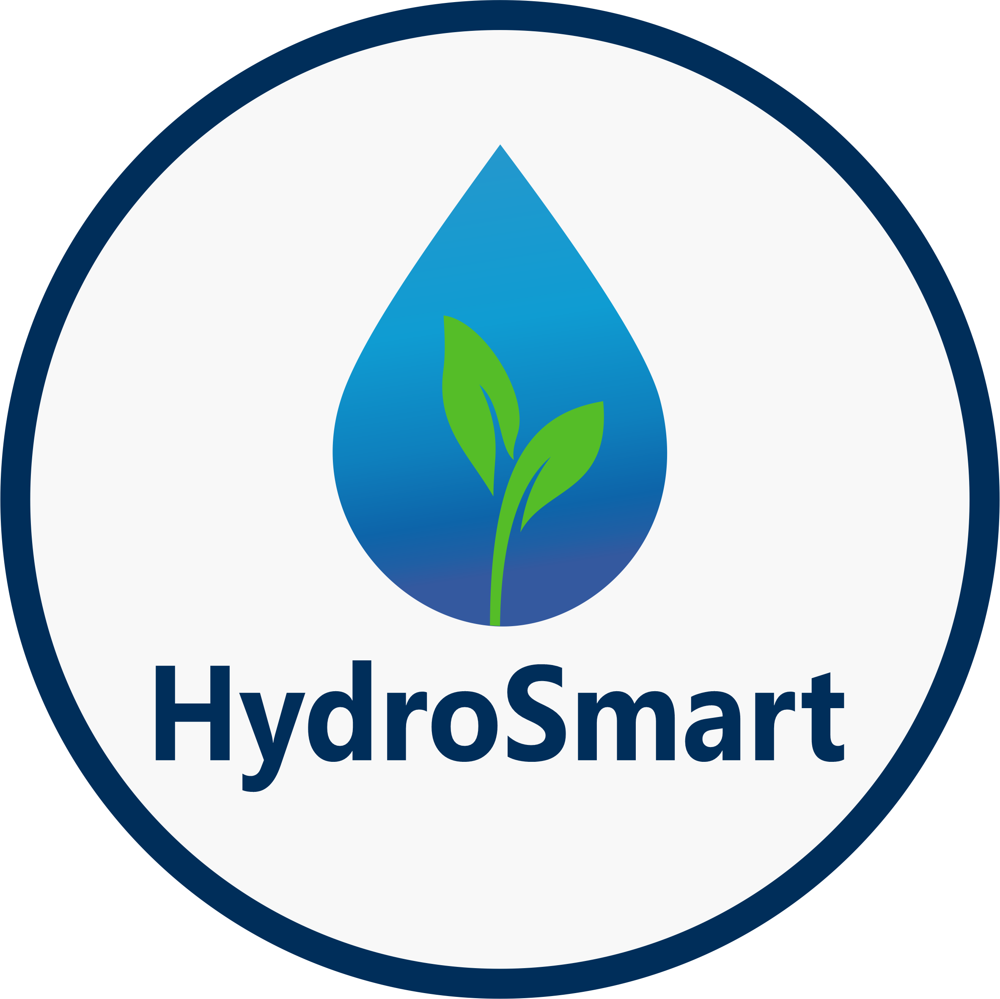
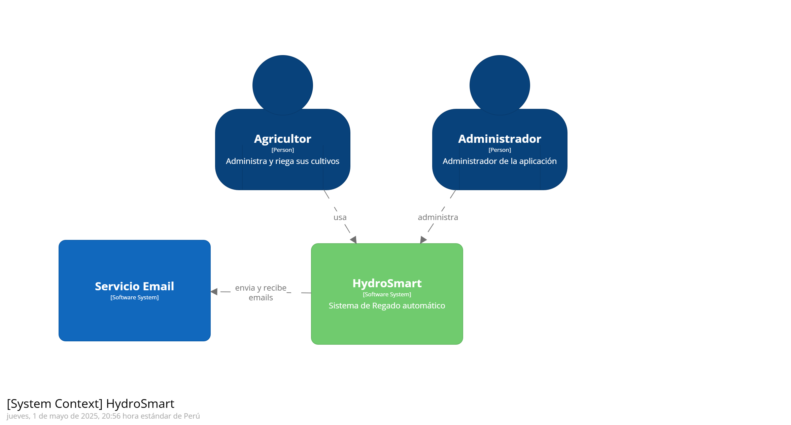

  

  <h1>Universidad Peruana de Ciencias Aplicadas</h1>
  
<strong>Carrera:</strong> Ingeniería de Software

  
<strong>Ciclo:</strong> 2025 - 10

  
<strong>Curso:</strong> Desarrollo de Soluciones IOT (1ASI0572)

  
<strong>Sección:</strong> 2942

  
<strong>Profesor:</strong> León Baca, Marco Antonio

  
<strong>"Informe de Trabajo Final"</strong>

  
<strong>Startup:</strong> IoT Solutions

  
<strong>Producto:</strong> HydroSmart

<table align="center">
  <tr>
    <th>Integrantes</th>
    <th>Código</th>
  </tr>
  <tr>
    <td>Delgado Corrales, Piero Gonzalo</td>
    <td>U202210749</td>
  </tr>
  <tr>
    <td>Neyra Santa Cruz, Marcelo Sebastian</td>
    <td>U202217241</td>
  </tr>
  <tr>
    <td>Paredes Puente, Sebastián Roberto</td>
    <td>U202217239</td>
  </tr>
  <tr>
    <td>Salinas Torres, Salvador Antonio</td>
    <td>U20221B127</td>
  </tr>
  <tr>
    <td>Soto Salis, Natanael David</td>
    <td>U20201C607</td>
  </tr>
</table>

<b>Abril 2025</b>

# Registro de versiones

<table>
  <thead>
    <tr>
        <th>Versión</th>
        <th>Fecha</th>
        <th>Autor</th>
        <th>Descripción de modificación</th>
    </tr>
  </thead>
  <tbody>
  <tr>
      <td><strong>TB1</strong></td>
      <td>08/04/2025</td>
      <td> <!--Agregar rowspan="num de entregas" en el futuro-->
        <ul>
          <li>Paredes Puente, Sebastian Roberto</li>
          <li>Delgado Corrales, Piero Gonzalo</li>
          <li>Salinas Torres, Salvador Antonio</li>
          <li>Neyra Santa Cruz, Marcelo Sebastian</li>
          <li>Soto Salis, Natanael David</li>
        </ul>
      </td>
      <td>
        Se han agregado los siguientes capítulos
        <ul>
          <li>Capítulo 1</li>
          <li>Capítulo 2</li>
          <li>Capítulo 3</li>
          <li>Capítulo 4</li>
        </ul>
      </td>
  </tr>
  <!--
  <tr>
      <td><strong>TP1</strong></td>
      <td>--/--/--</td>
      <td>
        <ul>
          <li>Paredes Puente, Sebastian Roberto</li>
          <li>Delgado Corrales, Piero Gonzalo</li>
          <li>Salinas Torres, Salvador Antonio</li>
          <li>ALUMNO X</li>
          <li>ALUMNO X</li>
        </ul>
      </td>
      <td>
        DESCRIPCION X
        <ul>
          <li>X</li>
          <li>X</li>
          <li>X</li>
        </ul>
      </td>
  </tr>
  <tr>
      <td><strong>TB2</strong></td>
      <td>--/--/--</td>
      <td>
        <ul>
          <li>Paredes Puente, Sebastian Roberto</li>
          <li>Delgado Corrales, Piero Gonzalo</li>
          <li>Salinas Torres, Salvador Antonio</li>
          <li>ALUMNO X</li>
          <li>ALUMNO X</li>
        </ul>
      </td>
      <td>
        DESCRIPCION X
        <ul>
          <li>X</li>
          <li>X</li>
          <li>X</li>
        </ul>
      </td>
  </tr>
  <tr>
      <td><strong>TF1</strong></td>
      <td>--/--/--</td>
      <td>
        <ul>
          <li>Paredes Puente, Sebastian Roberto</li>
          <li>Delgado Corrales, Piero Gonzalo</li>
          <li>Salinas Torres, Salvador Antonio</li>
          <li>ALUMNO X</li>
          <li>ALUMNO X</li>
        </ul>
      </td>
      <td>
        DESCRIPCION X
        <ul>
          <li>X</li>
          <li>X</li>
          <li>X</li>
        </ul>
      </td>
  </tr>
  -->
  </tbody>
</table>

# Project Report Collaboration Insights

### TB1
TBD

# Tabla de Contenidos

### [Registro de Versiones](#registro-de-versiones)  
### [Student Outcome](#student-outcome)  
### [Capítulo I: Introducción](#capítulo-i-introducción)  
- [1.1. Startup Profile](#11-startup-profile)  
  - [1.1.1. Descripción de la Startup](#111-descripción-de-la-startup)  
  - [1.1.2. Perfiles de integrantes del equipo](#112-perfiles-de-integrantes-del-equipo)  
- [1.2. Solution Profile](#12-solution-profile)  
  - [1.2.1. Antecedentes y problemática](#121-antecedentes-y-problemática)  
  - [1.2.2. Lean UX Process](#122-lean-ux-process)  
    - [1.2.2.1. Lean UX Problem Statements](#1221-lean-ux-problem-statements)  
    - [1.2.2.2. Lean UX Assumptions](#1222-lean-ux-assumptions)  
    - [1.2.2.3. Lean UX Hypothesis Statements](#1223-lean-ux-hypothesis-statements)  
    - [1.2.2.4. Lean UX Canvas](#1224-lean-ux-canvas)  
- [1.3. Segmentos objetivo](#13-segmentos-objetivo)  
### [Capítulo II: Requirements Elicitation & Analysis](#capítulo-ii-requirements-elicitation--analysis)  
- [2.1. Competidores](#21-competidores)  
  - [2.1.1. Análisis competitivo](#211-análisis-competitivo)  
  - [2.1.2. Estrategias y tácticas frente a competidores](#212-estrategias-y-tácticas-frente-a-competidores)  
- [2.2. Entrevistas](#22-entrevistas)  
  - [2.2.1. Diseño de entrevistas](#221-diseño-de-entrevistas)  
  - [2.2.2. Registro de entrevistas](#222-registro-de-entrevistas)  
  - [2.2.3. Análisis de entrevistas](#223-análisis-de-entrevistas)  
- [2.3. Needfinding](#23-needfinding)  
  - [2.3.1. User Personas](#231-user-personas)  
  - [2.3.2. User Task Matrix](#232-user-task-matrix)  
  - [2.3.3. User Journey Mapping](#233-user-journey-mapping)  
  - [2.3.4. Empathy Mapping](#234-empathy-mapping)  
  - [2.3.5. As-is Scenario Mapping](#235-as-is-scenario-mapping)  
- [2.4. Ubiquitous Language](#24-ubiquitous-language)  
### [Capítulo III: Requirements Specification](#capítulo-iii-requirements-specification)  
- [3.1. To-Be Scenario Mapping](#31-to-be-scenario-mapping)  
- [3.2. User Stories](#32-user-stories)  
- [3.3. Impact Mapping](#33-impact-mapping)  
- [3.4. Product Backlog](#34-product-backlog)  

### [Capítulo IV: Solution Software Design](#capítulo-iv-solution-software-design)  
- [4.1. Strategic-Level Domain-Driven Design](#41-strategic-level-domain-driven-design)  
  - [4.1.1. EventStorming](#411-eventstorming)  
    - [4.1.1.1. Candidate Context Discovery](#4111-candidate-context-discovery)  
    - [4.1.1.2. Domain Message Flows Modeling](#4112-domain-message-flows-modeling)  
    - [4.1.1.3. Bounded Context Canvases](#4113-bounded-context-canvases)  
  - [4.1.2. Context Mapping](#412-context-mapping)  
  - [4.1.3. Software Architecture](#413-software-architecture)  
    - [4.1.3.1. System Landscape Diagram](#4131-system-landscape-diagram)  
    - [4.1.3.2. Context Level Diagrams](#4132-context-level-diagrams)  
    - [4.1.3.3. Container Level Diagrams](#4133-container-level-diagrams)  
    - [4.1.3.4. Deployment Diagrams](#4134-deployment-diagrams)  
- [4.2. Tactical-Level Domain-Driven Design](#42-tactical-level-domain-driven-design)  
  - [4.2.X. Bounded Context: <Bounded Context Name>](#42x-bounded-context-bounded-context-name)  
    - [4.2.X.1. Domain Layer](#42x1-domain-layer)  
    - [4.2.X.2. Interface Layer](#42x2-interface-layer)  
    - [4.2.X.3. Application Layer](#42x3-application-layer)  
    - [4.2.X.4. Infrastructure Layer](#42x4-infrastructure-layer)  
    - [4.2.X.5. Component Level Diagrams](#42x5-component-level-diagrams)  
    - [4.2.X.6. Code Level Diagrams](#42x6-code-level-diagrams)  
      - [4.2.X.6.1. Domain Layer Class Diagrams](#42x61-domain-layer-class-diagrams)  
      - [4.2.X.6.2. Database Design Diagram](#42x62-database-design-diagram)  

### [Capítulo V: Solution UI/UX Design](#capítulo-v-solution-uiux-design)  
- [5.1. Style Guidelines](#51-style-guidelines)  
  - [5.1.1. General Style Guidelines](#511-general-style-guidelines)  
  - [5.1.2. Web, Mobile and IoT Style Guidelines](#512-web-mobile-and-iot-style-guidelines)  
- [5.2. Information Architecture](#52-information-architecture)  
  - [5.2.1. Organization Systems](#521-organization-systems)  
  - [5.2.2. Labeling Systems](#522-labeling-systems)  
  - [5.2.3. SEO Tags and Meta Tags](#523-seo-tags-and-meta-tags)  
  - [5.2.4. Searching Systems](#524-searching-systems)  
  - [5.2.5. Navigation Systems](#525-navigation-systems)  
- [5.3. Landing Page UI Design](#53-landing-page-ui-design)  
  - [5.3.1. Landing Page Wireframe](#531-landing-page-wireframe)  
  - [5.3.2. Landing Page Mock-up](#532-landing-page-mock-up)  
- [5.4. Applications UX/UI Design](#54-applications-uxui-design)  
  - [5.4.1. Applications Wireframes](#541-applications-wireframes)  
  - [5.4.2. Applications Wireflow Diagrams](#542-applications-wireflow-diagrams)  
  - [5.4.3. Applications Mock-ups](#543-applications-mock-ups)  
  - [5.4.4. Applications User Flow Diagrams](#544-applications-user-flow-diagrams)  
- [5.5. Applications Prototyping](#55-applications-prototyping)  

### [Capítulo VI: Product Implementation, Validation & Deployment](#capítulo-vi-product-implementation-validation--deployment)  
- [6.1. Software Configuration Management](#61-software-configuration-management)  
  - [6.1.1. Development Environment Configuration](#611-development-environment-configuration)  
  - [6.1.2. Source Code Management](#612-source-code-management)  
  - [6.1.3. Style Guide & Conventions](#613-style-guide--conventions)  
  - [6.1.4. Deployment Configuration](#614-deployment-configuration)  
- [6.2. Implementation](#62-implementation)  
  - [6.2.X. Sprint n](#62x-sprint-n)  
    - [6.2.X.1. Sprint Planning n](#62x1-sprint-planning-n)  
    - [6.2.X.2. Aspect Leaders and Collaborators](#62x2-aspect-leaders-and-collaborators)  
    - [6.2.X.3. Sprint Backlog n](#62x3-sprint-backlog-n)  
    - [6.2.X.4. Development Evidence](#62x4-development-evidence)  
    - [6.2.X.5. Testing Suite Evidence](#62x5-testing-suite-evidence)  
    - [6.2.X.6. Execution Evidence](#62x6-execution-evidence)  
    - [6.2.X.7. Services Documentation](#62x7-services-documentation)  
    - [6.2.X.8. Deployment Evidence](#62x8-deployment-evidence)  
    - [6.2.X.9. Collaboration Insights](#62x9-collaboration-insights)  
- [6.3. Validation Interviews](#63-validation-interviews)  
  - [6.3.1. Diseño de Entrevistas](#631-diseño-de-entrevistas)  
  - [6.3.2. Registro de Entrevistas](#632-registro-de-entrevistas)  
  - [6.3.3. Evaluaciones según heurísticas](#633-evaluaciones-según-heurísticas)  
- [6.4. Video About-the-Product](#64-video-about-the-product)  

### [7. Conclusiones y Recomendaciones](#conclusiones-y-recomendaciones)  
### [8. Video About-the-Team](#video-about-the-team)  
### [9. Bibliografía](#bibliografía)  
### [10. Anexos](#anexos)

# Student Outcome
> **ABET – EAC - Student Outcome 5** La capacidad de funcionar efectivamente en un equipo cuyos miembros juntos proporcionan liderazgo, crean un entorno de colaboración e inclusivo, establecen objetivos, planifican tareas y cumplen objetivos.

<table>
  <thead>
    <tr>
      <th><strong>Criterio específico</strong></th>
      <th><strong>Acciones realizadas</strong></th>
      <th><strong>Conclusiones</strong></th>
    </tr>
  </thead>
  <tbody>
    <tr>
      <td>criterio 1 (WIP)</td>
      <td>
        
<strong>Paredes Puente, Sebastian Roberto</strong>

        
Acciones

      </td>
      <td>Conclusiones generales</td>
    </tr>
  </tbody>
</table>

# Capítulo 1: Presentación

## 1.1. Startup Profile

### 1.1.1. Descripción de la Startup

Somos el grupo IOT Solutions, una startup especializada en enfrentar los desafíos del riego agrícola. Para ello, el equipo ha desarrollado la aplicación **HydroSmart** con la tecnología de Internet de las Cosas. Con la aplicación, los usuarios podrán optimizar el uso del agua a través de sensores de humedad y sistemas de riego automatizados, facilitando así la gestión eficiente y sostenible de sus cultivos.
<!-- Cambiar a este si no les gusta el cambio. Borrar, de lo contrario
Nuestra startup se llama IoT Solutions y se especializa en enfrentar los desafíos del riego agrícola mediante nuestra solución inteligente HydroSmart. Nos enfocamos en optimizar el uso del agua a través de sensores de humedad y sistemas de riego automatizados, facilitando una gestión eficiente y sostenible de los cultivos.
-->
**Misión**: Brindar a los agricultores una herramienta accesible e inteligente para optimizar el uso del agua en sus cultivos, promoviendo una agricultura más sostenible, eficiente y rentable.

**Visión**: Ser líderes en innovación tecnológica para el riego agrícola, contribuyendo al desarrollo sostenible de la agricultura mediante soluciones basadas en IoT.

### 1.1.2. Perfiles de integrantes del equipo

<table>
  <th colspan="2">Delgado Corrales, Piero Gonzalo</th>
  <tr>
    <td>
    
    </td>
    <td>
      

        Soy estudiante del séptimo ciclo de Ingeniería de Software. Tengo conocimientos en diseño web utilizando HTML, CSS. Además, utilizo herramientas como Figma para la creación de prototipos. Asimismo, he aprendido a trabajar con frameworks para frontend (Vue, Angular y React) y backend (Spring Boot, .NET y Django).  
        Soy una persona responsable y me esfuerzo por mantener una organización óptima para gestionar mi tiempo de forma eficiente.
      

    </td>
  </tr>
  <th colspan="2">Neyra Santa Cruz, Marcelo Sebastian</th>
  <tr>
    <td>
    
    </td>
    <td>
      

        Mi nombre es Marcelo Sebastian Neyra Santa Cruz, Actualmente estudio la carrera de ingeniería de software en la  UPC. Entre mis habilidades, podemos destacar el buen uso de tecnologías web y móviles. Me considero como una persona perseverante, trabajadora y amable.
      

    </td>
  </tr>
  <th colspan="2">Salinas Torres, Salvador Antonio</th>
  <tr>
    <td>
    
    </td>
    <td>
      

        Soy Salvador y actualmente curso el séptimo ciclo de la carrera de Ingeniería de Software. Poseo conocimientos en: programación orientada a objetos en C++, Python, C# y Java; desarrollo de Frontend Web con frameworks de Angular y Vue; desarrollo de backend con frameworks de Spring Boot y .NET; desarrollo móvil con Kotlin y Dart; gestión de base de datos en SQL Server, MySQL y SQLite. Considero que soy una persona responsable y siempre organizo el tiempo para hacerlos tranquilamente antes de la fecha de entrega.
      

    </td>
  </tr>
  <th colspan="2">Paredes Puente, Sebastian Roberto</th>
  <tr>
    <td>
    
    </td>
    <td>
      

        Soy Sebastian, estudiante del séptimo ciclo de Ingeniería de Software. A lo largo de mi formación he adquirido experiencia trabajando con diversos lenguajes como C++, Python, C# y Java, aplicando principios de programación orientada a objetos. Además, he desarrollado proyectos web utilizando Angular y Vue para el frontend, y he implementado servicios backend con Spring Boot y .NET. También he explorado el desarrollo móvil con Kotlin y Dart, y tengo manejo de bases de datos como SQL Server, MySQL y SQLite. 
      

    </td>
  </tr>
  <th colspan="2">Soto Salis, Natanael David</th>
  <tr>
    <td>
    
    </td>
    <td>
      

        Descripción básica de Natanael
      

    </td>
  </tr>
</table>

## 1.2. Solution Profile

### 1.2.1 Antecedentes y problemática

La gestión ineficiente del agua en el riego agrícola representa un desafío crítico para la sostenibilidad y productividad del sector. Muchos agricultores aún dependen de métodos manuales o tradicionales, lo que genera un uso excesivo o insuficiente del agua, afectando tanto al rendimiento de los cultivos como al medio ambiente.

**5 W's**

**What:** El riego agrícola enfrenta desafíos significativos debido al uso ineficiente del agua, la falta de automatización en los procesos y la limitada capacidad para adaptar los sistemas a condiciones climáticas cambiantes. Esto provoca un manejo inapropiado del recurso hídrico, que impacta negativamente tanto en el rendimiento de los cultivos como en el medio ambiente.

**Where:** La solución se implementará en zonas agrícolas del Perú, especialmente en regiones con alta actividad agrícola y limitaciones hídricas, donde la eficiencia en el riego es crucial para la productividad.

**When:** Actualmente, el cambio climático y la escasez de agua están afectando la producción agrícola. La necesidad de soluciones inteligentes como HydroSmart es urgente para enfrentar estos problemas en el corto y largo plazo.

**Who:** Los principales beneficiarios son los agricultores, quienes podrán automatizar sus procesos de riego, reducir el desperdicio de agua y aumentar la productividad. También se benefician cooperativas y comunidades agrícolas que buscan soluciones sostenibles a gran escala.

**Why:** La ineficiencia en el uso del agua en la agricultura peruana limita la productividad y sostenibilidad del sector, especialmente en zonas con estrés hídrico. Debido a esto, la implementación de sistemas de riego inteligente se vuelve crucial ya que permite optimizar el uso del recurso hídrico, garantizando una distribución adecuada que favorezca el crecimiento de los cultivos sin comprometer los recursos naturales.

**2 H's**

**How:** A través de HydroSmart, se instalarán sensores de humedad en el suelo conectados a un sistema automatizado de riego. El sistema analiza en tiempo real las condiciones del cultivo y activa el riego solo cuando es necesario, asegurando un uso óptimo del recurso hídrico.

**How much:** Según la Escuela de Gestión Pública de la Universidad del Pacífico (2022) el sector agropecuario absorbe la mayor cantidad de fuerza laboral en la economía peruana, representando el 27.5% de la población activa  en 2021. Esta cifra resalta la importancia de abordar los desafíos del sector, como la ineficiencia en el uso del agua, para mejorar la productividad y el bienestar de millones de trabajadores agrícolas.

### 1.2.2 Lean UX Process
#### 1.2.2.1. Lean UX Problem Statements

**Problem Statement 1**

La escasez de recursos hídricos y el uso ineficiente del agua en la agricultura son problemas comunes que enfrentan los agricultores, lo que genera en ocasiones costos elevados como una escasa rentabilidad en sus cultivos. Las técnicas de riego tradicionales no son suficientemente efectivas, y los agricultores tienen poca visibilidad sobre el estado de la humedad del suelo, lo que resulta en un uso excesivo de agua o un riego insuficiente.

<table> 
    <tr> 
      <td><strong>El producto tiene como objetivo optimizar el uso del agua en los cultivos agrícolas.</strong></td>
    </tr>
    <tr>
      <td>Hemos observado que los agricultores enfrentan grandes dificultades para gestionar el riego de sus cultivos, lo que afecta la eficiencia del uso del agua y su productividad general.</td>
    </tr>
    <tr>
      <td>¿Podría nuestro sistema HydroSmart ayudar a los agricultores a gestionar de manera más eficiente el uso del agua en sus cultivos y mejorar su productividad?</td>
    </tr> 
</table>

**Problem Statement 2**

En muchos casos, los agricultores carecen de tecnología que les brinde información precisa y en tiempo real sobre las condiciones de sus cultivos, lo que dificulta la toma de decisiones informadas sobre el riego y el cuidado del suelo.

<table>
  <tr>
    <td><strong>El producto tiene como objetivo proporcionar datos en tiempo real sobre la humedad del suelo para optimizar el riego.</strong></td>
  </tr>
  <tr>
    <td>Hemos observado que los agricultores tienen dificultades para obtener datos precisos sobre la humedad del suelo y sus cultivos, lo que lleva a decisiones erróneas en cuanto al riego.</td>
  </tr>
  <tr>
    <td>¿Podría HydroSmart ofrecer datos precisos y fáciles de interpretar para que los agricultores optimicen el riego de manera más eficiente?</td>
  </tr>
</table>

**Problem Statement 3**

El riego automatizado es aún una práctica poco adoptada por los agricultores debido a su costo y complejidad. Muchos agricultores desconocen las tecnologías disponibles y cómo podrían implementarlas de forma rentable en sus cultivos.
<table>
  <tr>
    <td><strong>El producto tiene como objetivo facilitar la implementación de sistemas de riego automatizado accesibles y fáciles de usar.</strong></td>
  </tr>
  <tr>
    <td>Hemos observado que los agricultores desean adoptar soluciones automatizadas de riego, pero a menudo no tienen los conocimientos ni los recursos para hacerlo de manera rentable y sencilla.</td>
    </tr>
    <tr>
    <td>¿Podría HydroSmart ofrecer una solución de riego automatizado fácil de implementar y a un costo accesible para los agricultores?</td>
   </tr>
</table>
 

#### 1.2.2.2. Lean UX Assumptions

##### **User Assumptions**

**1. ¿Quién es el usuario?**

El usuario principal de HydroSmart son los agricultores, especialmente aquellos que carecen de experiencia en la implementación de tecnologías avanzadas de riego y gestión de cultivos. Nuestro sistema está dirigido a agricultores de pequeña y mediana escala que buscan optimizar el uso del agua y mejorar la productividad de sus cultivos de manera rentable.

**2. ¿Dónde encaja nuestro producto en su trabajo o vida?**

HydroSmart se integra en la vida diaria del agricultor proporcionando datos en tiempo real sobre la humedad del suelo y controlando el riego de forma automatizada. La plataforma se usa en campo, permitiendo a los agricultores tomar decisiones informadas sobre cuándo y cuánto regar, todo desde su teléfono móvil o dispositivo conectado.

**3. ¿Qué problemas tiene nuestro producto? ¿Resolver?**

Los agricultores enfrentan la falta de tecnologías accesibles y prácticas para gestionar eficientemente el riego y el uso del agua en sus cultivos. El uso ineficiente del agua no solo aumenta los costos operativos, sino que también impacta negativamente en la sostenibilidad de sus cultivos. HydroSmart busca resolver este problema brindando un sistema de riego automatizado basado en datos reales de humedad del suelo.

**4. ¿Cuándo y cómo es nuestro producto? ¿Usado?**

HydroSmart es utilizado principalmente durante las estaciones de crecimiento de los cultivos, cuando el monitoreo del riego es esencial para garantizar la salud de las plantas. Los agricultores lo usarán tanto en sus dispositivos móviles como en estaciones de control de riego en el campo, en tiempo real, para gestionar el riego de manera eficiente.

**5. ¿Qué características son importantes?**

- Sensores de humedad del suelo precisos y de bajo costo.
- Sistema de riego automatizado, que se activa de acuerdo con los datos recogidos.
- Interfaz fácil de usar para visualizar el estado de los cultivos y controlar el riego.
- Alerta de condiciones de riego deficientes o excesivos.

**6. ¿Cómo debe verse nuestro producto y cómo comportarse?**

HydroSmart debe tener una interfaz simple, clara y fácil de usar, ideal para agricultores con poca experiencia tecnológica. La aplicación debe ser intuitiva y rápida, mostrando los datos de manera visual y comprensible. Además, debe ser robusta, segura y capaz de manejar grandes volúmenes de datos sin fallos.

##### **Business Assumptions**
  1. **Creo que mis clientes necesitan** una solución que les permita gestionar de manera eficiente el uso del agua y optimizar el riego en sus cultivos, mejorando así la productividad y reduciendo costos.
  2. **Estas necesidades se pueden resolver con** el uso de sensores de humedad del suelo, un sistema de riego automatizado y una plataforma accesible que brinde recomendaciones basadas en datos precisos y en tiempo real.
  3. **Mis clientes iniciales son** agricultores de pequeña y mediana escala que buscan mejorar la eficiencia del uso del agua en sus cultivos, especialmente en áreas agrícolas de Perú.
  4. **El valor N.°1 que mi cliente quiere de mi servicio es** la mejora de la eficiencia en el uso del agua, la reducción de costos operativos y el aumento de la productividad de sus cultivos, adoptando prácticas sostenibles.
  5. **Mi cliente también puede obtener estos beneficios adicionales:** Una aplicación web y móvil que les permita adminisitrar el regado todos sus cultivos
  6. **Voy a adquirir la mayoría de mis clientes a través de** campañas de marketing digital dirigidas, demostraciones en ferias agrícolas, y asociaciones con cooperativas agrícolas locales que promuevan la adopción de tecnologías innovadoras.
  7. **Haré dinero a través de** la venta de suscripciones mensuales a nuestra plataforma HydroSmart.
  8. **Mi competencia principal en el mercado serán** otras soluciones tecnológicas para la agricultura como PRISMAB y Netafim Perú.
  9. **Los venceremos debido a que** la aplicación cuenta con una interfaz de usuario muy sencilla de utilizar, con una curva de aprendizaje mínima, por lo que todo tipo de usuario puede adquirirlo y usarlo sin ningún tipo de problemas
  10. **Mi mayor riesgo de producto es** la falta de confianza de los agricultores en la tecnología y la resistencia al cambio, ya que muchos están acostumbrados a métodos de riego tradicionales.
  11. **Resolveremos esto a través de** una estrategia educativa que incluya tutoriales fáciles de seguir, demostraciones prácticas y casos de éxito que demuestren el valor tangible de nuestra solución. Además, ofreceremos soporte técnico continuo.

<!--
Agregar como extra (?)
El cliente podría optar por abandonar el uso de HydroSmart si no ve mejoras significativas en la eficiencia del riego y en la productividad de sus cultivos durante los primeros meses de uso.

Nuestro enfoque principal es ayudar a los agricultores a optimizar el uso del agua y mejorar la eficiencia del riego mediante una solución sencilla, rentable y eficaz, enfocada en el cuidado y la sostenibilidad de los cultivos.
-->
#### 1.2.2.3. Lean UX Hypothesis Statements

##### Hypothesis Statement 1
Creemos que al proporcionar a los agricultores acceso a datos en tiempo real sobre la humedad del suelo y automatizar el proceso de riego, mejoraremos la eficiencia del uso del agua en los cultivos.

Sabremos que esto es cierto

Cuando se observe una reducción del 20% en el consumo de agua durante los primeros 6 meses de uso en los cultivos de los agricultores que implementen HydroSmart.

---

##### Hypothesis Statement 2
Creemos que al ofrecer un sistema de riego automatizado accesible y fácil de usar, aumentaremos la adopción de la tecnología entre los agricultores de pequeña y mediana escala.

Sabremos que esto es cierto

Cuando el 30% de los agricultores que usan HydroSmart durante los primeros 3 meses adopten el sistema de riego automatizado

---

##### Hypothesis Statement 3
Creemos que al permitir a los agricultores tomar decisiones informadas sobre el riego, se aumentará la productividad y rentabilidad de sus cultivos.

Sabremos que esto es cierto

Cuando se observe un incremento del 15% en la productividad de los cultivos de los agricultores que utilicen HydroSmart durante los primeros 6 meses.

#### 1.2.2.4. Lean UX Canvas

## 1.3. Segmentos objetivo

##### Agricultores
Los agricultores en Perú enfrentan desafíos en la gestión del agua para el riego debido a la falta de tecnologías adecuadas y prácticas sostenibles, lo que afecta la productividad y rentabilidad. HydroSmart les ofrecerá una solución para optimizar su uso del agua promoviendo una agricultura más eficiente y sostenible.

|**Segmento objetivo**|Agricultores|
| :- | :- |
|**Edad**|25-55 años|
|**Ubicación**|Perú|
|**Sexo**|Masculino y Femenino|
|**Formación educativa**|Primaria, Secundaria o Técnico|
|**Poder adquisitivo**|Bajo y medio|

# Capítulo II: Requirements Elicitation & Analysis

## 2.1. Competidores

### 2.1.1. Análisis competitivo

<table>
   <tr>
      <th colspan="6" valign="top"><b>Competitive Analysis Landscape</b></th>
   </tr>
   <tr>
      <td rowspan="2" valign="top">¿Por qué llevar a cabo este análisis? </td>
     <td colspan="5" valign="top">
      <ul>
        <li>Objetivo 1: Obtener información sobre las ofertas de nuestros competidores y aprender de las áreas en las que tienen limitaciones.</li>
        <li>Objetivo 2: Reconocer las fortalezas y debilidades de nuestros competidores para desarrollar una estrategia competitiva robusta y eficaz.</li>
      </ul>
     </td>
   </tr>
   <tr></tr>
   <tr>
      <td colspan="2" valign="top">(En la cabecera colocar por cada competidor nombre y logo)</td>
      <td valign="top">
         
HydroSmart

         

      </td>
      <td valign="top">
         
CropX

         

      </td>
      <td valign="top">
         
AgriWebb

         

      </td>
      <td valign="top">
         
DigiFarmz

         

      </td>
   </tr>
   <tr>
      <td rowspan="2">Perfil</td>
      <td valign="top">Overview</td>
      <td valign="top"><b>HydroSmart</b> es una solución que tiene como propósito optimizar el uso de agua en el riego de los cultivos utilizando sistemas de riego y sensores de humedad eficaces.</td>
      <td valign="top"><b>CropX</b> es un sistema de gestión agrícola que recopila y analiza datos para ayudar a los agricultores a administrar sus cultivos.</td>
      <td valign="top"><b>AgriWebb</b> es una plataforma que ofrece una solución integral para ayudar a los agricultores a registrar datos de forma segura para decisiones agrícolas y fines de auditoría.</td>
      <td valign="top"><b>DigiFarmz</b> es una plataforma que viene a ayudar en los trabajos de técnicos y productores para maximizar los rendimientos, con el manejo eficiente de las enfermedades en el cultivo de soja.</td>
   </tr>
   <tr>
      <td valign="top">
         
Ventaja competitiva

         
¿Qué valor ofrece a los clientes?

      </td>
      <td valign="top">Integración simple y económica para pequeños agricultores.</td>
      <td valign="top">Análisis avanzado del suelo y recomendaciones</td>
      <td valign="top">Fuerte enfoque en la trazabilidad y la capacidad de capturar datos en tiempo real</td>
      <td valign="top">Recomendaciones agronómicas en tiempo real</td>
   </tr>
   <tr>
      <td rowspan="2">Perfil de Marketing</td>
      <td valign="top">Mercado objetivo</td>
      <td valign="top">Pequeños y medianos agricultores en Perú</td>
      <td valign="top">Productores medianos y grandes a nivel global</td>
      <td valign="top">Productores agropecuarios, sobre todo en Australia</td>
      <td valign="top">Agricultores en Latinoamérica, especialmente Brasil</td>
   </tr>
   <tr>
      <td valign="top">Estrategias de marketing</td>
      <td valign="top">Marketing digital, colaboraciones con asociaciones agrícolas</td>
      <td valign="top">Presencia global, partners agrícolas</td>
      <td valign="top">Promoción digital y alianzas con universidades</td>
      <td valign="top">Redes sociales, asociaciones con institutos técnicos</td>
   </tr>
   <tr>
      <td rowspan="3">Perfil de Producto</td>
      <td valign="top">Productos & Servicios</td>
      <td valign="top">Sensores de humedad, control de riego inteligente, y aplicación web/móvil para tener control sobre estos.</td>
      <td valign="top">Sensores, dashboard en la nube, app móvil</td>
      <td valign="top">App de gestión, integración de datos y sensores</td>
      <td valign="top">Recomendaciones de cultivo con base en clima y suelo</td>
   </tr>
   <tr>
      <td valign="top">Precios & Costos</td>
      <td valign="top">Bajo costo, modelo SaaS mensual</td>
      <td valign="top">Planes de suscripción, precios altos</td>
      <td valign="top">Suscripción mensual, depende del tamaño de la finca</td>
      <td valign="top">Freemium + suscripción mensual accesible</td>
   </tr>
   <tr>
      <td valign="top">Canales de distribución (Web y/o Móvil)</td>
      <td valign="top">App móvil y app web</td>
      <td valign="top">Web y app, integración con ERPs</td>
      <td valign="top">Web, app móvil y plataforma online</td>
      <td valign="top">Web, app móvil, redes sociales</td>
   </tr>
   <tr>
      <td rowspan="5">Análisis SWOT</td>
      <td colspan="5" valign="top">Realice esto para su startup y sus competidores. Sus fortalezas deberían apoyar sus oportunidades y contribuir a lo que ustedes definen como su posible ventaja competitiva. </td>
   </tr>
   <tr>
      <td valign="top">
         
Fortalezas

         

      </td>
      <td valign="top">
        Simple, accesible, centrado en usuarios rurales
      </td>
      <td valign="top">
        Precisión científica, soporte global
      </td>
      <td valign="top">
        Completa gestión de finca con enfoque práctico
      </td>
      <td valign="top">
        Rápida adaptación a condiciones regionales
      </td>
   </tr>
   <tr>
      <td valign="top">Debilidades</td>
      <td valign="top">
        Menor madurez tecnológica, recién ingresando al mercado
      </td>
      <td valign="top">
        Costoso, complejo de implementar
      </td>
      <td valign="top">
        Costoso para pequeñas fincas, poca especialización en agricultura no ganadera
      </td>
      <td valign="top">
        Está muy limitado fuera de Brasil
      </td>
   </tr>
   <tr>
      <td valign="top">Oportunidades</td>
      <td valign="top">
        Alta demanda de soluciones accesibles y simples
      </td>
      <td valign="top">
        Expansión a mercados emergentes
      </td>
      <td valign="top">
        Adaptación a otros cultivos y regiones
      </td>
      <td valign="top">
        Escalar hacia otros países de LatAm
      </td>
   </tr>
   <tr>
      <td valign="top">Amenazas</td>
      <td valign="top">
        Competencia de plataformas más establecidas o especializadas en áreas específicas
      </td>
      <td valign="top">
        Competencia de startups más ágiles
      </td>
      <td valign="top">
        Cambios en regulaciones o tecnologías
      </td>
      <td valign="top">
        Competidores con mayor inversión y tecnologías más avanzadas
      </td>
   </tr>
</table>

### 2.1.2. Estrategias y tácticas frente a competidores

**Experiencia personalizada de soporte:** Ofrecer soporte por videollamada o visitas puntuales de técnicos aliados para ayudar en la instalación inicial. Esta táctica genera confianza, fideliza al cliente desde el inicio y reduce errores en el uso del sistema.

**Penetración de mercado en zonas rurales:** Promocionar el producto en radios rurales, ferias agrícolas locales y visitas técnicas, aprovechando medios accesibles para el público objetivo. De esta forma, también se puede generar confianza y credibilidad en la comunidad agrícola.

**Expansión de la Red de Colaboradores:** Formar alianzas con universidades y centros de investigación agrícola para desarrollar nuevos conocimientos y tecnologías. Estas colaboraciones permitirán el acceso a investigaciones avanzadas y tecnologías emergentes, lo que puede enriquecer la oferta de HydroSmart y fomentar la innovación.

**Mejora continua:** Siempre tener en cuenta las opiniones de los usuarios, y así obtener feedback, sugerencias y casos de éxito para alimentar el desarrollo del producto. Por otro lado, se puede analizar mensualmente las funcionalidades de los competidores y priorizar mejoras clave en base a lo que el usuario realmente valora.

## 2.2. Entrevistas

### 2.2.1. Diseño de entrevistas
Las entrevistas representan una estrategia de investigación que implica el intercambio de diálogo con el propósito de adquirir datos, empleando cuestionamientos específicos para explorar en profundidad el pensamiento y la visión de la persona objeto de estudio.

##### Segmento Objetivo: Agricultor
  1. En pocas palabras, ¿Cómo describiría su día a día como agricultor?
  2. ¿Con qué cultivos trabaja actualmente y en qué zona se ubica su terreno?
  3. ¿Cuáles son los principales problemas que enfrenta en el manejo del agua para sus cultivos?
  4. ¿Lleva usted un control sobre cuándo y cuánto riega sus cultivos?
  5. ¿Utiliza alguna herramienta o aplicación para manejar el control de sus cultivos?
  6. ¿Cuántas veces al día o a la semana suele regar sus cultivos? ¿Y en qué horarios normalmente lo hace?
  7. ¿Cree que gasta más agua de la que realmente necesita para regar sus cultivos?
  8. ¿Le parece que regar los cultivos es una tarea pesada o cansada? ¿Por qué?
  9. ¿Cree que la calidad del agua que usa para regar afecta a sus cultivos? ¿Por qué?
  10. Si existiera una aplicación que controle el sistema de riego por usted y le avise cuando se esté regando los cultivos, ¿estaría dispuesto a probarla?

### 2.2.2. Registro de entrevistas

**Entrevista 1**

**Entrevistador:** Salvador Salinas

**Entrevistado:** Anderson Gonza

**Edad:** 23 años

**Distrito:** Lurín

**Enlace a entrevista:** [Entrevista en Microsoft Stream](https://upcedupe-my.sharepoint.com/:v:/g/personal/u20221b127_upc_edu_pe/EfplQNX-V1hArtEGzQFt-3ABzYYTV6e37eDV4HN7HzpS2A?nav=eyJyZWZlcnJhbEluZm8iOnsicmVmZXJyYWxBcHAiOiJPbmVEcml2ZUZvckJ1c2luZXNzIiwicmVmZXJyYWxBcHBQbGF0Zm9ybSI6IldlYiIsInJlZmVycmFsTW9kZSI6InZpZXciLCJyZWZlcnJhbFZpZXciOiJNeUZpbGVzTGlua0NvcHkifX0&e=yWJug5)

**Resumen:** Anderson es un agricultor de 23 años que cultiva hortalizas junto a su padre en Lurín. Mencionó que uno de los problemas con el agua es la irregularidad en el suministro de agua del canal y la presión que a veces no alcanza. Comenta que es bastante problable que se utilice más agua de la necesaria al no tener un control sobre este. De esta forma, le gustaría contar con una herramienta que le ayude a optimizar el riego. Anderson está dispuesto a probar una aplicación que le facilite esta tarea.

**Entrevista 2**

**Entrevistador:** Sebastian Paredes

**Entrevistado:** Alessandra Chaupis

**Edad:** 20 años

**Distrito:** San Juan de Lurigancho

**Enlace a entrevista:** [Entrevista 2](https://youtu.be/gyszZzqHZyA)

**Resumen:** Alessandra, de 20 años, tiene un familiar que se dedica a la agricultura en una zona rural de la Sierra, donde cultiva papa, maíz y habas. Señala que uno de los principales problemas es el acceso irregular al agua y la falta de tecnología para un mejor aprovechamiento. Su familiar no lleva un control preciso del riego ni utiliza herramientas digitales, por lo que muchas veces termina usando más agua de la necesaria. El riego es una tarea física y demandante, especialmente por la necesidad de trasladar agua. Además, cree que la calidad del agua puede afectar directamente a los cultivos. Debido a estas dificultades, Alessandra considera que su familiar estaría muy interesado en probar una aplicación que ayude a automatizar y optimizar el sistema de riego, sobre todo ante los efectos del cambio climático y las sequías recientes.

### 2.2.3. Análisis de entrevistas

## 2.3. Needfinding

### 2.3.1. User Personas

### 2.3.2. User Task Matrix

### 2.3.3. User Journey Mapping

### 2.3.4. Empathy Mapping

### 2.3.5. As-is Scenario Mapping
Segmento objetivo: Agricultor
<table>
  <tr>
    <th>Fase</th>
    <th>Inicio del día</th>
    <th>Inspección general de los cultivos</th>
    <th>Regado de los cultivos</th>
    <th>Finalización e inspección del regado</th>
  </tr>
  <tr>
    <th>Doing</th>
    <td>
      <ul>
        <li>Me levanto a las 4:00 am</li>
        <li>Veo qué cultivos son los que revisaré y regaré hoy</li>
        <li>Me dirijo al campo para empezar mi día</li>
      </ul>
    </td>
    <td>
      <ul>
        <li>Reviso los cultivos que me tocaba inspeccionar hoy</li>
        <li>Me aseguro de no ver ninguna anormalidad aparente</li>
        <li>Verifico la calidad de la tierra</li>
      </ul>
    </td>
    <td>
      <ul>
        <li>Empiezo a regar los cultivos que tocaban hoy</li>
        <li>Hago lo mejor que puedo que a ningún cultivo le llegue muy poca a demasiada agua</li>
      </ul>
    </td>
    <td>
      <ul>
        <li>Termino de regar los cultivos</li>
        <li>Hago una verificación rápida de los cultivos</li>
        <li>Empiezo con mis otras actividades diarias</li>
      </ul>
    </td>
  </tr>
  <tr>
    <th>Thinking</th>
    <td>Un día más en el trabajo. A empezar otro día</td>
    <td>Tengo que asegurarme que los cultivos y la tierra se encuentren en buen estado. Si la tierra está muy seca, tendré que pasar más tiempo regando</td>
    <td>Tengo que tener cuidado con cuanto riego. Si me paso de agua, puedo arruinar una gran cantidad de mis cultivos</td>
    <td>Después de unas cuantas horas, puedo finalmente seguir con mis otras actividades. Espero no haber regado de más</td>
  </tr>
  <tr>
    <th>Feeling</th>
    <td>Normal. Espero que hoy sea un buen día para los cultivos</td>
    <td>Ligeramente ansioso. Si hay alguna anomalía, puede afectar mi rutina diaria y puede atrasarme algunas tareas</td>
    <td>Aburrido. Mientras riego manualmente los cultivos no puedo hacer mucho más</td>
    <td>Intranquilo. Aunque sé que tengo ya bastante experiencia regando los cultivos, uno nunca puede estar 100% seguro que lo haya hecho perfectamente</td>
  </tr>
</table>

## 2.4. Ubiquitous Language

| **Término (en inglés)**    | **Término (en español)**       | **Definición** |
|----------------------------|--------------------------------|----------------|
| **Farmer**                 | Agricultor                     | Persona que se dedica al cultivo de la tierra y al manejo de cultivos agrícolas. |
| **Irrigation**             | Riego                          | Proceso de aplicar agua a los cultivos de manera controlada para asegurar su crecimiento. |
| **Smart irrigation system**| Sistema de riego inteligente   | Tecnología que permite automatizar y optimizar el uso del agua en el riego agrícola, considerando factores climáticos y del suelo. |
| **Water efficiency**       | Eficiencia del agua            | Grado en que el uso del agua logra el máximo beneficio con el menor desperdicio posible. |
| **Crop yield**             | Rendimiento de cultivo         | Cantidad de producto agrícola cosechado por unidad de área sembrada. |
| **Water scarcity**         | Escasez de agua                | Situación en la que la disponibilidad de agua es insuficiente para satisfacer las demandas agrícolas y otras necesidades. |
| **Sustainable agriculture**| Agricultura sostenible         | Práctica agrícola que busca equilibrar la producción de alimentos con el cuidado del medio ambiente y los recursos naturales. |
| **Weather data**           | Datos climáticos               | Información relacionada al clima (temperatura, humedad, lluvia, etc.) usada para tomar decisiones en el riego. |
| **Soil moisture**          | Humedad del suelo              | Cantidad de agua presente en el suelo, relevante para determinar la necesidad de riego. |
| **Field**                  | Campo                          | Terreno destinado al cultivo de productos agrícolas. |
| **Agricultural productivity**| Productividad agrícola      | Relación entre la producción obtenida y los recursos utilizados en la actividad agrícola. |
| **Irrigation scheduling**  | Programación de riego          | Planificación del momento y duración del riego según las necesidades del cultivo y condiciones ambientales. |
| **Climate change**         | Cambio climático               | Alteraciones significativas y duraderas en los patrones del clima, que afectan la disponibilidad de agua y la producción agrícola. |

# Capítulo III: Requirements Specification

## 3.1. To-Be Scenario Mapping
Segmento objetivo: Agricultor
<table>
  <tr>
    <th>Fase</th>
    <th>Inicio del día</th>
    <th>Inspección general de los cultivos</th>
    <th>Regado de los cultivos</th>
    <th>Finalización e inspección del regado</th>
  </tr>
  <tr>
    <th>Doing</th>
    <td>
      <ul>
        <li>Me levanto a las 5:00 am</li>
        <li>Me dirijo al campo para empezar mi día</li>
      </ul>
    </td>
    <td>
      <ul>
        <li>Reviso la aplicación HydroSmart para ver qué cultivos serán los que serán regados hoy</li>
        <li>La aplicación me indica si es que hay alguna anormalidad relacionada con el agua</li>
        <li>Verifico la calidad de la tierra</li>
      </ul>
    </td>
    <td>
      <ul>
        <li>El sistema HydroSmart riega por mí los cultivos automáticamente</li>
        <li>Le doy un vistazo al sistema para verificar cuánta agua está utilizando para los cultivos</li>
        <li>Si considero que está utilizando mucha agua, lo detengo</li>
      </ul>
    </td>
    <td>
      <ul>
        <li>Los cultivos terminan de regarse automáticante</li>
        <li>Hago una verificación rápida de los cultivos</li>
        <li>Empiezo con mis otras actividades diarias</li>
      </ul>
    </td>
  </tr>
  <tr>
    <th>Thinking</th>
    <td>Un día más en el trabajo. A empezar otro día</td>
    <td>A través de la aplicación HydroSmart, puedo verificar si los cultivos y la tierra se encuentren en buen estado. Si existe algún problema, la aplicación me lo indicará</td>
    <td>Con la aplicación HydroSmart no me tengo que preocupar mucho del riego. Si algo llegara a fallar, solo lo detengo</td>
    <td>Dado que el sistema hace el regado por mí, no tuve que invertir mucho tiempo en esta etapa, por lo que puedo empezar más temprano mis otras actividades</td>
  </tr>
  <tr>
    <th>Feeling</th>
    <td>Normal. Espero que hoy sea un buen día para los cultivos</td>
    <td>Contento. El sistema simplifica considerablemente la etapa de riego. Si hay algún problema, la aplicación me lo indica</td>
    <td>Aliviado. Puedo realizar otras actividades mientras se están regando los cultivos</td>
    <td>Contento. Ahora que el riego ha terminado, puedo enfocarme al 100% en mis otras actividades</td>
  </tr>
</table>

## 3.2. User Stories

<table>
  <tr>
    <th>Epic ID</th>
    <th> Epic </th>
    <th> User Story ID </th>
    <th> User Story </th>
  </tr>
  <!--Epic 1-->
  <tr>
    <th rowspan="7"> EP01 </th>
    <th rowspan="7"> Landing Page </th>
    <td> US01 </td>
    <td> Implementación de Barra de navegación </td>
  </tr>
  <tr>
    <td> US02 </td>
    <td> Logo y Descripción de la empresa </td>
  </tr>
  <tr>
    <td> US03 </td>
    <td> Detalles y Servicios de la empresa </td>
  </tr>
  <tr>
    <td> US04 </td>
    <td> Clientes de la empresa </td>
  </tr>
  <tr>
    <td> US05 </td>
    <td> Acerca de nosotros </td>
  </tr>
  <tr>
    <td> US06 </td>
    <td> Implementación de un Footer </td>
  </tr>
  <tr>
    <td> US07 </td>
    <td> Traslación a la aplicación web </td>
  </tr>
  <!--Epic 2-->
  <tr>
    <th rowspan="7"> EP02 </th>
    <th rowspan="7"> Monitoreo de los cultivos </th>
    <td> US08 </td>
    <td> Verificación de humedad del suelo </td>
  </tr>
  <tr>
    <td>TS-US08</td>
    <td>Verificar humedad del suelo</td>
  </tr>
  <tr>
    <td> US09 </td>
    <td> Verificación de temperatura del suelo </td>
  </tr>
  <tr>
    <td>TS-US09</td>
    <td>Verificar temperatura del suelo</td>
  </tr>
  <tr>
    <td> US10 </td>
    <td> Acciones Recomendadas </td>
  </tr>
  <tr>
    <td> US11 </td>
    <td> Historial del cultivo </td>
  </tr>
  <tr>
    <td>TS-US11</td>
    <td>Mostrar historial del cultivo</td>
  </tr>
  <!--Epic 3-->
  <tr>
    <th rowspan="6"> EP03 </th>
    <th rowspan="6"> Sistema automático de riego </th>
    <td> US12 </td>
    <td> Interacción con el riego automático </td>
  </tr>
  <tr>
    <td>TS-US12</td>
    <td>Interactuar con el riego automático</td>
  </tr>
  <tr>
    <td> US13 </td>
    <td> Notificaciones de regado </td>
  </tr>
  <tr>
    <td>TS-US13</td>
    <td>Notificar el regado</td>
  </tr>
  <tr>
    <td> US14 </td>
    <td> Limites en el uso agua por cultivo</td>
  </tr>
  <tr>
    <td>TS-US14</td>
    <td>Limitar el uso de agua por cultivo</td>
  </tr>
  <!--Epic 4-->
  <tr>
    <th rowspan="4"> EP04 </th>
    <th rowspan="4"> Administración de Agua </th>
    <td> US15 </td>
    <td> Cantidad de agua disponible </td>
  </tr>
  <tr>
    <td>TS-US15</td>
    <td>Mostrar Cantidad de agua disponible</td>
  </tr>
  <tr>
    <td> US16 </td>
    <td> Historial de consumo de agua mensual </td>
  </tr>
  <tr>
    <td>TS-US16</td>
    <td>Mostrar historial de consumo de agua mensual</td>
  </tr>
  <!--Epic 5-->
  <tr>
    <th rowspan="14"> EP05 </th>
    <th rowspan="14"> Configuración del sistema </th>
    <td> US17 </td>
    <td> Apagar y Encender los Sistemas</td>
  </tr>
  <tr>
    <td> TS-US17 </td>
    <td> Apagar/Encender Sistemas </td>
  </tr>
  <tr>
    <td> US18 </td>
    <td> Verificación del estado del sistema de regado</td>
  </tr>
  <tr>
    <td> TS-US18 </td>
    <td> Verificar estado del sistema de regado </td>
  </tr>
  <tr>
    <td> US19 </td>
    <td> Verificación del estado del sensor de humedad </td>
  </tr>
  <tr>
    <td> TS-US19 </td>
    <td> Verificar estado del sensor de humedad </td>
  </tr>
  <tr>
    <td> US20 </td>
    <td> Verificación del estado del sensor de temperatura </td>
  </tr>
  <tr>
    <td> TS-US20 </td>
    <td> Verificar estado del sensor de temperatura </td>
  </tr>
  <tr>
    <td> US21 </td>
    <td> Verificación de la batería</td>
  </tr>
  <tr>
    <td> TS-US21 </td>
    <td> Verificar batería </td>
  </tr>
  <tr>
    <td> US22 </td>
    <td> Añadir un nuevo sistema de HydroSmart </td>
  </tr>
  <tr>
    <td> TS-US22 </td>
    <td> Agregar un nuevo sistema HydroSmart</td>
  </tr>
  <tr>
    <td> US23 </td>
    <td> Quitar un sistema de HydroSmart </td>
  </tr>
  <tr>
    <td> TS-US23 </td>
    <td> Eliminar un sistema HydroSmart</td>
  </tr>
  <!--Epic 6-->
  <tr>
    <th rowspan="4"> EP06 </th>
    <th rowspan="4"> Autenticación de Usuarios </th>
    <td> US24 </td>
    <td> Registro de usuarios </td>
  </tr>
  <tr>
    <td> TS-US24 </td>
    <td> Registar usuario</td>
  </tr>
  <tr>
    <td> US25 </td>
    <td> Acceso de Usuarios </td>
  </tr>
  <tr>
    <td> TS-US25 </td>
    <td> Acceso a usuario </td>
  </tr>
  <!--Epic 7-->
  <tr>
    <th rowspan="4"> EP07 </th>
    <th rowspan="4"> Administración de Contraseña de Usuarios </th>
    <td> US26 </td>
    <td> Actualización de contraseña </td>
  </tr>
  <tr>
    <td> TS-US26 </td>
    <td> Actualizar contraseña</td>
  </tr>
  <tr>
    <td> US27 </td>
    <td> Recuperación de contraseña </td>
  </tr>
  <tr>
    <td> TS-US27 </td>
    <td> Recuperar de contraseña</td>
  </tr>
</table>

<table>
  <tr>
    <th> Epic / Story ID </th>
    <th> Título </th>
    <th> Descripción </th>
    <th> Criterios de Aceptación </th>
    <th> Relacionado con (Epic ID) </th>
  </tr>
  <tr>
    <td colspan="5">
      <h5 style="text-align: center">EPIC 1: LANDING PAGE</h5>
      

        Como visitante, quiero contar con una landing page para visualizar todas las funcionalidades que tiene la aplicación móvil que ofrece la empresa
      

    </td>
  </tr>
  <tr>
    <th>EP01 / US01</th>
    <th>Implementación de Barra de navegación</th>
    <td>
      
 Como visitante 

      
 Quiero tener la opción de atravesar todas las secciones de la landing page a través de una barra de navegación 

      
 Para facilitar el acceso a la información 

    </td>
    <td>
      <h5>Escenario 1: Traslado de una sección a otra</h5>
        
 Dado que el usuario se encuentra en la landing page 

        
 Cuando el usuario seleccione una de las secciones de la barra de navegación 

        
 Entonces se trasladará a la sección seleccionada 

      <h5>Escenario 2: Selección de la misma sección de la landing page</h5>
        
 Dado que el usuario se encuentra en una sección específica de la landing page 

        
 Cuando el usuario seleccione la misma sección en la barra de navegación 

        
 Entonces la pantalla no se moverá a otra sección diferente 

    </td>
    <td>EP01</td>
    </tr>
  <tr>
    <th>EP01 / US02</th>
    <th> Logo y Descripción de la empresa </th>
    <td>
      
 Como visitante 

      
 Quiero visualizar el logo y descripción de la empresa 

      
 Para verificar que estoy en la landing page oficial de la empresa 

    </td>
    <td>
      <h5> Escenario 1: Visualización del Logo </h5>
        
 Dado que el usuario se encuentra en la landing page 

        
 Cuando el usuario seleccione “Inicio” en la barra de navegación 

        
 Entonces se trasladará al usuario a la sección del logo y descripción de la empresa 

      <h5>Escenario 2: El logo no aparece</h5>
        
 Dado que el usuario se encuentra en una sección específica de la landing page 

        
 Cuando el usuario seleccione “Inicio” en la barra de navegación 

        
 Y el logo de la empresa no haya cargado 

        
 Entonces se trasladará al usuario a la sección del logo y descripción de la empresa 

        
 Y aparecerá solo la descripción 

    </td>
    <td>EP01</td>
  </tr>
  <tr>
    <th>EP01 / US03</th>
    <th>Detalles y Servicios de la empresa</th>
    <td>
      
 Como visitante 

      
 Quiero visualizar los detalles y servicios de la empresa 

      
 Para conocer de qué manera se puede utilizar la aplicación 

    </td>
    <td>
      <h5>Escenario 1: Traslado a la sección servicios</h5>
        
 Dado que el usuario se encuentra en la landing page 

        
 Cuando el usuario seleccione “Servicios” en la barra de navegación 

        
 Entonces se trasladará al usuario a la sección de detalles de servicios 

      <h5>Escenario 2: El usuario ya se encuentra en la sección servicios</h5>
        
 Dado que el usuario se encuentra en la sección “servicios” 

        
 Cuando el usuario seleccione “Servicios” en la barra de navegación 

        
 Entonces el sistema mantendrá al usuario en la sección seleccionada 

    </td>
    <td>EP01</td>
  </tr>
  <tr>
    <th>EP01 / US04</th>
    <th>Clientes de la empresa</th>
    <td>
      
 Como visitante 

      
 Quiero visualizar las experiencias de clientes previos de la empresa 

      
 Para es que la vida de los usuarios cambió al utilizar la aplicación 

    </td>
    <td>
      <h5>Escenario 1: Traslado a la sección clientes</h5>
        
 Dado que el usuario se encuentra en la landing page 

        
 Cuando el usuario seleccione “Clientes” en la barra de navegación 

        
 Entonces se trasladará al usuario a la sección de experiencia de clientes 

      <h5>Escenario 2: El usuario ya se encuentra en la sección clientes</h5>
        
 Dado que el usuario se encuentra en la sección “clientes” 

        
 Cuando el usuario seleccione “Clientes” en la barra de navegación 

        
 Entonces el sistema mantendrá al usuario en la sección seleccionada 

    </td>
    <td>EP01</td>
  </tr>
  <tr>
    <th>EP01 / US05</th>
    <th>Acerca de nosotros</th>
    <td>
      
 Como visitante 

      
 Quiero visualizar la misión y visión de la empresa 

      
 Para conocer qué planes tienen a futuro 

    </td>
    <td>
      <h5>Escenario 1: Traslado a la sección Nosotros</h5>
        
 Dado que el usuario se encuentra en la landing page 

        
 Cuando el usuario seleccione “Acerca de Nosotros” en la barra de navegación 

        
 Entonces se trasladará al usuario a la sección de experiencia de clientes 

      <h5>Escenario 2: El usuario ya se encuentra en la sección nosotros</h5>
        
 Dado que el usuario se encuentra en la sección “Nosotros” 

        
 Cuando el usuario seleccione “Acerca de Nosotros” en la barra de navegación 

        
 Entonces el sistema mantendrá al usuario en la sección seleccionada 

    </td>
    <td>EP01</td>
  </tr>
  <tr>
    <th>EP01 / US06</th>
    <th>Implementación de un Footer</th>
    <td>
      
 Como visitante 

      
 Quiero visualizar un Footer al final de la página 

      
 Para ver las redes sociales asociadas a la empresa 

    </td>
    <td>
      <h5>Escenario 1: Traslado a la sección de footer</h5>
        
 Dado que el usuario se encuentra en la landing page 

        
 Cuando el usuario se dirija al final de la landing page 

        
 Entonces el usuario visualizará las redes sociales asociadas a la empresa 

      <h5>Escenario 2: Traslado al usuario de la red social seleccionada</h5>
        
 Dado que el usuario se encuentra en el footer 

        
 Cuando el usuario seleccione una de íconos de las redes sociales que aparecen la sección del footer 

        
 Entonces el sistema redirigirá al usuario a la red social indicada 

      </td>
    <td>EP01</td>
  </tr>
  <tr>
    <th>EP01 / US07</th>  
    <th>Translación a la aplicación web</th>
    <td>
      
 Como visitante 

      
 Quiero contar con un botón que me redirija a la aplicación web 

      
 Para tener un acceso directo y rápido a ella 

    </td>
    <td>
      <h5>Escenario 1: Traslado a la aplicación web</h5>
        
 Dado que el usuario se encuentra en la landing page 

        
 Cuando el dé click en el botón "Abrir App" 

        
 Entonces el sistema redirigirá al usuario a la aplicación web 

      <h5>Escenario 2: Aplicación actualmente en mantenimiento</h5>
        
 Dado que el usuario se encuentra en la landing page 

        
 Cuando el dé click en el botón "Abrir App" 

        
 Y lo servicios de la aplicación web estén actualmente en mantenimiento 

        
 Entonces aparecerá un mensaje, indicando que actualmente la aplicación web está en mantenimiento 

    </td>
    <td>EP01</td>
  </tr>
  <!--EPIC 2-->
  <tr>
    <td colspan="5">
      <h5 style="text-align: center">EPIC 2: Monitoreo de Cultivos</h5>
      

        Como agricultor, quiero contar con una interfaz que me indique el estado de los cultivos para facilitar la administración de estos
      

    </td>
  </tr>
  <tr>
    <th>EP02 / US08</th>
    <th>Verificación de la humedad del suelo</th>
    <td>
      
 Como agricultor 

      
 Quiero contar con indicador de la humedad del suelo de cada uno de mis cultivos 

      
 Para asegurarme que cada uno de los suelos esté en el estado correcto para no arruinar los cultivos 

    </td>
    <td>
      <h5>Escenario 1: Suelo con humedad dentro de los parámetros normales</h5>
        
Dado que el agricultor se encuentra en la página "Detalles del suelo"

        
Cuando el agricultor quiera visualizar la humedad del suelo

        
Y la humedad del suelo esté dentro de los parámetros aceptables

        
Entonces se podrán ver los datos importantes del suelo

        
Y en la parte inferior aparecerá un mensaje, indicando que el suelo se encuentra con la humedad favorable

      <h5>Escenario 2: Suelo con humedad ligeramente fuera de los parámetros normales</h5>
        
Dado que el agricultor se encuentra en la página "Detalles del suelo"

        
Cuando el agricultor quiera visualizar la humedad del suelo

        
Y la humedad del suelo esté ligeramente fuera de los parámetros aceptables

        
Entonces se podrán ver los datos importantes del suelo

        
Y en la parte inferior aparecerá un mensaje de precaución, indicando que el suelo no se encuentra en un estado aceptable y que requiere atención

      <h5>Escenario 3: Suelo con humedad fuera de los parámetros normales</h5>
        
Dado que el agricultor se encuentra en la página "Detalles del suelo"

        
Cuando el agricultor quiera visualizar la humedad del suelo

        
Y la humedad del suelo esté muy por fuera de los parámetros aceptables

        
Entonces aparecerá un mensaje de peligro, indicando que el suelo necesita atención urgente y que se pueden hechar a perder los cultivos

        
Y en la parte inferior se encontrarán los datos del cultivo

      <h5>Escenario 4: Suelo inundado</h5>
        
Dado que el agricultor se encuentra en la página "Detalles del suelo"

        
Cuando el agricultor quiera visualizar la humedad del suelo

        
Y el suelo se encuentra inundado

        
Entonces aparecerá un mensaje, indicando que el suelo se encuentra en una situación no favorable

        
Y en la parte inferior se encontrarán los datos del cultivo

        
Y aparecerá el botón "Acciones recomendadas"

      <h5>Escenario 5: Suelo seco</h5>
        
Dado que el agricultor se encuentra en la página "Detalles del suelo"

        
Cuando el agricultor quiera visualizar la humedad del suelo

        
Y el suelo se encuentra muy seco

        
Entonces aparecerá un mensaje, indicando que el suelo se encuentra en una situación no favorable

        
Y en la parte inferior se encontrarán los datos del cultivo

        
Y aparecerá el botón "Acciones recomendadas"

    </td>
    <td>EP02</td>
  </tr>
  <tr>
    <th>EP02 / TS-US08</th>
    <th>Verificar humedad del suelo</th>
    <td>
      
 Como desarrollador 

      
 Quiero agregar un indicador de la humedad del suelo 

      
 Para que los usuarios puedan ver el estado de los suelos de sus cultivos 

    </td>
    <td>
      <h5>Escenario 1: Suelo con humedad dentro de los parámetros normales</h5>
        
Dado que el endpoint/usuario está disponible

        
Cuando una solicitud GET sea enviada al presionar el botón "Detalles del cultivo"

        
Y la humedad del suelo esté dentro de los parámetros aceptables (high: 80%-100%, medio: 60%-80%, bajo: 40%-60%) para el tipo de cultivo que es

        
Entonces se recibe una respuesta con el estado 200

        
Y la página mostrará todos los datos importantes del suelo

        
Y el mensaje "Humedad favorable" es mostrado

      <h5>Escenario 2: Suelo con humedad ligeramente fuera de los parámetros normales</h5>
        
Dado que el endpoint/usuario está disponible

        
Cuando una solicitud GET sea enviada al presionar el botón "Detalles del cultivo"

        
Y la humedad del suelo esté ligeramente fuera de los parámetros aceptables (high: 75%-79%, medio: 55%-59% o 81%-85%, bajo: 35%-39% o 61%-65%) para el tipo de cultivo que es

        
Entonces se recibe una respuesta con el estado 200

        
Y la página mostrará todos los datos importantes del suelo

        
Y el mensaje "Humedad ligeramente desfavorable, se recomienda una acción" es mostrado

      <h5>Escenario 3: Suelo con humedad fuera de los parámetros normales</h5>
        
Dado que el endpoint/usuario está disponible

        
Cuando una solicitud GET sea enviada al presionar el botón "Detalles del cultivo"

        
Y la humedad del suelo esté muy por fuera de los parámetros aceptables (high: < 75%, medio: < 55% o > 85%, bajo: < 35% o > 65%) para el tipo de cultivo que es

        
Entonces se recibe una respuesta con el estado 200

        
Y la página mostrará todos los datos importantes del suelo

        
Y el mensaje "Humedad desfavorable, se requiere acción" es mostrado

      <h5>Escenario 4: Suelo inundado</h5>
        
Dado que el endpoint/usuario está disponible

        
Cuando una solicitud GET sea enviada al presionar el botón "Detalles del cultivo"

        
Y el suelo se encuentre inundado

        
Entonces se recibe una respuesta con el estado 200

        
Y la página mostrará todos los datos importantes del suelo, junto con un botón "Acciones Recomendadas"

        
Y el mensaje "Suelo inundado, se requiere acción inmediata" es mostrado

      <h5>Escenario 5: Suelo seco</h5>
        
Dado que el endpoint/usuario está disponible

        
Cuando una solicitud GET sea enviada al presionar el botón "Detalles del cultivo"

        
Y el suelo se encuentre muy seco (humedad < 10%)

        
Entonces se recibe una respuesta con el estado 200

        
Y la página mostrará todos los datos importantes del suelo, junto con un botón "Acciones Recomendadas"

        
Y el mensaje "Suelo seco, se requiere acción inmediata" es mostrado

    </td>
    <td>EP02</td>
  </tr>
  <tr>
    <th>EP02 / US09</th>
    <th>Verificación de temperatura del suelo</th>
    <td>
      
 Como agricultor 

      
 Quiero contar con indicador de la temperatura del suelo de cada uno de mis cultivos 

      
 Para asegurarme que el suelo en donde se encuentran mis cultivos se encuentren con la temperatura correcta para no arruinar los cultivos 

    </td>
    <td>
      <h5>Escenario 1: Suelo con temperatura dentro de los parámetros normales</h5>
        
Dado que el agricultor se encuentra en la página "Detalles del suelo"

        
Cuando el agricultor quiera visualizar la temperatura del suelo

        
Y la temperatura del suelo esté dentro de los parámetros aceptables

        
Entonces se podrán ver los datos importantes del suelo

        
Y en la parte inferior aparecerá un mensaje, indicando que el suelo se encuentra con la temperatura favorable

      <h5>Escenario 2: Suelo con temperatura ligeramente fuera de los parámetros normales</h5>
        
Dado que el agricultor se encuentra en la página "Detalles del suelo"

        
Cuando el agricultor quiera visualizar la temperatura del suelo

        
Y la temperatura del suelo esté ligeramente fuera de los parámetros aceptables

        
Entonces se podrán ver los datos importantes del suelo

        
Y en la parte inferior aparecerá un mensaje de precaución, indicando que el suelo no se encuentra con una temperatura aceptable y que requiere atención

      <h5>Escenario 3: Suelo con temperatura fuera de los parámetros normales</h5>
        
Dado que el agricultor se encuentra en la página "Detalles del suelo"

        
Cuando el agricultor quiera visualizar la temperatura del suelo

        
Y la temperatura del suelo esté muy por fuera de los parámetros aceptables

        
Entonces aparecerá un mensaje de peligro, indicando que el suelo necesita atención urgente y que se pueden hechar a perder los cultivos

        
Y en la parte inferior se encontrarán los datos del cultivo

      <h5>Escenario 4: Suelo en llamas</h5>
        
Dado que el agricultor se encuentra en la página "Detalles del suelo"

        
Cuando el agricultor quiera visualizar la temperatura del suelo

        
Y el suelo se encuentra en llamas

        
Entonces aparecerá un mensaje de peligro, indicando que el suelo está en llamas

        
Y en la parte inferior se encontrarán los datos del cultivo

        
Y aparecerá el botón "Acciones recomendadas"

    </td>
    <td>EP02</td>
  </tr>
  <tr>
    <th>EP02 / TS-US09</th>
    <th>Verificar temperatura del suelo</th>
    <td>
      
 Como desarrollador 

      
 Quiero agregar un indicador de la temperatura del suelo 

      
 Para que los usuarios puedan ver el estado de los suelos de sus cultivos 

    </td>
    <td>
      <h5>Escenario 1: Suelo con temperatura dentro de los parámetros normales</h5>
        
Dado que el endpoint/usuario está disponible

        
Cuando una solicitud GET sea enviada al presionar el botón "Detalles del cultivo"

        
Y la temperatura del suelo esté dentro de los parámetros aceptables (Tropicales/calor: 20–30°C, Templados: 15–25°C, Frescos/resistentes: 10–20°C) para el tipo de cultivo que es

        
Entonces se recibe una respuesta con el estado 200

        
Y la página mostrará todos los datos importantes del suelo

        
Y el mensaje "Temperatura favorable" es mostrado

      <h5>Escenario 2: Suelo con temperatura ligeramente fuera de los parámetros normales</h5>
        
Dado que el endpoint/usuario está disponible

        
Cuando una solicitud GET sea enviada al presionar el botón "Detalles del cultivo"

        
Y la temperatura del suelo esté ligeramente fuera de los parámetros aceptables (Tropicales/calor: 16-19°C o 31-34°C, Templados: 11-14°C o 25-28°C, Frescos/resistentes: 6-9°C o 21-24°C) para el tipo de cultivo que es

        
Entonces se recibe una respuesta con el estado 200

        
Y la página mostrará todos los datos importantes del suelo

        
Y el mensaje "Temperatura ligeramente desfavorable, se recomienda una acción" es mostrado

      <h5>Escenario 3: Suelo con temperatura fuera de los parámetros normales</h5>
        
Dado que el endpoint/usuario está disponible

        
Cuando una solicitud GET sea enviada al presionar el botón "Detalles del cultivo"

        
Y la temperatura del suelo esté muy por fuera de los parámetros aceptables (Tropicales/calor: < 15°C o > 35°C, Templados: < 11°C o > 28°C, Frescos/resistentes: < 6°C o > 24°C) para el tipo de cultivo que es

        
Entonces se recibe una respuesta con el estado 200

        
Y la página mostrará todos los datos importantes del suelo

        
Y el mensaje "Temperatura desfavorable, se requiere acción" es mostrado

      <h5>Escenario 4: Suelo en llamas</h5>
        
Dado que el endpoint/usuario está disponible

        
Cuando una solicitud GET sea enviada al presionar el botón "Detalles del cultivo"

        
Y el suelo está en llamas

        
Entonces se recibe una respuesta con el estado 200

        
Y la página mostrará todos los datos importantes del suelo, junto con un botón "Acciones Recomendadas"

        
Y el mensaje "Suelo en llamas, acción inmediata requerida" es mostrado

    </td>
    <td>EP02</td>
  </tr>
  <tr>
    <th>EP02 / US10</th>
    <th>Acciones Recomendadas para los cultivos</th>
    <td>
      
 Como agricultor 

      
 Quiero contar una interfaz que me permita ver qué acciones debo realizar en situaciones de peligro

      
 Para que mis cultivos siempre se encuentren saludables y a salvo

    </td>
    <td>
      <h5>Escenario 1: Ingreso a la página Acciones Recomendadas</h5>
        
Dado que el agricultor se encuentra en la página "Detalles del suelo"

        
Y que el suelo se encuentra en una situación no favorable

        
Cuando el agricultor haga click en el botón "Acciones Recomendadas"

        
Entonces el agricultor será redirigido a la página de "Acciones Recomendadas"

      <h5>Escenario 2: Tutoriales</h5>
        
Dado que el agricultor se encuentra en la página "Acciones Recomendadas"

        
Cuando el agricultor haga click en cualquiera de los tutoriales

        
Entonces se redirigirá al agricultor a la página del tutorial seleccionado

      <h5>Escenario 3: Videos tutoriales</h5>
        
Dado que el agricultor se encuentra en la página "Acciones Recomendadas"

        
Cuando el agricultor haga click en cualquiera de los video tutoriales

        
Entonces se redirigirá al agricultor a la video de Youtube correspondiente

    </td>
    <td>EP02</td>
  </tr>
  <tr>
    <th>EP02 / US11</th>
    <th>Historial del cultivo</th>
    <td>
      
 Como agricultor 

      
 Quiero contar con una historial de cultivos

      
 Para visualizar cómo han estado los cultivos en los últimos días

    </td>
    <td>
      <h5>Escenario 1: Visualizar el estado de los cultivos</h5>
        
Dado que el agricultor se encuentra en la página "Detalles del suelo"

        
Cuando el agricultor haga click en "Visualizar Historial de cultivos"

        
Entonces aparecerá en la parte inferior una lista del estado (temperatura y humedad) de los cultivos en los últimos 30 días 

      <h5>Escenario 2: Visualizar el estado de los cultivos en más de 30 días</h5>
        
Dado que el agricultor se encuentra en la página "Detalles del suelo"

        
Cuando el agricultor haga click en "Visualizar Historial Completo de cultivos"

        
Entonces se redirigirá al agricultor a la página "Historial Detallado", en donde aparecerá el historial completo de los cultivos 

    </td>
    <td>EP02</td>
  </tr>
  <tr>
    <th>EP02 / TS-US11</th>
    <th>Mostrar historial del cultivo</th>
    <td>
      
 Como desarrollador 

      
 Quiero que el usuario cuente con historial de cultivos

      
 Para que pueda verificar el estado de sus cultivos

    </td>
    <td>
      <h5>Escenario 1: Visualizar el estado de los cultivos</h5>
        
Dado que el endpoint/usuario está disponible

        
Cuando un solicitud GET sea enviada al presionar "Visualizar Historial de cultivos"

        
Entonces se recibe una respuesta con el estado 200 

        
Y el mensaje "Mostrando historial de cultivos" es mostrado

      <h5>Escenario 2: Visualizar el estado de los cultivos en más de 30 días</h5>
        
Dado que el endpoint/usuario está disponible

        
Cuando un solicitud GET sea enviada al presionar "Visualizar Historial Completo de cultivos"

        
Entonces se recibe una respuesta con el estado 200 

        
Y el mensaje "Mostrando historial completo de cultivos" es mostrado

    </td>
    <td>EP02</td>
  </tr>
  <!--EPIC 3-->
  <tr>
    <td colspan="5">
      <h5 style="text-align: center">EPIC 3: Sistema automático de riego</h5>
      

        Como agricultor, quiero contar con un sistema que riegue automáticamente mis cultivos cuando sea necesario para poder utilizar mi tiempo en otras tareas relacionadas con los cultivos con mayor calma y facilidad
      

    </td>
  </tr>
  <tr>
  <tr>
    <th>EP03 / US12</th>
    <th>Interacción con el riego automático</th>
    <td>
      
 Como agricultor 

      
 Quiero poder activar y desactivar el riego automático 

      
 Para tener mayor control con el agua que se está utilizando para el regado de cultivos

    </td>
    <td>
      <h5>Escenario 1: Activar regado automático</h5>
        
Dado que el agricultor se encuentra en la página "Cultivos"

        
Y el regado automático está desactivado

        
Cuando el agricultor haga click en el switch "Toggle Regado"

        
Entonces el regado automático se activará para el cultivo seleccionado

        
Y aparecerá un mensaje de confirmación, indicando que el regado automático ha sido activado

      <h5>Escenario 2: Desactivar regado automático</h5>
        
Dado que el agricultor se encuentra en la página "Cultivos"

        
Y el regado automático está activado

        
Cuando el agricultor haga click en el switch "Toggle Regado"

        
Entonces el regado automático se desactivará para el cultivo seleccionado

        
Y aparecerá un mensaje de confirmación, indicando que el regado automático ha sido desactivado

      <h5>Escenario 3: Desactivar regado automático mientras se está regando</h5>
        
Dado que el agricultor se encuentra en la página "Cultivos"

        
Y el regado automático está activado

        
Y actualmente se está regando

        
Cuando el agricultor haga click en el switch "Toggle Regado"

        
Entonces aparecerá un mensaje, indicando que se está regando en este momento, junto con un botón para confirmar la desactivación

      <h5>Escenario 4: Activar regado automático para todos los cultivos</h5>
        
Dado que el agricultor se encuentra en la página "Cultivos"

        
Cuando el agricultor haga click en el botón "Activar Regado de todos los cultivos"

        
Entonces aparecerá un mensaje, indicando se ha activado el regado automático para todos los cultivos

      <h5>Escenario 5: Desactivar regado automático para todos los cultivos</h5>
        
Dado que el agricultor se encuentra en la página "Cultivos"

        
Cuando el agricultor haga click en el botón "Desactivar Regado de todos los cultivos"

        
Entonces aparecerá un mensaje, indicando se ha desactivado el regado automático para todos los cultivos

      <h5>Escenario 6: Desactivar regado automático para todos los cultivos mientras al menos 1 se está actualmente</h5>
        
Dado que el agricultor se encuentra en la página "Cultivos"

        
Cuando el agricultor haga click en el botón "Desactivar Regado de todos los cultivos"

        
Y al menos 1 cultivo se esté regando

        
Entonces aparecerá un mensaje, indicando que se está regando en este momento, junto con un botón para confirmar la desactivación

    </td>
    <td>EP03</td>
  </tr>
  <tr>
    <th>EP03 / TS-US12</th>
    <th>Interacción con el riego automático</th>
    <td>
      
 Como desarrollador 

      
 Quiero un botón para activar y desactivar el riego automático 

      
 Para que los usuarios tengan un mayor control con el agua que se está utilizando para el regado de cultivos

    </td>
    <td>
      <h5>Escenario 1: Verificación de estado inicial</h5>
        
Dado que el endpoint/usuario se encuentra disponible

        
Cuando una solicitud GET sea enviada al entrar por a la página "Cultivos"

        
Entonces se recibe una respuesta con estado 200

        
Y se muestran todos los cultivos con sus respectivos estados de regado automático

      <h5>Escenario 2: Activar regado automático</h5>
        
Dado que el endpoint/usuario se encuentra disponible

        
Y el regado automático está desactivado

        
Cuando una solicitud PATCH sea enviada al presionar el switch "Toggle Regado"

        
Entonces se recibe una respuesta con estado 200 

        
Y el mensaje "Regado automático activado" es mostrado

        
Y el regado automático se activa para el cultivo seleccionado

      <h5>Escenario 3: Desactivar regado automático</h5>
        
Dado que el endpoint/usuario se encuentra disponible

        
Y el regado automático está activado

        
Cuando una solicitud PATCH sea enviada al presionar el switch "Toggle Regado"

        
Entonces se recibe una respuesta con estado 200 

        
Y el mensaje "Regado automático desactivado" es mostrado

        
Y el regado automático se desactiva para el cultivo seleccionado

      <h5>Escenario 4: Activar regado automático para todos los cultivos</h5>
        
Dado que el endpoint/usuario se encuentra disponible

        
Cuando una solicitud PATCH sea enviada al presionar el switch "Activar Regado Automático de todos los cultivos"

        
Entonces se recibe una respuesta con estado 200 

        
Y el mensaje "Regado automático activado para todos los cultivos" es mostrado

        
Y el regado automático se activa para el cultivo seleccionado

      <h5>Escenario 5: Desactivar regado automático para todos los cultivos</h5>
        
Dado que el endpoint/usuario se encuentra disponible

        
Cuando una solicitud PATCH sea enviada al presionar el switch "Desactivar Regado Automático de todos los cultivos"

        
Entonces se recibe una respuesta con estado 200 

        
Y el mensaje "Regado automático desactivado para todos los cultivos" es mostrado

        
Y el regado automático se desactiva para el cultivo seleccionado

    </td>
    <td>EP03</td>
  </tr>
  <tr>
    <th>EP03 / US13</th>
    <th>Notificaciones de regado</th>
    <td>
      
 Como agricultor 

      
 Quiero que la aplicación cuente con notificaciones que me indiquen cuándo se inicia el regado de cada cultivo 

      
 Para saber cuándo se está regando los cultivos 

    </td>
    <td>
      <h5>Escenario 1: Notificación al iniciar regado automático</h5>
        
Dado que el agricultor cuenta con la aplicación móvil HydroSmart

        
Cuando el regado de un cultivo esté por iniciar

        
Entonces se le envía una notificación al agricultor, indicando que el regado automático está por iniciar

      <h5>Escenario 2: Error al iniciar regado automático</h5>
        
Dado que el agricultor cuenta con la aplicación móvil HydroSmart

        
Cuando el regado de un cultivo esté por iniciar

        
Y algún error interno ocurre que impide el regado automático

        
Entonces se le envía una notificación al agricultor, indicando que el regado automático no se ha podido iniciar

      <h5>Escenario 3: Fin de regado automático</h5>
        
Dado que el agricultor cuenta con la aplicación móvil HydroSmart

        
Cuando el regado de un cultivo haya concluido

        
Entonces se le envía una notificación al agricultor, indicando que el regado automático ha concluido

    </td>
    <td>EP03</td>
  </tr>
  <tr>
    <th>EP03 / TS-US13</th>
    <th>Notificar el regado</th>
    <td>
      
 Como desarrollador 

      
 Quiero que la aplicación cuente con notificaciones que le indiquen al usuario cuándo se inicia el regado de cada cultivo 

      
 Para que sepan cuándo se está regando los cultivos 

    </td>
    <td>
      <h5>Escenario 1: Notificación al iniciar regado automático</h5>
        
Dado que el endpoint/usuario está disponible

        
Cuando una solicitud POST sea enviada en el momento que el regado de un cultivo esté a 5 minutos de iniciar

        
Entonces se recibe una respuesta con estado 200 

        
Y el sistema envía una notificación al agricultor con el mensaje "Cultivo {nombre}: El regado automático está por iniciar"

      <h5>Escenario 2: Error al iniciar regado automático</h5>
        
Dado que el endpoint/usuario está disponible

        
Cuando una solicitud POST sea enviada en el momento que el regado de un cultivo esté a 5 minutos de iniciar

        
Y algún error interno (falta de agua, obstrucción del sistema de regado) ocurra

        
Entonces se recibe una respuesta con estado 400 

        
Y el sistema envía una notificación al agricultor con el mensaje "Cultivo {nombre}: El regado automático no se ha podido iniciar debido a el siguiente motivo: {motivo}"

      <h5>Escenario 3: Fin de regado automático</h5>
        
Dado que el endpoint/usuario está disponible

        
Cuando una solicitud POST sea enviada en el momento que el regado de un cultivo haya concluido

        
Entonces se recibe una respuesta con estado 200 

        
Y el sistema envía una notificación al agricultor con el mensaje "Cultivo {nombre}: El regado automático ha concluido"

    </td>
    <td>EP03</td>
  </tr>
  <tr>
    <th>EP03 / US14</th>
    <th>Limites en el uso agua por cultivo</th>
    <td>
      
 Como agricultor 

      
 Quiero que la aplicación me permita limitar la cantidad de agua utilizada por cada cultivo 

      
 Para asegurarme que ningún cultivo utilice agua de más 

    </td>
    <td>
      <h5>Escenario 1: Ingresar a la interfaz "Limitar uso de agua"</h5>
        
Dado que el agricultor se encuentra en la pantalla "Cultivos"

        
Cuando el usuario haga click en el botón "Limitar uso de agua"

        
Entonces aparecerá un diálogo que le permite al usuario limitar el uso del agua

      <h5>Escenario 2: Limitar uso del agua</h5>
        
Dado que el agricultor se encuentra en el diálogo "Limitar uso de agua"

        
Cuando el usuario escriba la cantidad máxima de agua que el cultivo pueda usar

        
Y haga click en "Confirmar"

        
Entonces la cantidad de agua que utiliza el cultivo será limitada a la cantidad indicada

        
Y aparecerá un mensaje de confirmación, indicando que la cantidad utilizable de agua máxima ha sido cambiada 

      <h5>Escenario 3: Error al limitar uso del agua</h5>
        
Dado que el agricultor se encuentra en el diálogo "Limitar uso de agua"

        
Cuando el usuario escriba la cantidad máxima de agua que el cultivo pueda usar

        
Y haga click en "Confirmar"

        
Y algún error impida guardar los cambios

        
Entonces la cantidad de agua que utiliza el cultivo se mantendrá como estaba antes de iniciar el cambio

        
Y aparecerá un mensaje de error, indicando que no se ha hecho ningún cambio 

      <h5>Escenario 4: Restablecer cantidad máxima de agua utilizable</h5>
        
Dado que el agricultor se encuentra en el diálogo "Limitar uso de agua"

        
Cuando el usuario haga click en "Restablecer"

        
Y haga click en "Confirmar"

        
Entonces el límite de agua utilizable volverá al predeterminado

        
Y aparecerá un mensaje de confirmación, indicando que la cantidad utilizable de agua máxima ha sido restablecida a su valor original

    </td>
    <td>EP03</td>
  </tr>
  <tr>
    <th>EP03 / TS-US14</th>
    <th>Limitar uso agua por cultivo</th>
    <td>
      
 Como desarrollador 

      
 Quiero que haya un método para limitar el uso de agua por cultivo 

      
 Para que el usuario se asegure que no se utilice más agua por cultivo que la deseada 

    </td>
    <td>
      <h5>Escenario 1: Ingresar a la interfaz "Limitar uso de agua"</h5>
        
Dado endpoint/usuario está disponible

        
Cuando una solicitud PATCH sea enviada con el dato de cantidad máxima de agua que el cultivo pueda usar al hacer click al botón "Confirmar"

        
Entonces se recibe una respuesta con estado 200

        
Y el sistema establece como límite de cantidad de agua utilizable en el cultivo el valor indicado por el usuario

        
Y el mensaje "Límite de agua actualizado" es mostrado 

      <h5>Escenario 2: Error al limitar uso del agua</h5>
        
Dado endpoint/usuario está disponible

        
Cuando una solicitud PATCH sea enviada con el dato de cantidad máxima de agua que el cultivo pueda usar al hacer click el botón "Confirmar"

        
Y el valor ingresado no es un número real positivo mayor a la cantidad mínima necesaria

        
Entonces se recibe una respuesta con estado 400

        
Y el mensaje "Error al actualizar límite de agua utilizable: el valor ingresado no es un número real positivo mayor a la cantidad mínima necesaria" es mostrado 

      <h5>Escenario 3: Restablecer cantidad máxima de agua utilizable</h5>
        
Dado endpoint/usuario está disponible

        
Cuando una solicitud PATCH sea enviada con el valor predeterminado de agua utilizable al hacer click al botón "Restablecer"

        
Entonces se recibe una respuesta con estado 200

        
Y el sistema restablece el valor de agua utilizable al valor predeterminado

        
Y el mensaje "Límite restablecido al valor predeterminado" es mostrado 

    </td>
    <td>EP03</td>
  </tr>
  <!--EPIC 4-->
  <tr>
    <td colspan="5">
      <h5 style="text-align: center">EPIC 5: Administración de Agua</h5>
      

        Como agricultor, quiero verificar la cantidad de agua con la que cuento para asegurarme de estar utilizando la cantidad adecuada de agua para mis cultivos
      

    </td>
  </tr>
  <tr>
    <th>EP04 / US15</th>
    <th>Cantidad de agua disponible</th>
    <td>
      
 Como agricultor 

      
 Quiero verificar la cantidad de agua disponible para mis cultivos

      
 Para visualizar si tengo suficiente agua para mis culivos

    </td>
    <td>
      <h5>Escenario 1: Visualizar cantidad de agua</h5>
        
Dado que el agricultor se encuentra en la página principal

        
Cuando el agricultor haga click en "Ver cantidad de agua disponible"

        
Entonces se redirigirá al agricultor a la página "Agua Disponible"

        
Y aparecerá la cantidad de agua disponible, en litros

      <h5>Escenario 2: No hay agua disponible</h5>
        
Dado que el agricultor se encuentra en la página principal

        
Cuando el agricultor haga click en "Ver cantidad de agua disponible"

        
Y no haya agua disponible

        
Entonces se redirigirá al agricultor a la página "Agua Disponible"

        
Y aparecerá un mensaje, indicando que no hay agua disponible

    </td>
    <td>EP04</td>
  </tr>
  <tr>
    <th>EP04 / TS-US15</th>
    <th>Mostrar Cantidad de agua disponible</th>
    <td>
      
 Como desarrollador 

      
 Quiero que se pueda verificar la cantidad de agua disponible para mis cultivos

      
 Para que el agricultor visualizar si tengo suficiente agua para mis culivos

    </td>
    <td>
      <h5>Escenario 1: Iniciar verificación de nivel de agua</h5>
        
Dado endpoint/usuario esté disponible

        
Cuando una solicitud POST sea enviada al hacer click en "Ver cantidad de agua disponible"

        
Entonces se recibe una respuesta con estado 200

        
Y la solicitud es enviada al sistema IOT

        
Y el mensaje "Iniciando comprobación de nivel de agua" es mostrado

      <h5>Escenario 2: Verificación del nivel del agua</h5>
        
Dado endpoint/sistemaIOT esté disponible

        
Cuando una solicitud POST, enviada por la plataforma al hacer click en "Ver cantidad de agua disponible", se recibida

        
Entonces se recibe una respuesta con estado 200

        
Y el sistema sistema comprueba la cantidad de agua que se encuentra en el tanque

        
Y el mensaje "Verificando cantidad de agua" es mostrado

      <h5>Escenario 3: Comprobación de cantidad de agua concluida</h5>
        
Dado endpoint/sistemaIOT esté disponible

        
Cuando el sistema IOT haya terminado de verificar la cantidad de agua

        
Y la cantidad de agua es mayor o igual a 200 L

        
Entonces se devuelve una respuesta a la plataforma con estado 200, mediante una solicitud POST

        
Y el mensaje "Mostrando cantidad de agua. Cantidad de agua suficiente" es mostrado

      <h5>Escenario 4: Comprobación de cantidad de agua concluida con agua insuficiente</h5>
        
Dado endpoint/sistemaIOT esté disponible

        
Cuando el sistema IOT haya terminado de verificar la cantidad de agua

        
Y la cantidad de agua es menor a 200 L

        
Entonces se devuelve una respuesta a la plataforma con estado 200, mediante una solicitud POST

        
Y el mensaje "Mostrando cantidad de agua. Cantidad de agua insuficiente" es mostrado

      <h5>Escenario 5: Comprobación de cantidad de agua concluida sin agua en el tanque</h5>
        
Dado endpoint/sistemaIOT esté disponible

        
Cuando el sistema IOT haya terminado de verificar la cantidad de agua

        
Y el sistema no detecta agua en el tanque

        
Entonces se devuelve una respuesta a la plataforma con estado 404, mediante una solicitud POST

        
Y el mensaje "No hay agua en el tanque" es mostrado

      <h5>Escenario 6: Comprobación defectuosa de cantidad de agua</h5>
        
Dado endpoint/sistemaIOT esté disponible

        
Cuando el sistema IOT haya terminado de verificar la cantidad de agua

        
Y el sistema presenta algún error al verificar el nivel del agua (cantidad de agua fluctuante durante la comprobación, cantidad de agua detectada por encima de la capacidad del tanque, cantidad de agua < 0)

        
Entonces se devuelve una respuesta a la plataforma con estado 400, mediante una solicitud POST

        
Y el mensaje "Error al comprobar cantidad de agua" es mostrado

      <h5>Escenario 7: Sin respuesta del verificador de cantidad de agua</h5>
        
Dado endpoint/sistemaIOT esté disponible

        
Cuando hayan pasado más de 30 segundos

        
Y el verificador de cantidad de agua no da ninguna respuesta

        
Entonces se devuelve una respuesta a la plataforma con estado 500, mediante una solicitud POST

        
Y el mensaje "No hay respuesta del verificador de cantidad de agua" es mostrado

      <h5>Escenario 8: Recepción de la respuesta del verificador de cantidad de agua</h5>
        
Dado endpoint/usuario esté disponible

        
Cuando la solicitud POST, enviada por el sistema al terminar su evaluación, sea recibida

        
Entonces se recibe una respuesta con estado 200

        
Y el mensaje "Cantidad de agua disponible: {cantidad}" es mostrado

      <h5>Escenario 9: Recepción de la respuesta del verificador de cantidad de agua con agua insuficiente</h5>
        
Dado endpoint/usuario esté disponible

        
Cuando la solicitud POST, enviada por el sistema al terminar su evaluación, sea recibida

        
Y la cantidad de agua no es suficiente para el regado de los cultivos

        
Entonces se recibe una respuesta con estado 200

        
Y el mensaje "Cantidad de agua disponible: {cantidad}. No es suficiente para regar los cultivos" es mostrado

      <h5>Escenario 10: Sin respuesta del sistema</h5>
        
Dado endpoint/usuario esté disponible

        
Cuando la solicitud POST, enviada por la plataforma al hacer click en "Ver cantidad de agua disponible", no tenga una respuesta en menos de 30 segundos

        
Entonces se recibe una respuesta con estado 500

        
Y el mensaje "No se pudo comunicar con el verificador de cantidad de agua" es mostrado

    </td>
    <td>EP04</td>
  </tr>
  <tr>
    <th>EP04 / US16</th>
    <th>Historial de consumo de agua mensual</th>
    <td>
      
 Como agricultor 

      
 Quiero contar con una historial de consumo de agua mensual

      
 Para visualizar cuánta agua utilizo por mes

    </td>
    <td>
      <h5>Escenario 1: Visualizar consumo de agua mensual</h5>
        
Dado que el agricultor se encuentra en la página principal

        
Cuando el agricultor haga click en "Ver consumo de agua mensual"

        
Entonces se redirigirá al agricultor a la página "Consumo de agua mensual"

        
Y aparecerá un listado de consumo de agua por mes

      <h5>Escenario 2: Visualizar consumo detallado de agua mensual</h5>
        
Dado que el agricultor se encuentra en la página "Consumo de agua mensual"

        
Cuando el agricultor dé click en "Historial detallado"

        
Entonces se redirigirá al agricultor a la página "Historial Detallado" 

        
Y aparecerá un gráfico de barras indicando la cantidad diaria de agua utilizada

    </td>
    <td>EP04</td>
  </tr>
  <tr>
    <th>EP04 / TS-US16</th>
    <th>Mostrar historial de consumo de agua mensual</th>
    <td>
      
 Como desarrollador 

      
 Quiero que se pueda visualizar en una tabla la cantidad de agua utilizada mensualmente

      
 Para que el agricultor pueda contar con un seguimiento de cantidad de agua utilizada

    </td>
    <td>
      <h5>Escenario 1: Visualizar consumo de agua mensual</h5>
        
Dado endpoint/usuario esté disponible

        
Cuando una solicitud GET sea enviada al hacer click en "Ver consumo de agua mensual"

        
Entonces se recibirá una respuesta con estado 200

        
Y el sistema mostrará un listado de consumo de agua por mes en formato gráfico de barras

        
Y el mensaje "Cantidad de agua utilizada mensualmente obtenida satisfactoriamente" es mostrado

      <h5>Escenario 2: Visualizar consumo de agua mensual para usuario nuevo</h5>
        
Dado endpoint/usuario esté disponible

        
Y el usuario es nuevo

        
Cuando una solicitud GET sea enviada al hacer click en "Ver consumo de agua mensual"

        
Entonces se recibirá una respuesta con estado 400

        
Y el mensaje "No hay datos para mostrar" es mostrado

      <h5>Escenario 3: Visualizar consumo detallado de agua mensual</h5>
        
Dado endpoint/usuario esté disponible

        
Cuando una solicitud GET sea enviada al hacer click en "Historial detallado"

        
Entonces se recibirá una respuesta con estado 200

        
Y el sistema mostrará un listado de consumo de agua por diario en formato gráfico de barras

        
Y el mensaje "Cantidad de agua utilizada mensualmente en formato diario obtenida satisfactoriamente" es mostrado

      <h5>Escenario 4: Visualizar consumo detallado de agua mensual para usuario nuevo</h5>
        
Dado endpoint/usuario esté disponible

        
Y el usuario es nuevo

        
Cuando una solicitud GET sea enviada al hacer click en "Historial detallado"

        
Entonces se recibirá una respuesta con estado 400

        
Y el mensaje "No hay datos para mostrar" es mostrado

    </td>
    <td>EP04</td>
  </tr>
  <!--EPIC 5-->
  <tr>
    <td colspan="5">
      <h5 style="text-align: center">EPIC 5: Configuración del sistema</h5>
      

        Como agricultor, quiero controlar los sistemas de regadío que me ofrece HydroSmart a través de una interfaz para que sea más sencillo poder modificar los datos y las funcionalidades a mi gusto
      

    </td>
  </tr>
  <tr>
  <tr>
    <th>EP05 / US17</th>
    <th>Apagar y Encender los Sistemas</th>
    <td>
      
 Como agricultor 

      
 Quiero poder apagar y encender los sistemas en cualquier momento

      
 Para no gastar energía innecesariamente

    </td>
    <td>
      <h5>Escenario 1: Ver estado del sistema</h5>
        
Dado que el agricultor se encuentra en la página "Configuración"

        
Cuando el agricultor haga click en alguno de los sistemas

        
Entonces aparecerán todos los estados modificables del sistemas

      <h5>Escenario 2: Encender un sistema</h5>
        
Dado que el agricultor se encuentra en la página de un sistema

        
Cuando el agricultor haga click en el switch "On/Off"

        
Entonces el sistema se encenderá

        
Y en pantalla se mostrará el momento en el que el sistema se encienda por completo

      <h5>Escenario 3: Apagar un sistema mientras no está regando</h5>
        
Dado que el agricultor se encuentra en la página de un sistema

        
Cuando el agricultor haga click en el switch "On/Off"

        
Y el sistema no se encuentra regando en este momento

        
Entonces el sistema se apagará

        
Y en pantalla se mostrará el momento en el que el sistema se apague por completo

      <h5>Escenario 4: Apagar un sistema mientras se está regando</h5>
        
Dado que el agricultor se encuentra en la página de un sistema

        
Cuando el agricultor haga click en el switch "On/Off"

        
Y el sistema se encuentra regando en este momento

        
Entonces aparecerá un mensaje, indicando si es el sistema se encuentra regando en este momento, junto con un botón de confirmación de apagado de sistema

    </td>
    <td>EP05</td>
  </tr>
  <tr>
    <th>EP05 / TS-US17</th>
    <th>Apagar y Encender los Sistemas</th>
    <td>
      
 Como desarrollador 

      
 Quiero que el usuario pueda apagar y encender los sistemas en cualquier momento

      
 Para que no gaste energía innecesariamente

    </td>
    <td>
      <h5>Escenario 1: Encender/Apagar un sistema</h5>
        
Dado que el endpoint/usuario está disponible

        
Cuando una solicitud POST sea enviada al hacer click en el switch "On/Off"

        
Entonces se recibirá una respuesta con estado 200

        
Y el sistema cambiará al estado correspondiente

        
Y el mensaje "Sistema {estado}" es mostrado

      <h5>Escenario 2: Apagar un sistema mientras se está regando</h5>
        
Dado que el endpoint/usuario está disponible

        
Cuando una solicitud POST sea enviada al hacer click en el switch "On/Off"

        
Y el sistema está regando actualmente

        
Entonces se recibirá una respuesta con estado 400

        
Y el mensaje "Sistema regando. No es posible apagarlo en este momento" es mostrado

    </td>
    <td>EP05</td>
  </tr>
  <tr>
    <th>EP05 / US18</th>
    <th>Verificación del estado del sistema de regado</th>
    <td>
      
 Como agricultor 

      
 Quiero poder verificar el estado del sistema de regado

      
 Para asegurarme que estén funcionando correctamente

    </td>
    <td>
      <h5>Escenario 1: Comprobar sistema de regado</h5>
        
Dado que el agricultor se encuentra en la página de un sistema

        
Cuando el agricultor haga click en el botón "Comprobar sistema de regado"

        
Entonces el sistema comprobará si es que el sistema de regado está obstruido

        
Y aparecerá un mensaje, indicando si el sistema de regado está funcionando correctamente

      <h5>Escenario 2: Comprobar sensor de humedad</h5>
        
Dado que el agricultor se encuentra en la página de un sistema

        
Cuando el agricultor haga click en el botón "Comprobar sensor de humedad"

        
Entonces el sistema comprobará si es que el sensor de humedad está funcionando correctamente, activándolo brevemente

        
Y aparecerá un mensaje, indicando si el sensor de humedad está funcionando correctamente

    </td>
    <td>EP05</td>
  </tr>
  <tr>
    <th>EP05 / TS-US18</th>
    <th>Verificar el estado del sistema de regado</th>
    <td>
      
 Como desarrollador 

      
 Quiero que el usuario pueda verificar el estado del sistema de regado

      
 Para que pueda asegurarse que esté funcionando correctamente

    </td>
    <td>
      <h5>Escenario 1: Inicia comprobación del sistema de regado</h5>
        
Dado que el endpoint/usuario está disponible

        
Cuando una solicitud POST sea enviada al hacer click en el botón "Comprobar sistema de regado"

        
Entonces se recibe una respuesta con estado 200

        
Y se envía la solicitud al sistema

        
Y el mensaje "Iniciando comprobación" es mostrado

      <h5>Escenario 2: Comprobación del sistema de regado</h5>
        
Dado que el endpoint/sistemaIOT está disponible

        
Cuando la solicitud POST, enviada al hacer click en el botón "Comprobar sistema de regado", sea recibida por el sistema

        
Entonces se recibe una respuesta con estado 200

        
Y el sistema comprobará si es que el sistema de regado está obstruido, fluyendo un poco de agua

        
Y el mensaje "Comprobando sistema de regado" es mostrado

      <h5>Escenario 3: Sistema de regado en estado correcto</h5>
        
Dado que el endpoint/sistemaIOT está disponible

        
Cuando el sistema haya terminado la verificación del sistema de regado

        
 Y no detecte ningún problema 

        
Entonces se devuelve la respuesta 200 a la plataforma, mediante una solicitud POST

        
Y el mensaje "Sistema sin obstrucciones" es mostrado

      <h5>Escenario 4: Sistema de regado obstruído</h5>
        
Dado que el endpoint/sistemaIOT está disponible

        
Cuando el sistema haya terminado la verificación del sistema de regado

        
 Y detecta una obstrucción en el sistema de regado 

        
Entonces se devuelve la respuesta 400 a la plataforma, mediante una solicitud POST

        
Y el mensaje "Sistema obstruído" es mostrado

      <h5>Escenario 5: Recepción del estado del sistema de regado por plataforma</h5>
        
Dado que el endpoint/usuario está disponible

        
Cuando la solicitud POST, enviada por el sistema al terminar su evaluación, sea recibida

        
Entonces se recibe una respuesta con estado 200

        
Y el mensaje "Sistema de regado en estado {estado}" es mostrado

      <h5>Escenario 6: Sin respuesta del sistema</h5>
        
Dado que el endpoint/usuario está disponible

        
Cuando la solicitud POST, enviada al hacer click en el botón "Comprobar sistema de regado", no tenga una respuesta por el sistema de regado

        
Entonces se recibe una respuesta con estado 500

        
Y el mensaje "No se pudo comunicar con el sistema de regado" es mostrado

    </td>
    <td>EP05</td>
  </tr>
  <tr>
    <th>EP05 / US19</th>
    <th>Verificación del estado del sensor de humedad</th>
    <td>
      
 Como agricultor 

      
 Quiero poder verificar el estado del sensor de humedad

      
 Para asegurarme que esté funcionando correctamente

    </td>
    <td>
      <h5>Escenario 1: Comprobar sensor de humedad</h5>
        
Dado que el agricultor se encuentra en la página de un sistema

        
Cuando el agricultor haga click en el botón "Comprobar sensor de humedad"

        
Entonces el sistema comprobará si es que el sensor de humedad está funcionando correctamente, activándolo brevemente

        
Y aparecerá un mensaje, indicando si el sensor de humedad está funcionando correctamente

      <h5>Escenario 2: Comprobar humedad</h5>
        
Dado que el agricultor se encuentra en la página de un sistema

        
Cuando el agricultor haga click en el botón "Comprobar humedad del suelo"

        
Entonces el sistema comprobará la humedad del suelo

        
Y aparecerá un mensaje, indicando la humedad del suelo

    </td>
    <td>EP05</td>
  </tr>
  <tr>
    <th>EP05 / TS-US19</th>
    <th>Verificar el estado de los sistemas</th>
    <td>
      
 Como desarrollador 

      
 Quiero que el usuario pueda verificar el estado del sensor de humedad

      
 Para que pueda asegurarse que esté funcionando correctamente

    </td>
    <td>
      <h5>Escenario 1: Inicia comprobación del sensor de humedad</h5>
        
Dado que el endpoint/usuario está disponible

        
Cuando una solicitud POST sea enviada al hacer click en el botón "Comprobar sensor de humedad"

        
Entonces se recibe una respuesta con estado 200

        
Y se envía la solicitud al sistema

        
Y el mensaje "Iniciando comprobación" es mostrado

      <h5>Escenario 2: Comprobación del sensor de humedad</h5>
        
Dado que el endpoint/sistemaIOT está disponible

        
Cuando la solicitud POST, enviada al hacer click en el botón "Comprobar sensor de humedad", sea recibida por el sistema

        
Entonces se recibe una respuesta con estado 200

        
Y el sistema comprobará si es que el sensor de humedad está funcionando correctamente, activándolo brevemente

        
Y el mensaje "Comprobando sensor de humedad" es mostrado

      <h5>Escenario 3: Sensor de humedad en estado correcto</h5>
        
Dado que el endpoint/sistemaIOT está disponible

        
Cuando el sistema haya terminado la verificación del sensor de humedad

        
 Y no detecte ningún problema 

        
Entonces se devuelve la respuesta 200 a la plataforma, mediante una solicitud POST

        
Y el mensaje "Sensor de humedad funcionando correctamente" es mostrado

      <h5>Escenario 4: Sensor de humedad defectuoso</h5>
        
Dado que el endpoint/sistemaIOT está disponible

        
Cuando el sistema haya terminado la verificación del sensor de humedad

        
 Y detecta que el sensor de humedad no está funcionando correctamente (detecta 0% de humedad, lee un +-20% de nivel de humedad en comparación a la última comprobación, detecta una humedad muy fluctuante) 

        
Entonces se devuelve la respuesta 400 a la plataforma, mediante una solicitud POST

        
Y el mensaje "Sensor de humedad mal estado" es mostrado

      <h5>Escenario 5: Sin respuesta del sensor de humedad</h5>
        
Dado que el endpoint/sistemaIOT está disponible

        
Cuando el sistema haya terminado la verificación del sensor de humedad

        
 Y el sensor de humedad no devuelve ninguna respuesta (no enciende, no hay ningún sensor) 

        
Entonces se devuelve la respuesta 404 a la plataforma, mediante una solicitud POST

        
Y el mensaje "No hay respuesta del sensor de humedad" es mostrado

      <h5>Escenario 6: Recepción del estado del sensor de humedad por plataforma</h5>
        
Dado que el endpoint/usuario está disponible

        
Cuando la solicitud POST, enviada por el sistema al terminar su evaluación, sea recibida

        
Entonces se recibe una respuesta con estado 200

        
Y el mensaje "Sensor en estado {estado}" es mostrado

      <h5>Escenario 7: Sin respuesta del sistema</h5>
        
Dado que el endpoint/usuario está disponible

        
Cuando la solicitud POST, enviada al hacer click en el botón "Comprobar sensor de humedad", no tenga una respuesta por el sensor de humedad

        
Entonces se recibe una respuesta con estado 404

        
Y el mensaje "No se pudo comunicar con el sensor de humedad" es mostrado

    </td>
    <td>EP05</td>
  </tr>
  <tr>
    <th>EP05 / US20</th>
    <th>Verificación del estado del sensor de temperatura</th>
    <td>
      
 Como agricultor 

      
 Quiero poder verificar el estado del sensor de temperatura

      
 Para asegurarme que esté funcionando correctamente

    </td>
    <td>
      <h5>Escenario 1: Comprobar sensor de temperatura</h5>
        
Dado que el agricultor se encuentra en la página de un sistema

        
Cuando el agricultor haga click en el botón "Comprobar sensor de temperatura"

        
Entonces el sistema comprobará si es que el sensor de temperatura está funcionando correctamente, activándolo brevemente

        
Y aparecerá un mensaje, indicando si el sensor de temperatura está funcionando correctamente

      <h5>Escenario 2: Comprobar temperatura</h5>
        
Dado que el agricultor se encuentra en la página de un sistema

        
Cuando el agricultor haga click en el botón "Comprobar temperatura del suelo"

        
Entonces el sistema comprobará la temperatura del suelo

        
Y aparecerá un mensaje, indicando la temperatura del suelo

    </td>
    <td>EP05</td>
  </tr>
  <tr>
    <th>EP05 / TS-US20</th>
    <th>Verificar el estado de los sistemas</th>
    <td>
      
 Como desarrollador 

      
 Quiero que el usuario pueda verificar el estado del sensor de humedad

      
 Para que pueda asegurarse que esté funcionando correctamente

    </td>
    <td>
      <h5>Escenario 1: Inicia comprobación del sensor de temperatura</h5>
        
Dado que el endpoint/usuario está disponible

        
Cuando una solicitud POST sea enviada al hacer click en el botón "Comprobar sensor de temperatura"

        
Entonces se recibe una respuesta con estado 200

        
Y se envía la solicitud al sistema

        
Y el mensaje "Iniciando comprobación" es mostrado

      <h5>Escenario 2: Comprobación del sensor de temperatura</h5>
        
Dado que el endpoint/sistemaIOT está disponible

        
Cuando la solicitud POST, enviada al hacer click en el botón "Comprobar sensor de temperatura", sea recibida por el sistema

        
Entonces se recibe una respuesta con estado 200

        
Y el sistema comprobará si es que el sensor de temperatura está funcionando correctamente, activándolo brevemente

        
Y el mensaje "Comprobando sensor de temperatura" es mostrado

      <h5>Escenario 3: Sensor de temperatura en estado correcto</h5>
        
Dado que el endpoint/sistemaIOT está disponible

        
Cuando el sistema haya terminado la verificación del sensor de temperatura

        
 Y no detecte ningún problema 

        
Entonces se devuelve la respuesta 200 a la plataforma, mediante una solicitud POST

        
Y el mensaje "Sensor de temperatura funcionando correctamente" es mostrado

      <h5>Escenario 4: Sensor de temperatura defectuoso</h5>
        
Dado que el endpoint/sistemaIOT está disponible

        
Cuando el sistema haya terminado la verificación del sensor de temperatura

        
 Y detecta que el sensor de temperatura no está funcionando correctamente (detecta una temperatura de <-10C°, lee un +-20% de nivel de temperatura en comparación a la última comprobación, detecta una temperatura >60°C, detecta una temperatura muy fluctuante) 

        
Entonces se devuelve la respuesta 400 a la plataforma, mediante una solicitud POST

        
Y el mensaje "Sensor de temperatura mal estado" es mostrado

      <h5>Escenario 5: Sin respuesta del sensor de temperatura</h5>
        
Dado que el endpoint/sistemaIOT está disponible

        
Cuando el sistema haya terminado la verificación del sensor de temperatura

        
 Y el sensor de temperatura no devuelve ninguna respuesta (no enciende, no hay ningún sensor) 

        
Entonces se devuelve la respuesta 404 a la plataforma, mediante una solicitud POST

        
Y el mensaje "No hay respuesta del sensor de temperatura" es mostrado

      <h5>Escenario 6: Recepción del estado del sensor de temperatura por plataforma</h5>
        
Dado que el endpoint/usuario está disponible

        
Cuando la solicitud POST, enviada por el sistema al terminar su evaluación, sea recibida

        
Entonces se recibe una respuesta con estado 200

        
Y el mensaje "Sensor en estado {estado}" es mostrado

      <h5>Escenario 7: Sin respuesta del sistema</h5>
        
Dado que el endpoint/usuario está disponible

        
Cuando la solicitud POST, enviada al hacer click en el botón "Comprobar sensor de temperatura", no tenga una respuesta por el sensor de temperatura

        
Entonces se recibe una respuesta con estado 404

        
Y el mensaje "No se pudo comunicar con el sensor de temperatura" es mostrado

    </td>
    <td>EP05</td>
  </tr>
  <tr>
    <th>EP05 / US21</th>
    <th>Verificación del estado de la batería</th>
    <td>
      
 Como agricultor 

      
 Quiero poder verificar el estado de la batería

      
 Para asegurarme que esté funcionando correctamente

    </td>
    <td>
      <h5>Escenario 1: Verificar batería</h5>
        
Dado que el agricultor se encuentra en la página de un sistema

        
Cuando el agricultor quiera ver la batería

        
Entonces aparecerá la cantidad de batería con la que cuenta el sistema

    </td>
    <td>EP05</td>
  </tr>
  <tr>
    <th>EP05 / TS-US21</th>
    <th>Verificar el estado de los sistemas</th>
    <td>
      
 Como desarrollador 

      
 Quiero que el usuario pueda verificar el estado del sensor de humedad

      
 Para que pueda asegurarse que esté funcionando correctamente

    </td>
    <td>
      <h5>Escenario 1: Verificar batería</h5>
        
Dado que el endpoint/usuario está disponible

        
Cuando una solicitud GET sea enviada al ingresar a la sección "Configuración"

        
Entonces se recibe una respuesta con estado 200

        
Y el mensaje "Mostrando batería" es mostrado

        
Y la plataforma muestra la batería correspondiente del sistema IOT

      <h5>Escenario 2: Sin respuesta del sistema IOT</h5>
        
Dado que el endpoint/usuario está disponible

        
Cuando una solicitud GET sea enviada al ingresar a la sección "Configuración"

        
Y el sistema IOT no devuelva una respuesta (sin batería, sin conexión a internet)

        
Entonces se recibe una respuesta con estado 404

        
Y el mensaje "Sin respuesta del sistema IOT" es mostrado

    </td>
    <td>EP05</td>
  </tr>
  <tr>
    <th>EP05 / US22</th>
    <th>Añadir un nuevo sistema de HydroSmart</th>
    <td>
      
 Como agricultor 

      
 Quiero poder agregar un nuevo sistema de HydroSmart 

      
 Para automatizar aún más el proceso de regado de mis cultivos 

    </td>
    <td>
      <h5>Escenario 1: Buscar un nuevo sistema para añadir</h5>
        
Dado que el agricultor se encuentra en la página "Configuración"

        
Cuando el agricultor haga click en "Agregar nuevo sistema"

        
Entonces se redirigirá al agricultor a la página "Agregar nuevo sistema"

        
Y la plataforma empezará a buscar un nuevo sistema cercano

      <h5>Escenario 2: Sin detección de sistemas</h5>
        
Dado que el agricultor se encuentra en la página "Agregar nuevo sistema"

        
Cuando la plataforma se encuentre buscando los sistemas cercanos

        
Y hayan pasado más de 30 segundos buscando

        
Entonces aparecerá un mensaje de error, indicando que no se encontró ningún sistema cercano, junto con un botón para reintar el proceso

      <h5>Escenario 3: Agregar nuevo sistema</h5>
        
Dado que el agricultor se encuentra en la página "Agregar nuevo sistema"

        
Cuando la plataforma encuentre un sistema nuevo para agregar

        
Y el agricultor haga click en "Agregar"

        
Entonces la plataforma agregará automáticamente el nuevo sistema

        
Y aparecerá un mensaje de confirmación, indicando que el nuevo sistema ha sido agregando

        
Y el nuevo sistema será visible en la interfaz de configuración, junto con la personalización del mismo

      <h5>Escenario 4: Error al agregar nuevo sistema</h5>
        
Dado que el agricultor se encuentra en la página "Agregar nuevo sistema"

        
Cuando la plataforma encuentre un sistema nuevo para agregar

        
Y el agricultor haga click en "Agregar"

        
Y algún error interno impida agregar el nuevo sistema

        
Entonces aparecerá un mensaje de error, indicando que no fue posible agregar el nuevo sistema, junto con un botón para reintar el proceso

    </td>
    <td>EP05</td>
  </tr>
  <tr>
    <th>EP05 / TS-US22</th>
    <th>Agregar un nuevo sistema HydroSmart</th>
    <td>
      
 Como desarrollador 

      
 Quiero que el usuario pueda agregar un nuevo sistema de HydroSmart 

      
 Para que pueda utilizar más de nuestros productos en su propiedad 

    </td>
    <td>
      <h5>Escenario 1: Se encontró un nuevo sistema para añadir</h5>
        
Dado que el endpoint/usuario se encuentra disponible

        
Cuando una solicitud GET sea enviada al hacer click en "Agregar nuevo sistema"

        
Y se ha encontrado al menos un nuevo sistema cercano

        
Entonces se recibe un respuesta con estado 200

        
Y el mensaje "Se han encontrado {cantidad} sistema(s)" es mostrado

      <h5>Escenario 2: No se encontró un nuevo sistema para añadir</h5>
        
Dado que el endpoint/usuario se encuentra disponible

        
Cuando una solicitud GET sea enviada al hacer click en "Agregar nuevo sistema"

        
Y han pasado más de 30 segundos buscando sistemas

        
Y no se ha encontrado al menos un nuevo sistema cercano

        
Entonces se recibe un respuesta con estado 404

        
Y el mensaje "No se ha encontrado ningún sistema" es mostrado

      <h5>Escenario 3: Agregar nuevo sistema</h5>
        
Dado que el endpoint/usuario se encuentra disponible

        
Cuando una solicitud POST sea enviada al hacer click en "Agregar"

        
Entonces se recibe una respuesta con estado 201

        
Y la plataforma agrega automáticamente el nuevo sistema

        
Y mensaje "Nuevo sistema agregado satisfactoriamente" es mostrado

      <h5>Escenario 4: Error al agregar nuevo sistema</h5>
        
Dado que el endpoint/usuario se encuentra disponible

        
Cuando una solicitud POST sea enviada al hacer click en "Agregar"

        
Y algún error de conexión ocurra (sistema corrupto, sistema conectándose a otra plataforma, sin respuesta del sistema)

        
Entonces se recibe una respuesta con estado 400

        
Y mensaje "Error al agregar el nuevo sistema: {error}" es mostrado

    </td>
    <td>EP05</td>
  </tr>
  <tr>
    <th>EP05 / US23</th>
    <th>Quitar un sistema de HydroSmart</th>
    <td>
      
 Como agricultor 

      
 Quiero poder quitar un sistema de HydroSmart 

      
 Para no tener sistemas que ya no utilizo en la plataforma 

    </td>
    <td>
      <h5>Escenario 1: Elegir sistema a eliminar</h5>
        
Dado que el agricultor se encuentra en la página "Configuración"

        
Cuando el agricultor haga click en "Eliminar sistema"

        
Entonces se redirigirá al agricultor a la página "Eliminar sistema"

        
Y la plataforma mostrará todos los sistemas disponibles para la eliminación

      <h5>Escenario 2: Sin detección de sistemas</h5>
        
Dado que el agricultor se encuentra en la página "Configuración"

        
Y actualmente no cuente con ningún sistema disponible

        
Cuando el agricultor haga click en "Eliminar sistema"

        
Entonces aparecerá un mensaje, indicando que no cuenta con ningún sistema disponible 

      <h5>Escenario 3: Inicio de eliminación sistema</h5>
        
Dado que el agricultor se encuentra en la página "Eliminar sistema"

        
Cuando el agricultor haga click en el botón "Eliminar" de cualquiera de los sistemas disponibles

        
Entonces aparecerá un diálogo de confirmación, indicando que la acción es irreversible, junto con un botón de confirmación

      <h5>Escenario 4: Eliminación definitiva de sistema</h5>
        
Dado que el agricultor se encuentra en el diálogo de confirmación de eliminación de sistema

        
Cuando el agricultor haga click en "Eliminar Definitivamente"

        
Entonces la plataforma empezará a eliminar todo dato del sistema de la plataforma

        
Y aparecerá un mensaje de confirmación, indicando que el sistema ha sido eliminado

      <h5>Escenario 5: Eliminación definitiva de sistema que está regando</h5>
        
Dado que el agricultor se encuentra en el diálogo de confirmación de eliminación de sistema

        
Cuando el agricultor haga click en "Eliminar Definitivamente"

        
Entonces la plataforma detendrá el sistema de regado automático del sistema

        
Y empezará a eliminar todo dato del sistema de la plataforma

        
Y aparecerá un mensaje de confirmación, indicando que el sistema ha sido eliminado

    </td>
    <td>EP05</td>
  </tr>
  <tr>
    <th>EP05 / TS-US23</th>
    <th>Eliminar un sistema de HydroSmart</th>
    <td>
      
 Como desarrollador 

      
 Quiero que el usuario pueda quitar un sistema de HydroSmart 

      
 Para que no tenga sistemas que ya no utiliza en la plataforma 

    </td>
    <td>
      <h5>Escenario 1: Elegir sistema a eliminar</h5>
        
Dado que el endpoint/usuario está disponible

        
Cuando una solicitud GET sea enviada al dar click en "Eliminar sistema"

        
Entonces se recibe una respuesta con estado 200

        
Y la plataforma muestra todos los dispositivos disponibles para eliminar

        
Y el mensaje, "Mostrando {cantidad} dispositivos disponibles para eliminar"

      <h5>Escenario 2: Sin detección de sistemas</h5>
        
Dado que el endpoint/usuario está disponible

        
Cuando una solicitud GET sea enviada al dar click en "Eliminar sistema"

        
Y no haya ningún sistema para eliminar

        
Entonces se recibe una respuesta con estado 404

        
Y el mensaje, "No hay dispositivos disponibles para eliminar"

      <h5>Escenario 3: Inicio de eliminación sistema</h5>
        
Dado que el endpoint/usuario está disponible

        
Cuando una solicitud GET sea enviada al hacer click en el botón "Eliminar" de cualquiera de los sistemas disponibles

        
Entonces se recibe una respuesta con estado 200 con el dato del estado del sistema 

        
Y el mensaje "El sistema se encuentra actualmente {estado}" es mostrado

      <h5>Escenario 4: Eliminación definitiva de sistema</h5>
        
Dado que el endpoint/usuario está disponible

        
Cuando una solicitud DELETE sea enviada al hacer click en "Eliminar Definitivamente"

        
Entonces se recibe una respuesta con estado 200

        
Y la plataforma empezará a eliminar todo dato del sistema de la plataforma 

        
Y el mensaje "Sistema eliminado de la plataforma" es mostrado

      <h5>Escenario 5: Eliminación definitiva de sistema que está regando</h5>
        
Dado que el endpoint/usuario está disponible

        
Cuando una solicitud DELETE sea enviada al hacer click en "Eliminar Definitivamente"

        
Y el sistema se encuentra actualmente regando

        
Entonces se recibe una respuesta con estado 200

        
Y la plataforma detiene el funcionamiento del sistema

        
Y la plataforma empezará a eliminar todo dato del sistema de la plataforma 

        
Y el mensaje "Sistema eliminado de la plataforma" es mostrado

    </td>
    <td>EP05</td>
  </tr>
  <!--EPIC 6-->
  <tr>
    <td colspan="5">
      <h5 style="text-align: center">EPIC 6: Autenticación de Usuarios</h5>
        

          Como usuario, quiero poder registrarme e iniciar sesión para acceder a todas las herramientas que HydroSmart me ofrece
        

    </td>
  </tr>
  <tr>
    <th>EP06 / US24</th>
    <th>Registro de usuario</th>
    <td>
      
 Como usuario de cualquiera de los segmentos objetivos sin una cuenta en el sistema 

      
 Quiero poder registrarme en la aplicación 

      
 Para acceder a todas sus funcionalidades 

    </td>
    <td>
      <h5>Escenario 1: Ingreso a la página "Crear una cuenta"</h5>
        
 Dado que el usuario se encuentra en la página "Inicio Sesión" 

        
 Cuando el usuario seleccione el botón "Crear nueva cuenta" 

        
 Entonces se redirige al usuario a la página "Crear nueva cuenta" 

      <h5>Escenario 2: Registro exitoso</h5>
        
 Dado que el usuario se encuentra en la página “Crear nueva cuenta” 

        
 Cuando el usuario ingrese todos sus datos de registro 

        
 Entonces el sistema crea una nueva cuenta, incluyendo los datos de registro proporcionados por el usuario 

        
 Y se redirige al usuario a la página principal 

      <h5>Escenario 3: Registro con datos incompletos</h5>
        
 Dado que el usuario se encuentra en la página “Crear nueva cuenta” 

        
 Cuando el usuario intente registrar una cuenta sin proporcionar todos los datos de registro requeridos 

        
 Entonces se muestra un mensaje de error, indicando que no puede crearse una cuenta sin haber completado todos los campos 

      <h5>Escenario 4: Registro con correo electrónico ya registrado</h5>
        
 Dado que el usuario se encuentra en la página “Crear nueva cuenta” 

        
 Cuando el usuario ingrese una dirección de correo electrónico ya está registrada en el sistema 

        
 Entonces se muestra un mensaje de error, indicando que la dirección de correo electrónico ya está en uso 

      <h5>Escenario 5: Registro con un nombre inválido</h5>
        
 Dado que el usuario se encuentra en la página “Crear nueva cuenta” 

        
 Cuando el usuario ingrese un nombre inválido 

        
 Entonces se muestra un mensaje de error, indicando que el nombre escrito no puede ser utilizado para crear una cuenta 

    </td>
    <td>EP065</td>
  </tr>
  <tr>
    <th>EP06 / TS-US24</th>
    <th>Registrar Usuario</th>
    <td>
      
 Como desarrollador 

      
 Quiero agregar usuarios a la base de datos 

      
 Para que puedan utilizar mi aplicación 

    </td>
    <td>
      <h5>Escenario 1: Registro de usuario exitoso</h5>
        
 Dado que el ENDPOINT/usuario está disponible 

        
 Cuando una solicitud POST sea enviada con los datos de nombre, edad, sexo, correo electrónico, contraseña 

        
 Entonces se recibe una respuesta con el status 201 

        
 Y un recurso de usuario es incluido en el campo de respuestas con un nuevo ID y los datos ofrecidos por el usuario 

      <h5>Escenario 2: Registro con correo electrónico ya registrado</h5>
        
 Dado que el ENDPOINT/usuario está disponible 

        
 Cuando una solicitud POST sea enviada con los datos de nombre, edad, sexo, correo electrónico, contraseña 

        
 Y la dirección de correo electrónico ingresada ya está registrada en el sistema 

        
 Entonces se recibe una respuesta con el status 400 

        
 Y un mensaje con el valor “Correo ya registrado” es mostrado 

      <h5>Escenario 3: Registro con datos incompletos</h5>
        
 Dado que el ENDPOINT/usuario está disponible 

        
 Cuando una solicitud POST sea enviada con solo algunos de los datos de nombre, edad, sexo, correo electrónico, contraseña 

        
 Entonces se recibe una respuesta con el status 400 

        
 Y un mensaje con el valor “Faltan datos” es mostrado 

      <h5>Escenario 4: Registro con un nombre de usuario prohibido</h5>
        
 Dado que el ENDPOINT/usuario está disponible 

        
 Cuando una solicitud POST sea enviada con los datos de nombre, edad, sexo, correo electrónico, contraseña 

        
 Y el dato nombre sea una palabra inválida 

        
 Entonces se recibe una respuesta con el status 400 

        
 Y un mensaje con el valor “Nombre Prohibido” es mostrado 

      <h5>Escenario 5: Registro con una edad inválida</h5>
        
 Dado que el ENDPOINT/usuario está disponible 

        
 Cuando una solicitud POST sea enviada con los datos de nombre, edad, sexo, correo electrónico, contraseña 

        
 Y el dato edad menor o igual a 0 o mayor que 130 

        
 Entonces se recibe una respuesta con el status 400 

        
 Y un mensaje con el valor “La edad no es número entero positivo menor a 130” es mostrado 

      <h5>Escenario 6: Registro con una contraseña débil</h5>
        
 Dado que el ENDPOINT/usuario está disponible 

        
 Cuando una solicitud POST sea enviada con los datos de nombre, edad, sexo, correo electrónico, contraseña 

        
 Y la contraseña sea muy débil (sin al menos una letra mayúscula, una letra minúscula, un número y un carácter especial) 

        
 Entonces se recibe una respuesta con el status 400 

        
 Y un mensaje con el valor de “La contraseña no incluye al menos una letra mayúscula, una letra minúscula, un número y un carácter especial” es mostrado 

    </td>
    <td>EP06</td>
  </tr>
  <tr>
    <th>EP06 / US25</th>
    <th>Acceso de usuario</th>
    <td>
      
 Como usuario de cualquiera de los segmentos objetivos sin una cuenta en el sistema 

      
 Quiero poder iniciar sesión en la aplicación utilizando mi dirección de correo electrónico y contraseña 

      
 Para acceder a mi cuenta y utilizar todas las funcionalidades de la aplicación 

    </td>
    <td>
      <h5>Escenario 1: Inicio de sesión exitoso</h5>
        
 Dado que el usuario se encuentra en la página "Inicio Sesión" 

        
 Cuando el usuario ingrese una dirección de correo electrónico que tenga una cuenta registrada en el sistema 

        
Y el usuario ingrese la contraseña asociada al correo electrónico proporcionado

        
 Entonces se redirige al usuario a la página principal de la aplicación 

      <h5>Escenario 2: Inicio de sesión con un correo electrónico no registrado en el sistema</h5>
        
 Dado que el usuario se encuentra en la página “Inicio Sesión” 

        
 Cuando el usuario ingrese una dirección de correo electrónico que no tenga una cuenta registrada en el sistema 

        
 Entonces se muestra un mensaje de error, indicando que el correo o contraseña es incorrecto 

      <h5>Escenario 3: Inicio de sesión con una contraseña inválida</h5>
        
 Dado que el usuario se encuentra en la página “Inicio Sesión” 

        
 Cuando el usuario ingrese una dirección de correo electrónico 

        
 Y una contraseña inválida

        
 Entonces se muestra un mensaje de 1error, indicando que el correo o contraseña es incorrecto 

      <h5>Escenario 4: Inicio de sesión con una cuenta desactivada</h5>
        
 Dado que el usuario se encuentra en la página de “Inicio Sesión” 

        
 Cuando el usuario intente iniciar sesión con una cuenta desactivada 

        
 Entonces el sistema activa automáticamente la cuenta

        
 Y se redirige al usuario a la página principal de la aplicación

    </td>
    <td>EP06</td>
  </tr>
  <tr>
    <th>EP06 / TS-US25</th>
    <th>Acceder Usuarios</th>
    <td>
      
 Como desarrollador 

      
 Quiero poder permitir el acceso a los usuarios a la aplicación móvil 

      
 Para que puedan utilizar los servicios ofrecidos por nuestra empresa 

    </td>
    <td>
      <h5>Escenario 1: Inicio de sesión exitoso</h5>
        
 Dado que el ENDPOINT/usuario está disponible 

        
 Cuando una solicitud POST sea enviada con los datos de dirección de correo electrónico y contraseña que se encuentren guardados dentro de la base de datos

        
 Entonces se recibe una respuesta con el status 202 

        
 Y el sistema permite el acceso al usuario a la página principal 

      <h5>Escenario 2: Registro con correo electrónico ya registrado</h5>
        
 Dado que el ENDPOINT/usuario está disponible 

        
 Cuando una solicitud POST sea enviada con los datos de dirección de correo electrónico y contraseña 

        
 Y la dirección de correo electrónico no esté guardada en la base de datos 

        
 Entonces se recibe una respuesta con el status 404 

        
 Y un mensaje con el valor de “No existe una cuenta asociada a el correo electrónico proporcionado” es mostrado 

      <h5>Escenario 3: Inicio de sesión con contraseña incorrecta</h5>
        
 Dado que el ENDPOINT/usuario está disponible 

        
 Cuando una solicitud POST sea enviada con los datos de dirección de correo electrónico y contraseña 

        
 Y la contraseña sea incorrecta 

        
 Entonces se recibe una respuesta con el status 400 

        
 Y un mensaje con el valor “Datos incorrectos” es mostrado 

      <h5>Escenario 4: Inicio de sesión con datos incompletos</h5>
        
 Dado que el ENDPOINT/usuario está disponible 

        
 Cuando una solicitud POST sea enviada con solo uno de los datos de dirección de correo electrónico y contraseña 

        
 Entonces se recibe una respuesta con el status 400 

        
 Y un mensaje con el valor “Faltan Datos” es mostrado 

    </td>
    <td>EP06</td>
  </tr>
  <!--EPIC 07-->
  <tr>
    <th>EP07 / US26</th>
    <th>Actualización de contraseña</th>
    <td>
      
 Como usuario de cualquiera de los segmentos objetivos 

      
 Quiero poder cambiar mi contraseña 

      
 Para mantener mi cuenta segura 

    </td>
    <td>
      <h5>Escenario 1: Entrar en el entorno “Contraseña”</h5>
        
 Dado que el usuario se encuentra en el entorno “Configuración” 

        
 Cuando el usuario seleccione el botón "Contraseña”

        
 Entonces se redirige al usuario al entorno “Contraseña” 

      <h5>Escenario 2: Ingreso al entorno “Cambiar Contraseña”</h5>
        
 Dado que el usuario se encuentra en el entorno “Contraseña” 

        
 Cuando el usuario complete el campo mostrado con la contraseña actual 

        
 Entonces se redirige al usuario al entorno “Cambiar contraseña” 

      <h5>Escenario 3: Contraseña incorrecta</h5>
        
 Dado que el usuario se encuentra en el entorno “Contraseña” 

        
 Cuando el usuario complete el campo mostrado con una contraseña diferente a la actual 

        
 Entonces se muestra un mensaje de error, indicando que la contraseña escrita no coincide con la contraseña actual 

      <h5>Escenario 4: Cambio de contraseña exitoso</h5>
        
 Dado que el usuario se encuentra en el entorno “Cambiar contraseña” 

        
 Cuando el usuario ingrese la nueva contraseña 

        
 Y da clic en “Cambiar” 

        
 Entonces se muestra un mensaje de confirmación, indicando que se cambió la contraseña 

    </td>
    <td>EP07</td>
  </tr>
  <tr>
    <th>EP07 / TS-US26</th>
    <th>Actualizar de contraseña</th>
    <td>
      
 Como desarrollador 

      
 Quiero permitir al usuario cambiar su contraseña actual mediante un entorno aislado del resto de los entornos 

      
 Para mantener el cambio de contraseña como un método aislado del resto que no pueda afectar ninguna de las otras funcionalidades de la aplicación 

    </td>
    <td>
      <h5>Escenario 1: Contraseña actual incorrecta</h5>
        
 Dado que el ENDPOINT/usuario está disponible 

        
 Cuando una solicitud PUT sea enviada con los datos del campo “Contraseña Actual” al presionar el botón “Comprobar” 

        
 Entonces se recibe una respuesta con el status 400 

        
 Y el mensaje “La contraseña escrita no coincide con la actual” es mostrado 

        
 Y el sistema muestra solo las tareas que están etiquetadas con la etiqueta seleccionada 

      <h5>Escenario 2: Cambio de contraseña exitoso</h5>
        
 Dado que el ENDPOINT/usuario está disponible 

        
 Cuando una solicitud PUT sea enviada con los datos de los campos “Nueva Contraseña” y “Confirmar Contraseña” al presionar el botón “Cambiar” 

        
 Entonces se recibe una respuesta con el status 202 

        
 Y el mensaje “La contraseña ha sido cambiada” es mostrado 

        
 Y el sistema cambia la contraseña actual por la proporcionada 

    </td>
    <td>EP07</td>
  </tr>
  <tr>
    <th>EP07 / US27</th>
    <th>Recuperación de Contraseña</th>
    <td>
      
 Como usuario de cualquiera de los segmentos objetivos 

      
 Quiero tener la capacidad de restablecer mi contraseña en caso de olvidarla 

      
 Para así poder acceder nuevamente a mi cuenta 

    </td>
    <td>
      <h5>Escenario 1: Ingreso al entorno “Recuperar Contraseña”</h5>
        
 Dado que el usuario se encuentra en la página “Inicio sesión” 

        
 Cuando el usuario dé clic en "Olvidé mi contraseña" 

        
 Entonces se redirige al usuario al entorno “Recuperar Contraseña” 

      <h5>Escenario 2: Recuperación con dirección de correo electrónico válido</h5>
        
 Dado que el usuario se encuentra en el entorno “Recuperar Contraseña” 

        
 Cuando el usuario escriba una dirección de correo electrónico registrada en el sistema 

        
 Entonces se muestra el entorno “Nueva Contraseña” 

      <h5>Escenario 3: Recuperación con dirección de correo electrónico inválido</h5>
        
 Dado que el usuario se encuentra en el entorno “Recuperar Contraseña” 

        
 Cuando el usuario proporcione una dirección de correo electrónico que no se encuentra actualmente registrada en el sistema 

        
 Entonces se muestra un mensaje de error, indicando que la dirección de correo electrónico no está registrada en el sistema 

      <h5>Escenario 4: Restablecimiento de contraseña exitoso</h5>
        
 Dado que el usuario se encuentra en la página “Nueva Contraseña” 

        
 Cuando el usuario ingresa una nueva contraseña 

        
 Entonces se muestra un mensaje de confirmación, indicando que la contraseña se ha restablecido correctamente 

        
 Y se redirige al usuario a la página “Inicio Sesión”

      <h5>Escenario 5: Restablecimiento de contraseña con la misma contraseña que la original</h5>
        
 Dado que el usuario se encuentra en la página “Recuperar Contraseña” 

        
 Cuando el usuario ingresa una contraseña igual a la que actualmente está utilizando 

        
 Entonces se muestra un mensaje de error, indicando que no puede cambiarse a la misma contraseña que está actualmente en uso 

    </td>
    <td>EP07</td>
  </tr>
  <tr>
    <th>EP07 / TS-US27</th>
    <th>Recuperar Contraseña</th>
    <td>
      
 Como desarrollador 

      
 Quiero que el sistema permita a los usuarios recuperar su contraseña 

      
 Para permitir que los usuarios tengan un método para acceder de nuevo a la aplicación si es que se han olvidado de su contraseña 

    </td>
    <td>
      <h5>Escenario 1: Recuperación con dirección de correo electrónico válido</h5>
        
 Dado que el ENDPOINT/usuario está disponible 

        
 Cuando una solicitud POST sea enviada con el dato de dirección de correo electrónico 

        
 Y la dirección de correo electrónico ingresada esté registrada en el sistema 

        
 Entonces se recibe una respuesta con el status 202 

        
 Y el sistema permite el acceso al usuario al entorno “Nueva Contraseña” 

      <h5>Escenario 2: Recuperación con dirección de correo electrónico inválido</h5>
        
 Dado que el ENDPOINT/usuario está disponible 

        
 Cuando una solicitud POST sea enviada con el dato de dirección de correo electrónico 

        
 Y la dirección de correo electrónico ingresada no se encuentre registrada en el sistema 

        
 Entonces se recibe una respuesta con el status 401 

        
 Y un mensaje con el valor “El correo electrónico es incorrecto” es mostrado 

      <h5>Escenario 3: Restablecimiento de contraseña exitoso </h5>
        
 Dado que el ENDPOINT/usuario está disponible 

        
 Cuando una solicitud POST sea enviada con el dato de una nueva contraseña 

        
 Entonces se recibe una respuesta con el status 202

        
 Y el sistema redirige al usuario a la página principal 

      <h5>Escenario 4: Restablecimiento de contraseña con la misma contraseña que la original</h5>
        
 Dado que el ENDPOINT/usuario está disponible 

        
 Cuando una solicitud POST sea enviada con el dato de una contraseña

        
 Y la contraseña sea la misma que la contraseña actual 

        
 Entonces se recibe una respuesta con el status 406 

        
 Y un mensaje con el valor “La nueva contraseña coincide con la actual” es mostrado 

      <h5>Escenario 5: Restablecimiento de contraseña sin proporcionar una contraseña</h5>
        
 Dado que el ENDPOINT/usuario está disponible 

        
 Cuando una solicitud POST sea enviada sin datos

        
 Entonces se recibe una respuesta con el status 400 

        
 Y un mensaje con el valor “Contraseña no proporcionada” es mostrado 

    </td>
    <td>EP07</td>
  </tr>
</table>

## 3.3. Impact Mapping

## 3.4. Product Backlog
Se utilizó la aplicación Trello para el desarrollo del product backlog **[Trello Board](https://trello.com/invite/b/68029db69b9160a847867db7/ATTIe60cc61d919ec781877b36318d877ec2F1FD4DE3/desarrollo-de-soluciones-iot)**

|Orden|User Story ID|Título|Descripción|Story Points|
| - | - | - | - | - |
| 1 | US12 | Interacción con el riego automático | Como agricultor quiero poder activar y desactivar el riego automático para tener mayor control con el agua que se está utilizando para el regado de cultivos | 5 |
| 2 | US08 | Verificación de humedad del suelo | Como agricultor quiero contar con indicador de la humedad del suelo de cada uno de mis cultivos para asegurarme que cada uno de los suelos esté en el estado correcto para no arruinar los cultivos| 5 |
| 3 | US09 | Verificación de temperatura del suelo | Como agricultor quiero contar con indicador de la temperatura del suelo de cada uno de mis cultivos para asegurarme que el suelo en donde se encuentran mis cultivos se encuentren con la temperatura correcta para no arruinar los cultivos | 5 |
| 4 | US13 | Notificaciones de regado | Como agricultor quiero que la aplicación cuente con notificaciones que me indiquen cuándo se inicia el regado de cada cultivo para saber cuándo se está regando los cultivos | 3 |
| 5 | US11 | Historial del cultivo | Como agricultor quiero contar con una historial de cultivos para visualizar cómo han estado los cultivos en los últimos días | 5 |
| 6 | US14 | Limites en el uso agua por cultivo | Como agricultor quiero que la aplicación me permita limitar la cantidad de agua utilizada por cada cultivo para asegurarme que ningún cultivo utilice agua de más | 3 |
| 7 | US15 | Cantidad de agua disponible | Como agricultor quiero verificar la cantidad de agua disponible para mis cultivos para visualizar si tengo suficiente agua para mis culivos | 5 |
| 8 | US16 | Historial de consumo de agua mensual | Como agricultor quiero contar con una historial de consumo de agua mensual para visualizar cuánta agua utilizo por mes | 3 |
| 9 | US17 | Apagar y Encender los Sistemas | Como agricultor quiero poder apagar y encender los sistemas en cualquier momento para no gastar energía innecesariamente | 2 |
| 10 | US18 | Verificación del estado del sistema de regado | Como agricultor quiero poder verificar el estado del sistema de regado para asegurarme que estén funcionando correctamente | 5 |
| 11 | US19 | Verificación del estado del sensor de humedad | Como agricultor quiero poder verificar el estado del sensor de humedad para asegurarme que esté funcionando correctamente | 5 |
| 12 | US20 | Verificación del estado del sensor de temperatura | Como agricultor quiero poder verificar el estado del sensor de temperatura para asegurarme que esté funcionando correctamente | 5 |
| 13 | US21 | Verificación del estado de la batería | Como agricultor quiero poder verificar el estado de la batería para asegurarme que esté funcionando correctamente | 3 |
| 14 | US22 | Añadir un nuevo sistema de HydroSmart | Como agricultor quiero poder agregar un nuevo sistema de HydroSmart para automatizar aún más el proceso de regado de mis cultivos | 3 |
| 15 | US23 | Quitar un sistema de HydroSmart | Como agricultor quiero poder quitar un sistema de HydroSmart para no tener sistemas que ya no utilizo en la plataformas | 3 |
| 16 | US10 | Acciones Recomendadas | Como agricultor quiero contar una interfaz que me permita ver qué acciones debo realizar en situaciones de peligro para que mis cultivos siempre se encuentren saludables y a salvo | 2 |
| 17 | US24 | Registro de usuarios | Como usuario de cualquiera de los segmentos objetivos sin una cuenta en el sistema quiero poder registrarme en la aplicación para acceder a todas sus funcionalidades | 3 |
| 18 | US25 | Acceso de Usuarios | Como usuario de cualquiera de los segmentos objetivos sin una cuenta en el sistema quiero poder iniciar sesión en la aplicación utilizando mi dirección de correo electrónico y contraseña para acceder a mi cuenta y utilizar todas las funcionalidades de la aplicación | 3 |
| 19 | US26 | Actualización de contraseña | Como usuario de cualquiera de los segmentos objetivos quiero poder cambiar mi contraseña para mantener mi cuenta segura | 3 |
| 20 | US27 | Recuperación de contraseña | Como usuario de cualquiera de los segmentos objetivos quiero tener la capacidad de restablecer mi contraseña en caso de olvidarla para así poder acceder nuevamente a mi cuenta | 3 |
| 21 | US01 |	Implementación de Barra de navegación |	Como visitante quiero tener la opción de atravesar todas las secciones de la landing page a través de una barra de navegación para facilitar el acceso a la información |	1 |
| 22 | US02 |	Implementación de Barra de navegación | Como visitante quiero visualizar el logo y descripción de la empresa para verificar que estoy en la landing page oficial de la empresa | 1 |
| 23 | US03 |	Detalles y Servicios de la empresa | Como visitante quiero visualizar los detalles y servicios de la empresa para conocer de qué manera se puede utilizar la aplicación | 1 |
| 24 | US04 |	Clientes de la empresa | Como visitante quiero visualizar las experiencias de clientes previos de la empresa para es que la vida de los usuarios cambió al utilizar la aplicación | 1 |
| 25 | US05 |	Acerca de nosotros | Como visitante quiero visualizar la misión y visión de la empresa para conocer qué planes tienen a futuro | 1 |
| 26 | US06 |	Implementación de un Footer |	Como visitante quiero visualizar un Footer al final de la página para ver las redes sociales asociadas a la empresa |	1 |
| 27 | US07 |	Translación a la aplicación web |	Como visitante quiero contar con un botón que me redirija a la aplicación web para tener un acceso directo y rápido a ella | 1 |
# Capítulo IV: Solution Software Design

## 4.1. Strategic-Level Domain-Driven Design

### 4.1.1. EventStorming

Tomando en cuenta el Domain-Driven Design, hicimos todo el proceso de Event Storming en una pizarra en Miro. De este modo, se llegaron a identificar los Bounded Contexts de nuestro sistema.

[Tablero de Miro con Event Storming](https://miro.com/welcomeonboard/UWVqWXkzM01CTlJFcGFxOTR0WHNvc1U0M2hBNUtQM1VLR0NnY0dOL1YzREsxdXdNWnFGcFVXdTRBVmhHSm0rbWsxb0JzRGNuaE84WGVQK3oyT3BzY2E4UGY5VUUzM2dBd3JJeE1sbGF1ZWN4Z1YyM1h4ZGJMZWhkaG9SbnNkNzhnbHpza3F6REdEcmNpNEFOMmJXWXBBPT0hdjE=?share_link_id=584797912906)

**Paso 1: Unstructured Exploration**

**Paso 2: Timelines**

**Paso 3: Pain points**

**Paso 4: Pivotal points**

**Paso 5: Commands**

**Paso 6: Policies**

**Paso 7: Read models**

**Paso 8: External systems**

**Paso 9: Aggregates**

**Paso 10: Bounded contexts**

#### 4.1.1.1. Candidate Context Discovery

#### 4.1.1.2. Domain Message Flows Modeling

#### 4.1.1.3. Bounded Context Canvases

### 4.1.2. Context Mapping

### 4.1.3. Software Architecture

#### 4.1.3.1. System Landscape Diagram

#### 4.1.3.2. Context Level Diagrams

#### 4.1.3.3. Container Level Diagrams

#### 4.1.3.4. Deployment Diagrams

## 4.2. Tactical-Level Domain-Driven Design

### 4.2.1. Bounded Context: Soil

Este bounded context se encarga de la gestión de los datos relacionados a la humedad y temperatura del suelo. Este contexto es el encargado de recibir los datos de los sensores y almacenarlos en la base de datos. Además, este contexto es el encargado de enviar las notificaciones al usuario cuando la humedad o temperatura del suelo se encuentren fuera de los límites establecidos por el usuario.

#### 4.2.1.1. Domain Layer

- **SoilData**: Esta clase representa los datos de humedad y temperatura del suelo en un momento específico. Contiene atributos como humidity, temperature, timestamp y location.
- **SoilParameterThresholds**: Esta clase define los límites aceptables para los parámetros de humedad y temperatura del suelo definidos por el usuario. Contiene atributos como minHumidity, maxHumidity, minTemperature, maxTemperature.
- **SoilAnomalyDetector**: Esta clase contiene la lógica para detectar si los valores de humedad o temperatura del suelo están fuera de los límites definidos en SoilParameterThresholds.

**Enum:**
- **ParameterType**: Define los tipos de parámetros de suelo que se están midiendo (humidity, temperature).

#### 4.2.1.2. Interface Layer

- **SoilInformationDisplayInterface**: Esta interfaz define los métodos para mostrar la información actual del suelo (humedad, temperatura).
- **SoilDataRequestInterface**: Esta interfaz define los métodos para solicitar datos de humedad o temperatura del suelo.
- **SoilDetailsRequestInterface**: Esta interfaz define los métodos para solicitar detalles específicos del suelo.
- **NotificationServiceInterface**: Esta interfaz define el método para enviar notificaciones al usuario.

#### 4.2.1.3. Application Layer

- **SoilAnomalyDetectionService**: Este servicio utiliza el SoilAnomalyDetector para verificar si los datos del suelo están dentro de los rangos aceptables.
- **SoilNotificationService**: Este servicio se encarga de enviar notificaciones al usuario cuando los datos del suelo están fuera de los límites establecidos.
- **SoilDataQueryService**: Este servicio se encarga de responder a las consultas sobre la información del suelo y sus detalles para el usuario.
- **SoilDataCommandService**: Este servicio se encarga de recibir y procesar los comandos relacionados con los datos del suelo, como la actualización de los límites de humedad y temperatura.

#### 4.2.1.4. Infrastructure Layer

- **SoilDataRepository**: Esta clase se encarga de la persistencia de los datos del suelo en la base de datos. Utiliza un ORM para interactuar con la base de datos.
- **ThresholdsRepository**: Este repositorio gestiona el almacenamiento y la recuperación de los límites definidos por el usuario (SoilParameterThresholds).
- **SensorDataRepository**: Este repositorio se encarga de almacenar y recuperar los datos de los sensores de humedad y temperatura del suelo.

#### 4.2.1.5. Component Level Diagrams

#### 4.2.1.6. Code Level Diagrams

##### 4.2.1.6.1. Domain Layer Class Diagrams

##### 4.2.1.6.2. Database Design Diagram

### 4.2.2. Bounded Context: Irrigation

Este bounded context se encarga de la gestión de los datos relacionados al riego automático de los cultivos. Este contexto es el encargado de mantener el control de los sistemas de riego y de la cantidad de agua que se utiliza para el riego de los cultivos. Además, este contexto es el encargado de enviar las notificaciones al usuario cuando se inicie o detenga el riego de los cultivos, además de enviar las notificaciones al usuario cuando la cantidad de agua utilizada para el riego de los cultivos se encuentre fuera de los límites establecidos por el usuario.

#### 4.2.2.1. Domain Layer

- **IrrigationSession**: Representa una sesión de riego específica. Contiene atributos como sessionId, startTime, endTime, requestedWaterAmount, deliveredWaterAmount, irrigationStatus.
- **WaterTankLevel**: Representa el nivel actual de agua en el tanque de riego. Contiene atributos como currentLevel, capacity.
- **WaterLevelThresholds**: Define los límites para el nivel de agua en el tanque (normalLevelThreshold, lowLevelThreshold).
- **IrrigationSchedule**: Define la configuración para el riego automático, incluyendo la hora de inicio, la duración y los criterios basados en los datos del suelo. Contiene atributos como startTime, duration, soilConditionTriggers
- **WaterLimit**: Representa el límite máximo de agua a utilizar en un periodo determinado. Contiene atributos como limitValue, period.
- **SoilConditionTrigger**: Define las condiciones del suelo que activan el riego automático. Contiene atributos como minHumidity, maxHumidity, minTemperature, maxTemperature.

**Enum:**
- **IrrigationStatus**: Define los posibles estados de una sesión de riego (started, running, ended).
- **AutomaticIrrigationStatus**: Define los estados del riego automático (active, inactive).

#### 4.2.2.2. Interface Layer

- **IrrigationControlInterface**: Define los métodos para iniciar y detener el riego manualmente.
- **WaterTankLevelDisplayInterface**: Define el método para mostrar el nivel actual del tanque de agua.
- **WaterLimitManagementInterface**: Define los métodos para solicitar y cambiar los límites de agua.
- **AutomaticIrrigationControlInterface**: Define los métodos para activar y desactivar el riego automático.
- **NotificationServiceInterface**: Define el método para enviar notificaciones al usuario.

#### 4.2.2.3. Application Layer

- **IrrigationCommandService**: Este servicio se encarga de procesar los comandos relacionados con el riego manual, como iniciar y detener el riego. Interactúa con la capa de dominio para cambiar el estado de las sesiones de riego.
- **WaterLevelMonitoringService**: Este servicio monitoriza el nivel del tanque de agua y puede generar notificaciones si el nivel cae por debajo de los umbrales definidos.
- **WaterLimitManagementService**: Este servicio gestiona la lógica para cambiar y restaurar los límites de agua. Puede validar las solicitudes de cambio antes de actualizar el límite.
- **AutomaticIrrigationService**: Este servicio implementa la lógica para el riego automático, consultando la configuración del IrrigationSchedule y los datos del suelo ( interactua con el Bounded Context Soil). Activa o desactiva el riego según las condiciones definidas.
- **IrrigationNotificationService**: Este servicio se encarga de enviar notificaciones relacionadas con el riego, como el inicio, la finalización, los niveles bajos de agua o los cambios en el estado del riego automático.

#### 4.2.2.4. Infrastructure Layer

- **IrrigationActuator**: Este componente interactúa con el hardware real para controlar el flujo de agua (abrir y cerrar válvulas).
- **WaterTankLevelSensor**: Este componente se encarga de leer los datos del sensor de nivel de agua del tanque.
- **IrrigationSessionRepository**: Este repositorio persiste la información de las sesiones de riego (IrrigationSession).
- **WaterLevelRepository**: Este repositorio almacena y recupera la información del nivel del tanque de agua (WaterTankLevel).
- **WaterLimitRepository**: Este repositorio gestiona el almacenamiento y la recuperación de los límites de agua (WaterLimit).
- **IrrigationScheduleRepository**: Este repositorio almacena y recupera la configuración del riego automático (IrrigationSchedule).
- **NotificationService**: Se encarga del envío real de las notificaciones.

#### 4.2.2.5. Component Level Diagrams

#### 4.2.2.6. Code Level Diagrams
##### 4.2.2.6.1. Domain Layer Class Diagrams
##### 4.2.2.6.2. Database Design Diagram

### 4.2.3. Bounded Context: Security

Este bounded context se encarga de la gestión de los datos relacionados a la seguridad del sistema. Este contexto es el encargado de verificar las credenciales de los usuarios y de gestionar el registro de los usuarios en el sistema.

#### 4.2.3.1. Domain Layer

- **User**: Representa a un usuario del sistema. Contiene atributos como userId, username, passwordHash, registrationDate, email.
- **Role**: Representa los diferentes roles que pueden tener los usuarios en el sistema (Farmer, Administrator). Contiene atributos como roleId, roleName, permissions.
- **Permission**: Representa una acción específica que un usuario con un determinado rol puede realizar. Contiene atributos como permissionId, permissionName.
- **AuthenticationResult**: Representa el resultado de un intento de autenticación, indicando si fue exitoso o fallido y, en caso de éxito, se le asocia un token de acceso.
- **AuthorizationResult**: Representa el resultado de una verificación de acceso, indicando si el usuario tiene permiso para realizar una acción específica.

#### 4.2.3.2. Interface Layer

- **UserRegistrationInterface**: Define el método para registrar un nuevo usuario.
- **UserAuthenticationInterface**: Define el método para autenticar a un usuario.
- **UserAuthorizationInterface**: Define el método para verificar si un usuario tiene permiso para realizar una acción.
- **NotificationServiceInterface**: Define el método para enviar notificaciones, como la confirmación de registro.

#### 4.2.3.3. Application Layer

- **UserRegistrationService**: Este servicio se encarga de procesar las solicitudes de registro de nuevos usuarios. Valida la información, crea el usuario en el dominio y utiliza la UserRepository para guardar las credenciales. También puede enviar una notificación de registro a través de la NotificationServiceInterface.
- **UserAuthenticationService**: Este servicio se encarga de autenticar a los usuarios que intentan iniciar sesión, devuelve un AuthenticationResult.
- **UserAuthorizationService**: Este servicio determina si un usuario autenticado tiene permiso para acceder a una funcionalidad o recurso específico. Utiliza la información del User y sus Role para tomar la decisión.
- **UserSessionService**: Este servicio gestiona las sesiones de los usuarios que han iniciado sesión, manteniendo el estado de "logged in". También maneja el proceso de cierre de sesión.

#### 4.2.3.4. Infrastructure Layer

- **UserRepository**: Este repositorio se encarga de la persistencia de la información de los usuarios (User).
- **RoleRepository**: Este repositorio gestiona la persistencia de los roles de usuario (Role) y sus permisos asociados (Permission).
- **EmailNotificationService**: Se encarga de enviar correos electrónicos para la confirmación de registro u otras notificaciones de seguridad.

#### 4.2.3.5. Component Level Diagrams

#### 4.2.3.6. Code Level Diagrams
##### 4.2.3.6.1. Domain Layer Class Diagrams
##### 4.2.3.6.2. Database Design Diagram

### 4.2.4. Bounded Context: System

Este bounded context se encarga de la gestión de los datos relacionados a los sistemas de HydroSmart. Este contexto es el encargado de gestionar la información relacionada al estado de los sistemas.

#### 4.2.4.1. Domain Layer

- **SystemState**: Representa el estado actual del sistema. Contiene atributos como status, lastStatusChange.
- **SystemStatusReport**: Representa un informe del estado del sistema, que incluye el estado general y información sobre los diferentes subsistemas. Contiene atributos como overallStatus, subsystemStatuses (lista de estados de otros Bounded Contexts).

**Enum:**
- **SystemStatus**: Define los posibles estados del sistema (on, off, shutting_down).

#### 4.2.4.2. Interface Layer

- **SystemStatusRequestInterface**: Define el método para solicitar el estado actual del sistema.
- **SystemInformationDisplayInterface**: Define el método para mostrar la información del estado del sistema.
- **SystemControlInterface**: Define los métodos para solicitar el encendido y apagado del sistema.

#### 4.2.4.3. Application Layer

- **SystemStatusService**: Este servicio se encarga de obtener y proporcionar el estado actual del sistema. Utiliza el SystemState y el SystemStatusReport para generar un informe completo del estado del sistema.
- **SystemStartupService**: Este servicio gestiona el proceso de encendido del sistema, realizando las inicializaciones necesarias en los diferentes subsistemas.
- **SystemShutdownService**: Este servicio gestiona el proceso de apagado del sistema, coordinando el cierre de los diferentes subsistemas de forma segura.

#### 4.2.4.4. Infrastructure Layer

- **SystemStatusRepository**: Este repositorio se encarga de la persistencia del estado actual del sistema (SystemState).
- **SystemControlHardwareInterface**: Este componente interactúa con el hardware subyacente para realizar las acciones de encendido y apagado del sistema.
- **SubsystemStatusIntegrations**: Componentes que se encargan de comunicarse con los repositorios o servicios de los otros Bounded Contexts ("Soil", "Irrigation", "Security") para obtener sus estados y agregarlos al SystemStatusReport.

#### 4.2.4.5. Component Level Diagrams

#### 4.2.4.6. Code Level Diagrams
##### 4.2.4.6.1. Domain Layer Class Diagrams
##### 4.2.4.6.2. Database Design Diagram

# Capítulo V: Solution UI/UX Design

## 5.1. Style Guidelines

### 5.1.1. General Style Guidelines

### 5.1.2. Web, Mobile and IoT Style Guidelines

## 5.2. Information Architecture

### 5.2.1. Organization Systems

### 5.2.2. Labeling Systems

### 5.2.3. SEO Tags and Meta Tags

### 5.2.4. Searching Systems

### 5.2.5. Navigation Systems

## 5.3. Landing Page UI Design

### 5.3.1. Landing Page Wireframe

### 5.3.2. Landing Page Mock-up

## 5.4. Applications UX/UI Design

### 5.4.1. Applications Wireframes

### 5.4.2. Applications Wireflow Diagrams

### 5.4.3. Applications Mock-ups

### 5.4.4. Applications User Flow Diagrams

## 5.5. Applications Prototyping

# Capítulo VI: Product Implementation, Validation & Deployment

## 6.1. Software Configuration Management

### 6.1.1. Development Environment Configuration

### 6.1.2. Source Code Management

### 6.1.3. Style Guide & Conventions

### 6.1.4. Deployment Configuration

## 6.2. Implementation

### 6.2.X. Sprint n

#### 6.2.X.1. Sprint Planning n

#### 6.2.X.2. Aspect Leaders and Collaborators

#### 6.2.X.3. Sprint Backlog n

#### 6.2.X.4. Development Evidence

#### 6.2.X.5. Testing Suite Evidence

#### 6.2.X.6. Execution Evidence

#### 6.2.X.7. Services Documentation

#### 6.2.X.8. Deployment Evidence

#### 6.2.X.9. Collaboration Insights

## 6.3. Validation Interviews

### 6.3.1. Diseño de Entrevistas

### 6.3.2. Registro de Entrevistas

### 6.3.3. Evaluaciones según heurísticas

## 6.4. Video About-the-Product

# Conclusiones y Recomendaciones

# Video About-the-Team

# Bibliografía

Escuela de Gestión Pública de la Universidad del Pacífico. (2022). Informe de evidencia: Sector agropecuario en el Perú. *Universidad del Pacífico*. https://www.up.edu.pe/egp/programas-especializacion_copy%281%29/SiteAssets/Lists/Observatorio/AllItems/Informe%20de%20Evidencia%20sector%20Agropecuario%20-%20EGP.pdf

# Anexos
